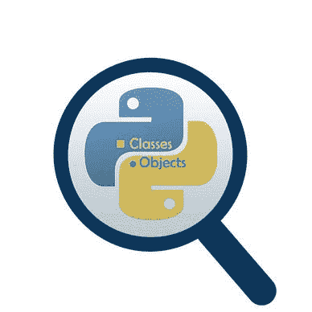

# 特殊方法介绍:Python OOP 完整教程—第 12 部分

> 原文：<https://blog.devgenius.io/introduction-to-special-methods-python-oop-complete-course-part-12-e5f8d5ebd79b?source=collection_archive---------3----------------------->

## 了解什么是特殊方法以及如何在 Python 中覆盖它。


Emile Perron 在 [Unsplash](https://unsplash.com/s/photos/welcome-code) 上的照片

**在我们开始之前，让我告诉你:**

*   这篇文章是 Python 面向对象编程完整课程的一部分，你可以在[这里](https://medium.com/@samersallam92/object-oriented-programming-course-f54c104271e0)找到它。
*   所有资源都可以在下面的“资源”部分找到。
*   这篇文章在 YouTube 上也有视频[点击](https://www.youtube.com/watch?v=Z2dZe739TzA)。

[https://www.youtube.com/watch?v=Z2dZe739TzA](https://www.youtube.com/watch?v=Z2dZe739TzA)

## 介绍

到目前为止，我们已经看到，当操作符与用户定义类的对象一起使用时，我们使用特殊的方法来定义应该执行的操作。

但是等等，有时我们称它们为特殊的方法，有时我们称它们为神奇的方法。**那么，这些术语是什么？**

如果你有兴趣学习这些新概念，请继续阅读…

**目录**

1.  [有哪些特殊方法？](#c913)
2.  [邓德方法和魔法方法](#e9d0)
3.  [如何覆盖特殊方法？](#bf3d)

## 1.有哪些特殊方法？

特殊方法是那些不能由您直接调用的方法。换句话说，您不会显式调用这些方法。然而，当某个动作发生时，调用发生在类的内部和场景之外。这个动作可以在一个类的两个对象之间使用一个类似(+ — * /)的操作符。

现在的问题是，在这种情况下，应当执行的行为是什么？无论是加号运算符还是任何其他运算符，对于这些运算符中的每一个，都有一个方法来定义使用该运算符时会发生什么，好消息是您可以覆盖它或重新定义它。

通过重写此方法，您可以定义在使用此运算符时要执行的操作。

> ***注*** *:特殊方法实际上不仅限于操作符，它们还包括其他内置的 Python 函数，例如数据类型函数(str，int，dir…)。*

例如，当您对您的类中的一个对象使用`str()`函数时，您将这个对象转换成一个字符串。但是，将对象转换成字符串有时很奇怪，因为这样做没有意义。

通过重写表示字符串转换的特殊方法，可以使这种转换更有意义。

**为了让事情变得简单，让我们看一个这些特殊方法的真实例子:**

1.  `__init__`:用初始值初始化实例属性。正如您之前看到的，当您从您的类中定义一个对象时，它会被自动调用(本例中的事件是定义一个新对象)。
2.  `__str__`:当你使用`str()` 函数来处理你的类的一个对象时，这个方法会被自动调用(在这个例子中，这个事件调用`str`作为输入对象)。

至此，特殊方法的定义已经提出。现在的问题是:**邓德方法**和**魔法方法**指的是什么？


照片由[梅尔特·塔拉伊](https://unsplash.com/@merttly?utm_source=unsplash&utm_medium=referral&utm_content=creditCopyText)在 [Unsplash](https://unsplash.com/s/photos/special?utm_source=unsplash&utm_medium=referral&utm_content=creditCopyText) 上拍摄

## 2.邓德方法和魔术方法

在 Python 社区中，**特殊方法**被称为 **Dunder 方法。**

它被命名为 **dunder** 是因为正如你从前面两个例子中看到的，这些方法有下面的命名约定 **:**

```
**__special_method_name__**
```

通常为了简便起见，它被称为**下划线**而不是**双下划线**。因此，这些特殊的方法也被称为邓德方法。

还有，不要不知所措，有时候这些方法也被称为**魔法方法。**

简而言之，即使你说**特殊方法**、**邓德方法**，或者**魔法方法**，所有这些概念指的都是同一个概念。现在让我们学习如何覆盖这些特殊的方法。


[西格蒙德](https://unsplash.com/@sigmund?utm_source=unsplash&utm_medium=referral&utm_content=creditCopyText)在 [Unsplash](https://unsplash.com/s/photos/all-of-these-concepts-refer-to-the-same-concept?utm_source=unsplash&utm_medium=referral&utm_content=creditCopyText) 上拍照

## 3.如何重写特殊方法？

假设你有一个类`ClassName`。要覆盖任何特殊方法，您必须像 Python 中的任何普通方法一样定义这个特殊方法，如下所示:

```
class ClassName:
   def __specialmethod__(self):
       pass
```

> 注意:你应该小心它的名字，因为这些特殊的方法名在 Python 中是保留的。

一旦你定义了一个特殊的方法，当这个方法相关的动作发生时，这个类将理解这个方法将被自动调用。

酷吧？


照片由[布雷特·乔丹](https://unsplash.com/@brett_jordan)在 [Unsplash](https://unsplash.com/s/photos/practice) 上拍摄

现在让我们继续，让我们写一些代码来更好地理解这个想法。假设我们有一个带有一些实例属性`(id, first_name, last_name,….)`的`Student`类和一个实例方法`enrol()` **。**

让我们从`Student`类中定义一个对象:

```
student = Student('John', 'Doe', 25)
```

然后为这个对象调用 **dir()** 函数:

```
dir(student)
```

输出:

```
**['__class__',****'__delattr__',****'__dict__',****'__dir__',****'__doc__',**'__eq__','__format__','__ge__','__getattribute__','__gt__','__hash__','__init__','__init_subclass__','__le__','__lt__','__module__','__ne__','__new__','__reduce__','__reduce_ex__','__repr__','__setattr__','__sizeof__','__str__','__subclasshook__','__weakref__',**'age',****'classes',****'enrol',****'first_name',****'full_name',****'id',****'last_name']**
```

这是一个很长的列表，包含了您在`Student`类本身中拥有的实例的属性和方法。此外，还有其他名称，如(`__class__`、`__delatter__`、…)，所有这些名称都是特殊名称，它们的出现是因为`Student` 类和`Object` 类之间的继承。

> *在 Python 中，所有的类都隐式继承了* ***对象*** *类(在本课程的后面你会学到更多)。*

总之，你应该知道有一些特殊的方法已经**可用**和**预定义**用于 Python **中**的每个类**默认**。

现在让我们试着将`str()` 方法调用为`student` 对象。

```
str(student)
```

输出:

```
<__main__.Student object at 0x000001E22C2EA448>
```

前面输出中的数字代表存储学生对象的内存位置。这根弦很丑。因此，让我们重写这个方法，为`student` 对象打印一个更有代表性的值。

假设您希望`__str__`方法返回这样一个句子:

*   第一种情况:“我是班上学生的一个对象”
*   第二种情况:`我是班上的一个对象学生，我的名字是 **object_first_name `**

**第一种情况:**参考下面代码片段中的最后一个方法。

输出:

```
I am an object of the class Student.
```

**第二种情况输入:**

**提示帮你:**

*   通过在特殊方法定义中使用 **self** 关键字，可以访问和使用调用特殊方法的对象的属性。请参考下面代码片段中的最后一个方法。

输出:

```
I am an object of the class Student, My name is John
```

从这个简单的例子中我们可以理解，覆盖`__str__` 方法改变了函数`str()` 的行为，当它被我们类中的一个对象调用时，这个对象在这个例子中是`Student`。

现在，让我们总结一下我们在这篇文章中学到了什么


照片由[安 H](https://www.pexels.com/@ann-h-45017/) 在[像素](https://www.pexels.com/)上拍摄

*   **特殊方法:**是不打算由你直接调用的方法，但是调用发生在类内部的某个动作上。
*   **特殊方法、邓德方法和魔法方法**是三个可互换使用的术语，指的是同一件事。
*   您可以通过将特殊方法定义为 Python 中的任何其他方法来覆盖它们，并注意在 Python 中使用正确的保留名称。

***附:*** *:万分感谢您花时间阅读我的故事。在你离开之前，让我快速地提两点*

*   *首先，要想直接在你的收件箱里看到我的帖子，请在这里订阅*[](https://medium.com/@samersallam92/subscribe)**，你可以在这里关注我*[](https://medium.com/@samersallam92)**。***
*   ***第二，作家在媒介上制造了数以千计的****$****。为了无限制地访问媒体故事并开始赚钱，* [***现在就注册成为媒体会员***](https://medium.com/@samersallam92/membership)**其中* *每月只需花费 5 美元。通过此链接* *报名* [***，可以直接支持我，不需要你额外付费。***](https://medium.com/@samersallam92/membership)***

**

萨梅尔·萨拉姆** 

## **Python 面向对象编程的完整教程**

**[View list](https://medium.com/@samersallam92/list/the-complete-course-in-objectoriented-programming-in-python-7b54126a7f4e?source=post_page-----e5f8d5ebd79b--------------------------------)****24 stories**************

**要回到上一篇文章，您可以使用以下链接:**

**[第 11 部分:特殊方法概述](https://medium.com/@samersallam92/python-oop-complete-course-part-11-special-methods-overview-bf1e7c9e7ae9)**

**要阅读下一篇文章，您可以使用以下链接:**

**[第 13 部分:初始化和构造特殊方法](/initialization-and-construction-special-methods-python-oop-complete-course-part-13-78b62305101)**

# **资源:**

*   **GitHub [这里的**这里的**](https://github.com/samersallam/The-Complete-Course-in-Object-Oriented-Programming-in-Python/tree/main/Introduction%20to%20The%20Special%20Methods)**。****