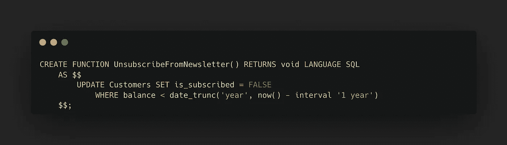

# SQL 存储过程简介

> 原文：<https://blog.devgenius.io/introduction-to-sql-stored-procedures-68eb8d6d6e6?source=collection_archive---------8----------------------->

> 本文概述了存储过程。

## 🧐什么是**存储过程**

S 暗指 put，存储过程是一个或多个 SQL 语句的集合，这些语句被 ***保留以备将来使用*** 。虽然您可以将它们视为批处理文件，但它们不仅仅是批处理文件。

> *SQLite 不支持存储过程。*

## **🔗理解为什么要使用存储过程**

1.  通过将复杂的操作封装到一个简单易用的单元中来简化它们。
2.  以确保数据一致性，而无需重复创建一系列步骤。如果所有开发人员和应用程序都使用相同的存储过程，那么每个人都将使用相同的代码。
3.  简化变更管理。如果表、列名、业务逻辑或其他任何内容发生变化，只需修改存储过程代码，其他人不需要知道这些变化。
4.  以减少处理命令所需的工作量。DBMS 执行的工作较少，因为存储过程通常以编译形式存储。这导致增强的性能。
5.  创建更健壮、适应性更强的代码。有些 SQL 语言功能和部分只能在单个请求中访问。这就是存储过程可以使用它们的原因。

> 存储过程的语法在不同的 DBMSs 中变化很大。实际上，创建完全可移植的存储过程非常困难。

# 💎创建存储过程

***创建或替换过程*** 存在于 PostgreSQL 中，用于创建新过程或用新定义替换现有定义。对于能够**创建或替换过程**的 PostgreSQL 用户，需要该语言的**使用权限**。

当指定模式名时，会在模式中生成一个过程。否则，当前模式包含新构建的模式。另外，CREATE 或 REPLACE 过程可用于修改或替换当前过程的定义。

## 现在，不要忘记 SQL Server，这里有几个使用它的例子

这个存储过程没有任何参数。调用应用程序通过使用 SQL Server 的返回代码支持来检索该值。这里使用`DECLARE`语句声明了一个名为`@news_count`的局部变量。然后在`SELECT`语句中使用这个变量，以便它包含由`COUNT()`函数返回的值。最后，`RETURN`语句用于将计数作为`RETURN @news_count`返回给调用应用程序。

## **执行存储过程**

这段代码声明一个变量来保存存储过程返回的内容，执行存储过程，然后使用一个`SELECT`来显示返回值。

# 🤓存储过程和函数

与函数不同，存储过程**不会**返回值。解释很简单:存储过程的唯一功能是 ***完成动作*** 。

## **让我们创建一个存储过程**

*姑且称之为*

## **现在让我们创建一个函数**

*姑且称之为*

## 🆚以下是存储过程与函数的区别:

*   当使用 **INOUT** 参数时，存储过程不需要返回任何东西，只返回一行。
*   在存储过程中，可以提交和回滚事务，但在函数中不行。
*   您使用`CALL/EXECUTE`语句而不是`SELECT`语句来执行存储过程。
*   与函数不同，过程不能在其他 DML 命令中分层。

## 😎优势..

*   只要可行，就可以经常重新引入存储过程，这大大减少了应用程序和数据库服务器之间的往返次数。
*   应用程序现在只需调用一个函数，而不是发送 SQL 语句来检索结果和消除响应时间。
*   提高了应用程序的效率。PostgreSQL 数据库服务器预先组合了用户定义的函数和存储过程。

> 我希望你觉得这篇文章很有趣💕！