# Swift Loops 简介

> 原文：<https://blog.devgenius.io/introduction-to-swift-programming-language-abecb5c3e2c6?source=collection_archive---------3----------------------->

> IOS 开发和软件工程。

# 环

在构建应用程序时，我们有时需要在应用程序的整个生命周期中重复某些功能。我们将利用一个循环来允许程序重复这些任务，并与应用程序进行必要的交互。

**For-In 循环**

> 对于 xxx {
> 
> for-in 循环体}

2 . **While 循环**

> 而 xxx {
> 
> //只要条件为真，循环就会继续执行。
> 
> }

# For-in 循环

当对应用程序中需要重复的复杂任务进行编程时，For-In 循环具有很大的威力。For-In 循环的关键字“For”描述了循环将如何执行包含字符串、整数和范围的块代码。对于 In，循环在遍历集合时要安全得多，并提供类似的操作，比如 while loop。

For-In 循环是使特定重复任务只在程序中长条件为真时才执行的大师。For-In 循环通常仅用于循环访问集合。下面列出了一些例子。

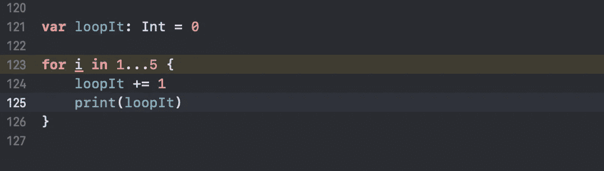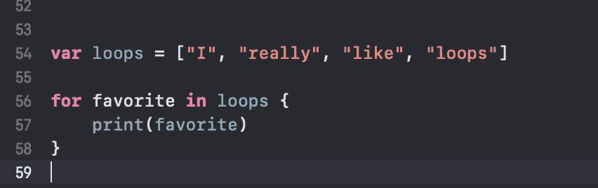

For-In 循环遍历集合字符串值

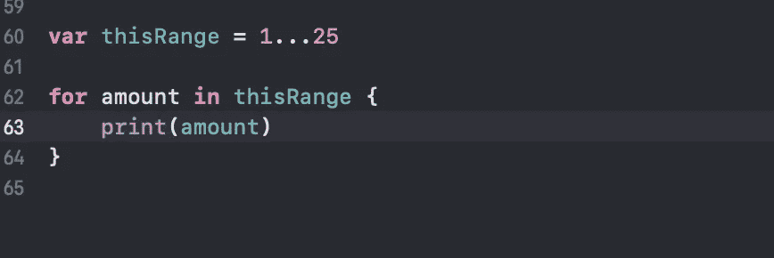

For-In 循环遍历整数范围

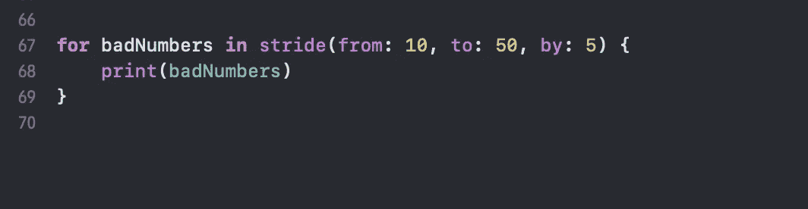

For-In 循环使用 stride 方法遍历从 5 开始计数的范围号。

# 通配符 _

通配符通常用于省略子持有人变量和执行特定的操作设置时间。如果您不在循环中引用迭代器，最好使用通配符。

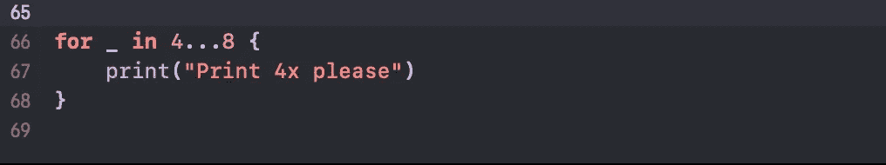

通配符代替了迭代器

# **Where 子句 For-In 循环**

Where 子句也常用于 for-in 循环中。For-In 循环必须满足 where 子句的条件才能完成。我们在代码中增加了更多的逻辑，提高了循环的性能。

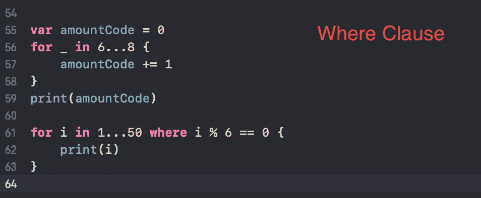

为-In 循环添加 Where 子句，列出所有可被 6 整除的数字。

# While 循环

While 循环是 Swift 编程中常用的另一种类型的循环。while 循环和 for-in 循环的区别在于，只要条件为真，While 循环就会继续执行。如果没有设置退出循环的要求，这可能是危险的。这个问题可能会导致无限循环，并在运行时使程序迅速崩溃。

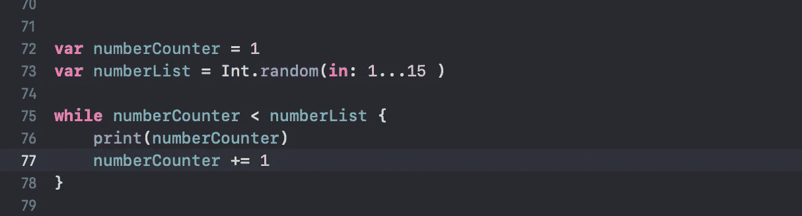

While 循环在整数范围内递增，直到满足某个条件才结束 While 循环。

# 连续语句

continue 语句允许在满足特定条件时执行循环。continue 语句将在满足条件后跳过循环的当前迭代，并使程序能够继续迭代完成的循环。一个完美的例子可能是找到一个特定的网站，但仍然在互联网上滚动以找到类似的网站。

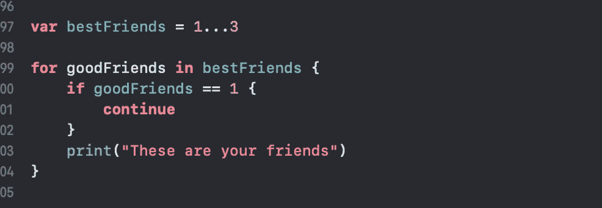

For-in 循环使用 continue 语句迭代整数范围 1 到 3。

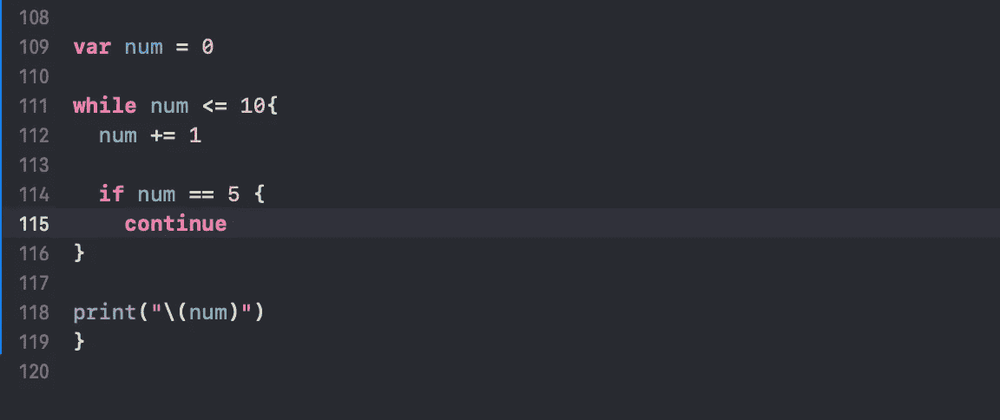

While 循环使用 continue 语句遍历 0 到 10 范围内整数。

# break 语句

break 语句与 continue 语句相反，continue 语句允许循环在集合中不断迭代。一旦满足特定条件，break 语句就退出循环。Break 语句类似于使用 web 浏览器 URL 来精确定位网站。我们不是在谷歌上寻找某个特定的网站，而是使用网络浏览器进行搜索，省去了寻找那个特定网站的所有额外工作。

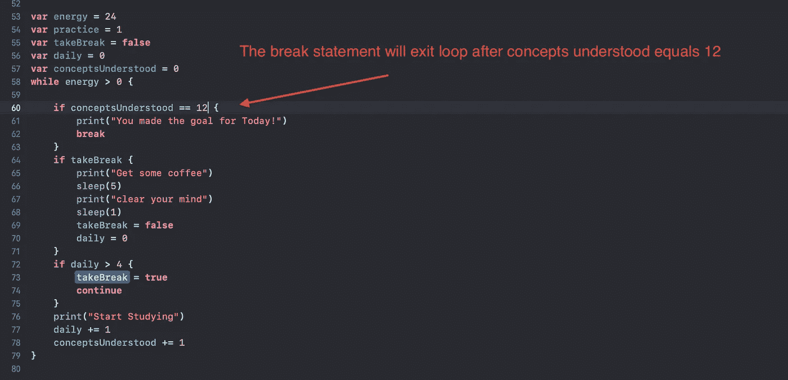

正在实现 Break 语句以退出 while 循环。

# 参考

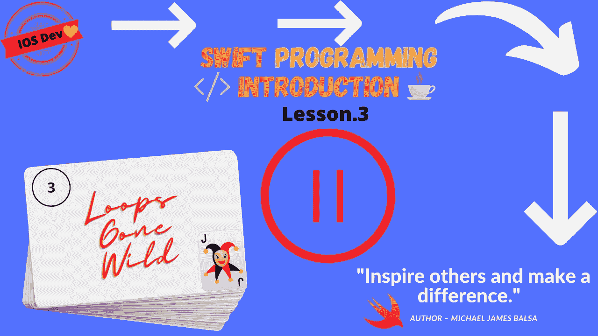

*更多内容尽在*[*blog . dev genius . io*](http://blog.devgenius.io)*。*