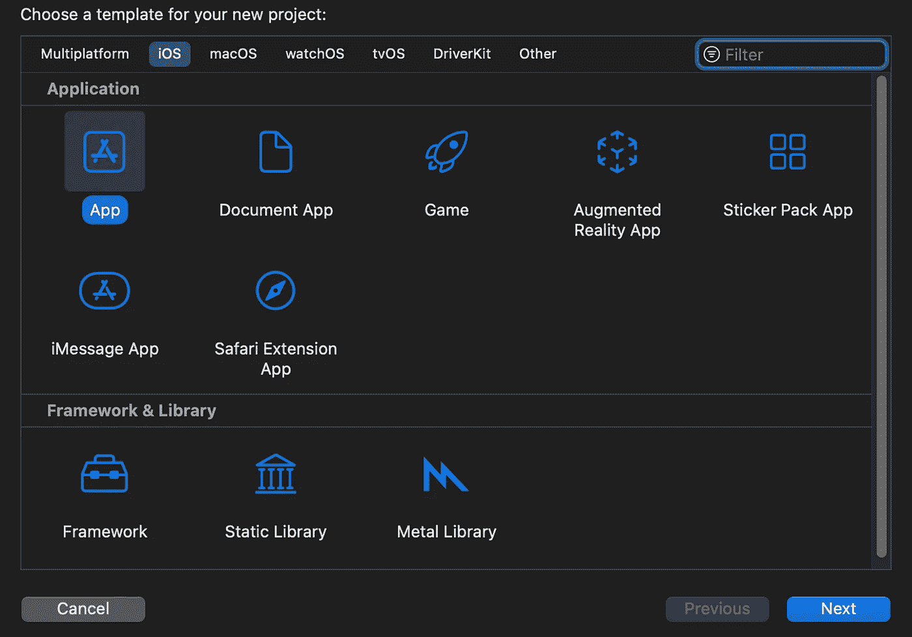

# SwiftUI 简介:创建新项目

> 原文：<https://blog.devgenius.io/introduction-to-swiftui-creating-new-project-9adc502e1804?source=collection_archive---------7----------------------->

图 1

本教程是整个 [SwiftUI 教程](https://arc-sosangyo.medium.com/list/swiftui-tutorial-03734e631240)系列的一部分，主要目的是指导那些刚刚开始零想法的人如何为 SwiftUI 创建一个新项目。它还将讨论您需要填写的每个表单的一些重要细节。

> 本教程是我的 [SwiftUI 教程](https://arc-sosangyo.medium.com/list/swiftui-tutorial-03734e631240)系列的一部分。

我们开始吧！

**第一步:**打开 **Xcode** ，选择**文件- >新建- >项目**。您将被询问使用什么样的模板(如上面的图 1 所示)。选择**应用，**然后按下**下一步**。

**第二步:**第一步完成后，会出现一个表格，需要填写一些信息:

*   **产品名称:**这是您要放置应用程序名称的地方。
*   **团队:**如果你刚开始练习，什么都不行。团队允许指定您希望参与项目的小组。
*   **组织标识符:**该标识符的主要用途是让你的应用在 app store 中得到唯一识别。这样做的标准是通过你的组织的反向域名。例如，如果您的组织是 acmecorp.com，请将 com.acmecorp 放在这里。如果你只是练习，你可以把任何名字放在这里。
*   **捆绑包标识符:**这将根据您输入的产品名称和组织标识符自动填写。它将成为应用程序的整个标识符。
*   接口:这个部分允许你选择你将要用于应用程序 UI 的框架。确保将其设置为 SwiftUI。
*   语言:你将要使用的编程语言会在这里标明。确保它设置为 Swift。
*   **使用核心数据:**如果您希望应用程序预装核心数据，请选择此项。不要选中它，因为您可以随时手动集成核心数据。手动操作也是更好的方法。
*   **包含测试:**也不要选中该部分，因为它可以随时手动集成。为了练习你不需要这个。

完成后按下**下一个**。

第三步:系统会询问你将文件保存在哪里。随意选择你想要的位置。最后，完成后点击**创建**。

当 Xcode 在您的保存位置构建一个文件夹，包含一些预先编写的代码时，项目就成功创建了。

愿法典与你同在，

-电弧