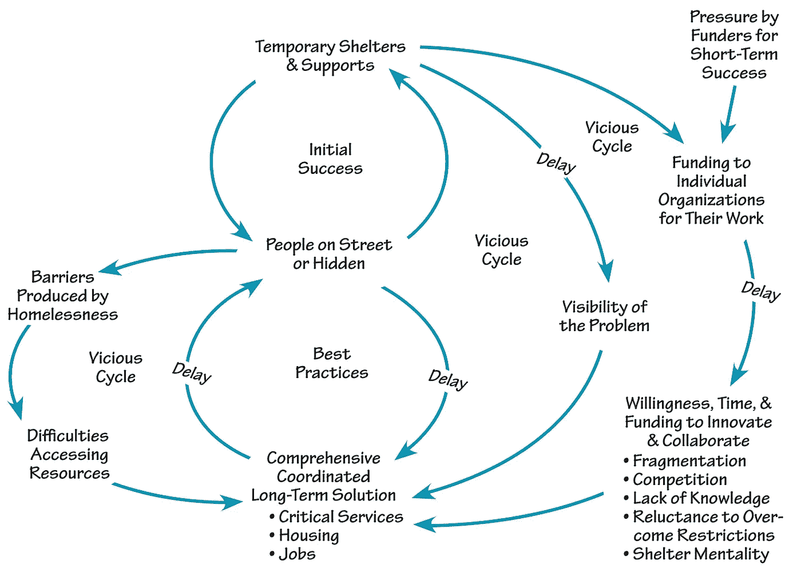

# 编程系统思维导论

> 原文：<https://blog.devgenius.io/introduction-to-systematic-thinking-for-programming-bad31014e299?source=collection_archive---------3----------------------->

制作功能程序的一个重要课题。

虽然算法是创建计算机程序的第一步，但它通常不足以构建高效的应用程序。而是只有用系统思维的算法才能做出。这里有一些细节可以帮助你在设计程序时进行系统的思考。

## 1-看问题

当涉及到编程时，这个问题通常变得很清楚。无论是辅导课、作业、面试，还是项目，他们一般都会对问题给出清晰的描述。然后，你可以分析这个程序是如何找到解决方案的。

## 2-思考潜在的解决方法

一旦你有了创建程序的想法，就有三个阶段来解决问题。首先，你设计一个解释为代码的解决方案。第二，你构建软件，最后一步是测试。但问题是你不能独自完成所有的步骤。相反，当涉及到所有三个步骤时，整个团队必须努力创造一个解决方案。根据国家的不同，公司可以将所有三个过程分开，或者将所有基于软件的解决方案的过程混合在一起。

## 3-如有必要，像阅读书籍一样阅读代码

学习如何编程的最好方法之一是看和阅读代码。但这不是结构的问题，而是你对程序代码本身的理解。这个过程可以通过查看程序代码并把它们的意思翻译成日常语言来完成。它提供了用不同语言编写的计算机程序的编写和实现的背景信息。但是这个技巧需要你所使用的编程语言的基础知识。如果你在编写自己的程序时，把计算机代码翻译成日常的书面语言，回报会更好。

## 4-记住你不能独自创造程序

我记得当我学习编程时，我对自己说创建一个程序是可能的。这并不是因为从设计到测试，编程有很多方面。因为所有的人不可能一下子做到所有的步骤，所以在所有的阶段都需要分化。有时，所有的成员必须同步工作的所有步骤。简而言之，不可能创建有效的程序来解决客户要求的问题。

*编程时你是如何进行系统思考的？你是怎么学会系统思维的？在下面的评论区分享你的想法和经历。*