# Unity 中 Tilemap 的介绍第 1 部分

> 原文：<https://blog.devgenius.io/introduction-to-tilemap-in-unity-part-1-beb7b5435c2?source=collection_archive---------2----------------------->

## 创建切片地图、切片调色板和切片

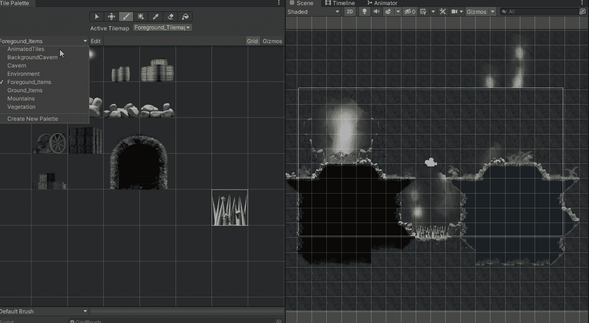

在 Unity 中使用 [**Tilemaps**](https://docs.unity3d.com/Manual/Tilemap-CreatingTilemaps.html) 需要一些东西。我需要 [**瓷砖**](https://docs.unity3d.com/Manual/Tilemap-TileAsset.html) 来绘制，我需要一个 [**瓷砖调色板**](https://docs.unity3d.com/Manual/Tilemap-Palette.html) 来包含我将使用的瓷砖，我还需要一个 [**网格**](https://docs.unity3d.com/Manual/class-Grid.html) 游戏对象，它包含一个 Tilemap(把它当作一个层)游戏对象。如果我想让瓷砖托盘与物理互动，我还需要使用[**2D**](https://docs.unity3d.com/Manual/class-TilemapCollider2D.html)瓷砖贴图碰撞器，这意味着它只会与 2D 物理互动。更多关于 Tilemaps 的信息和细节请参考 Unity 手册，我将只涉及使用它的一小部分。

 [## Tilemap

### 你如何在整个工作流程中使用文档？请参加本次调查，与我们分享您的体验。磁贴地图…

docs.unity3d.com](https://docs.unity3d.com/Manual/class-Tilemap.html) 

我打开瓷砖面板窗口，设置我的环境，这样我就可以很容易地访问一切。这需要将[**2D tile map Editor**](https://docs.unity3d.com/Manual/com.unity.2d.tilemap.html)包安装到我的项目中，它是自动为我安装的，因为我从 2D 项目模板开始，如果它不在那里，我可以随时使用包管理器来安装它。

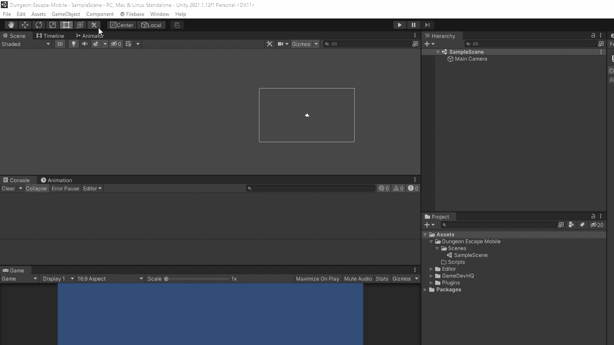

# 创建切片地图、切片调色板和切片

## 创建 Tilemap

我需要一张地图来画画。这很简单，只需在层次结构中右键单击并选择要创建的 Tilemap。Unity 有几个选项可供选择，允许创建各种不同类型的 Tilemaps。我将使用矩形。这将自动为我创建网格对象。

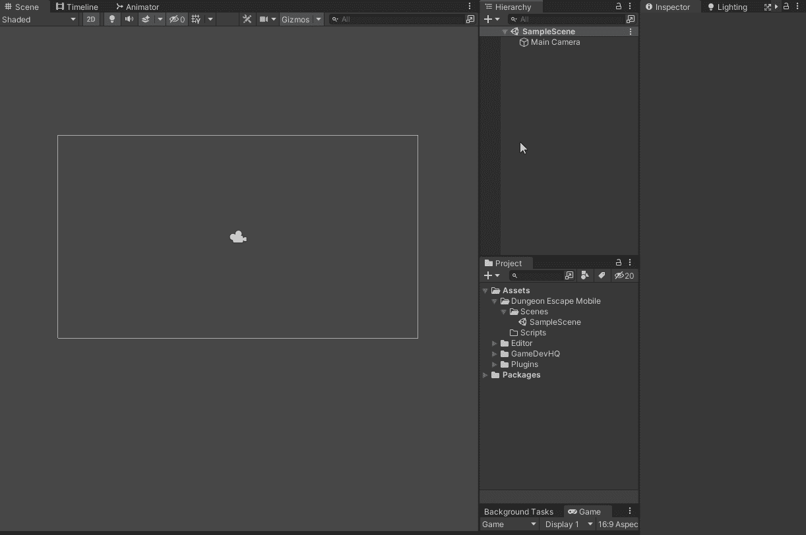

我可以通过选择网格对象并右击选择 Tilemap 来添加更多的层。我还可以通过创建一个没有附着到网格的 Tilemap 来添加一个新的网格。为了简单起见，我现在只需要一个 Tilemap。

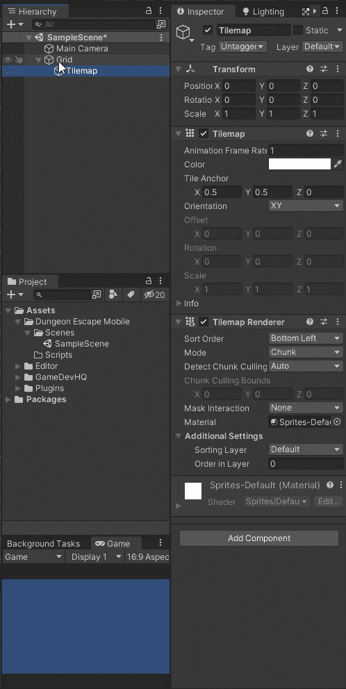

## 创建调色板

现在我需要一个可以用来在 Tilemap 上绘图的 Tile 调色板。在瓷砖调色板窗口中，我选择“创建新的调色板”。我给我的调色板一个名字和一个保存它的地方。

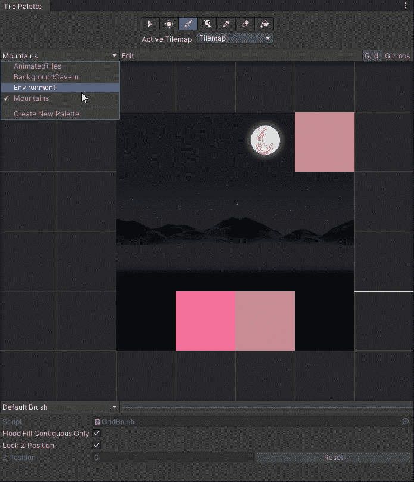

## 创建切片

现在我有一个瓷砖调色板，我需要用瓷砖填充它来绘制。

这些瓷砖是由精灵制成的。我有一个精灵表，包含了我将用于地面的所有精灵。我需要确保它被设置为精灵，并告诉 Unity 有多个精灵。然后我需要使用精灵编辑器对它进行切片，有很多方法可以做到这一点，但我知道这些是 125x128。在分割精灵之后，我需要告诉 Unity 1 个 Unity 单位需要多少像素，Unity 由于某种原因默认为 100。我希望 1 个图块占用 1 个单位，所以我将每个单位的像素设置为 128。忘记确保这是正确的会导致一些令人头疼的事情，后来当试图找出为什么事情没有正确排列。现在我已经设置好了精灵表，我把它拖到瓷砖面板窗口中。

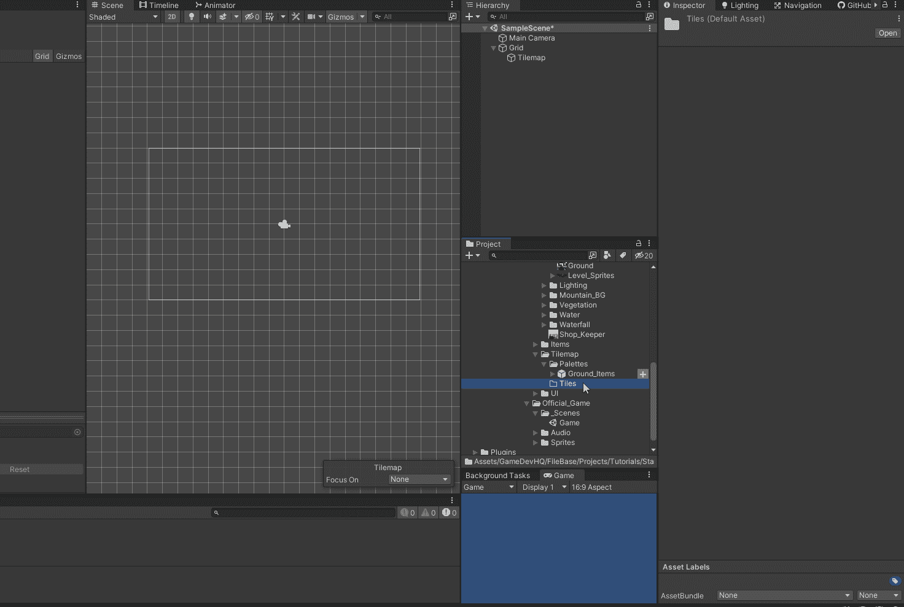

这将把所有的精灵变成瓷砖。我还确保所有我不希望有冲突的图块都设置为无。

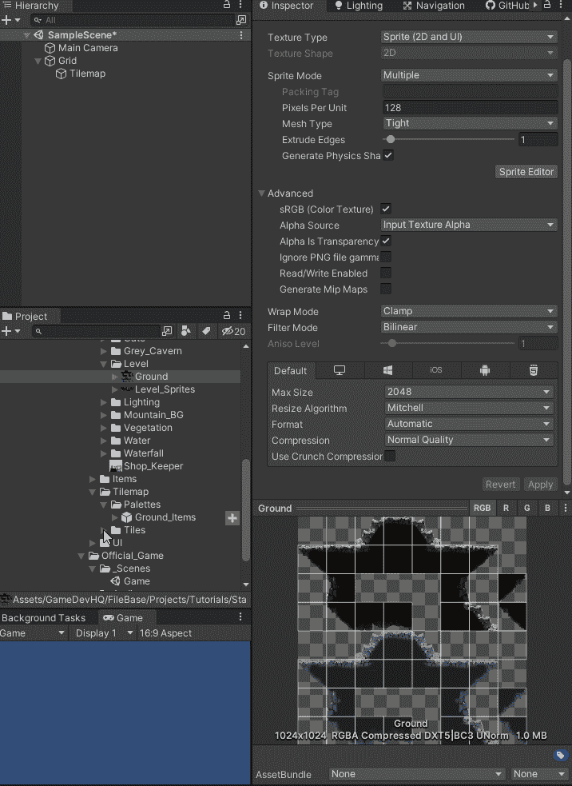

# 绘制 Tilemaps

现在我已经准备好了一切，我可以开始画画了。最简单的绘画方法是确保将“平铺调色板”窗口中的活动平铺地图设置为要在其上绘画的平铺地图。选择瓷砖，确保使用画笔，并开始绘制。

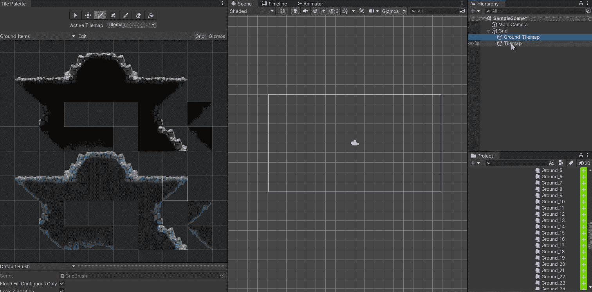

一个有用的设置是 Tilemap 焦点。将此项设置为 Tilemap 将更容易知道您正在绘制的 Tilemap 上有哪些图块。

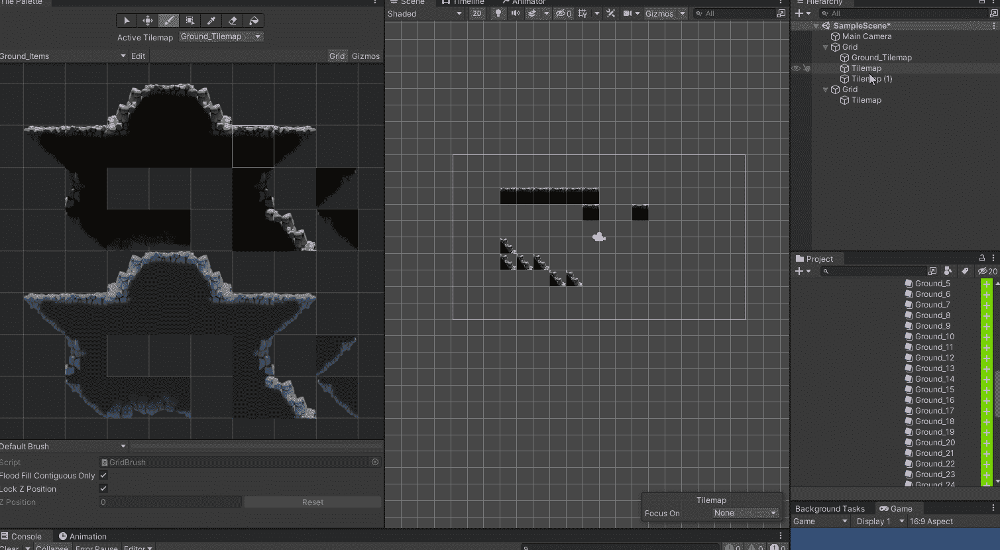

## 擦除图块

将活动画笔更改为橡皮擦。

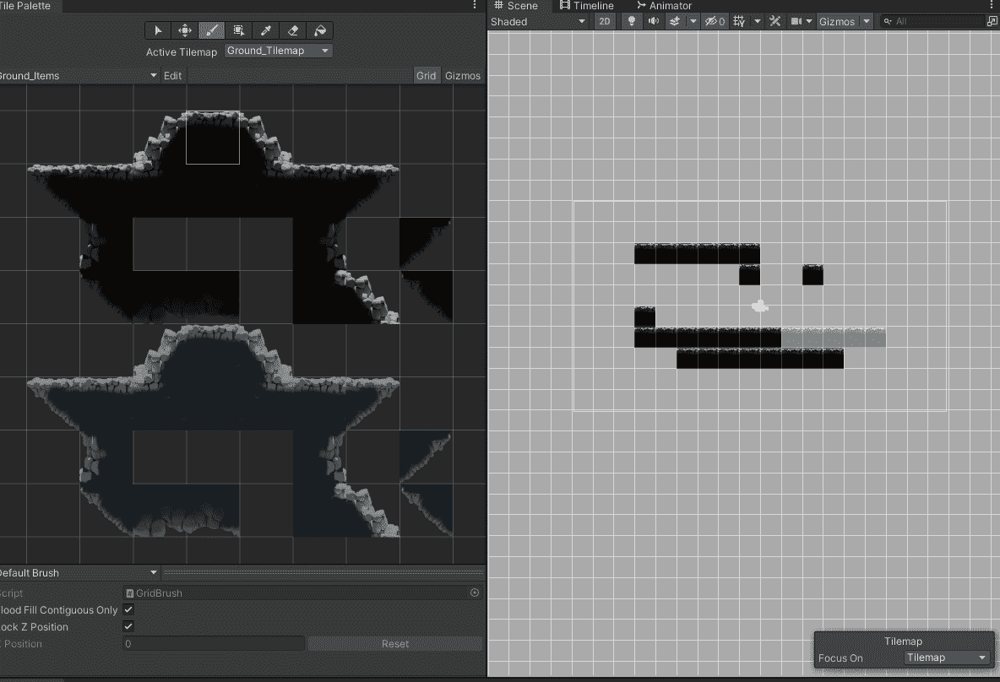

## 充满

您可以使用填充画笔来填充整个区域。

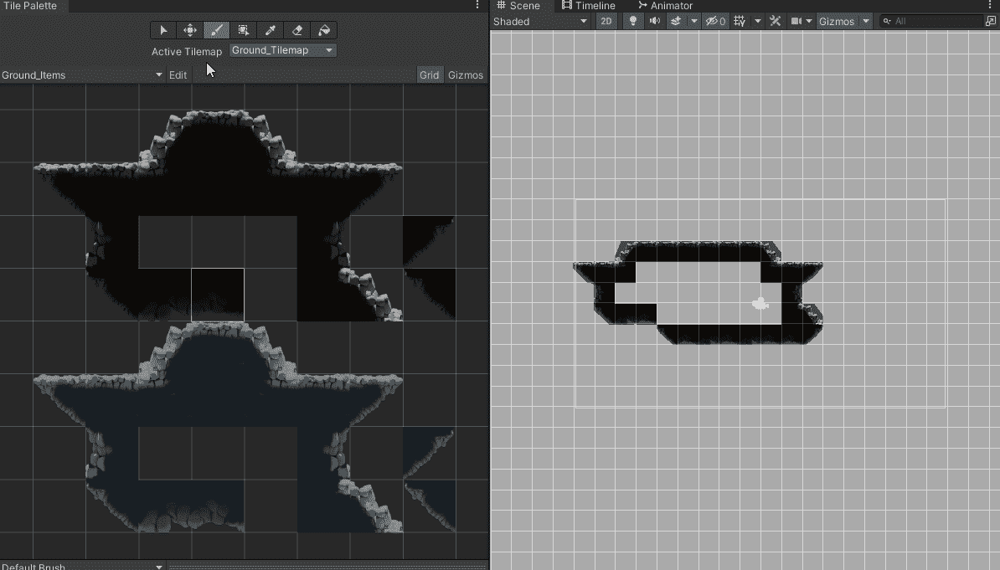

## 框填充

使用“框填充”来填充框内的区域。只需点击并拖动。

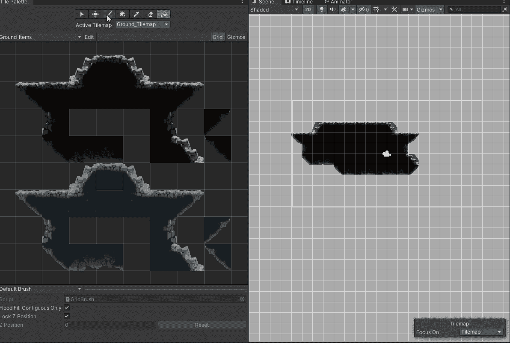

## 一次多个图块

要绘制多个图块，只需拖动选择要绘制的图块。将此与框填充相结合，所选的瓷砖将被重复。

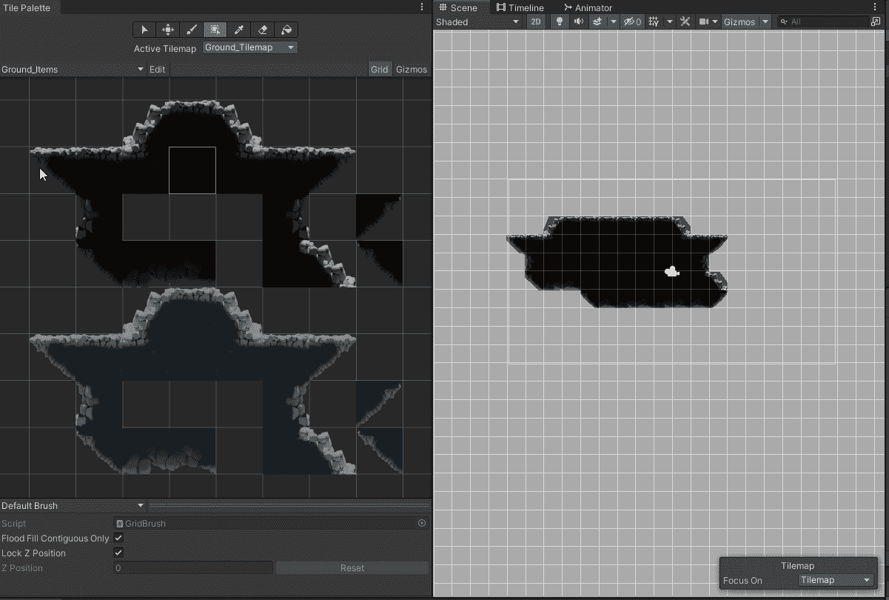

请注意，橡皮擦的大小将与所选图块的数量相同。

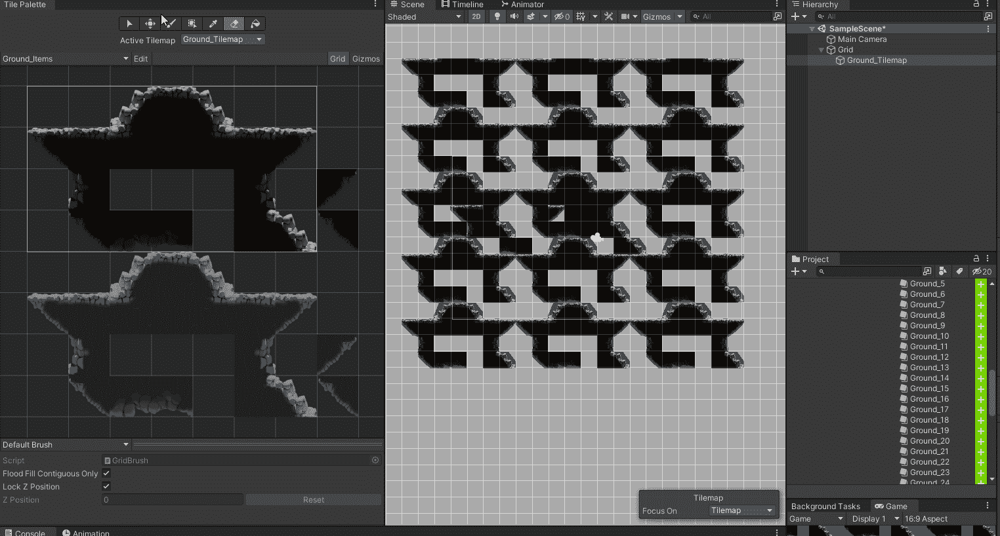

## 把所有的放在一起

将它们结合在一起，我可以很快画出我的等级。

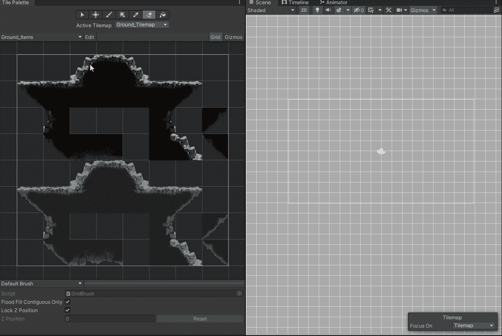