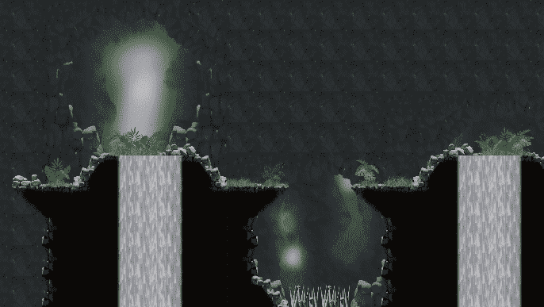
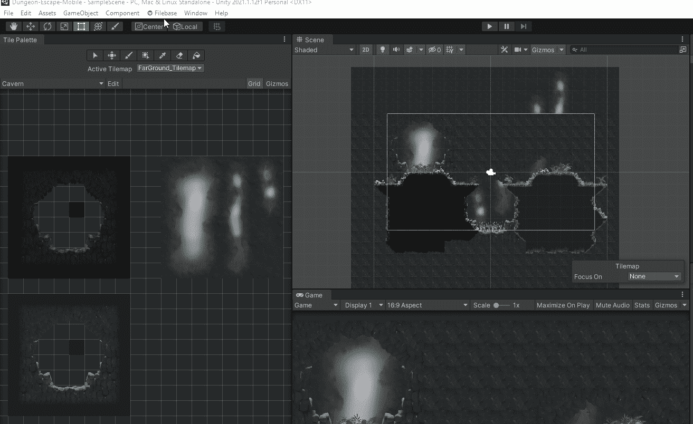
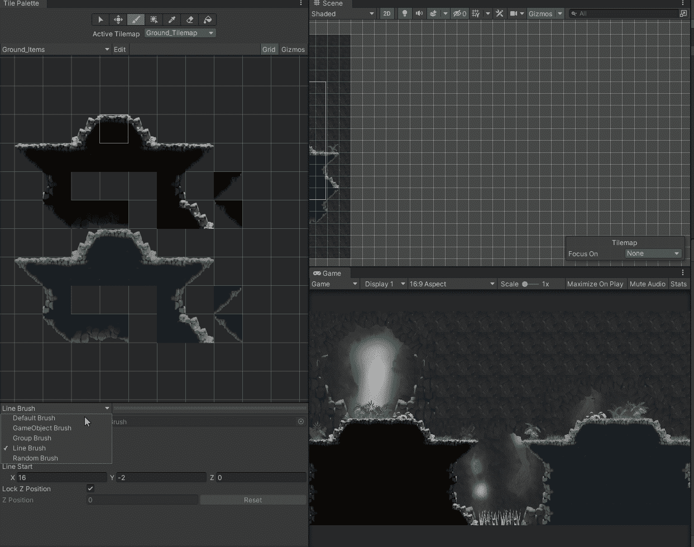
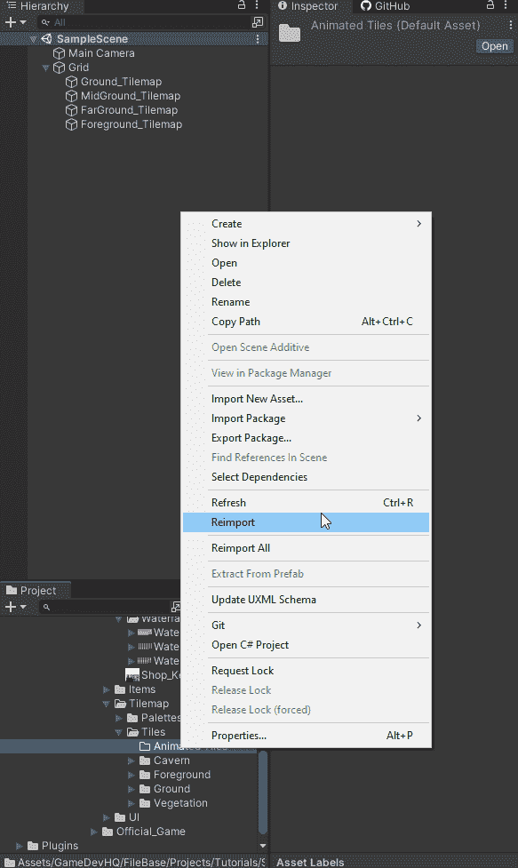
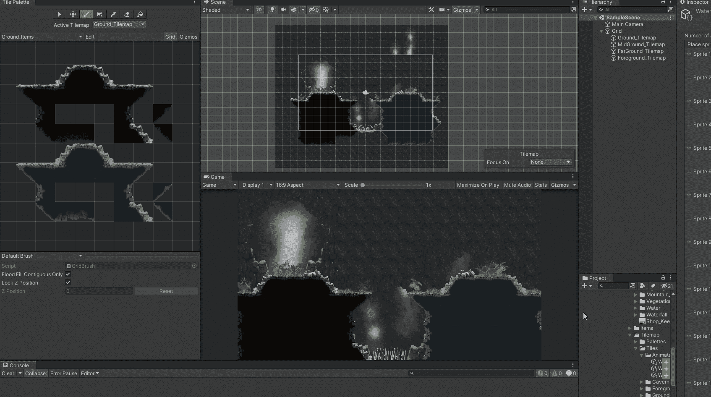
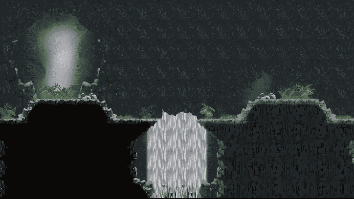
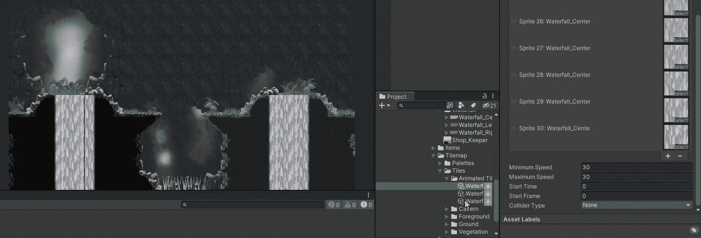
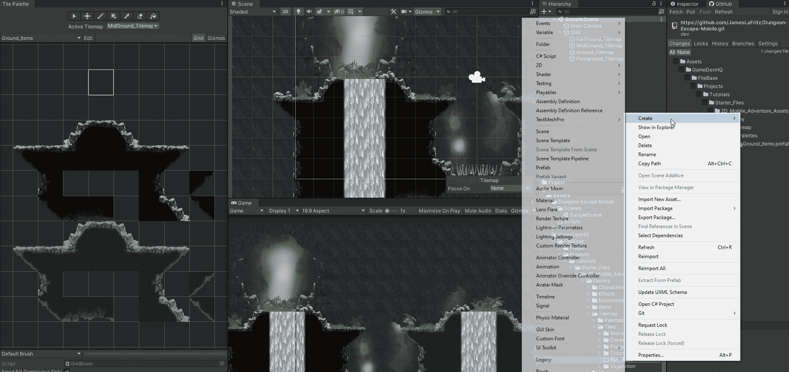
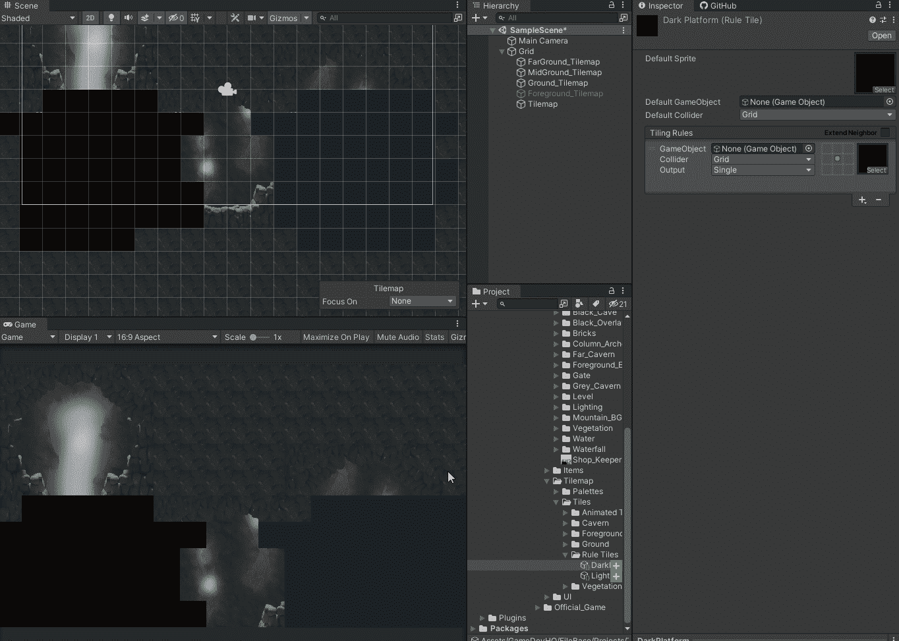
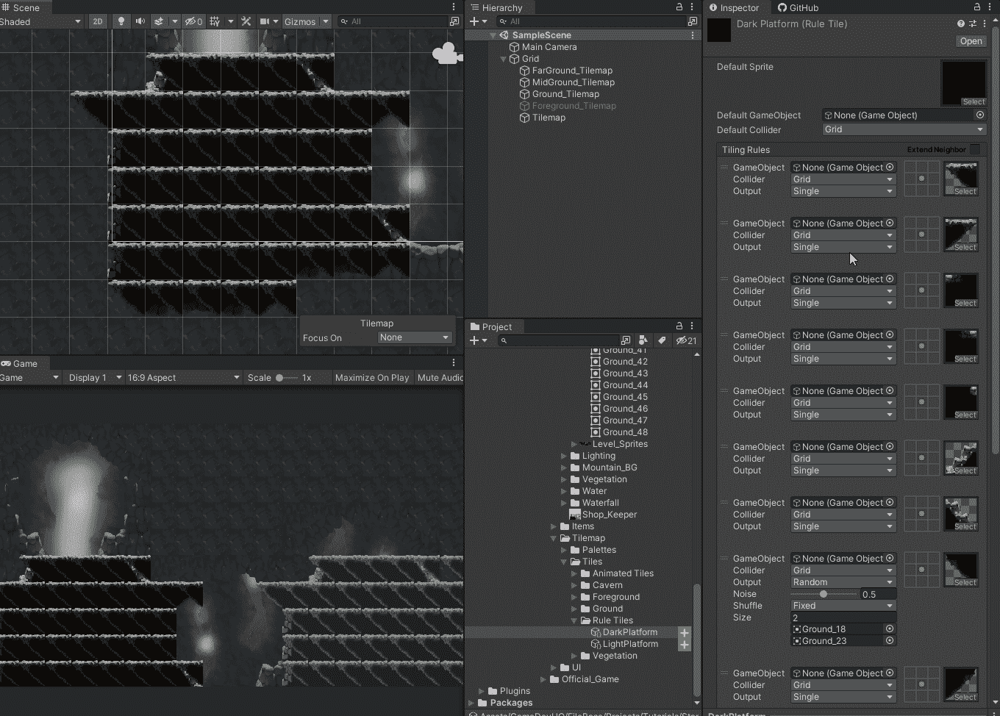

# Unity 中 Tilemap 的介绍第 2 部分

> 原文：<https://blog.devgenius.io/introduction-to-tilemap-in-unity-part-2-ffdf6b3b6e23?source=collection_archive---------1----------------------->

## 可脚本化的瓷砖，可脚本化的笔刷，使用 2D Tilemap Extras

Unity 的 Tilemap 是非常可扩展的。

# 可编写脚本的图块

我可以使用 [**可脚本化的图块**](https://docs.unity3d.com/Manual/Tilemap-ScriptableTiles-Example.html) **创建自己的图块类型。**这让我可以做各种事情，比如创建自动平铺功能来制作动画。

 [## 可编写脚本的图块

### 你如何在整个工作流程中使用文档？请参加本次调查，与我们分享您的体验。创建一个…

docs.unity3d.com](https://docs.unity3d.com/Manual/Tilemap-ScriptableTiles.html) 

# 可编写脚本的画笔

我可以使用 [**可脚本化的笔刷**](https://docs.unity3d.com/Manual/Tilemap-ScriptableBrushes-Example.html) 来创建自己的笔刷。我可以创建圆形填充笔刷，线条填充笔刷，或者绘制预设的笔刷。

 [## 可编写脚本的画笔

### 你如何在整个工作流程中使用文档？请参加本次调查，与我们分享您的体验。创建一个…

docs.unity3d.com](https://docs.unity3d.com/Manual/Tilemap-ScriptableBrushes.html) 

# 2D·TilemapExtras

这些事情需要花很多时间去实现和做好。对我们来说幸运的是团结已经为我们做了工作。他们有一个名为 **2D Tilemap Extras** 的预览包，里面装有有用的笔刷和图块。最有用的有 [**线条笔刷**](https://docs.unity3d.com/Packages/com.unity.2d.tilemap.extras@2.0/manual/LineBrush.html) ， [**随机笔刷**](https://docs.unity3d.com/Packages/com.unity.2d.tilemap.extras@2.0/manual/RandomBrush.html) ， [**游戏对象笔刷**](https://docs.unity3d.com/Packages/com.unity.2d.tilemap.extras@2.0/manual/GameObjectBrush.html) ， [**动画平铺**](https://docs.unity3d.com/Packages/com.unity.2d.tilemap.extras@2.0/manual/AnimatedTile.html) ，以及 [**规则平铺**](https://docs.unity3d.com/Packages/com.unity.2d.tilemap.extras@2.0/manual/RuleTile.html) **。**

 [## 2D Tilemap Extras

### 2D Tilemap Extras 包包含可重用的 2D 和 Tilemap 编辑器脚本，您可以将其用于自己的项目…

docs.unity3d.com](https://docs.unity3d.com/Packages/com.unity.2d.tilemap.extras@1.6/manual/index.html) 

我刚刚意识到 Unity 已经在 Unity 2020.1 版本中发布了这个包。如果您使用的是旧版本的 Unity，您将必须使用预览包。

 [## 2D Tilemap Extras

### 2D Tilemap Extras 包包含可重用的 2D 和 Tilemap 编辑器脚本，您可以将其用于自己的项目…

docs.unity3d.com](https://docs.unity3d.com/Packages/com.unity.2d.tilemap.extras@2.0/manual/index.html) 

## 安装

安装这个就像从软件包管理器安装在其他软件包中一样。如果您使用的是 Unity 2019 或更早版本，您必须确保打开预览设置。

## 使用不同的笔刷

利用不同的刷子可以大大加快你的工作流程。

## 创建动画单幅图块

创建动画单幅图块就像使用“创建”菜单创建任何其他资源一样。创建完成后，我要做的就是给动画添加帧

接下来，我为瀑布创建一个瓷砖调色板。然后我把它们画在地图上。

现在我有一个很好的动画效果。

我把动画速度提高到 30。值得注意的是，我希望瀑布的最小值和最大值相同，因为 Unity 会在最小值和最大值之间选择一个随机数来播放动画。

## 嵌线瓷砖

创建规则图块就像使用“创建”菜单创建任何其他资源一样。创建后，我所要做的就是添加规则，使其自动平铺。规则的工作方式是，一旦有匹配，它将选择该匹配并使用该图块。我将我的瓷砖的默认瓷砖设置为内部填充，将它们添加到我的托盘中，并在场景中绘制它们，这样一旦创建了我的规则，我就可以验证它们是否按照我的意图绘制。

对于我的平台，我有 4 个边，4 个外角，2 个内角和 2 个端盖。这样我总共需要 12 条规则。我必须先做 2 个端盖和 2 个内角。然后我做外角，最后是四边。我的一个内角是一种特殊情况，取决于它属于哪里，我可以通过使用扩展邻居复选框来处理这种情况，该复选框允许我添加额外的邻居进行检查。所以我实际上有 13 条规则。当一个规则匹配时，我可以输出一个单幅图块、一个随机选择的图块或一个动画图块。我也可以输出一个游戏对象，我不会用这个。我使用精灵编辑器来帮助确定使用哪些瓷砖。

有 3 个规则条件可用于规则图块的相邻规则，空白表示不关心，红色 x 表示相邻规则图块不同，绿色箭头表示相邻规则图块相同。使用扩展邻居将在您检查一个邻居后立即添加另一组邻居进行检查。

