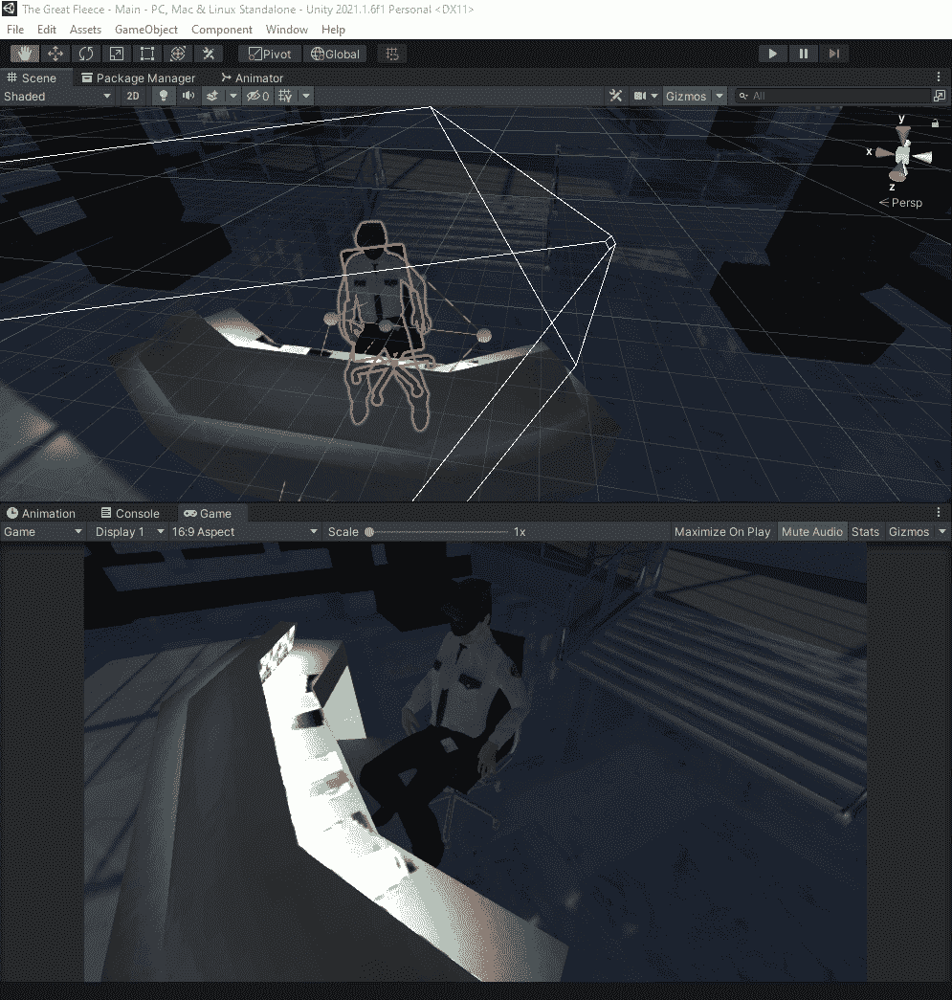
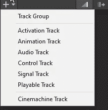
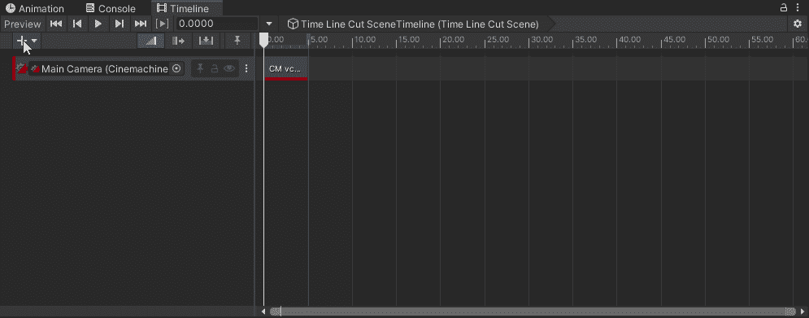

# Unity 时间轴简介

> 原文：<https://blog.devgenius.io/introduction-to-timeline-in-unity-6e8ed2148de4?source=collection_archive---------1----------------------->

## 创建电影内容、游戏序列、音频序列和复杂的粒子效果。

Unity 有一个内置的工具，用于创建过场动画、电影或游戏序列。这些序列中的每一个都由一个 [**时间轴资产**](https://docs.unity3d.com/Packages/com.unity.timeline@1.5/manual/tl_about.html#timeline-asset) 和一个 [**时间轴实例**](https://docs.unity3d.com/Packages/com.unity.timeline@1.5/manual/tl_about.html#timeline-instance) 组成。一个 [**时间线资产**](https://docs.unity3d.com/Packages/com.unity.timeline@1.5/manual/tl_about.html#timeline-asset) 是所有没有链接到任何特定游戏对象的轨迹、剪辑和录制的动画，并保存在您的项目中。一个 [**时间轴实例**](https://docs.unity3d.com/Packages/com.unity.timeline@1.5/manual/tl_about.html#timeline-instance) 是通过一个 [**可玩导演组件**](https://docs.unity3d.com/Packages/com.unity.timeline@1.5/manual/play_director.html) 链接到一个特定的游戏对象，并保存在场景中。 [**可播放导演组件**](https://docs.unity3d.com/Packages/com.unity.timeline@1.5/manual/play_director.html) 是导演，它控制 [**时间轴资产**](https://docs.unity3d.com/Packages/com.unity.timeline@1.5/manual/tl_about.html#timeline-asset) 何时播放，时钟如何更新，以及序列完成后做什么。

要访问时间线，请转至窗口->排序->时间线。

现在，我需要创建一个 director 组件和一个时间线资产。

接下来，我需要添加轨道和动画场景。

[**曲目**](https://docs.unity3d.com/Packages/com.unity.timeline@1.5/manual/trk_list_about.html)

> 每个轨道头都有一个彩色重音，用于识别轨道类型及其片段:
> 
> 激活轨迹是绿色的。使用激活轨迹添加激活剪辑，激活剪辑设置绑定的游戏对象何时激活(如图所示)。游戏对象被绑定到激活轨道。
> 
> 动画轨迹是蓝色的。使用动画轨迹添加动画剪辑，为绑定的游戏对象制作动画。使用动画轨迹及其动画剪辑[记录基本动画](https://docs.unity3d.com/Packages/com.unity.timeline@1.5/manual/wf_rec_anim.html)或[制作人形动画](https://docs.unity3d.com/Packages/com.unity.timeline@1.5/manual/wf_char_anim.html)。
> 
> 音轨是橙色的。使用音轨来添加音频剪辑，以播放背景音乐或声音效果。每个音频片段都绑定到一个音频波形。播放每个波形的音频源被绑定到音频轨道。
> 
> 控制轨道是蓝绿色的。使用控制轨迹添加控制片段，这些控制片段是控制嵌套时间轴实例、粒子系统、预设实例或 ITimeControl 脚本的特殊片段。[控制剪辑是如何创建的](https://docs.unity3d.com/Packages/com.unity.timeline@1.5/manual/insp_clp_ctrl_com.html)决定了它控制什么。
> 
> 可播放曲目为白色。使用可播放轨迹添加可播放剪辑。每个可播放的剪辑都绑定到一个脚本，该脚本使用 [Playables API](https://docs.unity3d.com/Manual/Playables.html) 来创建定制的动画工具、效果或游戏机制。

我将我的 Cinemachine 添加为音轨。

然后，我从一个动画剪辑中添加一个动画轨道，我使用开始级别的过场剪辑。我还调整我的 Cinemachine 轨道，以占用动画轨道所占用的全部时间。

现在，当我拖动时间线时，我看到动画在播放。

要使用时间轴创建过场动画，我只需添加轨道，并让它们在时间轴上的适当位置排成一行，以配合背景音乐和画外音，使其与摄像机的过场动画保持一致。

