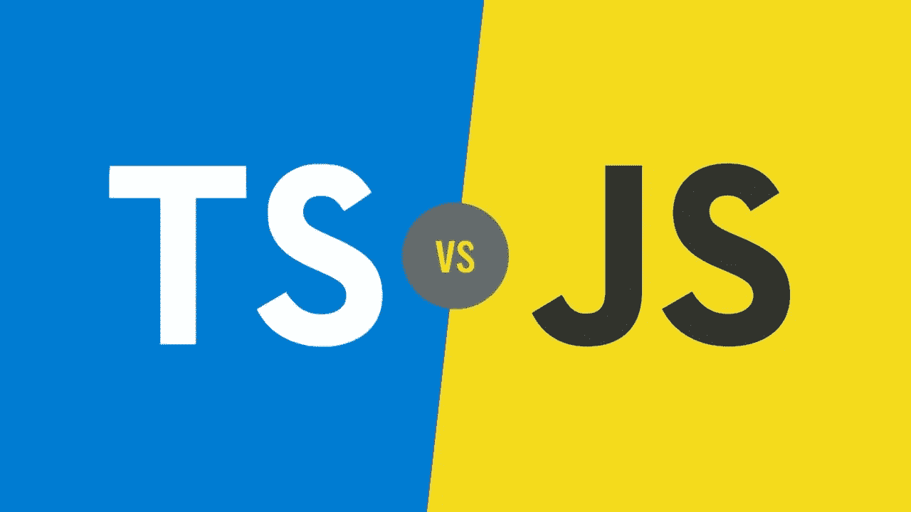
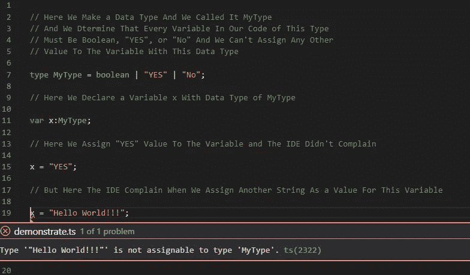
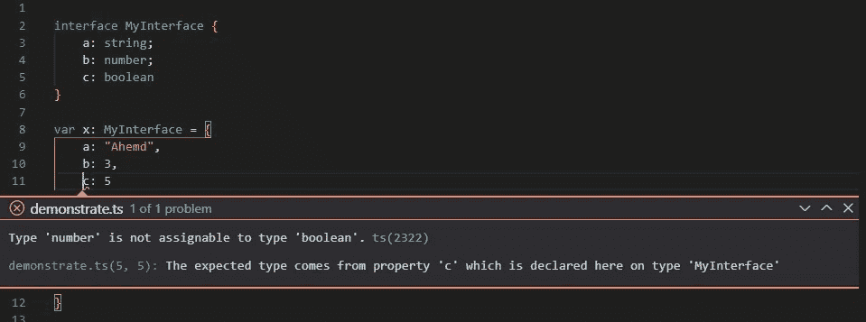

# Typescript 简介

> 原文：<https://blog.devgenius.io/introduction-to-typescript-586d090fd336?source=collection_archive---------29----------------------->

2012 年 10 月 1 日，新技术出现在 web 开发领域，几乎彻底改变了编写 javascript 的方式，特别是在大型项目以及团队和企业内部，今天，我们将讨论 typescript 以及它如何影响我们编写 javascript 的方式。

类型脚本与 Javascript

# **什么是打字稿:**

简而言之，TypeScript 是 JavaScript 的类型化超集，可以编译成普通 JavaScript。我们还可以说， [t](http://www.typescriptlang.org/) ypescript 是 JavaScript 的超集，它提供可选的静态类型、类和接口，使用 typescript 的一大好处是使 ide 能够提供一个更丰富的环境，以便在您键入代码时发现常见错误。

为了让您清楚这个想法，您可以将 typescript 视为一种编程语言，它将 javascript 从弱类型编程语言转换为像 Java 或 C#这样的强类型编程语言。

弱类型编程语言意味着您不能为变量设置特定的数据类型，也就是说，您可以将一个字符串值放入变量中，然后在代码中稍后将该变量的值更改为整数或布尔值，这可能会导致如下运行时错误:

强类型编程语言的意思正好相反，如果您声明了一个字符串变量，然后在代码中将其更改为整数，IDE 将会报错并显示如下错误:

# **使用 Typescript 背后有什么好处:**

Typescript 允许您越来越多地控制您的代码，不仅仅是通过让您确定代码中变量的数据类型，typescript 还具有一些普通 javascript 通常无法提供给您的其他奇妙优势，这些是使用 typescript 背后的一些主要优势:

*   为开发人员提供控制项目中变量的数据类型的机会，我们之前已经提到过
*   允许开发人员预先确定函数中输入和输出变量的数据类型:

*   允许开发人员编写自己的数据类型，以便在代码中添加额外的控制层:

*   允许您作为开发人员创建允许您在 JS 代码中强有力地控制对象和类的接口:

*   在 visual studio 代码中使用 typescript 的一个便利特性是智能感知和自动完成。

# **为什么打字稿:**

我一直想知道 typescript 是如何在 javascript 开发人员中流行起来的，而其他具有相同目的的语言却未能幸免，比如 CoffeeScript:

Typescript 与 Coffescript

答案相对简单，typescript 得到了开发人员社区以及它的创建者和所有者微软的大力支持，你现在可以在浏览器中键入“typescript ”,然后按回车键，你会看到你将得到的结果的数量，在我看来，这就是 typescript 的真正力量:巨大的支持。

# **个人经历:**

我几乎每天都在使用 typescript，我已经在我以前的几个项目中使用了它，我完全鼓励任何 javascript 开发人员开始在他的项目中使用它，当然，我们必须提到，typescript 几乎没有学习曲线，这意味着当你开始学习它时，你不会发现任何困难，而且任何 javascript 开发人员都可以在一天内学会 typescript，并开始在他的下一个项目中使用它，学习起来并不困难。

# **结论:**

在以前的博客文章中，我预测 typescript 将继续增长，到 2025 年底，开发人员将每天使用 typescript 来构建他们的项目，我将把博客的链接放在底部，以防你想查看它。

最后，希望这篇文章赢得您的赞赏，感谢您的关注。

 [## 向水晶球询问 Web 开发的未来

### 在编程世界里，事情是不断变化的，尤其是在 web 开发领域，例如，以一个…

medium.com](https://medium.com/dev-genius/asking-the-crystal-ball-about-the-future-of-web-development-4b0bc90068aa)