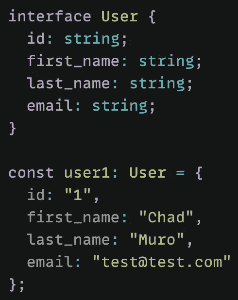
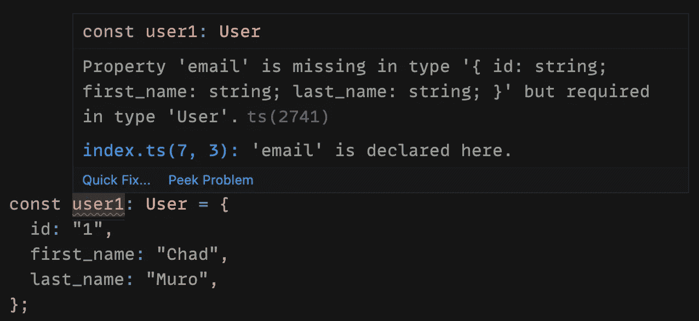
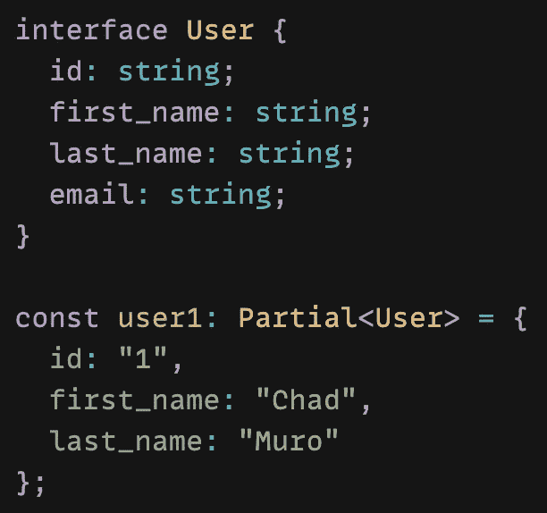
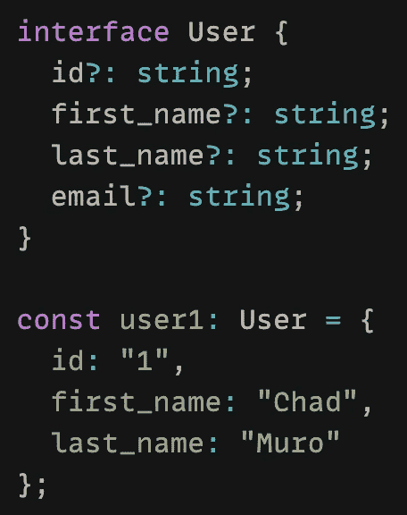
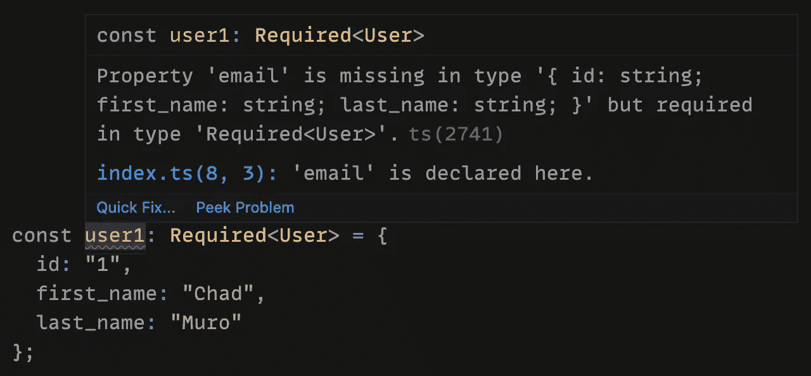
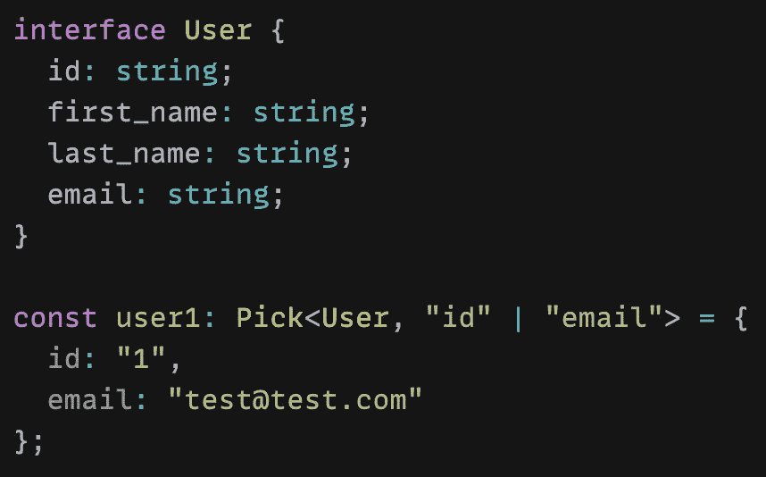
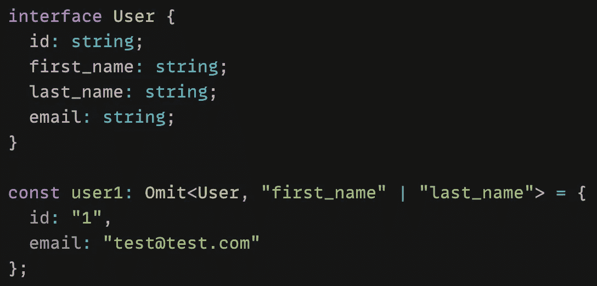
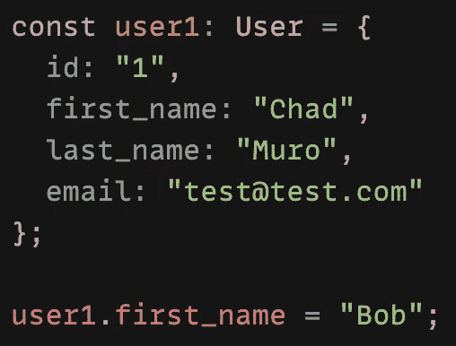
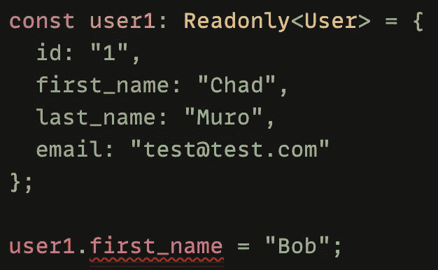

# 类型脚本实用程序类型简介:第一部分

> 原文：<https://blog.devgenius.io/introduction-to-typescript-utility-types-part-one-11e53a10db95?source=collection_archive---------6----------------------->

## 如何使用部分、必需、选择、省略和只读

照片由 [Matteo Grassi](https://unsplash.com/@matteo_grassi?utm_source=medium&utm_medium=referral) 在 [Unsplash](https://unsplash.com?utm_source=medium&utm_medium=referral) 上拍摄

我的任务是提高我的打字技能。为了做到这一点，我一直在花时间浏览 TypeScript 文档，以了解更多中级到高级的概念。

在本文中，我将介绍 TypeScript 中的实用程序类型。

如果您是第一次接触 TypeScript，请先阅读下面的文章，了解一些基本概念。

 [## 类型脚本中的类型注释与类型推理

### 了解如何在 TypeScript 中向变量添加类型

levelup.gitconnected.com](https://levelup.gitconnected.com/type-annotation-vs-type-inference-in-typescript-85ba2194ebe1) 

## 什么是实用程序类型？

实用程序类型用于促进常见的类型转换。基本上，这意味着实用程序类型用于从现有类型创建新类型。

使用 TypeScript 时，有一系列类型实用程序是全局可用的。如果您想查看完整列表，请在此处查看他们的文档[。](https://www.typescriptlang.org/docs/handbook/utility-types.html)

让我们看看以下常用的实用程序类型:

*   `Partial<Type>`
*   `Required<Type>`
*   `Pick<Type, Keys>`
*   `Omit<Type, Keys>`
*   `Readonly<Type>`

# 部分

`Partial`实用程序类型创建一个新类型，将给定参数类型的所有属性设置为可选。它将类型作为参数

例如，我有一个如下定义的`User`类型。然后我会创建一个新的用户，并给它一个类型`User`。

但是，假设我想创建一个没有电子邮件的新用户。类型脚本将显示一个错误，因为当前需要电子邮件属性。

我可以将用户类型更改为`Partial<User>`，这将把`User`类型的所有属性设置为可选。然后，我可以在不添加电子邮件的情况下创建一个新用户。

# 必需

`Partial`的反义词是`Required`。`Required`创建一个新类型，将给定参数类型的所有属性设置为必选项。它以类型作为参数。

例如，我采用相同的`User`类型，最初将所有属性设置为可选。我现在可以创建一个没有电子邮件属性的新用户。

但是，如果我将用户对象的类型更改为`Required<User>`，Typescript 现在将显示一个错误，因为所有属性现在都是必需的。

# 选择

`Pick`通过从给定的类型中挑选属性集来创建一个新的类型。它有两个参数:一个类型和一个字符串或字符串的联合。

例如，如果我想创建一个没有名字或姓氏的新用户，我可以使用之前相同的`User`类型和`Pick`实用程序类型。

这将创建一个新类型，只有来自`User`类型的*“id”*和*“email”*的属性。

# 省略

`Pick`的反义词是`Omit`。`Omit`通过从给定的类型中选择属性集并删除它们，创建一个新的类型。它有两个参数:一个类型和一个字符串或字符串的联合。

例如，如果我想创建只有*“id”*和*“email”*属性的相同类型，我可以使用`Omit`实用程序类型。这次我将传递我想从类型中移除的属性。

# 只读

本文中我们要看的最后一个实用程序类型是`Readonly`。顾名思义，`Readonly`将创建一个类型，并将该类型的所有属性设置为只读。这意味着不能重新分配该类型的属性。

它接受一个类型作为参数。

通常，我可以创建一个用户对象，然后像这样重新分配其中一个属性。

然而，如果我使用`Readonly`实用程序类型，当我试图重新分配 *"first_name"* 属性时，TypeScript 会显示一个错误。

# 结论

感谢阅读！我希望这篇文章有助于您开始使用 TypeScript 中的实用工具类型。还有更多可用的实用程序类型，我们将在以后的文章中介绍。现在，查看他们的[文档](https://www.typescriptlang.org/docs/handbook/utility-types.html)来了解更多。

如果您想继续阅读关于 TypeScript 的内容，请查阅下面的文章，了解如何使用类型保护来缩小范围。

 [## 使用类型保护缩小类型脚本

### 帮助 TypeScript 通过收缩获得正确的类型

javascript.plainenglish.io](https://javascript.plainenglish.io/typescript-narrowing-using-type-guards-268e4c6edc0) 

**资源**

*   [https://www . typescriptlang . org/docs/handbook/utility-types . html](https://www.typescriptlang.org/docs/handbook/utility-types.html)