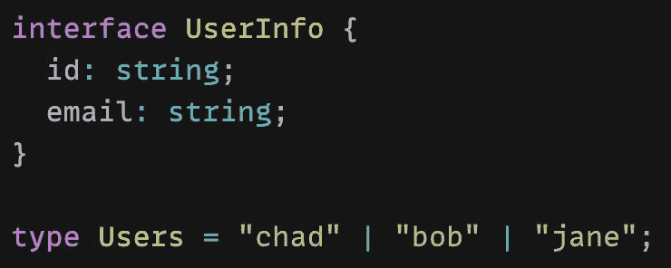
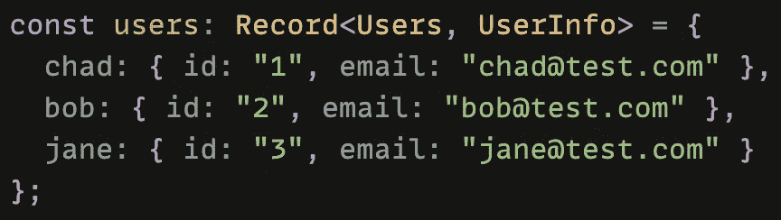
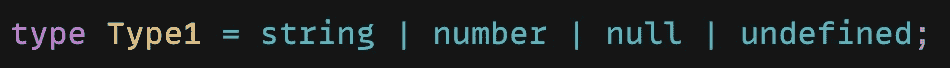
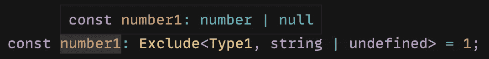
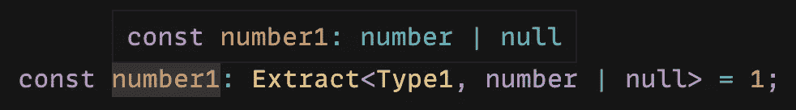
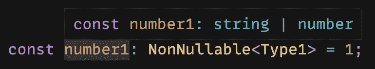

# TypeScript 实用工具类型介绍:第二部分

> 原文：<https://blog.devgenius.io/introduction-to-typescript-utility-types-part-two-fb6e696ad4ac?source=collection_archive---------3----------------------->

## 如何使用记录、排除、提取和非空值

[史蒂夫·哈维](https://unsplash.com/@trommelkopf?utm_source=medium&utm_medium=referral)在 [Unsplash](https://unsplash.com?utm_source=medium&utm_medium=referral) 上的照片

我正在努力提高我的打字技能。为了做到这一点，我一直在花时间阅读 TypeScript 文档，以学习更多的中级到高级概念。

在本文中，我将介绍 TypeScript 中的实用工具类型。

如果您不熟悉 TypeScript，请先阅读下面的文章，了解一些基本概念。

 [## TypeScript 中的类型注释与类型推理

### 如何在 TypeScript 中向变量添加类型

levelup.gitconnected.com](https://levelup.gitconnected.com/type-annotation-vs-type-inference-in-typescript-85ba2194ebe1) 

## 什么是实用程序类型？

实用程序类型用于促进常见的类型转换。基本上，这意味着实用程序类型用于从现有类型创建新类型。

当使用 TypeScript 时，有许多类型实用工具是全局可用的。如果你想看完整的列表，请点击这里查看他们的文档。

让我们来看看以下常用的实用程序类型:

*   `Record<Keys, Type>`
*   `Exclude<Type, ExcludedUnion>`
*   `Extract<Type, Union>`
*   `NonNullable<Type>`

如果您错过了本文的第一部分，请查看下面的内容。

 [## TypeScript 实用工具类型介绍:第一部分

### 如何使用 Partial、Required、Pick、省略和 Readonly

blog.devgenius.io](/introduction-to-typescript-utility-types-part-one-11e53a10db95) 

# 记录

`Record`创建一个设置了属性键和属性值类型的对象类型。这需要两个参数。第一个是一组键，第二个是要设置给每个属性的类型。

它用于将一种类型的属性映射到另一种类型。

比如我有一个`UserInfo`型和一个`Users`型这样的。`UserInfo`类型是一个以 *id* 属性为字符串，以 *email* 属性为字符串的对象。`Users`类型是我们想要表示对象属性的字符串的并集。

我可以创建一个新的对象来映射`Users`类型并添加`UserInfo`作为每个属性的类型。

现在，`users`对象具有了`Users`类型的属性。每个属性都有一个`UserInfo`类型的类型。

# 排除

`Exclude`实用程序类型通过排除分配给给定参数的所有联合成员来创建一个新类型。

这需要两个参数。首先是要检查的类型。第二个是您希望从新创建的类型中排除的类型。

例如，这里我有一个类型，它可以是字符串、数字、null 或未定义的。

然后，我将创建一个变量，但只希望这个变量是一个数字或 null。

我可以使用`Exclude`实用程序类型，并将`string | undefined`作为第二个参数传递。这将从联合类型中移除它们。那么我的变量的类型就是`number | null`。

# 摘录

`Exclude`的反义词是`Extract`。`Extract`通过包含分配给给定参数的所有联合成员来创建新类型。

这也需要两个参数。首先是要检查的类型。第二个是您希望包含在新创建的类型中的类型。

例如，如果我们使用与上面相同的`Type1`类型，我们可以获得相同的结果。这次我们将使用`Extract`实用程序类型，并将`number | null`作为第二个参数传递。

# 不可空

`NonNullable`是`Exclude`实用程序类型的另一个版本。它接受一个类型作为参数。`NonNullable`将创建一个新类型，从类型参数中排除 null 和 undefined。

使用同样的例子，这次我们的变量将是类型`string | number`。

# 结论

感谢阅读！我希望这篇文章有助于您开始使用 TypeScript 中的实用工具类型。查看他们的文档以了解更多。

如果您想继续阅读关于 TypeScript 的内容，请查阅下面的文章，了解如何使用类型保护来缩小范围。

 [## 使用类型保护缩小类型脚本

### 帮助 TypeScript 通过收缩获得正确的类型

javascript.plainenglish.io](https://javascript.plainenglish.io/typescript-narrowing-using-type-guards-268e4c6edc0) 

**资源**

*   [https://www . typescriptlang . org/docs/handbook/utility-types . html](https://www.typescriptlang.org/docs/handbook/utility-types.html)