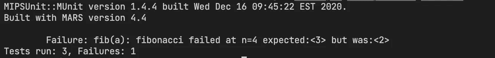
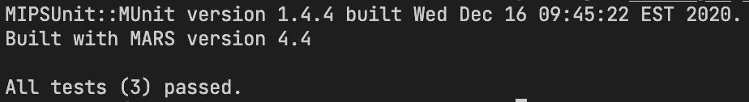

# MUnit 中的单元测试介绍

> 原文：<https://blog.devgenius.io/introduction-to-unit-testing-in-munit-4ce7e24ff3f4?source=collection_archive---------6----------------------->

低级代码不一定是未经测试的代码

[](https://github.com/daminals/Unit_Testing_with_MUnit)

查看该项目的 GitHub

# 什么是单元测试？

单元测试是软件开发中的一个过程，它需要创建测试用例来评估单个代码单元的功能和行为。这是软件开发过程中至关重要的一步，通常由开发人员作为日常任务的一部分来执行。

单元测试的主要优势之一是它有助于在开发过程的早期发现缺陷和错误，在它们可能导致更大的问题之前。通过为代码编写单元测试，您可以确保代码按预期运行，并且您所做的任何更改都不会破坏现有的功能。

用汇编语言编写代码通常会涉及到令人头疼的繁琐过程，调试这些代码可能会花费数小时的时间。这就是为什么在编写这种类型的代码时，应用单元测试尤为必要。

本文将介绍如何用 MUnit 编写测试，这是一个基于 JUnit 的汇编语言 mips 测试框架。

需要注意的是，单元测试的过程包括编写离散函数的测试，在函数测试之前或之后存储在变量/寄存器中的值不能保证在不同的测试中保持不变。

本文中使用的所有代码都可以在[的 github 链接](https://github.com/daminals/Unit_Testing_with_MUnit)上获得。

# 启动测试文件

在开始之前，我们需要清除许多样板代码，所以我现在提供一个样本测试文件:

```
import org.junit.*;
import org.junit.rules.Timeout;

import java.util.*;
import java.io.*;
import java.util.concurrent.TimeUnit;

import static edu.gvsu.mipsunit.munit.MUnit.Register.*;
import static edu.gvsu.mipsunit.munit.MUnit.*;
import static edu.gvsu.mipsunit.munit.MARSSimulator.*;

import org.junit.rules.Timeout;
import java.util.concurrent.TimeUnit;

public class TestName {

  int sp = 0;
  int s0 = 0;
  int s1 = 0;
  int s2 = 0;
  int s3 = 0;
  int s4 = 0;
  int s5 = 0;
  int s6 = 0;
  int s7 = 0;
  int gp = 0;

  @Before
  public void preTest() {
    s0 = get(s0);
    s1 = get(s1);
    s2 = get(s2);
    s3 = get(s3);
    s4 = get(s4);
    s5 = get(s5);
    s6 = get(s6);
    s7 = get(s7);
    sp = get(sp);
    gp = get(gp);
  }

  @After
  public void postTest() {
    Assert.assertEquals("Register convention violated $s0", s0, get(s0));
    Assert.assertEquals("Register convention violated $s1", s1, get(s1));
    Assert.assertEquals("Register convention violated $s2", s2, get(s2));
    Assert.assertEquals("Register convention violated $s3", s3, get(s3));
    Assert.assertEquals("Register convention violated $s4", s4, get(s4));
    Assert.assertEquals("Register convention violated $s5", s5, get(s5));
    Assert.assertEquals("Register convention violated $s6", s6, get(s6));
    Assert.assertEquals("Register convention violated $s7", s7, get(s7));
    Assert.assertEquals("Register convention violated $sp", sp, get(sp));
    Assert.assertEquals("Register convention violated $gp", gp, get(gp));
  }

  @Rule
  public Timeout timeout = new Timeout(30000, TimeUnit.MILLISECONDS);

}
```

这是我们基本的 java 单元测试文件，稍后我们将基于我们的程序添加测试。您将能够使用函数来编译它

```
javac -cp munit.jar path/to/test/file.java                
java -jar munit.jar path/to/test/file.class path/to/mips/file.asm
```

# 要测试的 Mips 代码

我将为您提供一个递归斐波那契函数在 mips。下面的代码有一个 bug，我们将通过单元测试来找到它。

```
# Compute the nth fibonacci number
#
# n: the index of the fibonacci number to compute
#
# return: the nth fibonacci number

.globl fibonacci
fibonacci:

    # Check if n is 0 or 1
    li $t0, 1
    beqz $a0, return_0
    beq $a0, $t0, return_1

    # Compute the (n-1)th and (n-2)th fibonacci numbers
    addi $sp, $sp, -8    # allocate space on the stack
    sw $ra, 4($sp)       # save return address
    sw $a0, 0($sp)       # save n
    addi $a0, $a0, -1    # n-1
    jal fibonacci        # call fibonacci(n-1)
    lw $a0, 0($sp)       # restore n
    addi $a0, $a0, -2    # n-2
    jal fibonacci        # call fibonacci(n-2)
    lw $ra, 4($sp)       # restore return address
    addi $sp, $sp, 8     # deallocate space on the stack

    # Return the sum of the (n-1)th and (n-2)th fibonacci numbers
    add $v0, $v0, $t0
    jr $ra

return_0:
    li $v0, 0    # return 0
    jr $ra

return_1:
    li $v0, 1    # return 1
    jr $ra
```

我们的斐波那契函数遵循标准的递归算法:

```
function fibonacci(n): // this example is written in psuedocode
  if n == 0 or n == 1:
    return 1
  else:
    return fibonacci(n-1) + fibonacci(n-2)
```

# 测试案例

好的，为了开始编写测试用例，我们必须首先考虑要测试的边缘用例。我会列一个清单

*   纤维(0)
*   纤维(1)
*   纤维

这为斐波那契函数提供了一个合适的范围，因为我们的边缘情况最有可能位于我们的基础情况(0，1)上，然后我们可以测试其他一切(n)。

下面是我们开始编写测试用例的方法:

```
 @Test
  public void test_zero() {
    run("fibonacci", 0); # run the mips function we defined, with a0=0
    Assert.assertEquals(0, get(v0)); # assert that it is the correct answer, 0
  }

  @Test
  public void test_one() {
    run("fibonacci", 1); # run the mips function we defined, with a0=1
    Assert.assertEquals(1, get(v0)); # assert that it is the correct answer, 1
  }
```

这为 MUnit 中的测试用例提供了一个标准模板。为了测试 n，我们需要一种方法来计算任何给定的 fibonacci n 的正确答案，因此让我们用 java 编写一个 fibonacci 函数来测试我们的 mips 代码:

```
 public int fibonacci(int n) {
    if (n <= 1) return n;
    return fibonacci(n-1) + fibonacci(n-2);
  }
```

让我们也写出测试用例:

```
 @Test
  public void fib() {
    for (int n=2; n<25; n++){ # test n up to 25, starting from where we stopped at 1
      run("fibonacci", n); # run the mips function we defined, with a0=n
      # test mips function against java function
      Assert.assertEquals("fibonacci failed at n=" + n,fibonacci(n), get(v0));
    }
  }
```

让我们使用下面的函数编译并运行我们的测试用例

```
javac -cp munit.jar path/to/test/file.java                
java -jar munit.jar path/to/test/file.class path/to/mips/file.asm
```

## 结果



斐波那契函数失败:预期 3 找到 2

运行测试用例后，我们发现了问题所在。我们毫无问题地完成了前两个测试用例，但是我们的 fib(n)单元测试失败了。我们还知道函数在 n=4 时失败，这给了我们一个很好的调试起点。

因为我们知道我们的代码在哪里失败了，我们可以调查函数是否正确地添加，因为它使我们所有的基本情况都正确，甚至有一些超过了它们。

经过进一步调查，证明这是正确的。让我们看看第 28 行

```
# Return the sum of the (n-1)th and (n-2)th fibonacci numbers
add $v0, $v0, $t0
```

我们加上$t0，并声称它是第 n-2 个 fib 数，但我们从未将其设置为该数。让我们通过将 fib 结果存储在堆栈中，然后在需要使用它们时恢复它们来解决这个问题！

```
# Compute the nth fibonacci number
#
# n: the index of the fibonacci number to compute
#
# return: the nth fibonacci number

.globl fibonacci
fibonacci:

    # Check if n is 0 or 1
    li $t0, 1
    beqz $a0, return_0
    beq $a0, $t0, return_1

    # Compute the (n-1)th and (n-2)th fibonacci numbers
    addi $sp, $sp, -16    # allocate space on the stack
    sw $ra, 4($sp)       # save return address
    sw $a0, 0($sp)       # save n
    addi $a0, $a0, -1    # n-1
    jal fibonacci        # call fibonacci(n-1)
    sw $v0, 8($sp)       # store fib(n-1) in the stack
    lw $a0, 0($sp)       # restore n
    addi $a0, $a0, -2    # n-2
    jal fibonacci        # call fibonacci(n-2)
    sw $v0, 12($sp)      # store fib(n-2) in the stack
    lw $ra, 4($sp)       # restore return address
    # Return the sum of the (n-1)th and (n-2)th fibonacci numbers
    lw $v0, 8($sp)       # load fib(n-1)
    lw $v1, 12($sp)      # load fib(n-2)
    add $v0, $v0, $v1

    addi $sp, $sp, 16     # deallocate space on the stack
    jr $ra

return_0:
    li $v0, 0    # return 0
    jr $ra

return_1:
    li $v0, 1    # return 1
    jr $ra
```

好了，这应该能解决问题。让我们重新运行我们的单元测试！



100%测试通过

完美，我们所有的测试都通过了！多刺激啊！

# 结论

尽管可能不会立即显现出来，但是创建这些测试用例节省了大量调试时间。我们没有在 mips 中手动输入测试，也没有偶然发现这个错误，而是能够以编程方式找到代码中的问题，然后使用这个程序缩小代码中出错的地方。

即使知道代码被破坏了，测试用例也给了我们优势，让我们知道在哪里寻找 bug。如果我们知道哪些案例失败了，它可以给我们一个很好的原因。

如果你想了解更多关于 mips 中单元测试的知识，请查看我对这篇关于用 MUnit 测试 mips 中缓冲区的文章的后续文章:

[](/learning-to-test-buffers-in-mips-a43f10393f86) [## 学习测试 MIPS 中的缓冲器

### 有时你的 MIPS 程序会将缓冲区作为输入，但是我们如何利用 MUnit 来测试这些功能呢？

blog.devgenius.io](/learning-to-test-buffers-in-mips-a43f10393f86) 

本文中使用的所有代码都可以在下面链接的 github 资源库中找到。

[](https://github.com/daminals/Unit_Testing_with_MUnit) [## GitHub-da minals/Unit _ Testing _ with _ MUnit

### 低级代码不一定是未经测试的代码

github.com](https://github.com/daminals/Unit_Testing_with_MUnit)