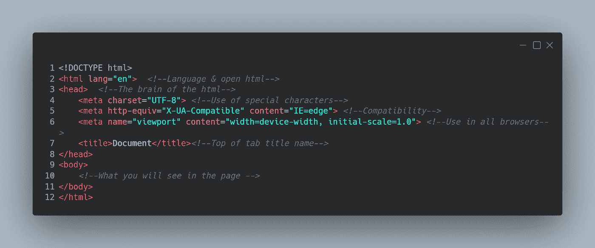
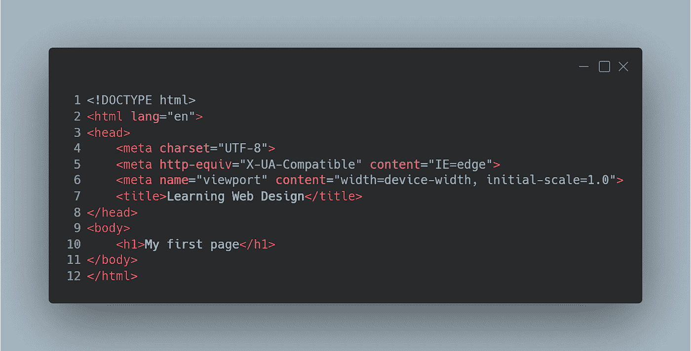
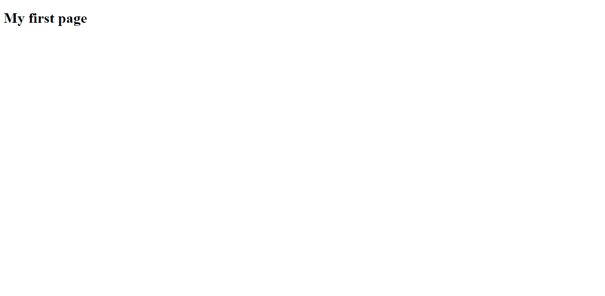
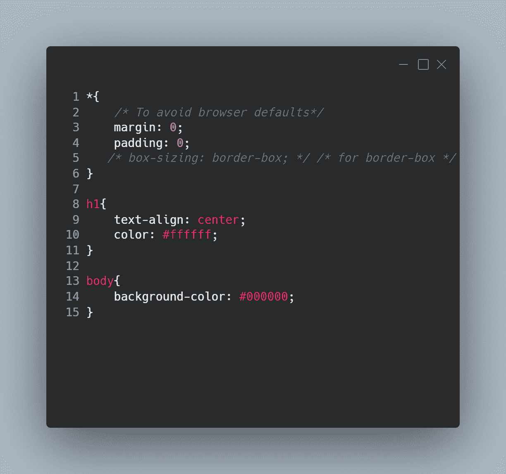
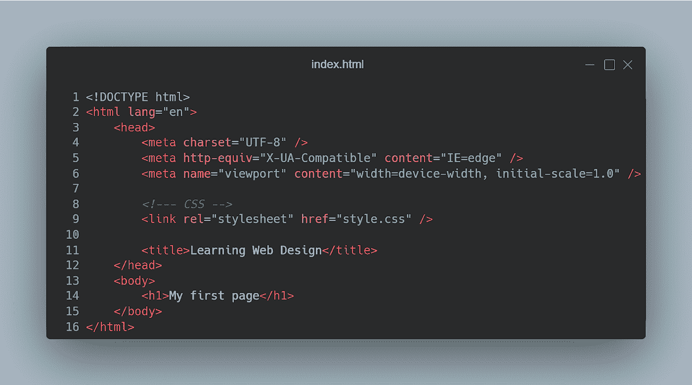
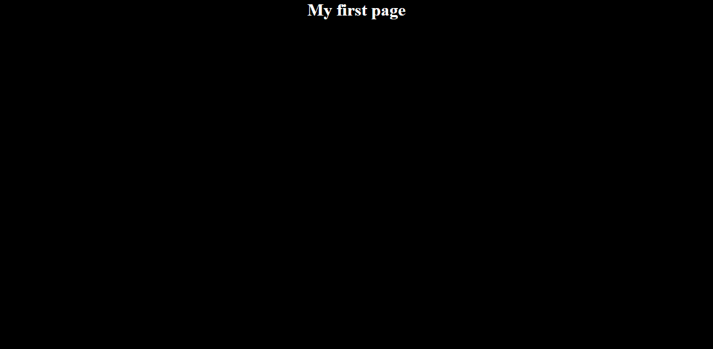
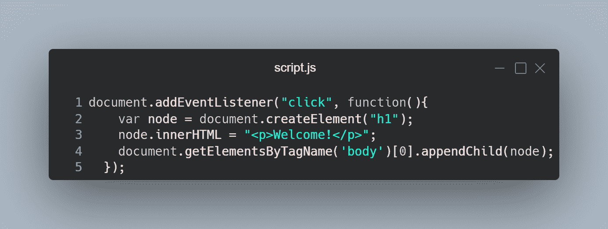
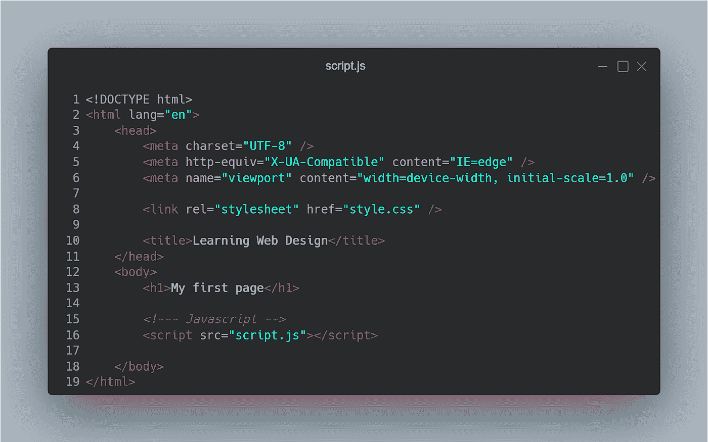

# Web 开发入门:HTML + CSS + Javascript

> 原文：<https://blog.devgenius.io/introduction-to-web-development-html-css-javascript-64b5a2d63096?source=collection_archive---------6----------------------->

嘿宝贝们！开始编程最简单的方法可能是从网页设计开始。嗯，也许不是，但这是最容易跟上，而不会达到某种学习高原。

先说两个真相和一个谎言:

1.  HTML 是超文本标记语言的缩写，我们用它来书写页面内容
2.  CSS(层叠样式表)用于设计我们的页面
3.  javascript 来源于 Java，是我们页面的脚本或编程发生的地方

嗯，这是半个谎言。Javascript 并不是来自 Java，而是源于以前在浏览器中使用的旧 Java 小程序的想法。一半的事实来自于这样一个事实，即 Javascript 是这三者中唯一一个你实际编码的。

最后，我会写一些课程、网页和视频供你查找，这样你就能真正沉浸其中。

# 您将需要什么:

*   代码编辑器
*   浏览器

对于代码编辑器，我建议您使用 Visual Studio 代码来添加扩展。

# HTML:

大多数标签在 html 中打开和关闭。这是 html 文档的基本模板。

创建一个名为 index.html 的文件，如果你使用的是 Visual Studio 代码你可以使用 Emmet 缩写**！**创建它。

让我们添加一个标题 1 标签 **< h1 > < /h1 >** 以便能够看到 css。

让我们打开它。你可以通过点击你的文件，用浏览器或服务器打开它来打开你的 html。Visual Studio 代码有一个由 Ritwick Dey 开发的名为 Live Server 的扩展，可以用来打开它。

为了能够看到更改，您可能需要在浏览器中保存并刷新页面。但是你会看到这一页:

# 半铸钢ˌ钢性铸铁(Cast Semi-Steel)

现在让我们添加一个简单的设计。

您可以使用 body、classes(.[你的类的名称])、id(#[你的类的名称])，以及像*这样的通用选择器来调用你想要的样式。然后用您想要的样式打开和关闭花括号{}。

为了让你的页面使用该样式，你必须将它们与<link>连接起来。Link 是一个自结束的 HTML 标记。

上面的代码在你的浏览器中会是这样的。

# java 描述语言

在 javascript 中你将编码。单击、悬停和您单击的按键是在文档顶部工作的事件。您可以通过 getElementBy[…]选择想要的文档部分(元素)。在这种情况下，我们将只向整个文档添加一个事件，当您单击页面的任何部分时都会触发该事件。我们创建了一个包含短语 Welcome 的新元素！然后我们在 html 中将它附加(添加到末尾)到我们的主体中。

然后我们用标签****将它添加到我们的 html 中。这将放在< /body >之前，或者放在带有延迟选项的头部。

当你点击你的页面时，它会添加新的文本。

现在你有了你的第一页！如果你一步一步走下去，明白为什么一切都会发生，那就很容易了！

# 了解更多信息的资源

[https://www.freecodecamp.org/learn/](https://www.freecodecamp.org/learn/)——html+CSS 的响应式网页设计

https://learnjavascript.online/[——JavaScript 的互动学习](https://learnjavascript.online/)

【https://mikkegoes.com/javascript-projects-for-beginners/】T4——做项目而不是学习 javascript 理论

[https://www.w3schools.com/html/default.asp](https://www.w3schools.com/html/default.asp)—HTML 文档

[https://www.w3schools.com/css/default.asp](https://www.w3schools.com/css/default.asp)—CSS 文档

[https://developer.mozilla.org/en-US/docs/Web/JavaScript](https://developer.mozilla.org/en-US/docs/Web/JavaScript)—Javascript 文档

[https://javascript.info/](https://javascript.info/)—Javascript 文档