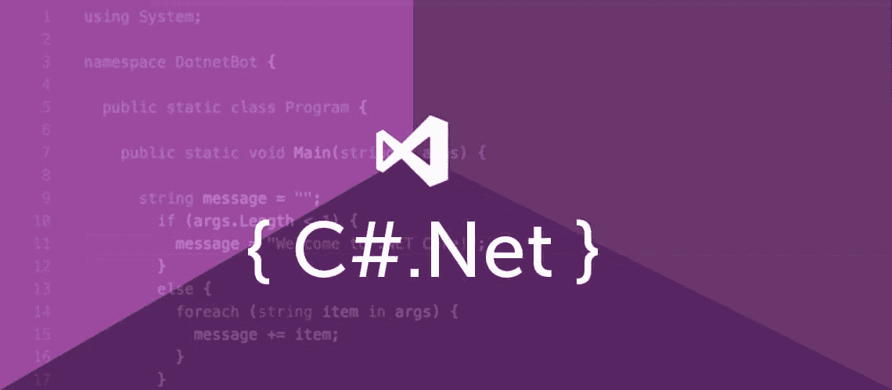

# c#使用中的 web3 介绍。网和尼瑟姆。

> 原文：<https://blog.devgenius.io/introduction-to-web3-in-c-using-net-and-nethereum-ea3d9812aa16?source=collection_archive---------1----------------------->

***为了开始，我们将要求以下:***

-文本编辑器，

-系统上安装的 NET Core SDK 3.1，

以太坊节点。

列出了在 c#上使用。Net 框架，我想简要解释一下我在本文中经常提到的重要术语。

***DOTNET 或。NET:***

。NET 是一个免费、跨平台、开源的开发环境，用于构建不同类型的应用程序，使用多种语言编辑器，如 visual basic、libraries、c#和 f#来构建 web、移动、桌面、游戏、物联网等。虽然它最初是为 windows 应用程序而创建的，但由于支持多种编程语言，基于 web 和基于表单的应用程序都可以使用。网和[ASP.NET](http://asp.net/)。中的一个工具。NET 框架，人们可以为 web 应用程序构建后端。

***的一些特性。NET 框架包括:***

-安全，

-语言独立，

-互操作性，

-便携性，

-简化部署，

-基础类库，

-公共语言运行时引擎(CLR)。

***C#:***

C#是一种通用的、面向对象的语言，由微软公司开发。它运行并安装在。Net 框架。

***尼瑟姆:***

尼瑟姆是。以太坊的. Net 集成库；它简化了与以太坊节点的访问和智能合约交互。它兼容所有主要的操作系统，并在移动、桌面、云、Xbox、hololens 和 Windows IoT 上进行测试。尼瑟姆非常适合 Web3 开发。

***幽冥的一些特征包括:***

-Unity 3d 集成。

-支持核心以太坊 JSON RPC / IPC 方法。

-具有标准契约令牌、ENS 和 Uport 的库。

-支持高清钱包。

-简单的帐户生命周期。

-ABI 有吗？NET 类型编码和解码。

-简化的智能合同交互。

现在我已经解释了上面的术语，我将使用尼日琴 web3 包从以太琴区块链获得最新的块号。

***如何安装尼瑟姆:***

要安装尼瑟姆，您需要。网芯还是。您的系统中安装了. NET Framework(4.5.1+)。在本演示中，我们将安装。NET Core SDK 使尼瑟姆工作。下载并安装。基于您的操作系统的 NET Core SDK 版。然后转到您的终端/命令行，键入以下命令:

*$ dotnet 新控制台-o nethereumapp*

一旦执行，它将创建一个新的。当前目录中的. NET 应用程序。您可以为您的应用程序选择任何名称。例如，我会把我的名字叫做*尼瑟姆 1*

现在，cd 进入您的应用程序:

*$ cd nethereum1*

现在添加对尼瑟姆的包引用。网站 3:

*$ dotnet 添加包尼瑟姆。网络 3*

这可能需要一些时间，但是在添加包引用后，通过键入以下命令下载/更新包:

*$ dotnet restore*

如果正确安装，尼瑟姆将与尼瑟姆 web3 包一起添加到您的 PC 中。

***现在我已经安装了以太坊，我将继续引导我们的以太坊节点***

首先，我们需要一个免费的端点 QuickNode，它可以是一个 testnet，如:Rinkeby，Kovan，Ropstepn 或 Mainnet。在你创建了你的免费以太坊端点后，复制你的 HTTP 提供者端点，你以后会需要它，所以确保复制并保存它。

***注意:*** 我们可以使用任何以太坊客户端，比如 Geth 或者 OpenEthereum (fka 奇偶校验)。

***与以太坊连接:***

去你的。NET app 文件夹并在文本编辑器中打开 Program.cs C#文件。

根据以下代码编辑代码:

*使用系统；*

*使用系统。线程。任务；*

*利用尼瑟姆。Web3*

*命名空间 nethereumapp*

*{*

*类程序*

*{*

*静态 void Main(string[] args)*

*{*

*GetBlockNumber()。wait()；*

*}*

*静态异步任务 GetBlockNumber()*

*{*

*Var web 3 = new web 3(" ADD _ YOUR _ ether eum _ NODE _ URL ")；*

*Var latest block number = await web 3。eth . blocks . getblocknumber . sendrequestasync()；*

*控制台。WriteLine($ "最新的块号是:{ latestBlockNumber } ")；*

*}*

*}*

*}*

确保用上一节中的 http 提供程序替换“ADD_YOUR_ETHEREUM_NODE_URL”。

***下面是上面代码的分解:***

第 1–3 行:我添加了所需的名称空间。

第 5 行:我声明了应用程序的名称空间(它将有一个类集合)。

第 7 行:我声明了一个名为 Program 的类。

第 9–12 行:我声明了 Main 类，这是 C#程序的入口点，并声明了该类在执行时做什么；声明主类必须等待 GetBlockNumber 类的执行。

第 14 行:我声明了一个任务类 GetBlockNumber，C#中的任务类是异步执行的。

第 16 行:我创建了一个 Web3 的实例，并设置了我的节点 URL。

第 17 行:使用 Eth API，我可以异步执行 GetBlockNumber 请求，并将结果存储在 latestBlockNumber 变量中。

第 18 行:打印 latest block number 中存储的最新块号，并带有一个字符串“最新块号是:”

要运行您的应用程序，请打开您的终端/cmd，转到您的。NET app 的文件夹，并键入以下内容:

***$ dotnet run***

一旦代码成功执行，您应该会看到如下输出:

**D:\ QuikNode \ netherum 1>dot net run**

***最新块号为:11876806***

回复转发