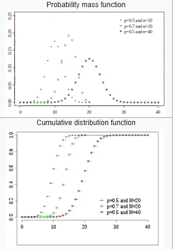
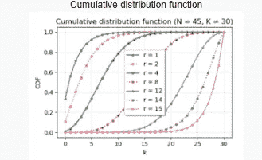

# 机器学习初学者概率分布背后的直觉

> 原文：<https://blog.devgenius.io/intuitions-behind-probability-distributions-62235215dcd2?source=collection_archive---------0----------------------->

## 各种概率分布技术的真实例子

马库斯·斯皮斯克在 [Unsplash](https://unsplash.com/s/photos/chance?utm_source=unsplash&utm_medium=referral&utm_content=creditCopyText) 上的照片

> **“50-50-90 法则:任何时候你有 50-50 的机会做对某件事，但有 90%的可能性你会做错。”**
> 
> **――安迪·鲁尼**

## 介绍

所有参数测试都期望数据处于某种数据分布中，以应用统计测试。然而，分布的形状是由实验和数据的性质决定的。除了理解证明概率分布背后理论的公式背后的复杂数学推导，理解现实生活中的直觉也很重要，因为这是学习的第一步。在本文中，我将解释每种概率分布的真实场景。

## 目录

1.  **离散和连续分布**
2.  **均匀分布**
3.  **伯努利分布**
4.  **二项式分布**
5.  **几何分布**
6.  **负二项分布**
7.  **正态分布**
8.  **泊松分布**
9.  **指数分布**
10.  **超几何分布**
11.  **负超几何分布**
12.  **单峰分布**

## 离散和连续分布

当我们用产生离散结果的变量做实验时，就形成了离散概率分布。

这些变量可以通过计算它们的数量来量化。

***举例-***

***掷出 2 个骰子 6 次，得到和 5 的概率。***

***下周一上课人数的概率。***

***下次生日收到朋友礼物的概率。***

当我们对产生连续结果的变量进行实验时，就会形成连续的概率分布。

这些变量可以通过测量它们的度量来量化。

***举例-***

***选择身高 174 cm 学生的概率。***

***从开车开始 60 分钟内到达目的地的概率。***

***某城市明天气温 30 摄氏度的概率。***

图片取自维基百科— [网址](https://en.wikipedia.org/wiki/Probability_distribution#Discrete_probability_distribution)

图片取自维基百科— [网址](https://en.wikipedia.org/wiki/Probability_distribution#Discrete_probability_distribution)。

连续概率分布的 PDF(图片取自维基百科— [网址](https://en.wikipedia.org/wiki/Probability_distribution#Discrete_probability_distribution))

连续概率分布的 CDF(图片取自维基百科— [URL](https://en.wikipedia.org/wiki/Probability_distribution#Discrete_probability_distribution) )

## 均匀分布

考虑我们掷骰子，得到整数结果的概率是多少？

***获得 1 的概率= 1/6***

***获得 2 的概率= 1/6***

***获得 3 的概率= 1/6***

***获得 4 的概率= 1/6***

***获得 5 的概率= 1/6***

***得到 6 的概率= 1/6***

这里所有可能的结果都有相等的概率。

类似地，考虑我们抛硬币，得到有效结果(正面或反面)的概率是多少

***获得人头的概率= 1/2***

***得到尾巴的概率= 1/2***

这里，所有可能的结果都有相同的概率。

这些场景是均匀分布的示例。

图片取自维基百科— [网址](https://en.wikipedia.org/wiki/Uniform_distribution_(continuous))

图片摘自维基百科— [网址](https://en.wikipedia.org/wiki/Uniform_distribution_(continuous))

## 伯努利分布

这是一种只有两种可能结果的分布——对或错。

***例如-***

***抛硬币时获得有效结果的概率(正面或反面)。***

***参加考试时获得有效结果的概率(通过或失败)。***

***参加药物治疗时获得有效结果的概率(有效或无效)。***

## 二项分布

这是伯努利分布的扩展版本，其中多个伯努利事件聚集在一起。

例如，如果我们想知道掷硬币一次正面朝上的概率是二项分布。但是，抛硬币超过一次(比如说 5 次)，正好得到 3 个头的概率有多大？这是二项式分布的一个经典例子。

***再多一些的例子有-***

在 7 次投掷中获得 3 个头的概率。

***游戏玩 10 次正好赢 5 次的概率。***

***期末考试 10 门科目中正好有 6 门通过的概率。***

图片摘自维基百科— [网址](https://en.wikipedia.org/wiki/Binomial_distribution)

## 几何分布

假设我们正站在一个选举投票站前。有两个候选人 X 和 Y 在选举中竞争。现在我们需要找出在第一次投票前没有投票给 X 的人数。

想象一下，每个人从投票站出来后都说他投了谁的票。

第一个人说他投了 y。

第二个人说他投了 y。

第三个人说他投了 y。

第四个人说他投了 y。

第五个人说他投了 x。

这里，4 票没有投给 X，直到他得到第一票。

这意味着在获得第一次成功之前有 n 次失败。

几何分布就是这样一种数据分布，它测量第一次成功发生之前的失败次数。

图片摘自维基百科— [网址](https://en.wikipedia.org/wiki/Geometric_distribution)

***几何分布的发生应该有一定的条件。***

***试验应该是独立的。***

***胜负应该是二元的。***

***每次试验成功的概率应该相等。***

## 负二项分布

这是几何分布的扩展，其中成功计数的数量将是倍数而不是一。在这里，我们测量在达到指定的成功次数之前的失败次数。

例如，直到 X 正好得到 3 票时才投票给 X 的选民人数。

## 正态分布

正态分布，也称为高斯分布，是一种关于平均值对称的概率分布，表明接近平均值的数据比远离平均值的数据出现得更频繁。

根据理论，数据分布形状将完全像一个钟形曲线。大多数情况下，偏斜为零，峰度约为 3。

***例如，***

***样本数据由一个班级所有学生的身高组成。***

***某次考试中一个班所有学生的分数。***

图片取自维基百科— [网址](https://en.wikipedia.org/wiki/Normal_distribution)

图片取自维基百科— [网址](https://en.wikipedia.org/wiki/Normal_distribution)

经验法则告诉你，你的数据有多少百分比落在均值的某个标准差范围内:
68%的数据落在均值的一个标准差范围内。
95%的数据落在平均值的两个标准偏差内。
99.7%的数据落在平均值的三个标准偏差内。

**如果我们使用均值=0 且标准差=1 的函数将所有数据点转换为新值，则可以形成标准正态分布。**

**如果我们将所有的数据点转换成它们对应的对数，就可以形成对数正态分布。**

**如果我们把一个标准正态分布的所有数据点转换成它对应的对数值，就可以形成一个对数标准正态分布。**

非对称的正态分布称为偏态分布。偏斜可以是正的，也可以是负的。

## 泊松分布

它是一种离散的概率分布，计算给定时间段内发生给定数量事件的概率。

举个例子，

假设一位教授计划在周一上午 9 点到 10 点上课。如果班级总人数为 100 人，正好 75 名学生参加该班的概率是多少？

这不过是泊松分布的一个例子。

更多的例子是-

2021 年，纽约市可能会新建 50 栋建筑。

美国股市从上午 9 点到下午 3 点，恰好 50 只股票涨幅超过 3%的概率

图片摘自维基百科— [网址](https://en.wikipedia.org/wiki/Poisson_distribution)

图片摘自维基百科— [网址](https://en.wikipedia.org/wiki/Poisson_distribution)

这里，λ通常是在历史证据的帮助下假设的。

## 指数分布

它是一个连续的概率分布，描述了两个独立事件的两次到达之间需要等待的时间。

例如，假设一位教授从上午 9 点到 10 点上课。

学生 1 在上午 9:01 到达。

学生 2 在上午 9:05 到达。

学生 3 在上午 9:15 到达。

学生 4 在上午 9:10 到达。

学生 5 在上午 9:08 到达。

现在，学生 2 和学生 3 到达的时间差大于 5 分钟的概率是多少？

这不过是指数分布的一个例子。

同样的，

学生 2 和学生 3 到达的时间差小于 5 分钟的概率是多少？

学生 2 和学生 3 到达的时间差小于 5 分钟但大于 3 分钟的概率是多少？

图片取自维基百科- [网址](https://en.wikipedia.org/wiki/Exponential_distribution)

图片摘自维基百科- [网址](https://en.wikipedia.org/wiki/Exponential_distribution)

这里λ是每单位时间到达的平均次数。

## 超几何分布

这是一种特殊的分布，在这种分布中，当从一大群人中抽取一个对象时，测量该对象的某些特殊特征的概率。

想想纽约市有一百万只猫。如果我们从种群中随机选择一只猫，我们想知道这只猫是母的概率。人口这么多，这个很难确定。

现在，我们从总人口中随机选择 1000 只猫。现在，从这个随机样本中选出的猫是雌性的概率是多少？

这不过是超几何分布的一个真实例子。

**如果我们仔细观察这个理论，我们可以发现这是二项分布的一个扩展版本。**

图片摘自维基百科— [网址](https://en.wikipedia.org/wiki/Hypergeometric_distribution)

图片取自维基百科— [网址](https://en.wikipedia.org/wiki/Hypergeometric_distribution)

这里，

N =人口规模

K =群体中成功状态的数量

N =抽签次数

K =观察到的成功次数

## 负超几何分布

这类似于超几何分布背景下的负二项式分布。

这里，我们需要在预定义的成功次数之前测量失败的次数。

对于上面解释的同一个现实世界的场景，如果我们把纽约的猫总数 100 万算进去，那么在我们找到 20 只公猫之前，得到正好 120 只母猫的概率是多少？

这只不过是负超几何分布的一个例子。

图片取自维基百科— [网址](https://en.wikipedia.org/wiki/Negative_hypergeometric_distribution)

图片摘自维基百科— [网址](https://en.wikipedia.org/wiki/Negative_hypergeometric_distribution)

这里，

n =人口规模

K=群体中成功状态的数量

R =故障次数

k =观察到的成功次数。

## 单峰分布

在数据分布图中，单峰分布有一个可识别的峰值。正态分布是单峰分布的一个例子，其中数据从一个小值开始上升，在某个数字达到峰值，然后再次逐渐下降。

双峰分布在数据分布的形状上有两个峰值。

图片摘自维基百科— [网址](https://en.wikipedia.org/wiki/Unimodality#/media/File:Bimodal.png)

类似地，多模态分布在数据分布的形状上具有两个以上的峰值。

二元、多模态分布。图片摘自维基百科— [网址](https://en.wikipedia.org/wiki/Multimodal_distribution#/media/File:Bimodal-bivariate-small.png)

## 结论

概率的历史真的很丰富，很古老，也很迷人。然而，在整个世纪中，这个主题仍然只是知识分子和研究人员的茶。随着近年来机器学习和数据科学的快速发展，这一主题在行业中兴起，掌握这一精髓的学生和专业人士一直需求量很大。

尽管 R 和 Python 中有各种内置的库可用于概率测试和随机过程，但非常有必要了解概念的实时应用和直观的过程计算，以便在关于不断变化的业务用例的高性能和一致性方面创建高级模型。

我希望这篇文章有助于你理解每个概率分布概念背后的直觉。

您可以通过以下平台联系我-

1.  [Quora](https://www.quora.com/profile/Sanjay-Kumar-563?q=sanjay%20kumar)
2.  [领英](https://www.linkedin.com/in/sanjay-nandakumar-8278229b/)
3.  Gmail—sanjayjsw05@gmail.com

## 参考

1.Agresti A，Finlay B. [**社会科学的统计方法**](https://www.researchgate.net/publication/322681991_STATISTICAL_METHODS_FOR_THE_SOCIAL_SCIENCES) 。第四版。新泽西州上马鞍河:普伦蒂斯霍尔出版社，2009 年。

2.佩洛西 MK，桑迪弗 TM，切尔奇耶洛 P，等 [**介绍**所有统计数据](https://www.matematicamente.it/appunti/statistica/introduzione-alla-statistica/#:~:text=La%20statistica%20si%20occupa%20della,si%20possono%20osservare%20e%20misurare.)。第二版。那不勒斯:Edizioni Scientifiche Italiane，2008 年。

3.哈耶克 [**对概率的诠释**](https://plato.stanford.edu/entries/probability-interpret/) 。扎尔塔·恩，编辑。斯坦福哲学百科全书。加利福尼亚州斯坦福:形而上学研究实验室，2012 年。

4.Grimmett GR，Stirzaker 博士 [**概率与随机过程**](https://link.springer.com/chapter/10.1007/978-1-4757-2024-2_1#:~:text=The%20space%20containing%20all%20of,of%20symbols%20from%20the%20alphabet.) ，第 3 版。牛津:牛津大学出版社，2001。