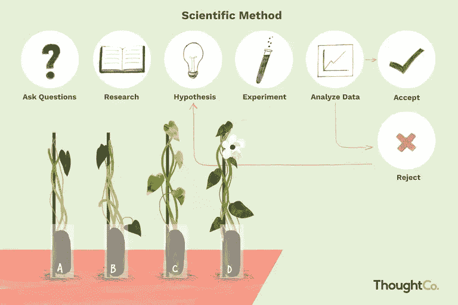

# 逆向科学家方法(又名 TDD)

> 原文：<https://blog.devgenius.io/inverted-scientist-method-aka-tdd-e7848c3fd982?source=collection_archive---------12----------------------->

## 作为 TDD 类比的科学家方法

[https://www . thoughtco . com/steps-of-the-scientific-method-p2-606045](https://www.thoughtco.com/steps-of-the-scientific-method-p2-606045)

## 软件中的科学家方法

“**科学方法**是一种[经验](https://en.wikipedia.org/wiki/Empirical)的获取知识的方法，至少自 17 世纪以来，这种方法已经成为[科学](https://en.wikipedia.org/wiki/Science)发展的特征。它涉及到仔细的观察，对观察到的东西应用严格的怀疑态度，因为认知假设会扭曲人们对观察结果的理解。它包括基于这样的观察，通过[归纳](https://en.wikipedia.org/wiki/Inductive_reasoning)形成[假设](https://en.wikipedia.org/wiki/Hypothesis)；[实验](https://en.wikipedia.org/wiki/Experiment)和基于测量的检验[从假设中得出的推论](https://en.wikipedia.org/wiki/Deductive_reasoning)；以及基于实验发现的假设的改进(或消除)。这些是科学方法的原则，区别于适用于所有科学事业的一系列确定的步骤。”[维基百科](https://en.wikipedia.org/wiki/Scientific_method)

让我们把这个转移到软件上，想象我们需要理解公司中使用的遗留系统。科学家首先会做什么来理解它？。
**观察**:所以基本上我们的调查员会摆弄软件添加输入和接收输出，试图了解系统在做什么。
**提问**:会有一些问题来理解为什么当输入是 A 时输出是 B
**假设**:科学家会创造一些假设来回答这些问题。
**实验**:会创建一些实验来证明这些假设或者丢弃它们。
**数据分析**:执行实验，记录数据，接受或拒绝你的假设。

这是一个非常严格的方法，我们对我们的结果非常有把握，但是时间呢？。软件最大的优势就是可以获得源代码。我们可以回答我们的科学家通过阅读代码所提出的问题，这就是为什么以一种人们仅仅通过阅读就能理解的方式编写代码如此重要。在我们的场景中，遗留代码通常很难理解，从事该代码工作的开发人员只想让它工作:

*   没有测试
*   没有好名字
*   没有好的抽象

在这种情况下，我们只有用科学家的方法了。这意味着速度慢，所以添加一个新特性会很慢，因为我们必须验证我们的假设(你可以称之为技术债务)。如果你想停止支付每个特性的技术债务，你应该开始坚持你的实验(在你的代码库中创建测试)。

## [实验](https://www.thoughtco.com/steps-of-the-scientific-method-p2-606045)

“设计并执行一个实验来检验你的假设。一个实验有一个[独立](https://www.thoughtco.com/definition-of-independent-variable-605238)和[相关](https://www.thoughtco.com/definition-of-dependent-variable-604998)变量。你改变或控制自变量，并记录它对因变量的[的影响。重要的是在一个实验中只改变一个变量，而不是试图在一个实验中组合变量的影响。例如，如果你想测试光照强度和肥料浓度对植物生长速度的影响，你实际上是在看两个独立的实验。”](https://www.thoughtco.com/what-is-a-dependent-variable-606108)

在软件测试中，这意味着只因为一个原因就让测试失败。那些测试将记录你的代码，因为它们将向读者解释当一个场景在适当的位置时将会发生什么。换句话说就是世界是如何运转的。

## 世界的规则

在现实世界中，你不能改变规则，但在软件中，你可以改变代码。这很重要，因为我可以颠倒科学家的方法，所以我可以创造假设让我的软件以那种方式工作，而不是验证我关于世界如何工作的假设。这是 TDD 有趣的部分，最后我通过实验(测试)创建了我的系统。

让我们记住 TDD 方法:

*   想
*   创建一个失败的测试
*   用尽可能少的代码通过测试
*   重构

## 创建一个失败的测试

失败的测试非常重要，因为这是迫使我们改变系统的方式。它应该不会强迫我们让我们的功能发挥作用(让我们的世界朝着那个方向改变)。如果我们不必改变任何东西，这可能意味着两件事:

*   我们没有给我们的系统增加任何价值
*   这项功能是先前开发的( [YAGNI](https://en.wikipedia.org/wiki/You_aren%27t_gonna_need_it) )

## 用尽可能少的代码通过测试

这是为了对抗 YAGNI 的“你不会需要它”，开发者的最大问题之一是试图做比我们系统所需更多的事情，只是为了预测未来。在这一步，我们正在为我们的特设世界创造新的规则，但只是考虑现在而不是未来。
这是一篇很棒的文章，解释了如何按照尽可能少的代码测试的原则开始转换代码:

 [## 清洁编码器博客

### 这篇博客提出了一个相当激进的前提。这表明重构有称为转换的对立面

blog.cleancoder.com](http://blog.cleancoder.com/uncle-bob/2013/05/27/TheTransformationPriorityPremise.html) 

## 重构

这一步是保持我们的新世界简单，减少我们的熵，只是简化我们的代码可维护性。如果你想学习如何重构，我建议看一看[重构书](https://martinfowler.com/books/refactoring.html)。

不要混淆这些步骤是非常重要的，当我们通过测试时，我们不能重构，当我们重构时，我们不能添加更多的测试。

你将创建 matrix，但 Matrix 不是两三个月的事，它必须工作数年，所以你真的需要以一种你可以维护它并添加新功能的方式来做，而不会在 Matrix 中产生“小故障”。

[https://es.wikipedia.org/wiki/The_Matrix](https://es.wikipedia.org/wiki/The_Matrix)

如果不考虑编码应用 TDD，你会倾向于什么样的系统？

*   一个行不通但可以改变的系统
*   一个有效但不能改变的系统

如果你选择了第一个选项，那么你应该开始应用 TDD。