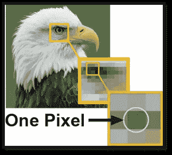

# 使用 python 反转图像。

> 原文：<https://blog.devgenius.io/inverting-images-using-python-c0031d09a026?source=collection_archive---------11----------------------->

## 详细的指导与源代码。

对文章内容的一瞥。

python 中有大量的库提供了广泛的特性和功能。通过这种方式，python 有许多库来处理图像，并用很少的几行代码进行各种修改。

我们有许多 python 库，它们使用一些内置函数直接给出一个反转图像。本文将研究一种方法来理解屏幕背后的功能。

# 图像是如何存储的

我们可以看到，当我们放大图像时，图像往往会变得模糊，我们可以看到单个的方块，这就是所谓的像素。像素是图像的基本块，根据图像的尺寸水平和垂直延伸，存储关于每个块的所需数据。像素值是表示每个像素的数值的数字。这些像素值代表像素的亮度。灰度或黑白图像的像素值范围从 0 到 255。接近零的较小数字代表较暗的阴影，而接近 255 的较大数字代表较亮或白色阴影。

类似地，如果我们看一幅彩色图像，每个像素包含三种不同的颜色:绿色、红色和蓝色。所以每个像素存储这三种不同颜色的像素值。而且，这些矩阵值中每一个也从 0 到 255 变化。

彩色图像中单个像素的精细化。

# 如何使用 python 浏览图像

> python 中可以使用许多库来打开图像并将它们转换成数组。但是在本文中，我们将主要使用三个库来完成我们的任务。枕头、IPython.display 和 Numpy。

让我们从导入这些库和函数开始，

我们将使用来自**枕头/ PIL** 库的图像模块，我们将使用**图像**模块，并且来自 **IPython 显示**库，我们将使用**显示**模块来查看笔记本本身的输出。

因此，现在我们可以导入图像并查看它

Jupyter 笔记本中的图像预览

因此，在导入库之后，我们可以使用图像。打开以打开指定的图像并将其存储到变量中。使用显示模块，我们可以查看导入的图像。为了便于解释，我在这里导入了灰度图像。但是这些步骤也适用于彩色图像。

# 让我们看看这张图片的像素…

为了玩这张图片，我们将把它转换成一个数组，让我们检查存储的值和它的形状。

通过上面这段代码，我们将把图像转换成一个数组，并打印出数组和数组的形状。

通过输出，我们可以看到这是一个 200 列 200 行的二维数组，这是因为我使用的图像分辨率为“200px X 200px”。此外，每个位置的值都是一个从 0-255 变化的单一值，因为这是一个灰度。这两个值可能会根据您使用的图像的分辨率和配色方案而变化。

# 现在让我们反转数值…

正如我们之前所说，像素值的范围是从 0 到 225，我们可以通过从 255 中减去该值来反转每个值。我们将首先创建一个与图像形状相同的数组，并用 **255 初始化所有的值。**我们可以做一个简单的算术运算，从我们创建的新数组**中减去图像数组。**在 Numpy 的帮助下，这很容易做到，如下所示:

**np。完整的**将创建一个与 **im 相等的形状数组。shape** (这将给出“数组 **im"** 的形状，其中存储了原始图像的值)

像素反转

现在，我们可以从我们创建的新数组中减去图像数组，以获得所需的输出。而" **astype** "函数帮助我们定义数据类型，应该是"**uint 8-大小为 8 bit 的无符号整数。**"并将数组保存到变量" **mod_image** "

# 最后一步。

现在我们可以使用" **Image.fromarray "** 函数来检查输出，该函数将给定的值数组转换成一个图像，以便在笔记本中查看。还有 tadaaaaaaaa…..我们的输出如下。

代码的最终输出。

这里我提供给你完整的代码，可能会帮助你重新检查和验证你的理解。

# 最后的话

我希望这篇文章能让你对用 python 反转图像有一个清晰而正确的理解，包括所有必要的步骤以及这些步骤背后的原因。同样的代码也可以转换彩色图像，因为我们没有硬编码遮罩的形状，但我们可以直接从图像中获取它。

如有任何疑问，请随时联系我。感谢您的阅读。