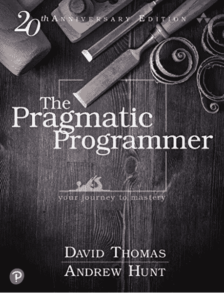
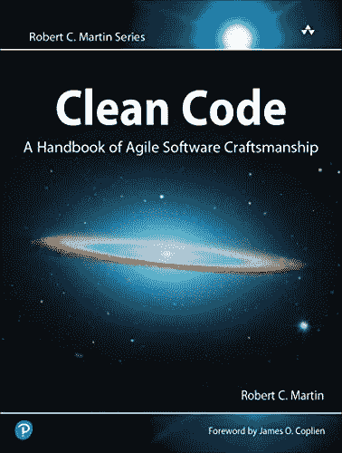
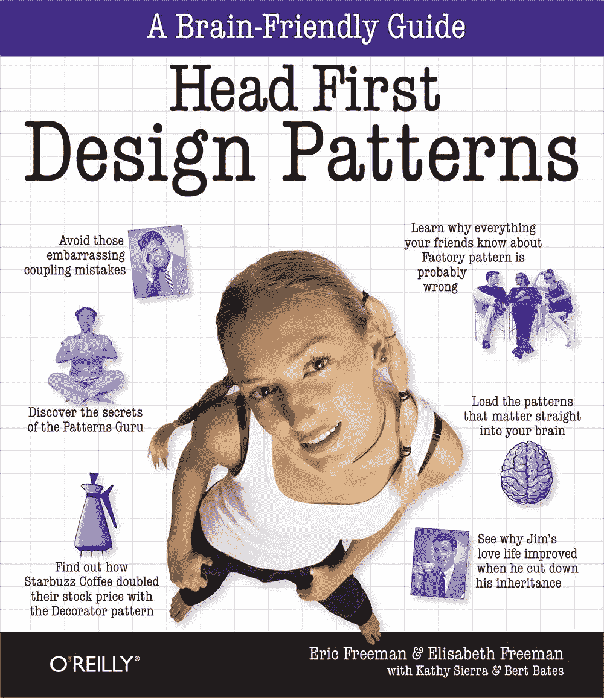
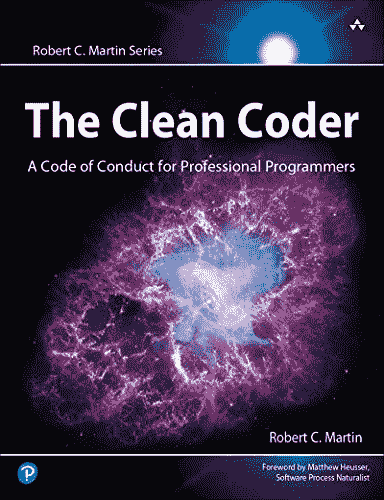
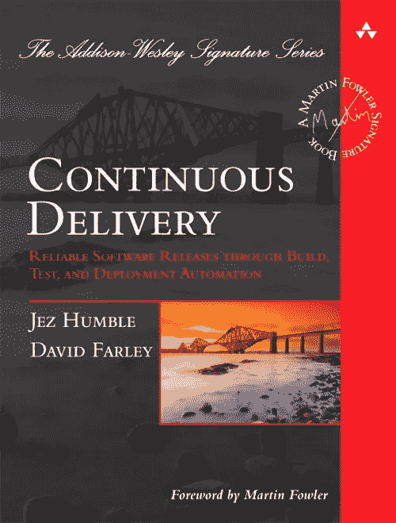

# 将你的黄金时间投资于可转移的技能

> 原文：<https://blog.devgenius.io/invest-your-golden-time-in-transferable-skills-3c17e0d1da0?source=collection_archive---------2----------------------->

安德里克·朗菲尔德在 [Unsplash](https://unsplash.com?utm_source=medium&utm_medium=referral) 上拍摄的照片

随着科技的飞速发展。我们需要跟上技术的发展。

每天，我们都在学习编程语言、框架和库。

我们知道的现代工具越多“越好”。

时间是有限的，不可再生的，你不能购买更多的时间。

技术发展比以往任何时候都快。

为了赶上，我们需要跑得非常快。这场比赛没有赢家，因为它没有终点。

**所以，把你的黄金时间投资在可转移的技能上。永远相关的技能。**

而是大量阅读关于框架、库等方面的书籍。专注于教你基础知识的书。

示例:

*   **而不是**微服务框架**专注于**进化架构
*   **而不是**新的编程语言**专注于**干净的代码、设计模式、DDD
*   **而不是**码头工人**了解更多关于**连续交货的信息
*   **而不是** Angular **了解更多关于** Web、HTTP 和 REST 的信息

在这篇文章中，我将与你分享五本改变了我生活的优秀书籍，

教授基本原理:

## 戴维·托马斯和安德鲁·亨特的《实用程序员》

实用程序员手册

***《实用程序员》*** 是你多年来会一读、再读、再读的稀有科技书籍之一。

无论你是这个领域的新手还是有经验的从业者，你每次都会有新的见解。

这本书不会教你代码，有时你可以阅读，但主要思想是成为一个更好的程序员，更好地思考，解决问题，自己思考算法。

没什么好说的，第一版是 20 年前写的，当你开始阅读时，你会看到这本书的质量。

它被分成几个主题。你可以边看边读，或者从头到尾跟着封面读。

这本书没有特定的语言或“食谱”可循，实际上它会打开你的思维，让你思考得更好。

**我觉得这本书是每个程序员的必读之作。**

## 罗伯特·c·马丁的《干净的代码:敏捷软件工艺手册》

干净的代码:敏捷软件工艺手册

即使是糟糕的代码也能运行。但是如果代码不干净，它会使开发组织陷入困境。

每年，都有无数的时间和大量的资源因为糟糕的代码而被浪费。但不一定非要这样。

这本书最大的优势在于它包含了大量的代码示例，包括一些冗长而深入的示例。

许多章节不是仅仅列出干净代码的规则或原则，而是仔细阅读这些代码示例并反复改进它们。

这本书是每个专业软件开发人员的必读书。

**强烈推荐！**

## [Eric Freeman、Kathy Sierra 的三头首个设计图案](https://amzn.to/39CEnBi)

头部优先设计模式

这本书是通向**设计模式的捷径，是软件设计中常见问题的**久经考验的解决方案。

这本书以有趣、易读和实用的方式呈现了一个复杂的主题。

Head First 设计模式使用了一种视觉上丰富的格式，这种格式是为你的大脑工作方式而设计的，而不是一种让你昏昏欲睡的大量文本的方法。

每个做 OO 设计的开发者必读。

## 罗伯特·c·马丁的《干净的编码者》

干净的编码器

这本书包含了从评估和编码到重构和测试的所有实用建议。

你将学会如何沟通，评估和处理工作中的困难情况。

***干净的程序员*** 会帮助你成为最好的专业人士之一。

## [5-Jez Humble 和 David Farley 连续交货](https://amzn.to/2KT8cDh)

连续交货

这本书阐述了能够将软件快速交付给用户的原则和技术实践。

通过构建、部署和测试过程的自动化。

Jez Humble 和 David Farley 首先介绍了快速、可靠、低风险交付流程的基础。接下来，他们引入了“部署管道”，这是一个管理所有变更的自动化过程，从签入到发布。

最后，他们讨论了支持持续交付所需的“生态系统”，从基础架构、数据和配置管理到治理。

这本书将帮助你快速有效地传递信息。

# 结论:

一项技术上市时间越长，投资就越安全。

不要哈利去学习新技术，它有很高的死亡概率。

时间是你最好的顾问。学会等待。

框架、库和工具来来去去。时间是宝贵的。

所以，把 70%的时间投资在基础上，30%的时间投资在框架、库和工具上。

**奖励:**

一个普通程序员的工作环境需要长时间坐在办公桌前，周围都是小工具。

这里的现实是，程序员很有可能患上某些健康疾病和与计算机相关的伤害。

从我的个人经历来看，我有时会因为长时间坐在电脑前，有时是错误的姿势，而患上背痛。

我推荐一款 [**姿势矫正器**](https://amzn.to/3lPCzYl) **来**恢复正确的姿势，有助于预防背部、颈部和肩部疼痛的发作。**姿势矫正器**有助于在坐着、站着、躺着或进行其他日常活动时调整姿势。

我每周写一篇关于编程的文章，感谢作为我的撰稿人在 [**patreon**](https://www.patreon.com/zelakioui) 上支持我:-)

一些您可能感兴趣的相关文章:

[1–4 本软件架构实用书籍](https://selcote.com/2020/08/12/4-practical-books-for-software-architecture/)

[2-设计不能被示教](https://selcote.com/2020/06/17/the-design-cannot-be-taught/)

[有史以来最好的 3-6 名程序员](https://selcote.com/2020/10/27/6-best-programmers-of-all-time/)

这个故事起源于:[selcote.com](https://selcote.com/2020/12/04/invest-your-golden-time-in-transferable-skills/)