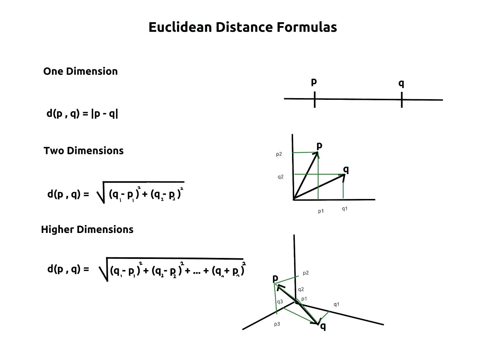
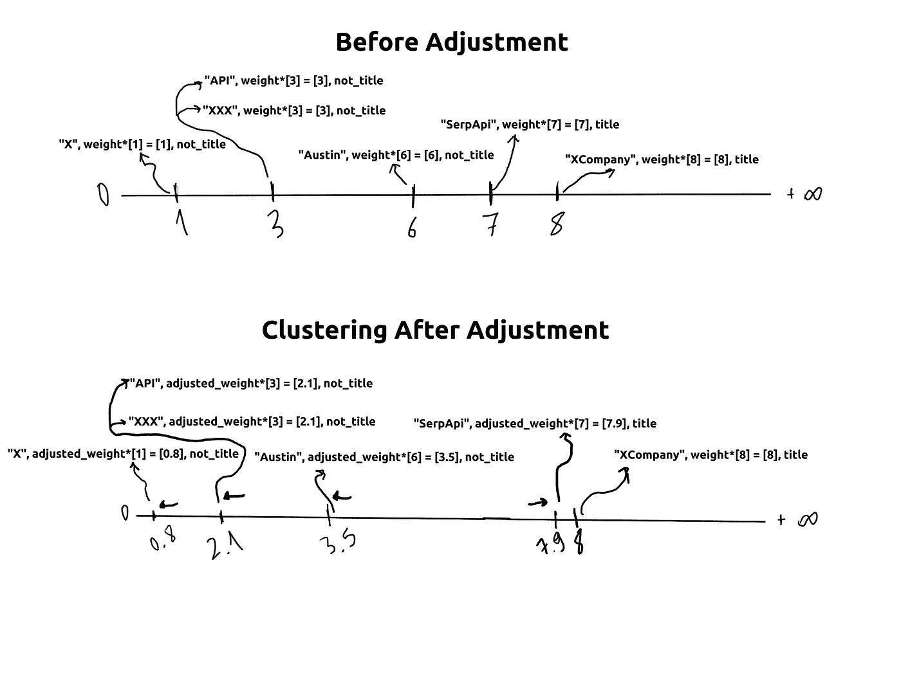

# 研究机器学习技术以改进规格测试

> 原文：<https://blog.devgenius.io/investigating-machine-learning-techniques-to-improve-spec-tests-40e426a571e0?source=collection_archive---------8----------------------->


本周，我们将展示我们为一般测试目的实现机器学习模型的路线图。

如果您对人工智能实施的背景或进展感兴趣，请访问以下链接:

# 问题

当前的 Spec 测试有助于检查提取数据的存在和类型。但是，必须执行特殊测试来检查提取数据的质量。

两个标题都存在，它们的出现会是一样的，而且都是`String`类。因此需要对有问题的部分进行特殊的测试，以检查它是否在字符串中包含任何`http`代码。更不用说，这个过程只有在有人注意到的情况下才会发生，而不是原本应该的原始规范。

# 背景研究和可用的方法

## [KNN (k 近邻)算法](https://en.wikipedia.org/wiki/K-nearest_neighbors_algorithm)

这种算法自 1951 年以来一直存在，并被用于统计分类。它的有效性在于其优雅的简单性。如果你能以数学的方式表达数据的特征，你就能从这些数字中创建一个 n 维向量。

这个向量的末端代表 n 维空间中的一个点。这些点的接近程度将定义每个向量行为之间的数学相似性。因此，每一个相似的行为都给了我们将它们分类的机会。

可以使用相同的方法对这些点进行分类。对于我们的问题，我们想要利用的是更进一步，即检查各个提取的值是否以与过去提取的数据相同的方式表现。

## [欧几里德距离公式](https://en.wikipedia.org/wiki/Euclidean_distance)

这些公式也是很久以前，在 18 世纪通过在欧几里德和毕达哥拉斯的公式之间建立联系而推导出来的。它们在点与点之间的高维距离计算中是必不可少的。这是他们的备忘单:



在读者感到困惑之前，让我解释一下这两个概念为什么以及如何重要。我们将为提取的数据覆盖的每个特征，无论是它的类别，还是长度，或者仅仅是它的字母索引；它们都将包含在笛卡尔平面的一维中。

下面是一个分解它的例子:

假设键`title`在大多数情况下由长度为 7-10 的字符串组成。如果标题是`SerpApi`，向量将是`[7]`。让我们设想一组我们为其训练了一个模型的单个键`title`:

```
[
  {
    "title": "SerpApi",
    "type": "API",
    "place": "Austin"
  },
  ...
  {
    "title": "XCompany",
    "type": "X",
	"place": "XXX",
  }
]
```

所有这些值将创建一个数据表，例如:

想象`Length`列中的条目是一行中的单个点。线是一维的。所以我们可以用:
`d(p,q)=|p-q|`。
如果我们想要找到什么是`XCompany`，而没有`Key`列，我们将使用公式将这些值中的每一个与`8`进行比较，取最小值(1-nn)，或 n 个最近邻居(k-nn)的多数情况，并将其分类为`title`。

现在让我们重新利用这种说法，并询问`XCompany`是否是一个标题。但是要做到这一点，我们需要用`not_title`重新排列数据表，让所有行的`Key`列中有除`title`以外的内容:

现在，如果我们对这里的`XCompany`使用相同的方法，距离最小的点将是`SerpApi`，这表明我们的关键是标题。

# 加权聚类

读者可能会问这将如何证明有用，因为字符串的长度在许多情况下几乎不是一个分类因素。这是机器学习过程发生的地方。

这些向量中的每一个都可以用它们的权重向量来调整，每个权重向量从向量 1 开始，并相应地用每个正确和不正确的猜测来调整，从而远离或接近比较向量。

这将创建不同的矢量簇，相似的矢量会更靠近，不相似的矢量最终会彼此远离。



# 假设

实现上述技术可用于测试提取数据的质量，并可用于**测试任何类型的 JSON 数据**。该过程应按如下顺序进行:

*   **用**内部的键创建数据库(每个内部键都有其唯一的标识符)

```
[
  {
    "title": "SerpApi",
    "text": "Scrape Google Organic Results"
    "usecases": {
                  "text": "Scraping SERP Results"
                  ...
                 },
    ...
  }
  ...
]
```

按键`text`和按键`usecases`->-`text`将被区别对待:

*   **为每个键创建数据库**(排除 inner_keys 中的相同键名)

请注意，省略`usecases__text`是为了避免建模混乱。由于我们正在测量该键是否包含已定义的`text`，所以它不会影响整个模型的准确性。我们将对这一估计进行验证。

**为每个示例中的每个当前键创建单独的模型**。这个过程应该是一个简单的 Rake 命令

**将这些模型整合到 Rspec** 内部。测试作为检查质量的改进部分，当整个示例中的`false`响应达到某个统计阈值时，警告开发人员结果有问题，并指出错误确定性较高的有问题的模型。

*   这里提到的统计阈值将通过不同的提取数据进行测试。我们将会看到它是否可以被一般化，或者它是否应该被建议用于每个不同的数据结构。

# 测试和分析结构

*   单词级索引(N-gram)以及一般特征
*   字符级索引以及不同的一般特征，如提取值的类别、长度等。
*   句子到字符级索引
*   这个实现是否应该使用第三方库，比如`Torch`(为了跨不同语言和栈的模块化)
*   在 Rspec 测试中增加误差的统计误差阈值应该是多少？
*   在不同的结构化数据中，错误阈值是否应该不同？

我们将从将 **JSON 写入 CSV 数据表** creator 开始。之后，使这个过程独立于库是很重要的。为此，我们将研究如何将单个模型存储在一个文件中。

单词级索引将是检验这一假设的首选，因为它在以前的博客文章中提到的 ML-Hybrid 解析器中对我们很有价值。

# 结论

我要感谢用户的关注，感谢 SerpApi 的聪明人对我的支持。下周，我们将研究如何如上所述创建特定于键的模型。

如果你觉得这篇博文有用，可以看看我的其他博文。

加入我们的|[Twitter](https://twitter.com/serp_api)|[YouTube](https://www.youtube.com/channel/UCUgIHlYBOD3yA3yDIRhg_mg)|[dev . to](https://dev.to/serpapi/)|[hash node](https://serpapi.hashnode.dev/)|[ser papi Medium](https://medium.com/serpapi)|

*原载于 2022 年 3 月 23 日 https://serpapi.com**T21*[。](https://serpapi.com/blog/use-machine-learning-to-improve-spec-tests/)