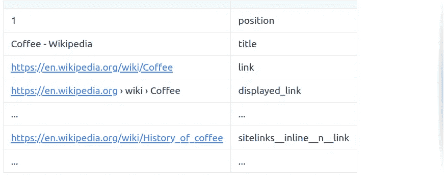

# 研究机器学习技术以改进规格测试— II

> 原文：<https://blog.devgenius.io/investigating-machine-learning-techniques-to-improve-spec-tests-ii-5ad2837bad8f?source=collection_archive---------10----------------------->


# 介绍

这是与人工智能实现相关的系列博文的一部分。如果你对故事的背景或情节感兴趣:

[#1)如何用人工智能抓取 Google 本地结果？](https://serpapi.com/blog/how-to-scrape-google-local-results-with-artificial-intelligence/)
[# 2)Rails 上机器学习的真实世界示例](https://serpapi.com/blog/real-world-example-of-machine-learning-on-rails/)
[#3) AI 训练技巧和比较](https://serpapi.com/blog/better-training-tips-and-comparisons/)
[# 4)Rails 刮刮中的机器学习](https://serpapi.com/blog/machine-learning-in-scraping-with-rails/)
[#5)在 Rails 中实现 ONNX 模型](https://serpapi.com/blog/implementing-onnx-models-to-rails/)
[# 6)ML 混合解析器如何击败传统解析器](https://serpapi.com/blog/how-ml-hybrid-parser-beats-tradition/)
[#7)如何在 Rails 上对 ML 实现进行基准测试](https://serpapi.com/blog/ml-hybrid-benchmarks/)
[#8)研究机器学习技术](https://serpapi.com/blog/use-machine-learning-to-improve-spec-tests/)

本周，我们将展示为一般测试目的实现机器学习模型的数据库创建过程。我们将使用 [SerpApi 的 Google Organic Results Scraper API](https://serpapi.com/organic-results)进行数据收集。此外，这里有一个[链接](https://serpapi.com/playground?q=Coffee&location=Austin%2C+Texas%2C+United+States&gl=us&hl=en&no_cache=true&newPara=lr+async+as_qdr)，包含我们将使用的数据的详细视图。


— — — — — — — — — — — — — — — — — — — — — — — — — — — — — —

# I —从哈希中创建线性 CSV

让我们初始化类变量`@@pattern_data`并在`Database`类中定义`@@vocab`。我们将用来矢量化单词和句子的默认词汇表应该是`{ "<unk>" => 0, " " => 1 }`。

```
class Database
  def initialize json_data, vocab = { "<unk>" => 0, " " => 1 }
    super()
    @@pattern_data = []
    @@vocab = vocab
  end
```

接下来，我们需要一种递归的方法来将散列转换成由值及其键类型组成的可理解的比特行。

例如，我们需要翻译这个:

```
{
      "position": 1,
      "title": "Coffee - Wikipedia",
      "link": "https://en.wikipedia.org/wiki/Coffee",
      "displayed_link": "https://en.wikipedia.org › wiki › Coffee",
      "thumbnail": "https://serpapi.com/searches/62436d12e7d08a5a74994e0f/images/ed8bda76b255c4dc4634911fb134de5319e08af7e374d3ea998b50f738d9f3d2.jpeg",
      "snippet": "Coffee is a brewed drink prepared from roasted coffee beans, the seeds of berries from certain flowering plants in the Coffea genus. From the coffee fruit, ...",
	  ...
    }
```

对此:



注意，对于某些元素来说，位置并不重要。所以我们用`n`来称呼它们，内部按键用`__`来分隔。

现在让我们定义填充`@@pattern_data` (master_array)的主函数，并将其写入一个 CSV 文件供将来使用。

```
def self.add_new_data_to_database json_data, csv_path = nil
    json_data.each do |result|
      recursive_hash_pattern result, ""
    end @@pattern_data = @@pattern_data.reject { |pattern| pattern.include? nil }.uniq.compact path = "#{csv_path}master_database.csv"
    File.write(path, @@pattern_data.map(&:to_csv).join)
  end
```

我们来分解一下`recursive_hash_pattern`及其相关功能:

```
## For keys that directly contain String, Integer, Float etc.
  def self.element_pattern result, pattern
    @@pattern_data.append([result, pattern].flatten)
  end   ## For Arrays that contain String, Integer, Float etc.
  def self.element_array_pattern result, pattern
    result.each do |element|
      element_pattern element, pattern
    end
  end ## Main Process
  def self.assign hash, key, pattern ## If the key contains a hash, it has to be recursed until all
    ## child components are collected.
    if hash[key].is_a?(Hash)
      if pattern.present?
        pattern = "#{pattern}__#{key}"
      else
        pattern = "#{key}"
      end recursive_hash_pattern hash[key], pattern ## If the key contains an array, containing multiple hashes,           ## all the hashes should be recursed to their components
    elsif hash[key].present? && hash[key].is_a?(Array) && hash[key].first.is_a?(Hash)
      if pattern.present?
        pattern = "#{pattern}__#{key}__n"
      else
        pattern = "#{key}"
      end hash[key].each do |hash_inside_array|
        recursive_hash_pattern hash_inside_array, pattern
      end
    ## If the key contains an array consisting of base elements,
    ## each element should be added with the right key pattern.
    elsif hash[key].present? && hash[key].is_a?(Array)
      if pattern.present?
        pattern = "#{pattern}__n"
      else
        pattern = "#{key}"
      end element_array_pattern hash[key], pattern
    ## If the element contains String, Float, etc.
    else
      if pattern.present?
        pattern = "#{pattern}__#{key}"
      else
        pattern = "#{key}"
      end element_pattern hash[key], pattern
    end
  end

  def self.recursive_hash_pattern hash, pattern
    hash.keys.each do |key|
      assign hash, key, pattern
    end
  end
```

请注意，每个递归操作都将其模式带到下一次迭代中，以使键分类不同。

现在，如果我们应用这些命令，它将在`organic_results`文件夹中创建一个名为`master.csv`的 csv 文件。
`json_data`表示包含所有`organic_result`散列的`organic_results`数组。

```
Database.new json_data Database.add_new_data_to_database json_data, csv_path = "organic_results/"
```

最终结果如您所愿:


— — — — — — — — — — — — — — — — — — — — — — — — — — — — — —

# II——标记化和词汇创造

在我们开始创建要用`ngram iterator`标记的`hash specific tables`之前，让我们定义负责标记的函数:

```
def self.default_dictionary_hash
    {
      /\"/ => "",
      /\'/ => " \'  ",
      /\./ => " . ",
      /,/ => ", ",
      /\!/ => " ! ",
      /\?/ => " ? ",
      /\;/ => " ",
      /\:/ => " ",
      /\(/ => " ( ",
      /\)/ => " ) ",
      /\// => " / ",
      /\s+/ => " ",
      /<br \/>/ => " , ",
      /http/ => "http",
      /https/ => " https ",
    }
  end
```

该函数负责为`tokenizer`中输入的拆分单词创建默认的字典哈希，以及它们将被替换成什么。我们将能够从这些分裂点创建可理解的向量。请注意，我将`http`和`https`包含在其中，因为它们在`organic_results`中被广泛使用。

— — — — — — — — — — — — — — — — — — — — — — — — — — — — — —

```
def self.tokenizer word, dictionary_hash = default_dictionary_hash word = word.downcase dictionary_hash.keys.each do |key| word.sub!(key, dictionary_hash[key]) end word.split end
```

这是我们主要的记号赋予器。举个例子，如果我们应用这样的命令:

```
Database.tokenizer "SerpApi, to. the: Moon"
```

我们得到这样的输出:

```
["serpapi,", "to", ".", "the", "moon"]
```

— — — — — — — — — — — — — — — — — — — — — — — — — — — — — — -

```
def self.iterate_ngrams token_list, ngrams = 1
    token_list.each do |token|
      1.upto(ngrams) do |n|
        permutations = (token_list.size - n + 1).times.map { |i| token_list[i...(i + n)] }

        permutations.each do |perm|
          key = perm.join(" ") unless @@vocab.keys.include? key
            @@vocab[key] = @@vocab.size
          end
        end
      end
    end
  end
```

这是我们的`ngram iterator`。`token_list`这里是 tokenizer 函数的输出。通过这个函数，我们可以从不同的切割点创建置换。`ngrams`定义排列的宽度。

举个例子，如果我们应用这样的命令:

```
Database.iterate_ngrams ["serpapi,", "to", ".", "the", "moon"], ngrams=3
```

我们的词汇(`@@vocab`)将更新如下:

```
{
  "<unk>"=>0,
  " "=>1,
  "serpapi,"=>2,
  "to"=>3,
  "."=>4,
  "the"=>5,
  "moon"=>6,
  "serpapi, to"=>7,
  "to ."=>8,
  ". the"=>9,
  "the moon"=>10,
  "serpapi, to ."=>11,
  "to . the"=>12,
  ". the moon"=>13
}
```

— — — — — — — — — — — — — — — — — — — — — — — — — — — — — —

我们将在下周的博客文章中讨论如何使用向量进行分类。但是为了给出一个大概的样子，负责的函数是:

```
def self.word_to_tensor word
    token_list = tokenizer word
    token_list.map {|token| @@vocab[token]}
  end
```

所以，如果我们把我们的句子:

```
Database.word_to_tensor "SerpApi, to. the: Moon"
```

我们得到相应的令牌:

```
[2, 3, 4, 5, 6]
```

这样我们就可以用数学的方式来表达字符串。

— — — — — — — — — — — — — — — — — — — — — — — — — — — — — —

# III —关键的特定 CSV 创建

让我们定义一些函数，它们将有助于创建关键的特定数据库，并供以后使用。
首先，我们需要定义一个函数来保存我们的词汇表的最终结果，该词汇表将由输入到关键特定数据库的每个单词创建:

```
def self.save_vocab vocab_path = ""
    path = "#{vocab_path}vocab.json"
    vocab = JSON.parse(@@vocab.to_json)
    File.write(path, JSON.pretty_generate(vocab))
  end
```

最终结果将是:

```
{
  "<unk>": 0,
  " ": 1,
  "1": 2,
  "coffee": 3,
  "-": 4,
  "wikipedia": 5,
  "coffee -": 6,
  ...
}
```

— — — — — — — — — — — — — — — — — — — — — — — — — — — — — —

只是为了检查字符串是否仅由数值组成:

```
def self.is_numeric?
    return true if self =~ /\A\d+\Z/
    true if Float(self) rescue false
  end
```

— — — — — — — — — — — — — — — — — — — — — — — — — — — — — —

要为每种键类型创建示例键-值对:

```
def self.create_keys_and_examples
    keys = @@pattern_data.map { |pattern| pattern.second }.uniq examples = {}
    keys.each do |key|
      examples[key] = @@pattern_data.find { |pattern| pattern.first.to_s if pattern.second == key }
    end [keys, examples]
  end
```

最终结果将是一个惟一键的集合和一个散列，其中包含一个消除条件错误的示例。

— — — — — — — — — — — — — — — — — — — — — — — — — — — — — —

```
def self.create_key_specific_databases result_type = "organic_results", csv_path = nil, dictionary = nil, ngrams = nil, vocab_path = nil
    keys, examples = create_keys_and_examples keys.each do |key|
      specific_pattern_data = []
      @@pattern_data.each_with_index do |pattern, index|
        word = pattern.first.to_s

        next if word.blank? if dictionary.present?
          token_list = tokenizer word, dictionary
        else
          token_list = tokenizer word
        end if ngrams.present?
          iterate_ngrams token_list, ngrams
        else
          iterate_ngrams token_list
        end if key == pattern.second
          specific_pattern_data << [ 1, word ]
        elsif (examples[key].to_s.to_i == examples[key]) && word.to_i == word
          next
        elsif (examples[key].to_s.to_i == examples[key]) && word.numeric?
          specific_pattern_data << [ 0, word ]
        elsif examples[key].numeric? && word.numeric?
          next
        elsif key.split("__").last == pattern.second.to_s.split("__").last
          specific_pattern_data << [ 1, word ]
        else
          specific_pattern_data << [ 0, word ]
        end
      end path = "#{csv_path}#{result_type}__#{key}.csv"
      File.write(path, specific_pattern_data.map(&:to_csv).join)
    end if vocab_path.present?
      save_vocab vocab_path
    else
      save_vocab
    end
  end
```

这是负责为每个键创建数据库的主要函数。请注意，对于包含整数的键，csv 将省略表中的整数键。这样，我们可以消除像`rating:"5"`这样可能与`reviews:"5"`混淆的情况。我们还推广了最后的内部键相同的情况，以避免同类元素的混淆。例子是在主散列和它的一个键中的`position`。它们代表同一个键，所以用`1`标记它们会很方便。我们还将每个单词添加到我们的词汇表中以扩充它，稍后保存到 csv 中。

创建的一个 CSV 文件的最终结果(`organic_results__about_page_link`):


`1`代表这是我们对这样一个键想要的那种结果，`0`代表相反。

— — — — — — — — — — — — — — — — — — — — — — — — — — — — — —

# IV —整个代码

这是整个过程的思维导图:


下面是该类的完整代码:

```
class Database
  def initialize json_data, vocab = { "<unk>" => 0, " " => 1 }
    super()
    @@pattern_data = []
    @@vocab = vocab
  end ## Related to creating main database
  def self.add_new_data_to_database json_data, csv_path = nil
    json_data.each do |result|
      recursive_hash_pattern result, ""
    end @@pattern_data = @@pattern_data.reject { |pattern| pattern.include? nil }.uniq.compact path = "#{csv_path}master_database.csv"
    File.write(path, @@pattern_data.map(&:to_csv).join)
  end def self.element_pattern result, pattern
    @@pattern_data.append([result, pattern].flatten)
  end  def self.element_array_pattern result, pattern
    result.each do |element|
      element_pattern element, pattern
    end
  end def self.assign hash, key, pattern
    if hash[key].is_a?(Hash)
      if pattern.present?
        pattern = "#{pattern}__#{key}"
      else
        pattern = "#{key}"
      end recursive_hash_pattern hash[key], pattern
    elsif hash[key].present? && hash[key].is_a?(Array) && hash[key].first.is_a?(Hash)
      if pattern.present?
        pattern = "#{pattern}__#{key}__n"
      else
        pattern = "#{key}"
      end hash[key].each do |hash_inside_array|
        recursive_hash_pattern hash_inside_array, pattern
      end
    elsif hash[key].present? && hash[key].is_a?(Array)
      if pattern.present?
        pattern = "#{pattern}__n"
      else
        pattern = "#{key}"
      end element_array_pattern hash[key], pattern
    else
      if pattern.present?
        pattern = "#{pattern}__#{key}"
      else
        pattern = "#{key}"
      end element_pattern hash[key], pattern
    end
  end

  def self.recursive_hash_pattern hash, pattern
    hash.keys.each do |key|
      assign hash, key, pattern
    end
  end ## Related to tokenizing
  def self.default_dictionary_hash
    {
      /\"/ => "",
      /\'/ => " \'  ",
      /\./ => " . ",
      /,/ => ", ",
      /\!/ => " ! ",
      /\?/ => " ? ",
      /\;/ => " ",
      /\:/ => " ",
      /\(/ => " ( ",
      /\)/ => " ) ",
      /\// => " / ",
      /\s+/ => " ",
      /<br \/>/ => " , ",
      /http/ => "http",
      /https/ => " https ",
    }
  end def self.tokenizer word, dictionary_hash = default_dictionary_hash
    word = word.downcase dictionary_hash.keys.each do |key|
      word.sub!(key, dictionary_hash[key])
    end word.split
  end def self.iterate_ngrams token_list, ngrams = 1
    token_list.each do |token|
      1.upto(ngrams) do |n|
        permutations = (token_list.size - n + 1).times.map { |i| token_list[i...(i + n)] }

        permutations.each do |perm|
          key = perm.join(" ") unless @@vocab.keys.include? key
            @@vocab[key] = @@vocab.size
          end
        end
      end
    end
  end def self.word_to_tensor word
    token_list = tokenizer word
    token_list.map {|token| @@vocab[token]}
  end ## Related to creating key-specific databases 
  def self.create_key_specific_databases result_type = "organic_results", csv_path = nil, dictionary = nil, ngrams = nil, vocab_path = nil
    keys, examples = create_keys_and_examples keys.each do |key|
      specific_pattern_data = []
      @@pattern_data.each_with_index do |pattern, index|
        word = pattern.first.to_s

        next if word.blank? if dictionary.present?
          token_list = tokenizer word, dictionary
        else
          token_list = tokenizer word
        end if ngrams.present?
          iterate_ngrams token_list, ngrams
        else
          iterate_ngrams token_list
        end if key == pattern.second
          specific_pattern_data << [ 1, word ]
        elsif (examples[key].to_s.to_i == examples[key]) && word.to_i == word
          next
        elsif (examples[key].to_s.to_i == examples[key]) && word.numeric?
          specific_pattern_data << [ 0, word ]
        elsif examples[key].numeric? && word.numeric?
          next
        elsif key.split("__").last == pattern.second.to_s.split("__").last
          specific_pattern_data << [ 1, word ]
        else
          specific_pattern_data << [ 0, word ]
        end
      end path = "#{csv_path}#{result_type}__#{key}.csv"
      File.write(path, specific_pattern_data.map(&:to_csv).join)
    end if vocab_path.present?
      save_vocab vocab_path
    else
      save_vocab
    end
  end def self.create_keys_and_examples
    keys = @@pattern_data.map { |pattern| pattern.second }.uniq examples = {}
    keys.each do |key|
      examples[key] = @@pattern_data.find { |pattern| pattern.first.to_s if pattern.second == key }
    end [keys, examples]
  end def self.is_numeric?
    return true if self =~ /\A\d+\Z/
    true if Float(self) rescue false
  end def self.save_vocab vocab_path = ""
    path = "#{vocab_path}vocab.json"
    vocab = JSON.parse(@@vocab.to_json)
    File.write(path, JSON.pretty_generate(vocab))
  end
end
```

— — — — — — — — — — — — — — — — — — — — — — — — — — — — — —

# 五、结论

下周我们将利用这些 csv 文件通过`tokenizer`来`vectorize`它们，并为每个键创建`key-specific models`。这个项目的最终目标是创建一个`open-source gem`，每个人都可以在代码中使用 JSON 数据结构来实现它。我要感谢读者的关注，感谢才华横溢的塞尔帕皮人在艰难时期创造奇迹，感谢他们的支持。

*原载于 2022 年 3 月 30 日 https://serpapi.com*[](https://serpapi.com/blog/investigating-machine-learning-techniques-to-improve-spec-tests-ii/)**。**