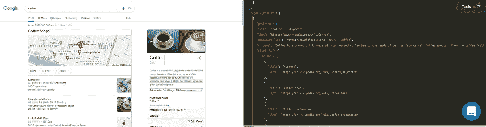

# 研究机器学习技术以改进规格测试(三)

> 原文：<https://blog.devgenius.io/investigating-machine-learning-techniques-to-improve-spec-tests-iii-7120d90a1ac5?source=collection_archive---------10----------------------->


# 介绍

这是与人工智能实现相关的系列博文的一部分。如果你对故事的背景或情节感兴趣:

本周我们将展示为一般测试目的实现机器学习模型的训练程序。我们将使用 [SerpApi 的 Google Organic Results Scraper API](https://serpapi.com/organic-results)进行数据收集。此外，您可以查看[游乐场](https://serpapi.com/playground?q=Coffee&location=Austin%2C+Texas%2C+United+States&gl=us&hl=en&no_cache=true&newPara=lr+async+as_qdr)，了解我们将使用的数据的更多详细信息。



____

# Ruby 中自定义加权 KNN 的分解

让我们初始化一个培训班

```
class Train
  def initialize csv_path
    @@csv_path = csv_path
    @@vector_arr = []
    @@word_arr = []
    @@maximum_word_size = 100
    @@weights = Vector[]
    @@losses = []
  end
```

— —

让我们读取特定于密钥的 CSV 文件。

```
def self.read
 @@word_arr = CSV.read(@@csv_path)
 @@word_arr
end
```
```

举个例子，如果我们键入以下命令:

```
csv_path = “organic_results/organic_results__snippet.csv”
Train.new csv_path
key_array = Train.read
```

输出将是:

```
[[“0”, “McDonald’s: Burgers, Fries & More. Quality Ingredients.”],
 [“0”, “[https://www.mcdonalds.com/us/en-us.html](https://www.mcdonalds.com/us/en-us.html)"],
 [“0”, “[https://www.mcdonalds.com](https://www.mcdonalds.com) › en-us”],
 [“1”, “McDonalds.com is your hub for everything McDonald’s. Find out more about our menu items and promotions today!”],
 [“0”, “Breakfast”],
 …
```

该阵列是 csv 上内容的副本。它包含元素及其对应的二进制对应的关键问题。

——
让我们在“Train”类中定义这些单词的矢量化版本。

```
def self.define_training_set vectors
 @@vector_arr = vectors
end
```

为了建立这样一个“向量”数组，我们将使用如下词汇表:

```
{
 “<unk>”: 0,
 “<pad>”: 1,
 “1”: 2,
 “mcdonald”: 3,
 “‘“: 4,
 “s”: 5,
 “burgers,”: 6,
 “fries”: 7,
 …
}
```

这些“标记”中的每一个都应该用以下命令行在向量中表示:

```
vector_array = key_array.map { |word| Database.word_to_tensor word[1] }
Train.define_training_set vector_array
```

` Database.word_to_tensor '是我们在上周的代码中定义的函数。它根据词汇来标记单词或句子。我们实际上在“Database”类中添加了以下函数来调用已经创建的词汇表:

```
def self.read_vocab vocab_path
   vocab = File.read vocab_path
   @@vocab = JSON.parse(vocab)
 end
```

最终结果是一个可矢量化数组的数组:

```
[[2],
 [3, 4, 5, 6, 7, 8, 9, 10, 11, 12],
 [22, 23, 24, 10, 25],
 [22, 23, 24, 10, 30, 31, 32],
 [36, 10, 37, 38, 39, 40, 41, 42, 3, 4, 43, 44, 45, 9, 46, 47, 48, 49, 50, 51, 52, 53],
 [74],
 [22, 23, 24, 10, 75],
 [77, 78],
 [22, 23, 24, 10, 80],
 [82, 83],
 [22, 23, 24, 10, 85],
 …
]
```

— -

让我们定义一个函数来自动取最大的字长来确定填充模式。对于您想要训练的最终模型，建议不要这样做，因为该集合中的最大值可能会小于您将输入的实际示例。

```
def self.auto_define_maximum_size
 @@maximum_word_size = @@vector_arr.map {|el| el.size}.max
end
```

所以再举一个例子:

```
Train.auto_define_maximum_size
```

输出:

```
37
```

这是具有最大字符数的单词，所以它将被视为最大单词大小。其余的条目将用“<pad>”字符补全为 37 个字符，在词汇表中标记为“1”。</pad>

—
让我们定义将单个向量扩展到最大字数的函数。

```
def self.extend_vector vector
  vector_arr = vector.to_a
  (@@maximum_word_size - vector.size).times { vector_arr << 1 }
  Vector.[](*vector_arr)
end
```

它获取向量，将其转换为数组，向其中输入足够的“1 ”,然后再次对其进行矢量化。
要浏览整个数据集，我们需要:

```
def self.extend_vectors
  @@vector_arr.each_with_index do |vector, index|
    @@vector_arr[index] = extend_vector vector
  end
end
```

因此，如果我们应用以下命令:

```
[Vector[2, 1, 1, 1, 1, 1, 1, 1, 1, 1, 1, 1, 1, 1, 1, 1, 1, 1, 1, 1, 1, 1, 1, 1, 1, 1, 1, 1, 1, 1, 1, 1, 1, 1, 1, 1, 1],
 Vector[3, 4, 5, 6, 7, 8, 9, 10, 11, 12, 1, 1, 1, 1, 1, 1, 1, 1, 1, 1, 1, 1, 1, 1, 1, 1, 1, 1, 1, 1, 1, 1, 1, 1, 1, 1, 1],
 Vector[22, 23, 24, 10, 25, 1, 1, 1, 1, 1, 1, 1, 1, 1, 1, 1, 1, 1, 1, 1, 1, 1, 1, 1, 1, 1, 1, 1, 1, 1, 1, 1, 1, 1, 1, 1, 1],
 Vector[22, 23, 24, 10, 30, 31, 32, 1, 1, 1, 1, 1, 1, 1, 1, 1, 1, 1, 1, 1, 1, 1, 1, 1, 1, 1, 1, 1, 1, 1, 1, 1, 1, 1, 1, 1, 1],
 …
```

迎接我们的是多个向量，每个向量的大小都是 37。这对于在下面的部分中保持带权重的矢量乘法是很重要的。

— -

现在我们需要初始化权重。它们将帮助我们将向量调整到它们相应分类的附近。

```
def self.initialize_weights
 weights = []
 @@maximum_word_size.times { weights << 1.0 }
 @@weights = Vector.[](*weights)
end
```

如果我们输入以下命令，我们可以看到输出将是一个大小为 37 的向量，由“1”组成:

```
Train.initialize_weights
```

输出:

```
Vector[1.0, 1.0, 1.0, 1.0, 1.0, 1.0, 1.0, 1.0, 1.0, 1.0, 1.0, 1.0, 1.0, 1.0, 1.0, 1.0, 1.0, 1.0, 1.0, 1.0, 1.0, 1.0, 1.0, 1.0, 1.0, 1.0, 1.0, 1.0, 1.0, 1.0, 1.0, 1.0, 1.0, 1.0, 1.0, 1.0, 1.0]
```

—
让我们也添加一些东西来控制变化的零件:

```
def self.config k = 1, lr = 0.001
 [k, lr]
end
```

— —

让我们定义我们的函数，在多个维度上倾斜向量，以获得我们想要的结果。

```
def self.product vector
  @@weights.each_with_index do |weight, index|
    vector[index] = weight * vector[index]
  end vector
end
```

权重向量中的每个元素乘以我们用于训练或预测的初始向量中的每个元素，以获得加权向量。因为我们的初始权重仅由‘1’组成，这个函数将返回我们在第一次迭代中输入的向量。

如果我们的初始向量仅由“2”组成

```
vector = Vector[2.0, 2.0, 2.0, 2.0, 2.0, 2.0, 2.0, 2.0, 2.0, 2.0, 2.0, 2.0, 2.0, 2.0, 2.0, 2.0, 2.0, 2.0, 2.0, 2.0, 2.0, 2.0, 2.0, 2.0, 2.0, 2.0, 2.0, 2.0, 2.0, 2.0, 2.0, 2.0, 2.0, 2.0, 2.0, 2.0, 2.0]Train.product vector
```

这些命令将为我们提供:

```
Vector[2.0, 2.0, 2.0, 2.0, 2.0, 2.0, 2.0, 2.0, 2.0, 2.0, 2.0, 2.0, 2.0, 2.0, 2.0, 2.0, 2.0, 2.0, 2.0, 2.0, 2.0, 2.0, 2.0, 2.0, 2.0, 2.0, 2.0, 2.0, 2.0, 2.0, 2.0, 2.0, 2.0, 2.0, 2.0, 2.0, 2.0]
```

—
多维空间中两点之间的欧几里德距离不应该吓到你，这很简单:

```
def self.euclidean_distance vector_1, vector_2
  subtractions = (vector_1 - vector_2).to_a
  subtractions.map! {|sub| sub = sub*sub }
  Math.sqrt(subtractions.sum)
end
```

就像我们在之前的博文中提到的那样，取向量中每个值的减法，平方，求和，得到平方根。
因此，如果我们给定“Vector[1，2]”和“Vector[2，3]”，它将计算点“x=1，y=2”和“x=2，y=3”之间的距离:

```
Train.euclidean_distance Vector[1,2], Vector[2,3]
```

输出:

```
1.4142135623730951
```

——
所以为了找到给定向量的“k”个最近向量，我们可以代入距离:

```
def self.k_neighbors distances, k
  indexes = []
  (k).times do
    min = distances.index(distances.min)
    indexes << min
    distances[min] = distances.max + 1
  end indexes
end
```

还有另一个负责收集距离的命令:

```
distances = []
    @@vector_arr.each_with_index do |comparison_vector, vector_index|
      if vector_index == index
        distances << 100000000
      else
        distances << euclidean_distance(comparison_vector, vector)
      end
    end indexes = k_neighbors distances, k
```

为了避免混淆，如果矢量本身就是距离，那么就给它一个大的值。
如果我们插入第一个向量，例如“k=1 ”,输出将是:

```
[22]
```

它给出了离第一个向量最近的向量的索引。

——
让我们创建一个函数来检查指标的分类，并给出分类的含义。

```
def self.make_prediction indexes
  predictions = []
  indexes.each do |index|
    predictions << @@word_arr[index][0].to_i
  end predictions.sum/predictions.size
end
```

这种分类的输出可以是‘1’和‘0 ’,因为在这种情况下我们检查元素是否是‘snippet’。因此它们平均值将在“0”和“1”之间，包括两端。

如果我们插上 22 号:

```
0
```

它向我们展示了这个向量并不像索引“22”处的向量那样是“片段”。

— -

让我们根据这个预测的有效性来实现一些改变权重的东西:

```
def self.update_weights result, indexes, vector, lr
  indexes.each do |index|
    subtractions = @@vector_arr[index] — vector
    subtractions.each_with_index do |sub, sub_index|
      if result == 0 && sub >= 0
        @@weights[sub_index] = @@weights[sub_index] + lr
      elsif result == 0 && sub < 0
        @@weights[sub_index] = @@weights[sub_index] — lr
      elsif result == 1 && sub >= 0
        @@weights[sub_index] = @@weights[sub_index] — lr
      elsif result == 1 && sub < 0
        @@weights[sub_index] = @@weights[sub_index] + lr
      end
    end
  end
end
```

作为预测分类和真实分类之间的关系，这里的“结果”是“0”代表假，“1”代表真。我们使用“lr”来使向量更接近，或者通过在权重上加上或减去“lr”来使向量更接近。由于加权向量将用于训练，从概率上来说，如果预测是真的，它不会犯同样的错误，如果预测是假的，它会做得更好。
结果将是重量的变化:

```
Vector[0.999, 0.999, 0.999, 0.999, 0.999, 0.999, 0.999, 0.999, 0.999, 0.999, 0.999, 0.999, 0.999, 0.999, 0.999, 0.999, 0.999, 0.999, 0.999, 0.999, 0.999, 0.999, 0.999, 0.999, 0.999, 0.999, 0.999, 0.999, 0.999, 0.999, 0.999, 0.999, 0.999, 0.999, 0.999, 0.999, 0.999]
```

注意，并不是所有的权重都以负序变化，以最大化或最小化两个向量之间的距离。这是一个巧合。

— -
平均绝对误差是一种非常常见的计算损失的技术:

```
def self.mean_absolute_error real, indexes
  errors = []
  indexes.each do |index|
    errors << (@@word_arr[index][0].to_i - real).abs
  end (errors.sum/errors.size).to_f
end
```

计算损失会告诉我们健康的训练过程。我们可能需要调整配置，使其更好。请注意，它不会给出这是否是我们必须使用的流程的指示，而只是流程的健康状况。你可以在以前的博客文章中找到详细信息。

— -
现在让我们来看看训练一个向量的整个函数:

```
def self.train vector, index
    k, lr = config
    vector = extend_vector vector
    vector = product vector

    distances = []
    @@vector_arr.each_with_index do |comparison_vector, vector_index|
      if vector_index == index
        distances << 100000000
      else
        distances << euclidean_distance(comparison_vector, vector)
      end
    end indexes = k_neighbors distances, k
    real = @@word_arr[index][0].to_i
    prob_prediction = make_prediction indexes
    prediction = prob_prediction > 0.5 ? 1 : 0
    result = real == prediction ? 1 : 0 update_weights result, indexes, vector, lr
    loss = mean_absolute_error real, indexes
    @@losses << loss

    puts "Result : #{real}, Prediction: #{prediction}"
    puts "Loss: #{loss}" prediction
end
```

*我们从一个向量及其索引开始。然后我们从“配置”中调用“k”和“lr”值。
*之后，我们把向量做成加权向量。
*然后我们计算加权向量相对于训练集中所有其他向量的距离。
*找到“k”个最近邻居的索引。
*得到加权向量的真实分类。
*使用最近邻获得它的预测。
*比较它们以创建一个结果。
*根据结果更新权重。
*计算损失并将其追加到所有损失中。(为了以后图形化)
*输出结果，返回预测。

如果我们迭代地执行这些步骤，我们将以一种适用于一般情况的方式训练权重。分类为‘1’向量将更接近分类为‘1’的向量，因此给我们一个好的预测。

# 完整代码

```
class Database
  def initialize json_data, vocab = { "<unk>" => 0, "<pad>" => 1 }
    super()
    @@pattern_data = []
    @@vocab = vocab
  end ## Related to creating main database
  def self.add_new_data_to_database json_data, csv_path = nil
    json_data.each do |result|
      recursive_hash_pattern result, ""
    end @@pattern_data = @@pattern_data.reject { |pattern| pattern.include? nil }.uniq.compact path = "#{csv_path}master_database.csv"
    File.write(path, @@pattern_data.map(&:to_csv).join)
  end def self.element_pattern result, pattern
    @@pattern_data.append([result, pattern].flatten)
  end def self.element_array_pattern result, pattern
    result.each do |element|
      element_pattern element, pattern
    end
  end def self.assign hash, key, pattern
    if hash[key].is_a?(Hash)
      if pattern.present?
        pattern = "#{pattern}__#{key}"
      else
        pattern = "#{key}"
      end recursive_hash_pattern hash[key], pattern
    elsif hash[key].present? && hash[key].is_a?(Array) && hash[key].first.is_a?(Hash)
      if pattern.present?
        pattern = "#{pattern}__#{key}__n"
      else
        pattern = "#{key}"
      end hash[key].each do |hash_inside_array|
        recursive_hash_pattern hash_inside_array, pattern
      end
    elsif hash[key].present? && hash[key].is_a?(Array)
      if pattern.present?
        pattern = "#{pattern}__n"
      else
        pattern = "#{key}"
      end element_array_pattern hash[key], pattern
    else
      if pattern.present?
        pattern = "#{pattern}__#{key}"
      else
        pattern = "#{key}"
      end element_pattern hash[key], pattern
    end
  end

  def self.recursive_hash_pattern hash, pattern
    hash.keys.each do |key|
      assign hash, key, pattern
    end
  end ## Related to tokenizing
  def self.default_dictionary_hash
    {
      /\"/ => "",
      /\'/ => " \'  ",
      /\./ => " . ",
      /,/ => ", ",
      /\!/ => " ! ",
      /\?/ => " ? ",
      /\;/ => " ",
      /\:/ => " ",
      /\(/ => " ( ",
      /\)/ => " ) ",
      /\// => " / ",
      /\s+/ => " ",
      /<br \/>/ => " , ",
      /http/ => "http",
      /https/ => " https ",
    }
  end def self.tokenizer word, dictionary_hash = default_dictionary_hash
    word = word.downcase dictionary_hash.keys.each do |key|
      word.sub!(key, dictionary_hash[key])
    end word.split
  end def self.iterate_ngrams token_list, ngrams = 1
    token_list.each do |token|
      1.upto(ngrams) do |n|
        permutations = (token_list.size - n + 1).times.map { |i| token_list[i...(i + n)] }

        permutations.each do |perm|
          key = perm.join(" ") unless @@vocab.keys.include? key
            @@vocab[key] = @@vocab.size
          end
        end
      end
    end
  end def self.word_to_tensor word
    token_list = tokenizer word
    token_list.map {|token| @@vocab[token]}
  end ## Related to creating key-specific databases 
  def self.create_key_specific_databases result_type = "organic_results", csv_path = nil, dictionary = nil, ngrams = nil, vocab_path = nil
    keys, examples = create_keys_and_examples keys.each do |key|
      specific_pattern_data = []
      @@pattern_data.each_with_index do |pattern, index|
        word = pattern.first.to_s

        next if word.blank? if dictionary.present?
          token_list = tokenizer word, dictionary
        else
          token_list = tokenizer word
        end if ngrams.present?
          iterate_ngrams token_list, ngrams
        else
          iterate_ngrams token_list
        end if key == pattern.second
          specific_pattern_data << [ 1, word ]
        elsif (examples[key].to_s.to_i == examples[key]) && word.to_i == word
          next
        elsif (examples[key].to_s.to_i == examples[key]) && word.numeric?
          specific_pattern_data << [ 0, word ]
        elsif examples[key].numeric? && word.numeric?
          next
        elsif key.split("__").last == pattern.second.to_s.split("__").last
          specific_pattern_data << [ 1, word ]
        else
          specific_pattern_data << [ 0, word ]
        end
      end path = "#{csv_path}#{result_type}__#{key}.csv"
      File.write(path, specific_pattern_data.map(&:to_csv).join)
    end if vocab_path.present?
      save_vocab vocab_path
    else
      save_vocab
    end
  end def self.create_keys_and_examples
    keys = @@pattern_data.map { |pattern| pattern.second }.uniq examples = {}
    keys.each do |key|
      examples[key] = @@pattern_data.find { |pattern| pattern.first.to_s if pattern.second == key }
    end [keys, examples]
  end def self.numeric?
    return true if self =~ /\A\d+\Z/
    true if Float(self) rescue false
  end def self.save_vocab vocab_path = ""
    path = "#{vocab_path}vocab.json"
    vocab = JSON.parse(@@vocab.to_json)
    File.write(path, JSON.pretty_generate(vocab))
  end def self.read_vocab vocab_path
    vocab = File.read vocab_path
    @@vocab = JSON.parse(vocab)
  end def self.return_vocab
    @@vocab
  end
endclass Train
  def initialize csv_path
    @@csv_path = csv_path
    @@vector_arr = []
    @@word_arr = []
    @@maximum_word_size = 100
    @@weights = Vector[]
    @@losses = []
  end def self.read
    @@word_arr = CSV.read(@@csv_path)
    @@word_arr
  end def self.define_training_set vectors
    @@vector_arr = vectors
  end def self.auto_define_maximum_size
    @@maximum_word_size = @@vector_arr.map {|el| el.size}.max
  end def self.extend_vector vector
    vector_arr = vector.to_a
    (@@maximum_word_size - vector.size).times { vector_arr << 1 }
    Vector.[](*vector_arr)
  end def self.extend_vectors
    @@vector_arr.each_with_index do |vector, index|
      @@vector_arr[index] = extend_vector vector
    end
  end def self.initialize_weights
    weights = []
    @@maximum_word_size.times { weights << 1.0 }
    @@weights = Vector.[](*weights)
  end def self.config k = 1, lr = 0.001
    [k, lr]
  end def self.product vector
    @@weights.each_with_index do |weight, index|
      vector[index] = weight * vector[index]
    end vector
  end def self.euclidean_distance vector_1, vector_2
    subtractions = (vector_1 - vector_2).to_a
    subtractions.map! {|sub| sub = sub*sub }
    Math.sqrt(subtractions.sum)
  end def self.k_neighbors distances, k
    indexes = []
    (k).times do
      min = distances.index(distances.min)
      indexes << min
      distances[min] = distances.max + 1
    end indexes
  end def self.make_prediction indexes
    predictions = []
    indexes.each do |index|
      predictions << @@word_arr[index][0].to_i
    end predictions.sum/predictions.size
  end def self.update_weights result, indexes, vector, lr
    indexes.each do |index|
      subtractions = @@vector_arr[index] - vector
      subtractions.each_with_index do |sub, sub_index|
        if result == 0 && sub >= 0
          @@weights[sub_index] = @@weights[sub_index] + lr
        elsif result == 0 && sub < 0
          @@weights[sub_index] = @@weights[sub_index] - lr
        elsif result == 1 && sub >= 0
          @@weights[sub_index] = @@weights[sub_index] - lr
        elsif result == 1 && sub < 0
          @@weights[sub_index] = @@weights[sub_index] + lr
        end
      end
    end
  end def self.mean_absolute_error real, indexes
    errors = []
    indexes.each do |index|
      errors << (@@word_arr[index][0].to_i - real).abs
    end (errors.sum/errors.size).to_f
  end def self.train vector, index
    k, lr = config
    vector = extend_vector vector
    vector = product vector

    distances = []
    @@vector_arr.each_with_index do |comparison_vector, vector_index|
      if vector_index == index
        distances << 100000000
      else
        distances << euclidean_distance(comparison_vector, vector)
      end
    end indexes = k_neighbors distances, k
    real = @@word_arr[index][0].to_i
    prob_prediction = make_prediction indexes
    prediction = prob_prediction > 0.5 ? 1 : 0
    result = real == prediction ? 1 : 0 update_weights result, indexes, vector, lr
    loss = mean_absolute_error real, indexes
    @@losses << loss

    puts "Result : #{real}, Prediction: #{prediction}"
    puts "Loss: #{loss}" prediction
  end
end json_path = "organic_results/example.json"
json_data = File.read(json_path)
json_data = JSON.parse(json_data)Database.new json_data
## For training from scratch                     
#Database.add_new_data_to_database json_data, csv_path = "organic_results/"
#Database.create_key_specific_databases result_type = "organic_results", csv_path = "organic_results/", ngrams = 2
##
Database.read_vocab "vocab.json"## We will use an iteration of csvs within a specific path in the end
csv_path = "organic_results/organic_results__snippet.csv"Train.new csv_path
key_array = Train.readvector_array = key_array.map { |word| Database.word_to_tensor word[1] }
Train.define_training_set vector_array
Train.auto_define_maximum_size
Train.extend_vectors
Train.initialize_weights
Train.config k = 3vector_array.each_with_index do |vector, index|
  Train.train vector, index
end
```

# 结论

从现在开始，这个博客系列将是“双周”的。两周后，我们将训练初始模型，并展示如何存储它们以供实现。

这个项目的最终目标是创建一个“开源 gem ”,每个人都可以在代码中使用 JSON 数据结构来实现它。

我要感谢读者的关注，感谢才华横溢的塞尔帕皮人在艰难时刻创造奇迹，感谢他们的支持。

[如果你觉得这篇博文有用，可以看看我的其他博文](https://serpapi.com/blog/author/emirhan/)。

加入我们的|[Twitter](https://twitter.com/serp_api)|[YouTube](https://www.youtube.com/channel/UCUgIHlYBOD3yA3yDIRhg_mg)|[dev . to](https://dev.to/serpapi/)|[hash node](https://serpapi.hashnode.dev/)|[ser papi Medium](https://medium.com/serpapi)