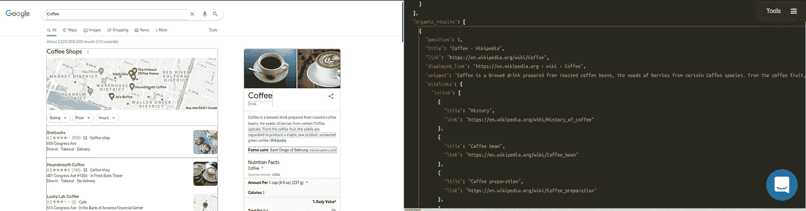

# 研究机器学习技术以改进规格测试— IV

> 原文：<https://blog.devgenius.io/investigating-machine-learning-techniques-to-improve-spec-tests-iv-8155275d40e8?source=collection_archive---------16----------------------->


# 介绍

这是与人工智能实现相关的系列博文的一部分。如果你对故事的背景或情节感兴趣:

本周我们将展示测试过程和模型的早期结果。我们将使用 [SerpApi 的 Google Organic Results Scraper API](https://serpapi.com/organic-results)进行数据收集。此外，您可以在[游乐场](https://serpapi.com/playground?q=Coffee&location=Austin%2C+Texas%2C+United+States&gl=us&hl=en&no_cache=true&newPara=lr+async+as_qdr)查看我们将使用的更详细的数据。



# 培训用数据

下面是我们存储在 json 文件中用于训练的数据的结构分解:

```
[
  { 
    "Key 1": Value_1,
    "Key 2": Value_2,
    "Key 3": Value_3,
    "Key 4": [
      "Value_1",
      ...
    ],
    "Key 5": {
      "Inner Key 1": Inner_Value_1,
      ...
  },
  ...
]
```

这里有一个例子:

```
[
  {
    "position": 1,
    "title": "Coffee - Wikipedia",
    "link": "https://en.wikipedia.org/wiki/Coffee",
    "displayed_link": "https://en.wikipedia.org › wiki › Coffee",
    "snippet": "Coffee is a brewed drink prepared from roasted coffee beans, the seeds of berries from certain flowering plants in the Coffea genus. From the coffee fruit, ...",
    "snippet_highlighted_words": [
      "Coffee",
      "coffee",
      "coffee"
    ],
    ...
  },
  ...
]
```

链接我们收集了来自谷歌的有机结果:
[茶的链接(100 个结果左右)](https://serpapi.com/playground?q=Tea&location=Austin%2C+Texas%2C+United+States&gl=us&hl=en&num=100&newPara=lr+async+as_qdr)
[咖啡的链接(100 个结果左右)](https://serpapi.com/playground?q=Coffee&location=Austin%2C+Texas%2C+United+States&gl=us&hl=en&num=100&newPara=lr+async+as_qdr)

# 测试结构

我们已经在过去三周的博客文章中详细介绍了我们是如何训练数据的。今天，我们将通过计算训练精度来测试假设是否成立。

我们可以重用`Train`和`Database`类来创建示例，并使用以下代码行创建示例向量:

```
example_vector = Database.word_to_tensor example
  example_vector.map! {|el| el = el.nil? ? 0: el}
  example_vector = Train.extend_vector example_vector
  weighted_example = Train.product example_vector
```

这里是我们提供的字符串。Google Organic Results 中被转换为字符串的任何键的任何值都将是有效的示例。
我们可以重用`Database.word_to_tensor`来获得与我们的词汇表一致的字符串的矢量化版本。
如果任何值是`nil` (null)，在我们的词汇表中没有，它将被替换为`0`，这是我们的`<unk>`(未知)的值。然后，
`example_vector`应该扩展到最大字符串大小，以便使用`1` s 进行计算。
`weighted_example`将是我们之前使用矢量化示例计算的`@@weights`的乘积。从我们提供的示例来看，多维空间中该值的最近向量应该具有相同的键，或者它们的平均值应该引导我们找到相同的键。因此，在我们的例子中，如果我们提供的例子不是一个`snippet`，那么围绕`weighted_example`的最近向量平均应该给出`less than 0.5`(它们的标识是`0`和`1`)。结论应该是`the example isn't a snippet`。

我们使用多维空间的欧几里德距离公式来测量我们的示例与数据集中每个示例的距离:

```
distances = []
  vector_array.each_with_index do |comparison_vector, vector_index|
    distances << Train.euclidean_distance(comparison_vector, weighted_example)
  end
```

我们取最小距离的指数(k 的许多倍):

```
indexes = []
  k.times do 
    index = distances.index(distances.min)
    indexes << index
    distances[index] = 1000000000
  end
```

然后，我们得到每个向量的真实身份:

```
predictions = []
  indexes.each do |index|
    predictions << key_array[index].first.to_i
  end
```

`key_array`这里是每行第一项包含`0`或`1`的数组，第二项包含字符串。举个例子:

```
[
  ...
  ["0", "https://www.coffeebean.com"],
  ["1", "Born and brewed in Southern California since 1963, The Coffee Bean & Tea Leaf® is passionate about connecting loyal customers with carefully handcrafted ..."],
  ["0", "4"],
  ...
]
```

`1`表示该项是片段，`0`表示不是。

让我们返回预测:

```
prediction = (predictions.sum/predictions.size).to_f
  if prediction < 0.5
    puts "False - Item is not Snippet"
    return 0
  else
    puts "True - Item is Snippet"
    return 1
  end
```

下面是完整的方法:

```
def test example, k, vector_array, key_array
  example_vector = Database.word_to_tensor example
  example_vector.map! {|el| el = el.nil? ? 0: el}
  example_vector = Train.extend_vector example_vector
  weighted_example = Train.product example_vector distances = []
  vector_array.each_with_index do |comparison_vector, vector_index|
    distances << Train.euclidean_distance(comparison_vector, weighted_example)
  end indexes = []
  k.times do 
    index = distances.index(distances.min)
    indexes << index
    distances[index] = 1000000000
  end predictions = []
  indexes.each do |index|
    predictions << key_array[index].first.to_i
  end puts "Predictions: #{predictions}" prediction = (predictions.sum/predictions.size).to_f
  if prediction < 0.5
    puts "False - Item is not Snippet"
    return 0
  else
    puts "True - Item is Snippet"
    return 1
  end
end
```

# 使用 Google Organic Results for Snippet 测试

现在我们有了一个测试函数，让我们在例子中将代码片段与非代码片段分开:

```
true_examples = key_array.map {|el| el = el.first == "1" ? el.second : nil}.compact
false_examples = key_array.map {|el| el = el.first == "0" ? el.second : nil}.compact
```

这将使我们更容易计算。

让我们声明一个空数组来收集预测，从非片段开始:

```
predictions = []false_examples.each do |example|
  prediction = test example, 2, vector_array, key_array
  predictions << prediction
endpredictions.map! {|el| el = el == 1 ? 0 : 1}
```

既然我们知道这些例子都不是`snippet`，那么任何给出`1`的预测都将是错误的。因此，如果我们用错误的例子来测试我们的模型，然后将`1` s 反转为`0` s，将`0` s 反转为`1` s，我们就可以将它与我们的真实例子结合起来:

```
true_examples.each do |example|
  prediction = test example, 2, vector_array, key_array
  predictions << prediction
end
```

现在我们已经填充了所需的数组:

```
prediction_train_accuracy = predictions.sum.to_f / predictions.size.to_fputs "Prediction Accuracy for Training Set is: #{prediction_train_accuracy}"
```

如果我们将`1`的数量除以预测的数量，我们可以计算出准确性结果。

# 初步结果

我们对前面提到的数据进行了完全相同的处理。片段的预测数为`1065`，`k`值为`2`，`n-gram`值为`2`。

模型正确预测了`872`次。这意味着训练精度为`0.8187793427230047` ( `%81.87`)。

这是一个很好的开始，随着更多的调整，以及用更大的数据集进行测试，最初的假设可能被证明是正确的。

# 完整代码

```
class Database
  def initialize json_data, vocab = { "<unk>" => 0, "<pad>" => 1 }
    super()
    @@pattern_data = []
    @@vocab = vocab
  end## Related to creating main database
  def self.add_new_data_to_database json_data, csv_path = nil
    json_data.each do |result|
      recursive_hash_pattern result, ""
    end@@pattern_data = @@pattern_data.reject { |pattern| pattern.include? nil }.uniq.compactpath = "#{csv_path}master_database.csv"
    File.write(path, @@pattern_data.map(&:to_csv).join)
  enddef self.element_pattern result, pattern
    @@pattern_data.append([result, pattern].flatten)
  enddef self.element_array_pattern result, pattern
    result.each do |element|
      element_pattern element, pattern
    end
  enddef self.assign hash, key, pattern
    if hash[key].is_a?(Hash)
      if pattern.present?
        pattern = "#{pattern}__#{key}"
      else
        pattern = "#{key}"
      endrecursive_hash_pattern hash[key], pattern
    elsif hash[key].present? && hash[key].is_a?(Array) && hash[key].first.is_a?(Hash)
      if pattern.present?
        pattern = "#{pattern}__#{key}__n"
      else
        pattern = "#{key}"
      endhash[key].each do |hash_inside_array|
        recursive_hash_pattern hash_inside_array, pattern
      end
    elsif hash[key].present? && hash[key].is_a?(Array)
      if pattern.present?
        pattern = "#{pattern}__n"
      else
        pattern = "#{key}"
      endelement_array_pattern hash[key], pattern
    else
      if pattern.present?
        pattern = "#{pattern}__#{key}"
      else
        pattern = "#{key}"
      endelement_pattern hash[key], pattern
    end
  end

  def self.recursive_hash_pattern hash, pattern
    hash.keys.each do |key|
      assign hash, key, pattern
    end
  end## Related to tokenizing
  def self.default_dictionary_hash
    {
      /\"/ => "",
      /\'/ => " \'  ",
      /\./ => " . ",
      /,/ => ", ",
      /\!/ => " ! ",
      /\?/ => " ? ",
      /\;/ => " ",
      /\:/ => " ",
      /\(/ => " ( ",
      /\)/ => " ) ",
      /\// => " / ",
      /\s+/ => " ",
      /<br \/>/ => " , ",
      /http/ => "http",
      /https/ => " https ",
    }
  enddef self.tokenizer word, dictionary_hash = default_dictionary_hash
    word = word.downcasedictionary_hash.keys.each do |key|
      word.sub!(key, dictionary_hash[key])
    endword.split
  enddef self.iterate_ngrams token_list, ngrams = 2
    token_list.each do |token|
      1.upto(ngrams) do |n|
        permutations = (token_list.size - n + 1).times.map { |i| token_list[i...(i + n)] }

        permutations.each do |perm|
          key = perm.join(" ")unless @@vocab.keys.include? key
            @@vocab[key] = @@vocab.size
          end
        end
      end
    end
  enddef self.word_to_tensor word
    token_list = tokenizer word
    token_list.map {|token| @@vocab[token]}
  end## Related to creating key-specific databases 
  def self.create_key_specific_databases result_type = "organic_results", csv_path = nil, dictionary = nil, ngrams = nil, vocab_path = nil
    keys, examples = create_keys_and_exampleskeys.each do |key|
      specific_pattern_data = []
      @@pattern_data.each_with_index do |pattern, index|
        word = pattern.first.to_s

        next if word.blank?if dictionary.present?
          token_list = tokenizer word, dictionary
        else
          token_list = tokenizer word
        endif ngrams.present?
          iterate_ngrams token_list, ngrams
        else
          iterate_ngrams token_list
        endif key == pattern.second
          specific_pattern_data << [ 1, word ]
        elsif (examples[key].to_s.to_i == examples[key]) && word.to_i == word
          next
        elsif (examples[key].to_s.to_i == examples[key]) && word.numeric?
          specific_pattern_data << [ 0, word ]
        elsif examples[key].numeric? && word.numeric?
          next
        elsif key.split("__").last == pattern.second.to_s.split("__").last
          specific_pattern_data << [ 1, word ]
        else
          specific_pattern_data << [ 0, word ]
        end
      endpath = "#{csv_path}#{result_type}__#{key}.csv"
      File.write(path, specific_pattern_data.map(&:to_csv).join)
    endif vocab_path.present?
      save_vocab vocab_path
    else
      save_vocab
    end
  enddef self.create_keys_and_examples
    keys = @@pattern_data.map { |pattern| pattern.second }.uniqexamples = {}
    keys.each do |key|
      examples[key] = @@pattern_data.find { |pattern| pattern.first.to_s if pattern.second == key }
    end[keys, examples]
  enddef self.numeric?
    return true if self =~ /\A\d+\Z/
    true if Float(self) rescue false
  enddef self.save_vocab vocab_path = ""
    path = "#{vocab_path}vocab.json"
    vocab = JSON.parse(@@vocab.to_json)
    File.write(path, JSON.pretty_generate(vocab))
  enddef self.read_vocab vocab_path
    vocab = File.read vocab_path
    @@vocab = JSON.parse(vocab)
  enddef self.return_vocab
    @@vocab
  end
endclass Train
  def initialize csv_path
    @@csv_path = csv_path
    @@vector_arr = []
    @@word_arr = []
    @@maximum_word_size = 100
    @@weights = Vector[]
    @@losses = []
  enddef self.read
    @@word_arr = CSV.read(@@csv_path)
    @@word_arr
  enddef self.define_training_set vectors
    @@vector_arr = vectors
  enddef self.auto_define_maximum_size
    @@maximum_word_size = @@vector_arr.map {|el| el.size}.max
  enddef self.extend_vector vector
    vector_arr = vector.to_a
    (@@maximum_word_size - vector.size).times { vector_arr << 1 }
    Vector.[](*vector_arr)
  enddef self.extend_vectors
    @@vector_arr.each_with_index do |vector, index|
      @@vector_arr[index] = extend_vector vector
    end
  enddef self.initialize_weights
    weights = []
    @@maximum_word_size.times { weights << 1.0 }
    @@weights = Vector.[](*weights)
  enddef self.config k = 1, lr = 0.001
    [k, lr]
  enddef self.product vector
    @@weights.each_with_index do |weight, index|
      vector[index] = weight * vector[index]
    endvector
  enddef self.euclidean_distance vector_1, vector_2
    subtractions = (vector_1 - vector_2).to_a
    subtractions.map! {|sub| sub = sub*sub }
    Math.sqrt(subtractions.sum)
  enddef self.k_neighbors distances, k
    indexes = []
    (k).times do
      min = distances.index(distances.min)
      indexes << min
      distances[min] = distances.max + 1
    endindexes
  enddef self.make_prediction indexes
    predictions = []
    indexes.each do |index|
      predictions << @@word_arr[index][0].to_i
    endpredictions.sum/predictions.size
  enddef self.update_weights result, indexes, vector, lr
    indexes.each do |index|
      subtractions = @@vector_arr[index] - vector
      subtractions.each_with_index do |sub, sub_index|
        if result == 0 && sub >= 0
          @@weights[sub_index] = @@weights[sub_index] + lr
        elsif result == 0 && sub < 0
          @@weights[sub_index] = @@weights[sub_index] - lr
        elsif result == 1 && sub >= 0
          @@weights[sub_index] = @@weights[sub_index] - lr
        elsif result == 1 && sub < 0
          @@weights[sub_index] = @@weights[sub_index] + lr
        end
      end
    end
  enddef self.mean_absolute_error real, indexes
    errors = []
    indexes.each do |index|
      errors << (@@word_arr[index][0].to_i - real).abs
    end(errors.sum/errors.size).to_f
  enddef self.train vector, index
    k, lr = config
    vector = extend_vector vector
    vector = product vector

    distances = []
    @@vector_arr.each_with_index do |comparison_vector, vector_index|
      if vector_index == index
        distances << 100000000
      else
        distances << euclidean_distance(comparison_vector, vector)
      end
    endindexes = k_neighbors distances, k
    real = @@word_arr[index][0].to_i
    prob_prediction = make_prediction indexes
    prediction = prob_prediction > 0.5 ? 1 : 0
    result = real == prediction ? 1 : 0update_weights result, indexes, vector, lr
    loss = mean_absolute_error real, indexes
    @@losses << loss

    puts "Result : #{real}, Prediction: #{prediction}"
    puts "Loss: #{loss}"prediction
  end
endjson_path = "organic_results/example.json"
json_data = File.read(json_path)
json_data = JSON.parse(json_data)Database.new json_data
## For training from scratch                     
Database.add_new_data_to_database json_data, csv_path = "organic_results/"
Database.create_key_specific_databases result_type = "organic_results", csv_path = "organic_results/"
##Database.read_vocab "vocab.json"## We will use an iteration of csvs within a specific path in the end
csv_path = "organic_results/organic_results__snippet.csv"Train.new csv_path
key_array = Train.readvector_array = key_array.map { |word| Database.word_to_tensor word[1] }
Train.define_training_set vector_array
Train.auto_define_maximum_size
Train.extend_vectors
Train.initialize_weights
Train.config k = 2vector_array.each_with_index do |vector, index|
  Train.train vector, index
enddef test example, k, vector_array, key_array
  example_vector = Database.word_to_tensor example
  example_vector.map! {|el| el = el.nil? ? 0: el}
  example_vector = Train.extend_vector example_vector
  weighted_example = Train.product example_vectordistances = []
  vector_array.each_with_index do |comparison_vector, vector_index|
    distances << Train.euclidean_distance(comparison_vector, weighted_example)
  endindexes = []
  k.times do 
    index = distances.index(distances.min)
    indexes << index
    distances[index] = 1000000000
  endpredictions = []
  indexes.each do |index|
    predictions << key_array[index].first.to_i
  endputs "Predictions: #{predictions}"prediction = (predictions.sum/predictions.size).to_f
  if prediction < 0.5
    puts "False - Item is not Snippet"
    return 0
  else
    puts "True - Item is Snippet"
    return 1
  end
endtrue_examples = key_array.map {|el| el = el.first == "1" ? el.second : nil}.compact
false_examples = key_array.map {|el| el = el.first == "0" ? el.second : nil}.compactpredictions = []false_examples.each do |example|
  prediction = test example, 2, vector_array, key_array
  predictions << prediction
endpredictions.map! {|el| el = el == 1 ? 0 : 1}true_examples.each do |example|
  prediction = test example, 2, vector_array, key_array
  predictions << prediction
endprediction_train_accuracy = predictions.sum.to_f / predictions.size.to_fputs "Prediction Accuracy for Training Set is: #{prediction_train_accuracy}"end
```

# 结论

我要为博客文章晚了一天向读者道歉。两周后，我们将展示如何存储它们以供实现，并进一步调整以提高准确性。

这个项目的最终目标是创建一个`open-source gem`，每个人都可以在代码中使用 JSON 数据结构来实现它。

我要感谢读者的关注，感谢才华横溢的塞尔帕皮人在艰难时刻创造奇迹，感谢他们的支持。

*原载于 2022 年 4 月 21 日*[*https://serpapi.com*](https://serpapi.com/blog/investigating-machine-learning-techniques-to-improve-spec-tests-iv/)*。*