# Jupyter 上带 Java 的 IO 拼花地板

> 原文：<https://blog.devgenius.io/io-parquet-with-java-on-colab-27806dbedfd9?source=collection_archive---------3----------------------->

在 Google Colab (Jupyter)上用 Java 语言用 Tablesaw 读/写 Parquet。


[来自 Pixabay 的问候](https://pixabay.com/photos/yellow-cab-taxi-new-york-road-619738/)

# 介绍

我们将在 [Google Colab](https://colab.research.google.com/) 上使用 Java 快速浏览 [Apache Parquet](https://parquet.apache.org/) 。在由[斯潘塞·帕克](https://github.com/SpencerPark)编写的用于 Jupyter 的 [IJava 内核的帮助下，这是可能的。](https://github.com/SpencerPark/IJava)

[](https://parquet.apache.org/)[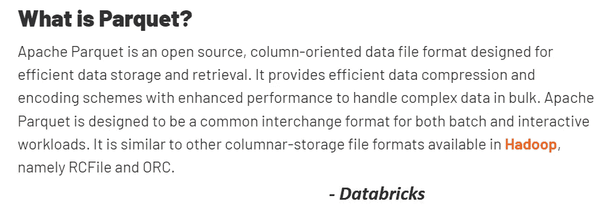](https://databricks.com/glossary/what-is-parquet)

如果你还不熟悉 Apache Parquet，我强烈推荐下面两个视频中的任何一个。

虽然这两个视频都是一个小承诺(约 45 分钟以上)，并且比你在其他地方可能找到的 5 分钟总结更具技术性，但它们非常值得投资。

在我早上开车从家到办公室的路上，我已经听了很多遍了。尽管办公室离我的床只有 20 英尺远，我还是喜欢在乡间悠闲地开车，一边喝着早晨的咖啡。

[](https://www.dremio.com/resources/webinars/columnar-roadmap-apache-parquet-and-arrow/)[](https://databricks.com/session_eu19/the-parquet-format-and-performance-optimization-opportunities)

## 先决条件

在完成本教程之前，熟悉在 Google Colab 上配置和安装内核的步骤会有所帮助，正如下面链接的几篇文章中所演示的那样。

*   [Java、Jupyter 和 Google Colab](https://medium.com/@gmsharpe/jupyter-java-and-google-colab-7a2f7fb08808)
*   [开始使用 Tablesaw 和 Google Colab](https://medium.com/@gmsharpe/getting-started-with-tablesaw-and-google-colab-65ef0cbe280c)
*   [Java、Jupyter 和 Plotly](https://medium.com/@gmsharpe/java-jupyter-plotly-e1bbaa7f2be8)

## ***TL/DR***

如果你想现在就开始，不回顾以上文章中的任何细节，你可以从在[谷歌实验室](https://colab.research.google.com/)上建立你的账户开始，如果你还没有的话。

接下来，在 Colab 中打开并创建该笔记本的副本:

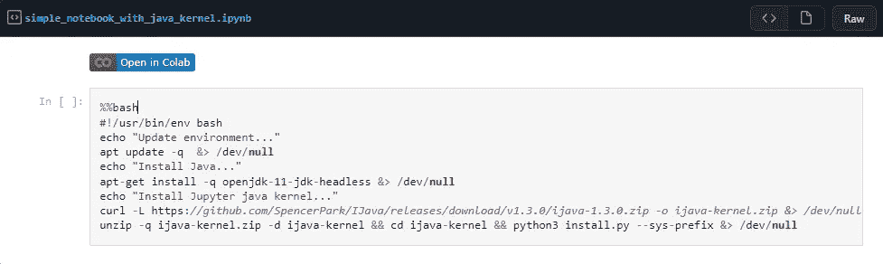

入门模板—包括 IJava 内核

上面链接的模板首先运行下面的 shell 脚本来安装 Java 内核。

接下来，您可以选择确认选择了 Java 运行时类型:

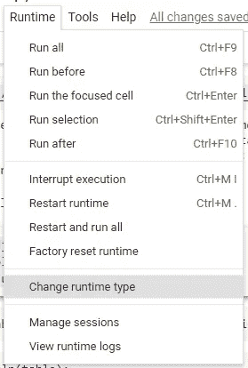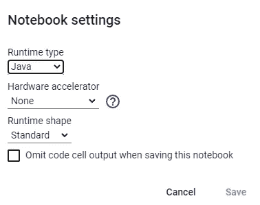

…然后'*连接到 Colab 中的托管运行时*，

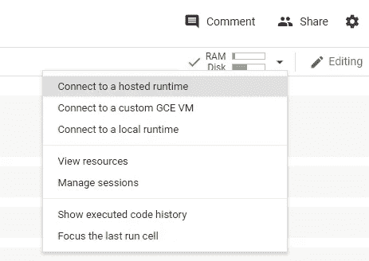

## 导入依赖项

安装完 Java 内核后，我们可以使用 Maven 和 [IJava 的 Magics](https://github.com/SpencerPark/IJava/blob/master/docs/magics.md) 加载依赖项。

具体来说，我们使用`%%loadFromPOM`魔法下载[锯木芯](https://github.com/jtablesaw/tablesaw)和[锯木芯](https://github.com/tlabs-data/tablesaw-parquet)。我们还将包含 Apache CommonsIO 来使用`FileUtils`下载原始数据集。

在代码块中执行以下内容。

*注意:有可能使用一个更小的依赖集来完成本文中的所有工作。我自己也尝试过，但是如果你有更小/更干净的东西，请给我发消息，我会用你的版本替换上面的。*

[](https://pixabay.com/photos/yellow-taxi-new-york-new-york-taxi-592184/)

[来自 Pixabay 的问候](https://pixabay.com/photos/yellow-cab-taxi-new-york-road-619738/)

## 下载数据

纽约市出租车和豪华轿车委员会保存着纽约市每辆出租车和豪华轿车的记录。这些行程每个月都向公众报告，包括接送目的地和时间等信息。这是数据工程项目中的一个流行数据集，也是概念验证，原因在本文的[这里](https://uwekorn.com/2019/08/22/why-the-nyc-trd-is-a-nice-training-dataset.html)描述。

有关纽约市出租车和豪华轿车委员会及其数据集的更多详情，请访问他们的网站。

对于我们的示例，我们将下载 2021 年 1 月的绿色出租车出行数据。

在将数据写入 Parquet 之前，让我们使用 Tablesaw 将 CSV 文件读入数据帧。

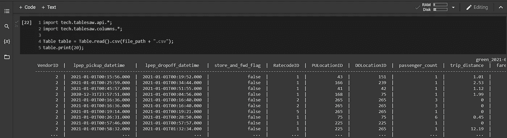

使用 Tablesaw 预览 Colab 中的数据

# 编写拼花文件

## 下载 tablesaw-parquet Jar

Tablesaw 拼花 I/O 与核心 Tablesaw 项目分开支持。虽然我们可以在上面的 POM 代码片段中把它作为一个依赖项包含进来，但是我们将下载我创建的 Jar 的一个版本，以便更新所使用的 parquet 和 hadoop 的版本。

[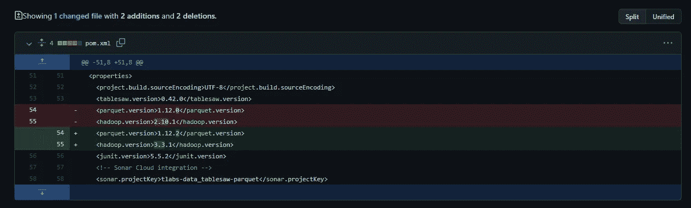](https://github.com/gmsharpe/tablesaw-parquet/commit/fbed411a8af4bc4087bb7dc290e4b588fe18e2ee)

为了下载这个 Jar，我们将再次使用`FileUtils.copyURLToFile(…)`

## 装上锯木架罐

使用来自 IJava 的`%jars` line magic，我们将把 jar 加载到我们的类路径中。

```
%jars "/content/" + tablesawParquetJar
```

## 准备好与拼花地板进行 I/O

最后，我们准备使用几个步骤前加载到 tablesaw 中的数据集写入 parquet。

为了完成这个循环，我们将使用`TablesawParquetReader`将数据 ***读回*** 到 Tablesaw。

## I/O 结果

现在我们已经将第一个 parquet 文件读入 Tablesaw，让我们评估使用默认设置创建的表的结构。

为此，我们使用了`Table#structure()`方法。

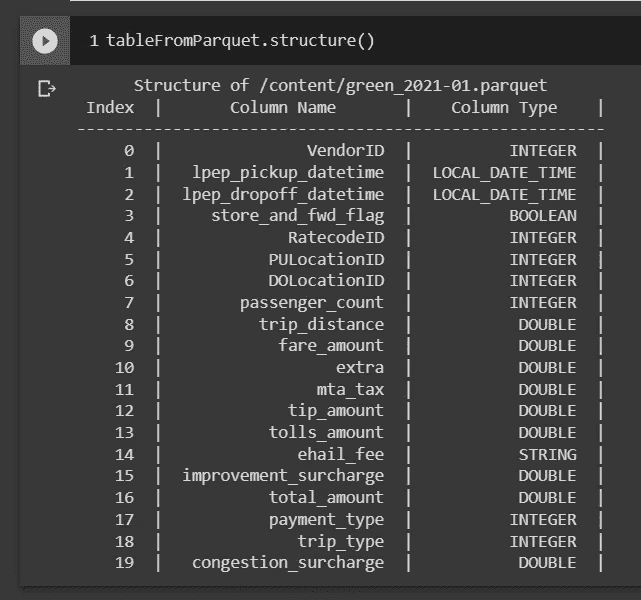

## 映射数据类型(表锯到拼花)

为了更好地理解从 Parquet 到 Tablesaw 的数据类型映射，GitHub `README.md`上提供了以下表格。

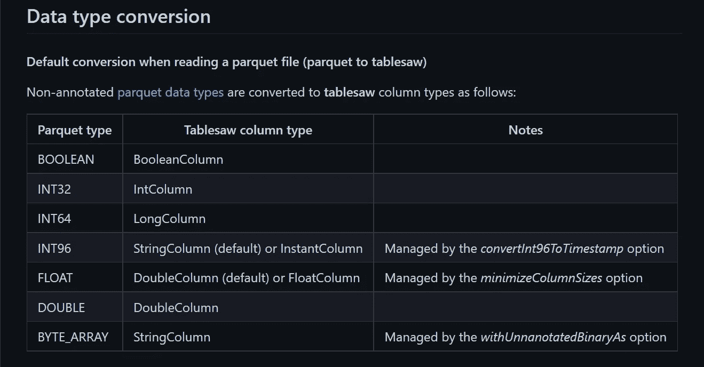

[数据类型转换](https://github.com/tlabs-data/tablesaw-parquet#data-type-conversion)

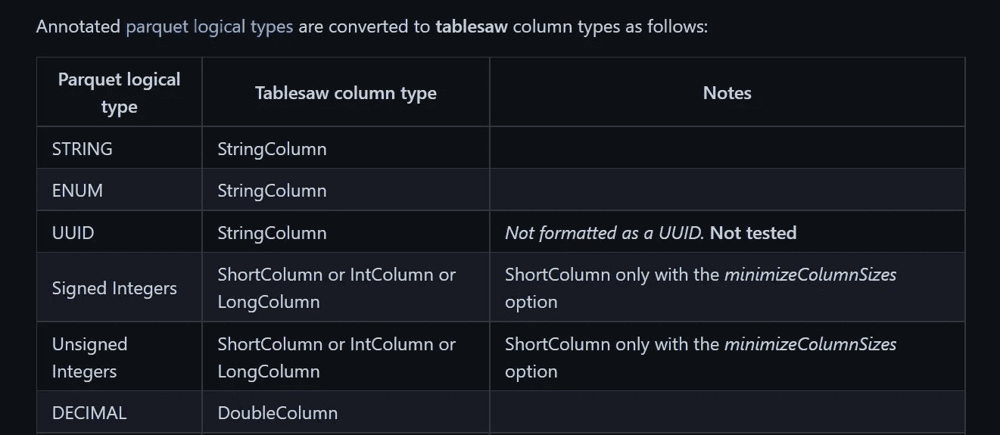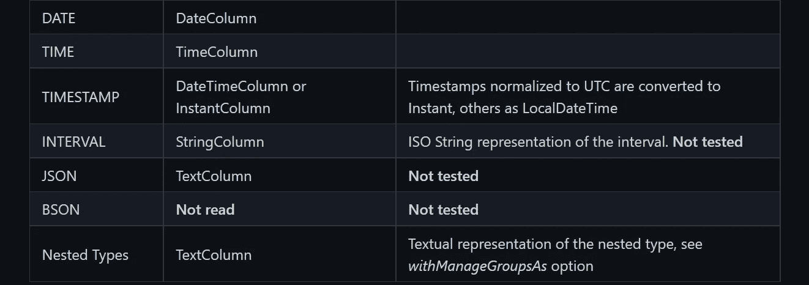

[数据类型转换](https://github.com/tlabs-data/tablesaw-parquet#data-type-conversion)(续。)

这是一个我们肯定可以进一步探讨的话题，但是我想我会把它留给另一篇文章，以免这篇文章太长…

与此同时，我建议阅读 GitHub 页面`[README.md](https://github.com/tlabs-data/tablesaw-parquet)`,并自己动手创建具有各种数据类型的表，并将这些表写入 Parquet。

# …请再来点拼花地板？

如果您还没有看够，Tablesaw-parquet 确实支持许多值得注意的附加[特性](https://github.com/tlabs-data/tablesaw-parquet#features)。

*   列过滤
*   列编码
*   压缩编解码器

在撰写本文时，Tablesaw 拼花地板**不支持**

*   谓词下推
*   模块化加密

更多细节，当然可以在项目的`[README.md](https://github.com/tlabs-data/tablesaw-parquet)`上找到。

我希望在以后的文章中更深入地了解这些附加特性。如果您对这个主题的示例特别感兴趣，请告诉我，我可以提升这项工作的优先级。

[](https://medium.com/@gmsharpe/membership)

请考虑用上面的会员推荐链接注册一个中等会员——谢谢！

# 摘要

有许多工具可以用来编写拼花文件。一般来说，Tablesaw 正在成为处理数据帧的一个非常有能力的框架，而对于‘table saw-parquet’来说，它也是读写日益流行的 Parquet 文件格式的一种有用的方式，用于快速的特别分析、数据争论等。

我希望这篇文章对这个主题有所帮助。如果你在这项工作的基础上创造出更复杂的例子，我很乐意在这里分享你的工作的链接，并对你的努力给予充分的肯定。

要获得上述代码的完整工作示例，您可以在我的 GitHub 存储库中找到我的 Google Colab 笔记本副本，链接如下。

[**完整的 Google Colab 笔记本**](https://gist.github.com/gmsharpe/4a2bba5088c0263b254cf954d82c61c9)

# 作者的说明

如果您想探索 Java、Jupyter 和许多可用于数据科学、工程和一般分析的工具的交集，下面是一些您可能感兴趣的文章。

*   Java，Jupyter & Plotly
*   [数据框& JSON 与 Jupyter 上的表锯](https://medium.com/@gmsharpe/dataframes-with-tablesaw-json-46dda9c8c217)
*   [用 Java 整理数据& Jupyter](https://medium.com/@gmsharpe/tidy-data-with-java-jupyter-b1e131b37ab0)
*   Apache Spark 与 Java & Jupyter

我很期待看到你们接下来的作品。

**所以，发挥创意**，别忘了[展示你的作品](https://austinkleon.com/show-your-work/)！！

我很乐意听到任何探索如何在笔记本环境中使用 Java 的人的反馈(Jupyter， [Zeppelin](https://zeppelin.apache.org/) 等)。)和命令行( [JShell](https://docs.oracle.com/javase/9/jshell/introduction-jshell.htm) )上使用 Tablesaw 等工具进行数据处理和可视化。

给我发消息，特别是如果你已经在 Medium 上发表了任何材料，我很乐意在将来相关的时候链接到你的内容。


[图片来自 Pixabay](https://pixabay.com/photos/new-york-b-w-taxi-nyc-manhattan-4449232/)