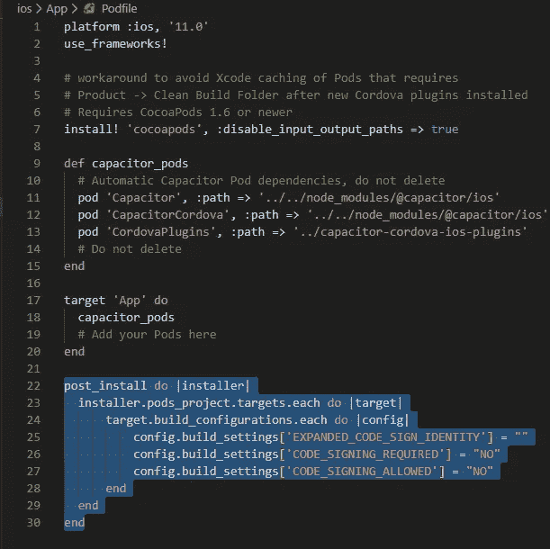
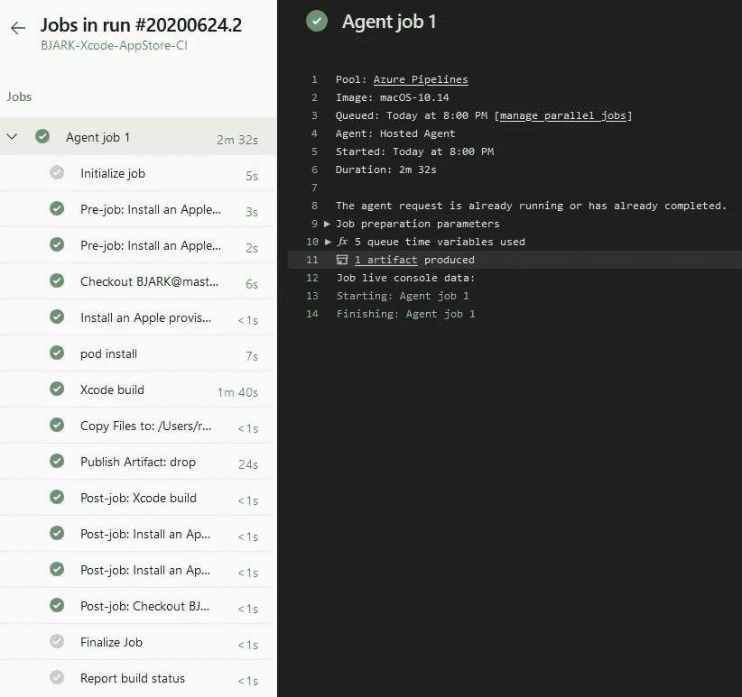

# 离子电容:从 App 到 iOS IPA 无需 Mac

> 原文：<https://blog.devgenius.io/ionic-capacitor-from-app-to-ios-ipa-without-a-mac-9b8616900528?source=collection_archive---------4----------------------->

## 磨快你的弯刀，丛林深处


尼古拉·切尔尼琴科在 [Unsplash](https://unsplash.com?utm_source=medium&utm_medium=referral) 上拍摄的照片

我听到你在想:“在没有 Mac 的情况下构建一个 IPA？愚不可及！”。我也有这样的印象，你必须花钱才能使用 MacOS 系统(一台 MacBook，一台 iMac，甚至是网上租赁的)。然而，在过去的一周里，我已经找到了用 Windows PC 给你买一台 IPA 的所有方法。

**重要提示:**我不建议正在开发的应用采用这种流程。使用这种方法在物理设备上测试应用程序非常麻烦和令人沮丧，尤其是当您希望调试特定场景时。如果你有一个(几乎)准备好发布的应用程序，如果你只是想尝试一下，或者如果你没有其他方法来建立一个 IPA，请使用这种方法。如果你有能力在你的能力范围内获得一个运行 MacOS 的系统，我强烈建议你走这条路。既然已经解决了，让我们继续吧。

# 一些背景

我为什么要考虑用这种复杂的方式来绕过 MacOS 呢？这是从我的一个朋友 Bjarke 开始的，他是 Twitch[上一个令人捧腹的流光。我的双手渴望用 Ionic 5、电容器和 React 构建一个移动应用程序，所以我问他是否想要一个应用程序来补充他的渠道，他说是的。](https://twitch.tv/bjarkeeeee)

在构建了应用程序，在浏览器和我的物理 Android 设备上进行测试后，我准备在他的 iPhone 上测试“成品”。为此，我需要一个 IPA 来分发到他的手机上，但花一大笔钱买一台 Mac 来运行“构建”对于一个小时间的练习应用程序来说是多余的。所以我开始四处寻找和研究。这篇文章是我研究和实验的结果。为了防止这篇文章变得太大，我将引用一些以更小的格式处理特定操作的其他帖子。

尽管已经从 Ionic 应用程序的角度描述了该过程，但是从 XCode 项目到 IPA 的步骤应该仍然适用于更一般的场景。

# 先决条件

本练习的目标是执行 Ionic 应用程序的临时分发，这需要我们构建一个 IPA 作为中间步骤。对于这个特定的练习，我假设您已经具备了以下条件:

*   一个[离子/电容](https://capacitor.ionicframework.com/docs/getting-started/with-ionic/) app
*   一个免费的 [Azure DevOps 账户](https://go.microsoft.com/fwlink/?LinkId=2014881&campaign=acom~azure~devops~services~main~hero&githubsi=true&clcid=0x409&WebUserId=3786039B5BF36ED7134B0D9C5FF36829)(创建一个账户，在那个账户中创建一个[组织](https://docs.microsoft.com/en-us/azure/devops/organizations/accounts/create-organization?view=azure-devops#create-an-organization)，如果你还没有的话，在那个组织中创建一个[项目](https://docs.microsoft.com/en-us/azure/devops/organizations/projects/create-project?view=azure-devops&tabs=preview-page#create-a-project))
*   一些 git repo (GitHub，Azure DevOps Repos 等)的代码库。)
*   苹果开发者支付的[账户](https://idmsa.apple.com/IDMSWebAuth/signin?appIdKey=891bd3417a7776362562d2197f89480a8547b108fd934911bcbea0110d07f757&path=%2Faccount%2F&rv=1)

付费的苹果开发者账户有 100 美元的缺点，但是如果你打算发布一些东西到 App Store，我假设你已经有了一个或者会创建一个。

# 要采取的步骤

现在让我们来看看本质吧！要从应用程序到临时分发，我们将经历以下步骤:

*   将 iOS 作为平台添加到 Ionic 应用程序
*   将代码推送到 git repo
*   从 Apple 开发人员控制台获取证书和预置描述文件
*   在 DevOps 中构建 Azure 管道，运行它并下载 IPA
*   将 IPA 上传至 [Diawi](https://www.diawi.com/) 进行分发

我们还有很长的路要走，所以让我们开始吧！

# 将 iOS 作为平台添加到 Ionic 应用程序

首先，我们需要 Ionic 来生成 iOS 构建的文件。如果您已经这样做了，您可以跳到下一小节，在那里我们会做一些必要的更改。

我们通过在项目的根目录下打开一个命令提示符来做到这一点(或者如果你使用 [VS Code](https://code.visualstudio.com/) ，Ctrl-`来启动一个终端)。奔跑

`ionic capacitor add ios`

然后回车。Ionic 现在将执行必要的步骤来为 iOS 准备应用程序。

很好，现在我们有了 iOS 文件，但是我们需要把它们调整成正确的形状。让我们接下来做那件事。

## 做一些必要的改变

为了让 Azure DevOps 中的构建工作，我们需要向 git 存储库中添加一些通常被忽略的文件，并对现有文件进行一些修改。

*   替换根中的`/node_modules`语句。gitignore 文件使其看起来像这样:


这将允许 node_modules/@capacitor/ios 文件夹被推送到 repo，同时忽略所有其他内容。

node_modules 通常保存在。这是一件好事，因为它包含了很多文件。我们希望保持这种方式，但 Azure 将需要这个特定的文件夹才能构建 IPA，所以这就是我们添加它的原因。

*   从`ios/.gitignore`上取下`App/public`和`capacitor-cordova-ios-plugin`:


移除后，这是。gitignore

Azure 在构建时也需要这些文件夹。

*   给`ios/App/PodFile`添加几行额外的代码，这是在最后一步中自动创建的:

```
post_install do |installer| installer.pods_project.targets.each do |target| target.build_configurations.each do |config| config.build_settings['EXPANDED_CODE_SIGN_IDENTITY'] = "" config.build_settings['CODE_SIGNING_REQUIRED'] = "NO" config.build_settings['CODE_SIGNING_ALLOWED'] = "NO" end end end
```



突出显示的部分是新零件

我们为什么要这么做？我们告诉 CocoaPods(将在 Azure 中运行该文件的包管理器)不要尝试对 pod 进行签名。这是在以前的版本中添加到 CocoaPods 中的东西，但是它中断了构建过程。

这就是我们需要做出的改变。请确保将此推送到您的 git repo，我们可以继续。

# 从 Apple 开发人员控制台获取证书和预置描述文件

这是 Apple 向您推荐 Keychain 的步骤之一，Keychain 是 Apple 自带的密钥管理工具。要使用 Keychain，您需要访问 Mac，但幸运的是，我们可以通过使用 OpenSSL 获得相同的结果。我将向您推荐一些不同步骤的文章，以免弄乱这个步骤。让我们来看一下这些步骤:

*   按照这篇文章来[安装 OpenSSL 并将其添加到您的路径中](https://medium.com/@nintendoengineer12/installing-openssl-on-windows-10-and-updating-path-80992e26f6a1)
*   按照本文[创建 Apple 预置描述文件和. p12 证书](https://medium.com/@nintendoengineer12/creating-an-apple-provisioning-profile-and-a-p12-certificate-using-openssl-ebd443d3b8bb)(记下您将创建的应用 ID，我们将需要它！)

没错，这至少会给你留下我们在 Azure DevOps 管道中需要的两个文件。我们需要注意一件重要的事情，那就是获取您创建的应用程序 ID，并将其设置在我们的代码中。前往`ios/App/App/capacitor.config.json`并设置您的应用 ID:


替换突出显示的部分

干得好我们已经准备好在 Azure 上开始构建管道了。

# 在 DevOps 中构建 Azure 管道，运行它并下载 IPA

有趣的部分！这里我们实际上会得到一个。可以在 iOS 设备上运行的 ipa 文件。毕竟这就是我们在这里的原因。敬蔚蓝！

*   登录您的 Azure DevOps 门户，选择组织，然后选择您为此创建的项目:


是的，我把我的叫做 BJARK

*   点击**管道** > **新建管道**，然后选择底部的**使用经典编辑器**选项:


*   确保根据您存储代码的位置(我的代码在同一个项目中，所以我选择了 Azure Repos Git)选择源、项目、存储库和默认分支(master ),然后点击 continue。


*   在模板选择界面中搜索“xcode ”,将鼠标悬停在 Xcode 模板管道上并点击**应用**,选择 Xcode 模板管道:


*   当你到达管道时，调整右边窗口中的字段，以反映下面的图像(Ionic 命名为 ios 源文件夹应用程序，所以我保持这种方式):


*   确保启用前两个任务(右键单击它们以获得菜单)，因为我们将需要它们来获得有效的。要分发的 ipa:


*   点击第一个任务，点击**证书(p12)** 字段右侧的齿轮图标，上传您的. P12 证书:


选择您在教程中创建的文件

*   上传后，点击顶部的**变量**，输入. p12 文件的密码:


Azure 会保护密码的安全

*   现在返回到**任务**，选择配置文件的第二个任务，并再次点击齿轮图标上传您创建的配置文件:


*   现在转到 **Xcode 构建**任务，向下滚动到**签名&供应**部分，并填写如下所示的字段:


确保选中**创建应用包**复选框！

*   我们需要向模板添加一个任务，所以点击**代理作业 1** 框中的+图标，搜索 **cocoapods** ，添加 **CocoaPods** 任务:


重要的一步

*   添加完成后，使用任务末尾的句柄将其移动到 **Xcode build** 任务之前，并填写如下所示的字段:


*   点击**保存&队列**，如果需要，输入注释，然后点击**保存并运行**:


*   点击**代理作业 1** 查看发生了什么:


*   一旦完成，(如果您遵循了步骤，构建应该通过，否则留下评论，我会尽快回复您)您可以下载生成的工件:



它在**代理作业 1** 下

*   一旦你点击它，打开文件夹，下载新的。国际音标:


只需点击下载，宝贝！

唷！我们终于得到了。ipa 当然，现在你一定意识到了我为什么建议尽可能地使用 Mac。虽然，一旦一切都设置好了，构建一个新的。ipa 只是将您的代码推送到您的主分支，并启动这条准备就绪的管道。

# 将 IPA 上传至 Diawi 进行分发

如果您对临时分发不感兴趣，那么您可以省去这一步。我想让 Bjarke 在发布之前在他的 iPhone 上测试一下这个应用程序，所以我会用 Diawi 把它分发给他。

*   进入 [Diawi](https://www.diawi.com/) ，点击**添加文件**添加您新下载的文件。ipa 文件:


*   等待上传完成，点击**发送**，复制链接和/或二维码:


别担心，未经您注册的设备无法下载该应用程序

*   将它们中的任何一个给拥有您在预置描述文件中注册的设备的人，他们应该能够下载它(如果他们在 iPad 上，请确定他们在 Safari 中使用移动视图)

# 结束了

就这样结束了！旅程很长，但我们设法在没有拥有/租用 Mac 的情况下，为 iOS 开发并发布了一个应用程序。谢谢你和我一起踏上穿越丛林的旅程。特别感谢 [Bjarke](https://twitch.tv/bjarkeeeee) (如果你喜欢笑的话，值得一试)，他给了我做和学习所有这些的机会，并为他开发了一个应用程序。

如果你有任何问题或意见，我很乐意倾听。