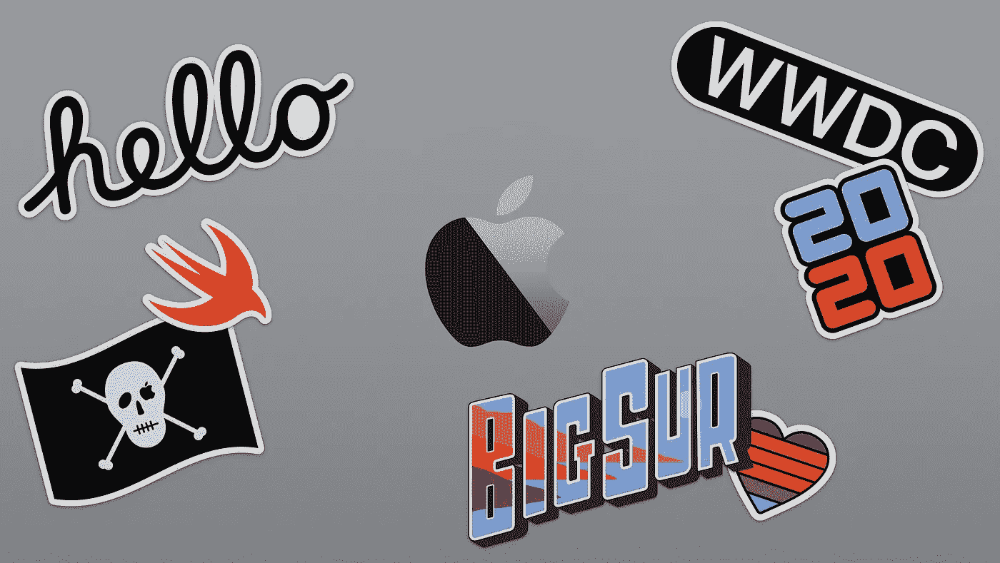

# iOS 14 和 WWDC 2020:有什么新内容

> 原文：<https://blog.devgenius.io/ios-14-wwdc-2020-whats-new-e3b99352c7f?source=collection_archive---------18----------------------->

## 技术

## 苹果 WWDC 2020 主题演讲上推出新功能

像每年六月一样，**苹果组织 WWDC** ，这是一系列围绕 iOS、watchOS、tvOS & macOS 的开发和工程的会议，展示了今年一些最令人兴奋的创新，并在未来几年将**应用开发、创新&技术推向一个全新的水平。**

今年，WWDC 将从 6 月 22 日开始持续一周，数百场生活会议将在介绍性主题演讲后举行。

**以下是今年在 2020 年苹果全球开发者大会上推出的一些最酷的功能，包括 iOS 14、macOS Big Sur、Apple Silicon、App Clips、CarKey 等。**

# 应用程序剪辑

在主题演讲中，苹果介绍了**应用剪辑**。一种允许访问应用程序的一部分并在用户需要时增加其可发现性的新方法。

一个**应用剪辑**是一个应用的一小部分(不到 10 MB)，启动起来很快很快。它允许用户用一个 **NFC 标签**、一个**代码标签**开始下载该剪辑，或者用 **iMessages、Safari、地图**等等分享该剪辑。餐馆或咖啡店的外卖订单、踏板车或自行车共享服务，这些都是这一伟大新功能的用例。

一个 **App Clips** 的目标是快速完成一项任务。使用 **Apple Pay** 和**登录苹果**，甚至可以快速轻松地提供连接或支付等高级功能。

您还可以直接从**应用程序剪辑**向用户提供下载完整应用程序的选项，这是提高应用程序可发现性的一个好方法。

关于**应用剪辑**和谁来制作的更多信息，你可以访问[苹果开发者网站](https://developer.apple.com/app-clips/)。

[应用剪辑——苹果开发者](https://developer.apple.com/app-clips/)

# 小工具

今年 iOS 上的另一个演变是对**小工具**的重新设计。用户现在可以在应用程序中间的主页上添加一个小部件，以提供增强的数据丰富的信息。将有 3 种尺寸可供选择:小、中、大，允许选择将在小部件中显示的信息密度。**现在大部分原生苹果应用都有自己的 widget，包括:天气、时钟、日历、新闻、健身、音乐等。**

此外，作为开发人员，我们也可以为我们的应用程序创建自己的小部件，利用新 API 的高级功能，包括在正确的时间显示小部件，或刷新信息。

下面是用 **WidgetKit** 创建小部件扩展的[编程指南](https://developer.apple.com/documentation/widgetkit/creating-a-widget-extension)。

[Widgets——人机界面指南](https://developer.apple.com/design/human-interface-guidelines/ios/system-capabilities/widgets)

# 苹果硅

苹果还推出了其 Mac 电脑的最大举措之一:**苹果芯片**，它自己的基于 ARM 的片上系统，以取代英特尔处理器。

比以往任何时候都更加强大和节能，它将允许你创建强大的应用程序，使用与 iOS 应用程序相同的架构，从而使新 Mac 上的所有 iPhone 和 iPad 应用程序与苹果芯片兼容。

多亏了 **Rosetta 2** ，每一个应用程序都将与这些新 Mac 兼容，Rosetta 2 将编译用于基于英特尔的 Mac 的应用程序翻译为用于新的苹果硅 Mac。

**微软、Adobe 和 Autodesk 已经使他们的应用程序兼容** (Office、Creative Cloud、Maya 等)在这些未来的新 Mac 上本地运行，比以往任何时候都更流畅和性能更好。

如果你需要测试你的应用程序，以确保一切都在苹果硅 Mac 上正常工作，可以使用一个**开发者过渡套件(DTK)** ，配有**苹果 A12Z 仿生处理器**。如果你是苹果开发者计划的成员，你可以在[这个页面](https://developer.apple.com/programs/universal/)上花 500 美元申请获得其中一个过渡套件。

苹果硅——WWDC 2020

# 大苏尔马科斯(11.0)

今年 macOS 正在转向 11.0 版本。这是苹果电脑和苹果芯片的转折点。

在 macOS Big Sur 上， **Mac Catalyst** 得到了改进，使得将 iOS 和 iPadOS 应用程序移植到 Mac 上变得更加容易。苹果还用 Mac Catalyst 重建了更多自己的应用，比如地图或信息。

此外，Safari 已经过重新设计，新的 **Safari 扩展**部分将添加到 Mac 应用商店，提供新的定制可能性，并保护用户数据的安全，以及浏览，这要归功于新的隐私报告工具，使用户知道他们访问的网站上正在使用的跟踪工具。

# iOS 和 iPadOS

在今年的 WWDC 主题演讲中还引入了大量其他新功能，重点是增强的用户体验。

## 应用程序库

苹果推出了一种在 iOS 设备上组织应用程序的新方法:应用程序库。现在，所有的应用程序都被从 A 到 Z 组织在一个应用程序库中，可以在主屏幕的最后一页访问，按照智能类别对应用程序进行分类，并在它们上面显示建议的应用程序，以便快速访问。现在甚至可以隐藏主屏幕的一些页面，以便更快地访问应用程序库。

iOS 14 —应用程序库

## 画中画

自 iOS 9 以来，iPad 拥有了画中画功能，允许用户使用另一个应用程序观看一个应用程序中的视频。现在，这也可以在每台装有 iOS 14 的 iPhone 上实现，该模式通过锁定和缩放手势得到了增强，并且可以隐藏视频，只保留音频。

## iPhone4S 上的语音控制功能

自从在 iOS 5 中推出 Siri 以来，它已经变得越来越强大，拥有处理更多请求的新功能。

截至今天，Siri 每月处理**250 亿次请求**，能够提供**比 3 年前多 20 倍的事实**。

在 iOS 14 中，Siri 体验被完全重新设计，现在变成了一个紧凑的项目，没有覆盖整个屏幕。

iOS 14 — Siri

## 翻译

iOS 14 增加了新的原生苹果应用:**翻译**。

如果翻译应用程序很久以前就存在，苹果推出了自己的应用程序，专注于用户隐私。Apple Translate 可以直接在用户的设备上处理翻译，不需要互联网连接，并引入了一种新的对话模式，让你可以轻松地与不讲你的语言的人交谈。非常有用的是，你在一个没有互联网连接的外国。

iOS 14 —翻译

## iMessages

iMessages 引入了许多新功能，尤其是针对群组对话。

现在可以用线程回复一条消息，在对话中保持逻辑，尤其是在对话中有大量事情同时发生的情况下。此外，一个新的演示谁在小组中，让您可以快速查看谁最近作出了回应。

iOS 14 引入的另一个功能是:你现在可以在对话中**提及**某人，并决定将对话静音，但直接提及除外。

## 地图

苹果推出了地图指南。一项新功能，允许您浏览和共享您最喜爱的地方，并像本地人一样发现新的地方。

一个新的交通模式，长时间请求，在 iOS 14 中也有:**自行车模式**。这种模式还让我们在骑行前预览街道的标高，并在不同的方式之间进行选择，以避免繁忙的道路。电动汽车的地图上也增加了充电站。

苹果地图——iOS 14

## CarPlay

截至今天，美国 97%的新车都配备了 CarPlay 功能，而在世界其他地区，这一比例约为 80%。

CarPlay 允许您直接在车载屏幕上找到您的应用程序，以获得更高的安全性。如果目前 CarPlay 中只允许几个类别的应用程序，如地图或音乐应用程序，iOS 14 将增加新的类别，包括快餐等。

## 汽车钥匙

另一个很酷的汽车新功能:可以通过安全的 NFC 连接，用 iPhone 和 car key**解锁和启动汽车。**

在**苹果钱包**中把钥匙作为卡片加入，还可以在 **iCloud** 中备份，确实可以防止钥匙丢失。这也引入了与 iMessage 共享密钥的可能性，并应用自定义驾驶模式。如果你需要把你的车借给朋友或家人，这特别有用。

车钥匙— iOS 14

## 电话

像 Siri 一样，当你在 iPhone 上接到一个电话时，你有一个覆盖整个电话屏幕呼叫视图。不太方便用户使用。现在有了 iOS 14，当你有来电时，它会在你的 iPhone 和 iPad 屏幕上方显示一个紧凑的通知。

呼叫通知— iOS 14

## 苹果铅笔

有了 **Scribble** 和 **Smart Select** ，用 Apple Pencil 在 iPad 上记笔记甚至比以前更容易了。

现在可以选择用 Apple Pencil 写的单词和句子，并将其作为文本复制到其他应用程序中。也可以直接用 Apple Pencil 在任何 UITextField 上书写，iOS 会自动转换成文本！

iOS 14 还可以检测手写文本中的电话号码、地址和其他格式化数据。

苹果铅笔— iPadOS 14

## 苹果手表

有了 **watchOS 7** ，开发者现在可以**使用传感器和附加数据开发自己的手表表盘和定制复杂功能**，并通过社交媒体、网站、iMessages 分享它们。当安装了一张脸后，watchOS 会自动开始下载复杂功能所需的应用程序。

watchOS 7

# 概述

今年，WWDC Keynote 在 iOS、watchOS、tvOS 和 macOS 上推出了丰富的新功能。一些最具创新性的功能是**苹果芯片、应用程序剪辑、小工具或汽车钥匙**。

还引入或重新设计了其他功能:

*   iOS 14
*   大苏尔马科斯
*   应用程序库
*   iPhone 的画中画
*   苹果翻译
*   地图指南
*   涂鸦(苹果铅笔)
*   智能选择(Apple Pencil)

观看(或重新观看)2020 年 WWDC 的完整回放，视频可在 [**苹果网站**](https://www.apple.com/apple-events/june-2020/) 上获得。

