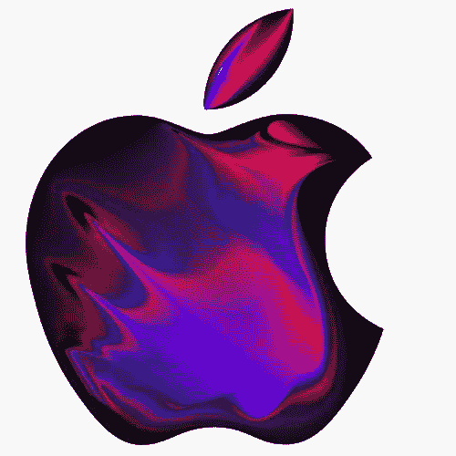
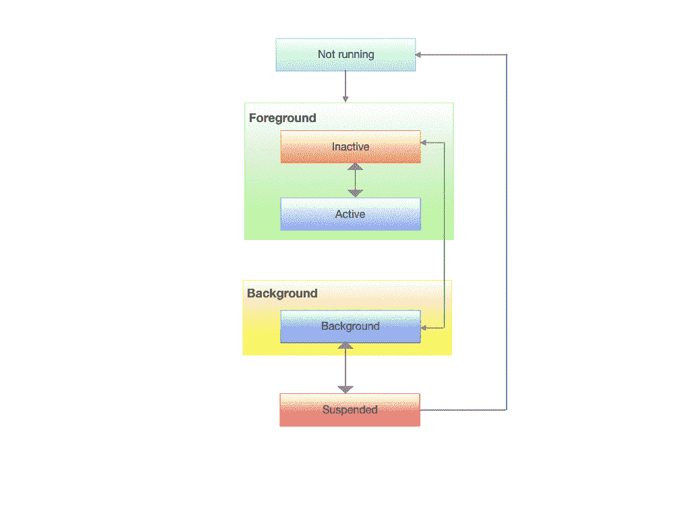
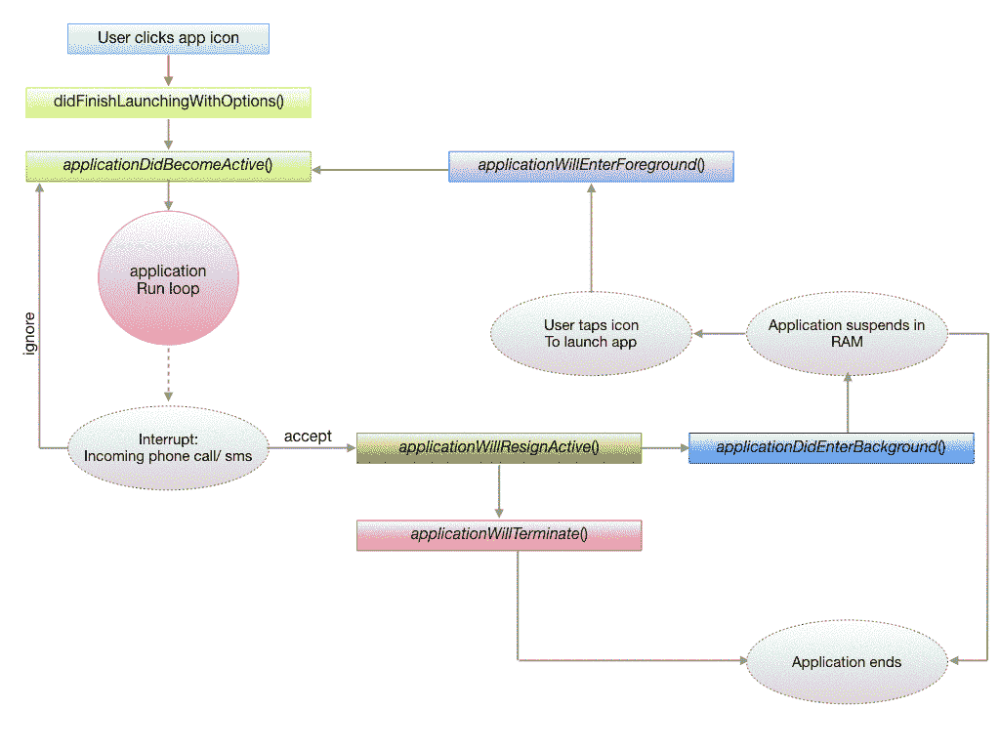

# iOS 应用程序生命周期

> 原文：<https://blog.devgenius.io/ios-application-life-cycle-672a7eec9d8d?source=collection_archive---------4----------------------->

iOS 旨在授权用户，让他们以直观高效的方式使用应用程序。开发 iOS 应用程序的整体理念应该是为用户提供无缝的应用体验。因此，每个开发人员都应该理解应用程序中发生的一系列事件。这一系列事件被称为 **iOS 应用生命周期**。

当应用程序第一次启动时，或者当按下后退按钮时，或者当屏幕旋转时，会发生什么情况。让我们试着概括出所有这些问题的答案。

一旦用户点击应用程序图标，跳板(操作系统中操作 iOS 主屏幕的部分)就会启动应用程序，开始执行应用程序，应用程序代理会收到通知。

现在，如果你对 JAVA 或 C 有所了解，你会知道程序中调用的第一个方法是 *Main* 。同样，在 iOS 中，我们有一个 *UIApplication* 对象，它将在内部调用 *UIApplicationMain* 。UIApplication 负责将所有的关键事件传递给它的代表。所以，可以说 *UIApplicationMain* 函数是创建应用对象的主要入口点，也是应用委托和设置事件周期的主要入口点。

在采用 *UIApplicationDelegate* 协议的 AppDelegate 类上调用了“ *@UIApplicationMain* ”。每个 iOS 应用程序都必须实现该协议，以获得关于用户事件的通知，如应用程序启动、应用程序进入后台、应用程序进入前台等。

*   **上市时间:**

1.  *应用程序:willffinishlaunchingwithoptions*—该方法在应用程序成功启动后调用。这是将被调用的 app 委托的第一个方法。如果启动成功，则执行该代码。
2.  *应用程序:difinishlaunchingwithoptions*—下一个调用。当应用程序完成启动并恢复其状态时，将调用此回调方法。此方法可用于完成接口，并为窗口提供根视图控制器。

> **如果这个回调方法返回“false”会怎么样？**

根据苹果文档，如果应用无法处理 URL 资源或继续用户活动，则返回`false`，否则，返回`true`。如果应用程序因远程通知而启动，返回值将被忽略。

> 要阅读更多关于 difinishlaunchingwithoptions*、*、的信息，请点击此处。

*   **过渡到前台:**

1.  *应用程序将进入前景:*当应用程序从后台状态转换到活动状态时，即当应用程序重新启动时，调用该方法。当应用首次启动时，即调用*applicationDidFinishLaunch*时，此方法不会被调用，但仅当它来自后台时，即*applicationdidbeactive*时，此方法才会被调用。
2.  *applicationdidbecomeaction:*这个方法在*applicationwilletenter foreground*之后被调用。就是让你的 app 知道它从非活动状态变成了活动状态。您应该使用此方法来重新启动任何暂停的任务。

应用程序的执行状态

*   **过渡到后台:**

*applicationDidEnterBackground:*当您的应用程序在变为非活动状态后进入后台时，会调用此方法。你有大约 5 秒钟的时间来运行任何需要备份的任务，以防应用程序稍后或之后立即终止。

*   **转换到非活动状态:**

*applicationWillResignActive*:当您的应用程序即将从活动状态进入非活动状态时，会调用此方法。考虑一下来电的情况，或者用户点击 home 键退出应用程序的情况。任何正在进行的任务都可以用这种方法暂停。

*   **终止:**

*application will termin ate:*当您的应用程序即将终止时，会调用这个方法。任何呼叫最终清理都可以在这里执行。有些情况下可能不会调用此方法，例如设备重新启动时。因此，开发人员不应该为了保存数据而等待调用此方法。

贯穿整个应用生命周期

好的读物:

*   [https://medium . com/@ Nero Xiao/IOs-app-life-cycle-EC 1b 31 CEE 9 DC](https://medium.com/@neroxiao/ios-app-life-cycle-ec1b31cee9dc)
*   [https://hacker noon . com/application-life-cycle-in-IOs-12 b 6 ba 6 af 78 b](https://hackernoon.com/application-life-cycle-in-ios-12b6ba6af78b)
*   [https://developer . apple . com/documentation/ui kit/app _ and _ environment/managing _ your _ app _ s _ life _ cycle](https://developer.apple.com/documentation/uikit/app_and_environment/managing_your_app_s_life_cycle)

## 我很高兴与你分享这篇文章。如果你喜欢读这篇文章，请鼓掌👏。感谢您的时间，请务必关注我，并在下面留下您的评论👇