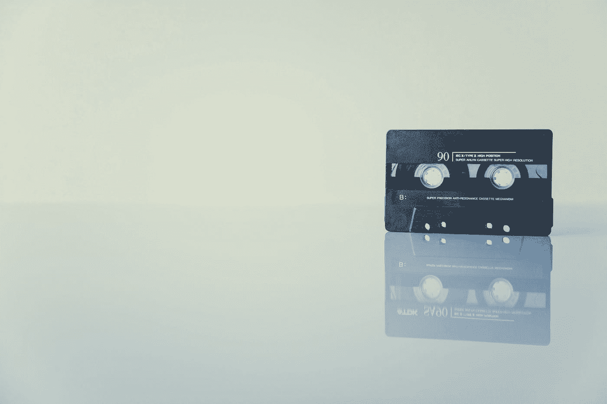
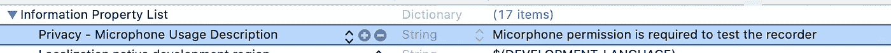
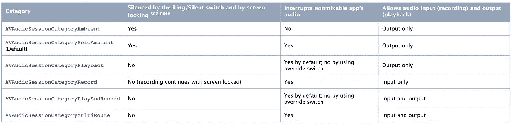
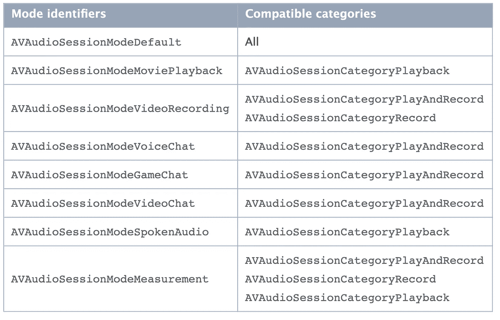

# 了解如何在 iOS AVFoundation 上播放和录制音频

> 原文：<https://blog.devgenius.io/ios-avfoundation-series-part-1-4eebaa837d9c?source=collection_archive---------1----------------------->

马库斯·斯皮斯克在 [Unsplash](https://unsplash.com?utm_source=medium&utm_medium=referral) 上拍摄的照片

**AVFoundation** 是一个多媒体框架，具有 Objective-C 和 Swift 中的 API，为基于时间的视听媒体提供高级服务，并结合了六个主要技术领域，我们将详细介绍每个领域的启动和运行，因此让我们从本文的第一个领域开始:

*   [音频播放、录制和处理](https://developer.apple.com/documentation/avfoundation/audio_playback_recording_and_processing)
*   [媒体合成和编辑](https://developer.apple.com/documentation/avfoundation/media_composition_and_editing)
*   [摄像机和媒体捕捉](https://developer.apple.com/documentation/avfoundation/cameras_and_media_capture)
*   [媒体播放和选择](https://developer.apple.com/documentation/avfoundation/media_playback_and_selection)
*   [在 Apple 平台上导入和导出视听媒体。](https://developer.apple.com/documentation/avfoundation/media_assets_and_metadata)
*   [语音合成并将文本转换成语音音频](https://developer.apple.com/documentation/avfoundation/speech_synthesis)

# 使用音频播放器播放音频

*   为想要播放的音频创建`songURL`。
*   创建`player`并持有`AVAudioPlayer`的引用，因为如果我们没有引用，播放器将被解除分配，不能播放音频。
*   需要设置`AVAudioPlayerDelegate`在音频结束时更新 UI。
*   将`numberOfLoops`设置为`.max`，以防想要无限重复播放该音频。
*   `prepareToPlay`:预加载缓冲并获取播放所需的音频硬件，这将最小化调用`play()`方法和开始声音输出之间的延迟，但调用`stop()`方法，或允许声音结束播放，会撤销此设置。

## 追踪当前播放时间

*   你可以通过创建`Timer`来追踪当前时间，它将每`0.2`秒重复重新安排自己的时间，并使用当前播放音频的`currentTime`。
*   不要忘记按住参考键`Timer`，否则将无法工作。
*   当调用`deinit`时，不要忘记使`Timer`无效，以避免崩溃。

## 改变播放速度

*   如果音频已经在播放，我们不能改变速率，除非我们用新的播放器替换旧的。
*   在设置`rate`值之前，将`enableRate`设置为真。
*   播放新创建的玩家。

## 音频结束时处理 UI

*   设置好`player`委托后，我们就可以在`audioPlayerDidFinishPlaying`中完成音频时更新 UI 了。

# 使用音频录像机录制音频

*   录制音频需要用户的许可，以阻止恶意应用程序做恶意的事情。如果获得许可，我们将更新 UI 并开始录制。
*   创建`AVAudioSession`,作为应用程序和操作系统之间的媒介。您使用音频会话向操作系统传达应用音频的一般特性，而无需详细说明特定行为或与音频硬件的必要交互。您将这些细节的管理委托给音频会话，这确保了操作系统能够最好地管理用户的音频体验。
*   在通过`setActive(true)`请求许可之前，我们需要激活音频会话。
*   当许可被授予时，我们可以开始记录并更新 UI 以显示记录已经开始。

*   我们需要在`info.plist`中设置`NSMicrophoneUsageDescription`的权限，并描述为什么你的应用会使用麦克风。

*   我们需要创建`URL`来保存录制的音频，因此我们将获得`documentDirectory` url，然后附加录制音频的名称，可以是任何名称和扩展名，如`newRecord.m4a`。
*   我们需要创建`AVAudioRecorder`，为此我们需要创建将要录制的音频的设置。
*   我们有两种类型的设置:
*   `[**AVAudioPlayer Settings**](https://developer.apple.com/documentation/avfoundation/avaudioplayer/1389359-settings)`其中包含与播放器相关的声音信息，如:
*   1- `[AVChannelLayoutKey](https://developer.apple.com/documentation/avfoundation/avchannellayoutkey)`:对应的值是一个包含`AudioChannelLayout`的`NSData`对象。**声道布局**可以用来描述你的音频是如何组织的，就像单声道只是**1**13】声道，立体声是 2 **声道**。每个单独的**通道**代表一个源，一个**通道布局**只是一个**通道**的组合
*   2- `[AVEncoderBitRateKey](https://developer.apple.com/documentation/avfoundation/avencoderbitratekey)`:标识音频比特率的整数，音频比特率是单位时间内编码的数据量，对于流媒体，视频通常以每秒兆比特(Mbps)为单位，音频通常以每秒千比特(kbps)为单位。从流的角度来看，更高的视频比特率意味着需要更多带宽的更高质量的视频。
*   3- `[AVFormatIDKey](https://developer.apple.com/documentation/avfoundation/avformatidkey)`:格式标识，可以是`[Audio Data Format Identifiers](https://developer.apple.com/documentation/coreaudiotypes/coreaudiotype_constants/1572096-audio_data_format_identifiers)`的任意值。
*   4- `[AVNumberOfChannelsKey](https://developer.apple.com/documentation/avfoundation/avnumberofchannelskey)`:用`NSNumber`整数值表示的通道数。
*   5- `[AVSampleRateKey](https://developer.apple.com/documentation/avfoundation/avsampleratekey)`:采样率，单位为赫兹，表示为一个`NSNumber`浮点值，它定义了每秒钟声音被采样的次数。从技术上讲，它是数字录音中使用的样本频率。用于音频 CD 的标准采样率为 *44.1 千赫(44，100 赫兹)*。人耳可以感知大约从 [*20 赫兹到*20 千赫兹的声音。](https://techterms.com/definition/sample_rate)
*   `[**AVAudioRecorder Settings**](https://developer.apple.com/documentation/avfoundation/avaudiorecorder/encoder_settings)`其中包含编码器的信息，该编码器将对声音进行编码，如:
*   1- `[AVEncoderAudioQualityKey](https://developer.apple.com/documentation/avfoundation/avencoderaudioqualitykey)`:来自`[AVAudioQuality](https://developer.apple.com/documentation/avfoundation/avaudioquality)`的一个常量，它是(。最小值，。低，。中等，。高，。最大)
*   2- `[AVEncoderBitRateKey](https://developer.apple.com/documentation/avfoundation/avencoderbitratekey)`:标识音频比特率的整数。
*   3- `[AVEncoderBitRatePerChannelKey](https://developer.apple.com/documentation/avfoundation/avencoderbitrateperchannelkey)`:标识每通道音频比特率的整数。
*   4- `[AVEncoderBitRateStrategyKey](https://developer.apple.com/documentation/avfoundation/avencoderbitratestrategykey)`:一个`AVAudioBitRateStrategy`常量。
*   5-`[AVEncoderBitDepthHintKey](https://developer.apple.com/documentation/avfoundation/avencoderbitdepthhintkey)`:8 到 32 之间的整数。提高数字音频质量的更有效的方法是增加位深度，它决定每个样本的振幅范围
*   在创建了 url 和设置之后，我们可以创建记录器，然后设置 delegate ( `[AVAudioRecorderDelegate](https://developer.apple.com/documentation/avfoundation/avaudiorecorderdelegate)`)，这样我们就可以在记录完成后使用它来更新 UI。
*   在开始实际录音之前，我们需要询问用户关于麦克风的许可。

## 录制完成后处理用户界面

*   将记录器设置为代表后，我们可以在`audioRecorderDidFinishRecording`函数中完成记录时更新 UI。

# 通过音频会话管理音频行为

**AVAudioSession** 充当应用程序和操作系统之间的中介。您可以使用它向操作系统传达您的应用程序音频的性质，而无需详细说明特定行为或与音频硬件的必要交互。将这些细节的管理委托给音频会话确保了用户音频体验的最佳管理。

所有 iOS、tvOS 和 watchOS 应用程序都有一个默认的音频会话，它预先配置了以下行为:

*   它支持音频播放，但不允许录音(tvOS 不支持录音)。
*   在 iOS 中，将响铃/静音开关设定为静音模式会使应用程序正在播放的任何音频静音。
*   在 iOS 中，锁定设备会使应用程序的音频静音。
*   当应用程序播放音频时，它会将任何其他背景音频静音。

*   配置音频会话的主要方法是设置其类别。与每个类别相关的精确行为不受应用程序的控制，而是由操作系统设置，因此您的最佳策略是选择最准确地描述您想要的音频行为意图的类别。
*   某些类别支持通过在进程中设置一个或多个类别选项来覆盖其默认行为。例如，当会话被激活时，与`[playback](https://developer.apple.com/documentation/avfoundation/avaudiosession/category/1616509-playback)`类别相关的默认行为会中断其他系统音频。在大多数情况下，播放应用程序需要这种行为。但是，如果您希望您的音频与其他系统音频混合，您可以通过设置会话`[AVAudioSession.CategoryOptions](https://developer.apple.com/documentation/avfoundation/avaudiosession/categoryoptions)`上的`[mixWithOthers](https://developer.apple.com/documentation/avfoundation/avaudiosession/categoryoptions/1616611-mixwithothers)`选项来覆盖此行为。

[**音频会话类别行为**](https://developer.apple.com/library/archive/documentation/Audio/Conceptual/AudioSessionProgrammingGuide/AudioSessionCategoriesandModes/AudioSessionCategoriesandModes.html#//apple_ref/doc/uid/TP40007875-CH10) **:**

[**模式及相关类别**](https://developer.apple.com/library/archive/documentation/Audio/Conceptual/AudioSessionProgrammingGuide/AudioSessionCategoriesandModes/AudioSessionCategoriesandModes.html#//apple_ref/doc/uid/TP40007875-CH10) **:**

## **温馨提示:**

*   为了让您的应用程序在响铃/静音开关设置为静音且屏幕锁定时继续播放音频，请确保`[UIBackgroundModes](https://developer.apple.com/library/archive/documentation/General/Reference/InfoPlistKeyReference/Articles/iPhoneOSKeys.html#//apple_ref/doc/plist/info/UIBackgroundModes)` `audio`键已添加到您的应用程序的`Info.plist`文件中。这项要求是对您使用正确类别的补充。
*   你可以在设置类别后随时激活音频会话，但通常最好将此呼叫推迟到你的应用开始播放音频时。推迟通话可以确保您不会过早地打断任何其他正在进行的背景音频。

希望你和我一样喜欢😃🎉如果是这样，请随意鼓掌😄并与您的朋友分享，与人分享总是令人愉快的，如果您也想查看，这里有所有源代码:

 [## deda9/AVFoundationExample

### 了解如何播放和录制音频。通过在…上创建帐户，为 deda9/AVFoundationExample 开发做出贡献

github.com](https://github.com/deda9/AVFoundationExample)