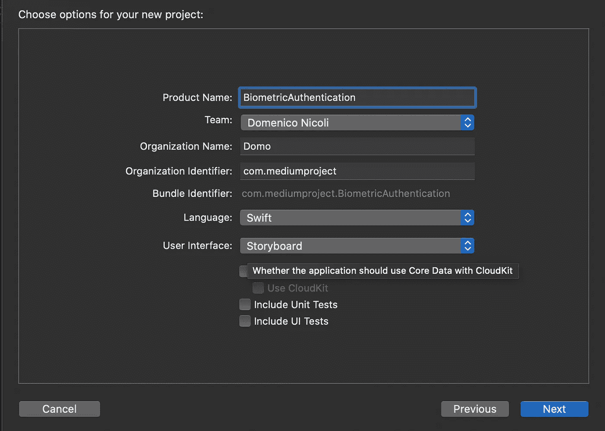
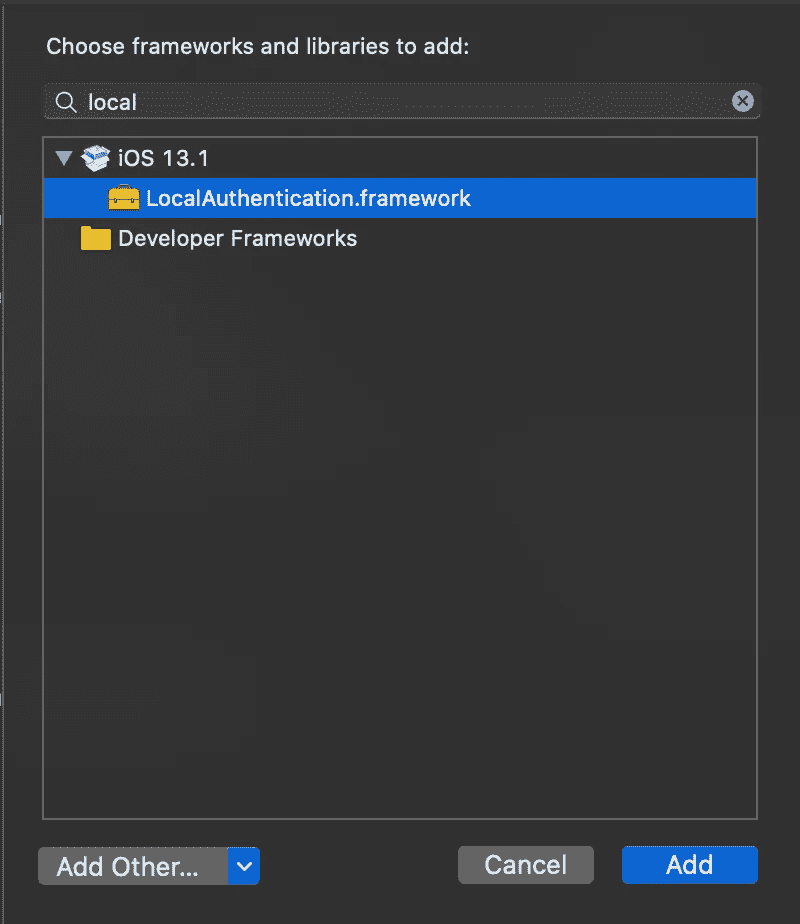
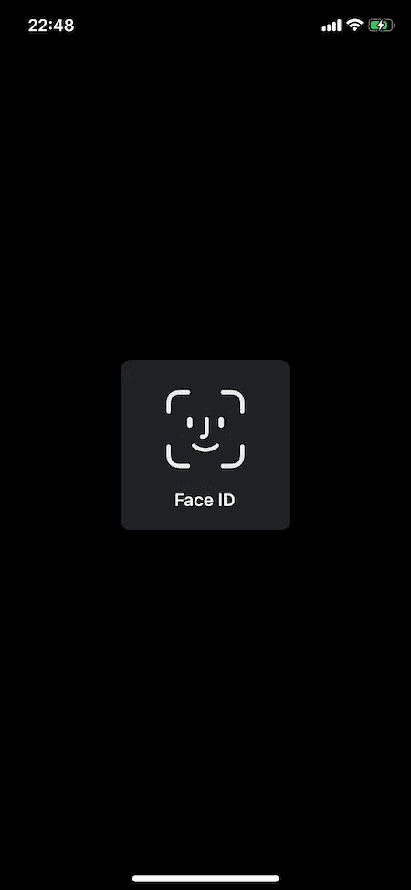
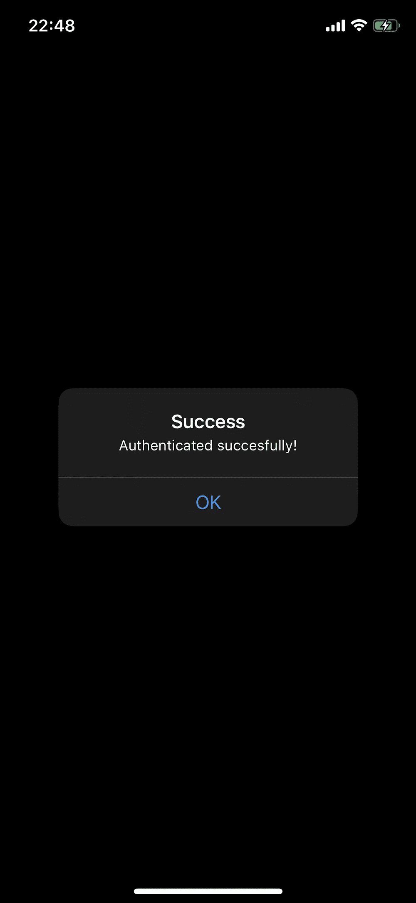
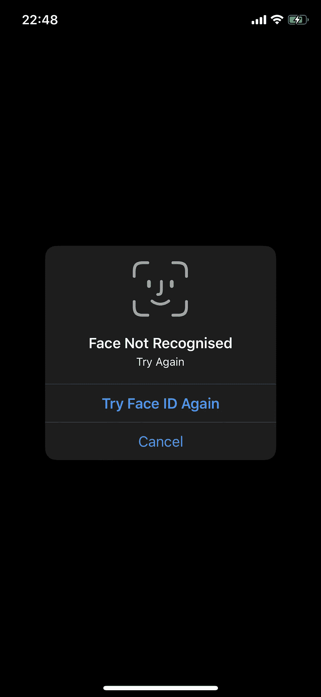
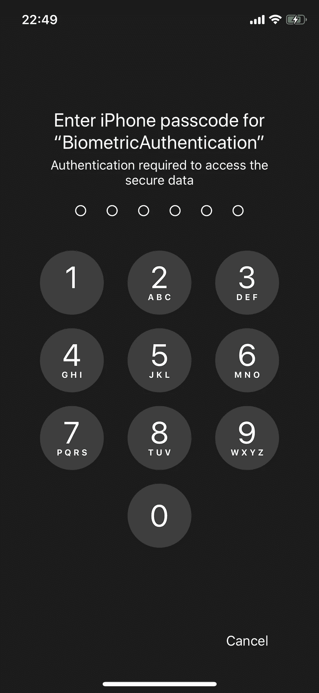

# 在 Swift 中实施 iOS 生物认证

> 原文：<https://blog.devgenius.io/ios-biometric-authentication-implementation-in-swift-fb662cc56f07?source=collection_archive---------0----------------------->

## 如何在您的应用中轻松实现生物认证


照片由[卢肯·萨贝拉诺](https://unsplash.com/@luferlex?utm_source=medium&utm_medium=referral)在 [Unsplash](https://unsplash.com?utm_source=medium&utm_medium=referral) 拍摄

# 介绍

2017 年，苹果推出了其新的顶级智能手机型号: **iPhone X** 。

与之前的机型不同，它有一个无边框的全帧屏幕(除了一个凹口)。由于这种彻底的改变，home 键也消失了，指纹安全认证也随之消失。

但是苹果没有疯。他们引入了一种复杂的新方法来保护我们的智能手机: **Face ID** 。

**Face ID** 是一个面部识别系统，它依靠三种不同的硬件传感器工作:一个点投影仪，一个泛光照明器和一个红外摄像机。将生成的地图与预先登记的人脸进行比较，如果两个人脸匹配，则用户通过了身份验证。该系统工作良好，即使戴眼镜，帽子，面部毛发和化妆。

# 入门指南

首先，打开 [Xcode](https://developer.apple.com/xcode/) 并创建一个新项目。选择*单视图应用*。



现在转到*项目设置>常规，*向下滚动到*链接框架和库*部分。点击+号，添加*local authentic ation . framework*。



# 履行

我们将从创建一个名为`authenticationWithTouchID`的新方法开始。在这里，我们使用生物特征(指纹/面部识别)或作为后备的密码来验证用户的逻辑。

为此，我们使用两种方法:

*   `canEvaluatePolicy`方法—如果设备所有者身份验证不可用，则返回 false。
*   `evaluatePolicy`方法—通过生物识别或密码向用户请求身份验证。

基本上，我们的应用程序将首先显示面部识别弹出窗口(或指纹弹出窗口，如果我们的设备不支持 Face ID)，然后在首次尝试使用密码失败后显示后退按钮。

```
func authenticationWithTouchID() {
        let localAuthenticationContext = LAContext()
        localAuthenticationContext.localizedFallbackTitle = "Please use your Passcode"

        var authorizationError: NSError?
        let reason = "Authentication required to access the secure data"

        if localAuthenticationContext.canEvaluatePolicy(.deviceOwnerAuthentication, error: &authorizationError) {

            localAuthenticationContext.evaluatePolicy(.deviceOwnerAuthentication, localizedReason: reason) { success, evaluateError in

                if success {
                    DispatchQueue.main.async() {
                        let alert = UIAlertController(title: "Success", message: "Authenticated succesfully!", preferredStyle: UIAlertController.Style.alert)
                        alert.addAction(UIAlertAction(title: "OK", style: .default, handler: nil))
                        self.present(alert, animated: true, completion: nil)
                    }

                } else {
                    // Failed to authenticate
                    guard let error = evaluateError else {
                        return
                    }
                    print(error)

                }
            }
        } else {

            guard let error = authorizationError else {
                return
            }
            print(error)
        }
    }
```

你可以在这里找到要点网址。

# 是时候测试一下了

我们已经完成了！是时候在我们的物理设备上测试了。



左侧 Face ID 弹出提示|右侧认证成功



左侧人脸未被识别|右侧密码作为备用

[](https://www.buymeacoffee.com/nicolidomenico)

**你可以在这里** 找到完整的代码[](https://github.com/domeniconicoli/BiometricAuthentication)

**感谢您的阅读。如果你有任何问题或建议，请在评论中告诉我。**