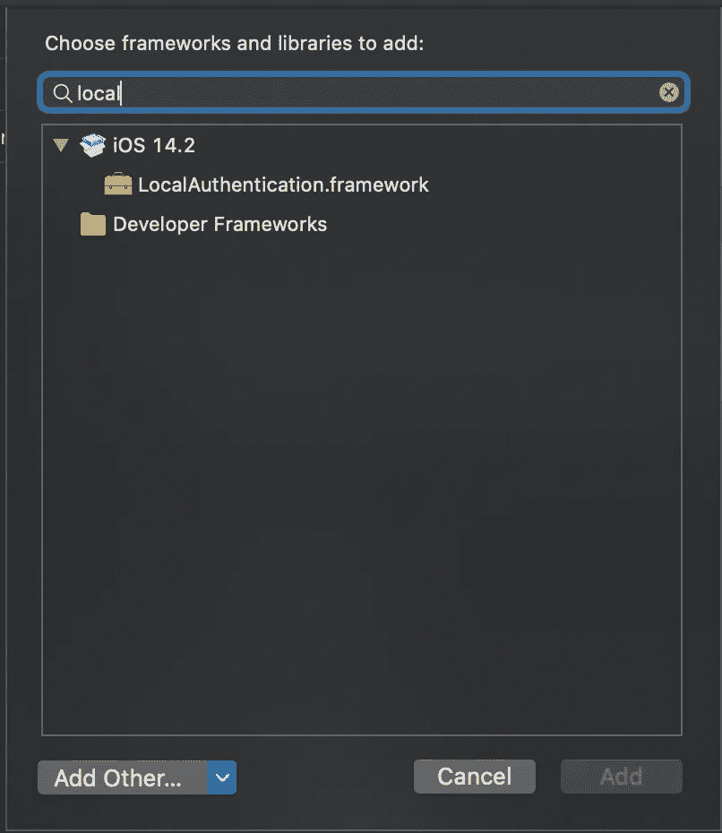

# 使用 FaceID 和 TouchID 实现 iOS 生物认证

> 原文：<https://blog.devgenius.io/ios-biometric-authentication-implementation-with-faceid-and-touchid-4155c804fea4?source=collection_archive---------3----------------------->


谷歌图片

如你所知，苹果在 iOS 7 和 iPhone 5S 中推出了生物认证系统 TouchID。

认证系统允许用户解锁设备，并在 AppStore/iTunes/others 中进行购买。

在 iOS 8 中，苹果允许开发者在应用程序中使用指纹传感器认证机制来识别用户。

在 iPhone X 生产之前，名为 TouchID 的身份验证系统一直与 iPhone home 键配合使用。然后在 2017 年 9 月 12 日，苹果推出了一款新的旗舰手机，这就是 iPhone X。

在 iPhone X 中，名为 FaceID 的认证系统取代了 TouchID。

我想这就够了。在这一点之后，我们不需要历史性的发展。

**让我们开始编码**

对于 FaceID 用法，请在应用程序的“Info.plist”文件中包含“NSFaceIDUsageDescription”关键字。没有此密钥，系统将不允许你的应用使用 Face ID。

iPhone 应用开发中的这个认证系统被称为本地认证框架。

要在您的应用程序中使用本地身份验证框架，我们需要添加 local authentication 框架。

转到项目设置>常规>链接的框架和库标题。单击+号并添加 LocalAuthentication.framework。



在视图控制器或你使用的认证系统的类中导入 LocalAuthentication 框架。

有了这个框架，我们将从“LAContext”类开始。这非常小，并且管理所有整个认证过程。

首先，创建一个身份验证上下文的实例，如下所示。

```
let localAuthenticationContext = LAContext()
```

在这个定义之后，我们将调用“canEvaluatePolicy”方法。通过这种方法，我们应该提供两种不同类型的“LAPolicy”中的一种。

苹果在他们的文件中解释了这一点:

> 该策略控制身份验证的行为方式。例如，此示例中使用的 la policy . deviceownerauthenationalization 策略指示当生物识别失败或不可用时，允许恢复到密码。或者，您可以指示不允许恢复到设备密码的 la policy . deviceownerauthenticationwith biometrics 策略。

第二个参数 localizedReason 将在对话框中通知用户。

通过“canEvaluatePolicy ”,我们将检查设备上的生物识别可用性。

```
if localAuthenticationContext.canEvaluatePolicy(.deviceOwnerAuthenticationWithBiometrics, error: &authError) {
 //call evaluatePolicy method to handle session or log in.
}
```

authError 会返回一个错误。有很多不同的错误。

在 Apple 文档中:

案例 app cancel
—app 取消认证。
案例系统取消
—系统取消认证。
案例用户取消
—用户点击认证对话框中的取消按钮。

案例认证失败
—用户未能提供有效凭证。

静态变量 biometryLockout
—生物统计学被锁定，因为尝试失败的次数太多。
static var biometryNotAvailable
—生物统计学在仪器上不可用。
静态 var biometryNotEnrolled
—用户没有注册生物识别身份。

iOS 11 之前:
case touchIDLockout
—触控 ID 因为尝试失败次数太多而被锁定。
病例触摸不可用
—触控 ID 在设备上不可用。
案例触摸未注册
—用户没有注册触控 ID 手指。

完整的身份验证代码如下:

从 [GitHub](https://github.com/batikansosun/iOSBiometricAuthentication) 下载项目。

对您的应用程序实现本地身份验证非常容易。例如，如果您想要实现登录。在首次认证之前，要求用户进行本地认证并记住我。如果用户选择了“记住我”选项，则将用户的登录凭据存储在钥匙串中。之后，在 UserDefaults 中用一个键标记这个用户。

对于所有下次登录检查“用户默认值”的关键，并开始使用生物认证。

仅此而已。

如果你喜欢这一切，请分享它，然后其他人喜欢它。

我创建的一些开源项目。

[](https://github.com/batikansosun/NetGuard) [## batikansosun/网络卫士

### NetGuard 是一个轻量级的原生 iOS 网络调试器。NetGuard 监控并捕获网络请求。NetGuard 商店…

github.com](https://github.com/batikansosun/NetGuard) [](https://github.com/batikansosun/ENVGadgetFW) [## batikansosun/ENVGadgetFW

### Compatible Plaforms iOS ENV Gadget 是一个帮助您轻松管理服务端点、服务密钥…

github.com](https://github.com/batikansosun/ENVGadgetFW)