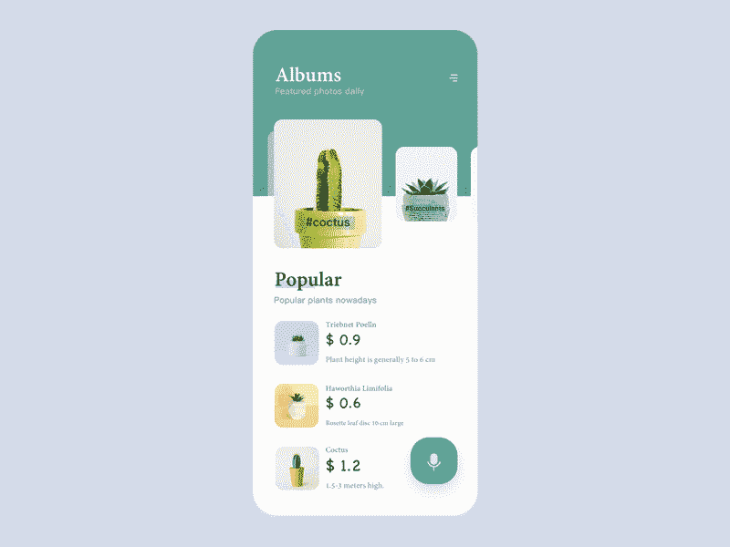
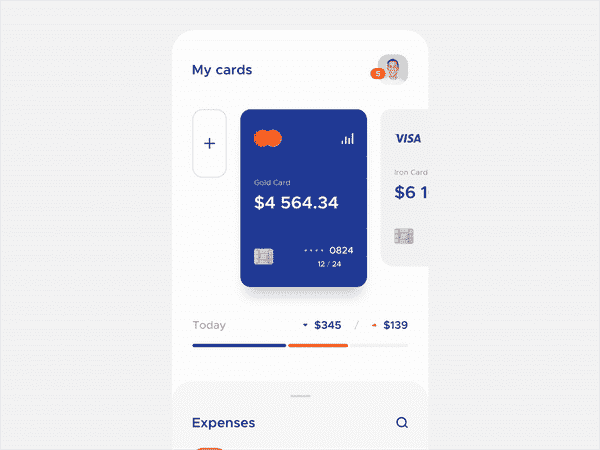
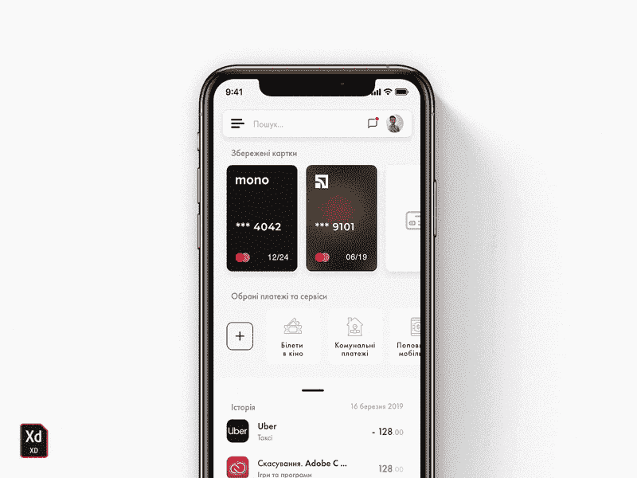
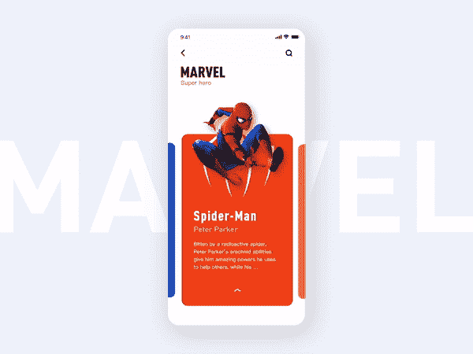
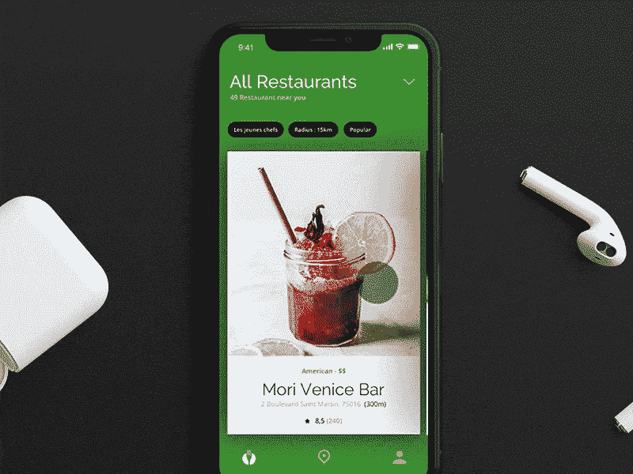
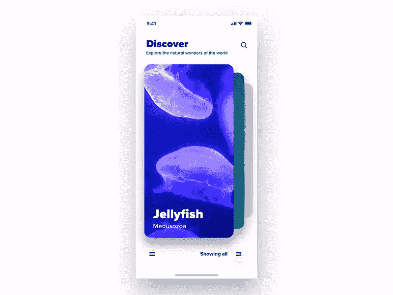
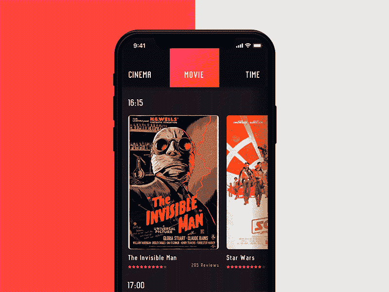

# iOS 卡片动画灵感

> 原文：<https://blog.devgenius.io/ios-card-animations-inspirations-7ad6d7d61081?source=collection_archive---------0----------------------->

感谢 [Jran](https://dribbble.com/dj3251) 的惊艳动画！

我喜欢**卡片视图**，现在苹果开始在股票应用上使用它们，许多**开发者**和**设计师**开始想办法让它更**酷**和**有吸引力**。

AppStore 是股票应用程序的一个例子，它广泛使用卡片作为视图细节。

从下面的**美丽的动画**中获得乐趣和灵感，感谢设计者，他们创造了这些动画！

卡片分页器组件由[立方体到](https://dribbble.com/cuberto)

由 [Cuberto](https://dribbble.com/cuberto) 的流体卡开源

安德鲁·拉林开发的银行应用

由 [Serhii](https://dribbble.com/Liudvichenko) 开发的金融应用程序

#探索由 [Dwinawan](https://dribbble.com/dwinawan)

电影人物 UI 由[姚](https://dribbble.com/JunliYao)

叉子由[巴特尔米·查尔维特](https://dribbble.com/BarthelemyChalvet)

视差显卡由 [Sam Atmore(奇异果 Sam)](https://dribbble.com/SamAtmoreMedia)

电影选择屏幕由[列昂尼德·阿雷斯托夫](https://dribbble.com/arestov_design)

今天就到这里吧！我希望你喜欢每一部被提议的动画，并且像往常一样让我知道你是否有任何**想法**、**问题**或**建议**！