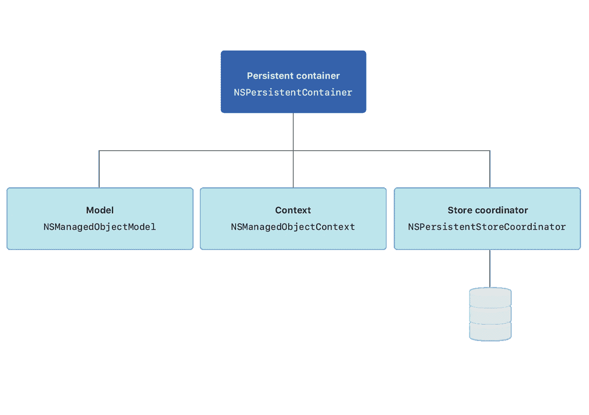
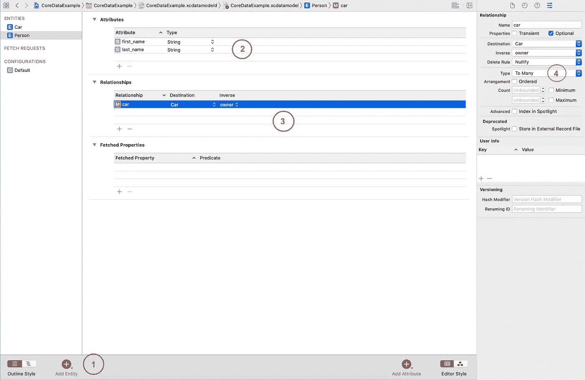

# 带有 Sugar 语法的 iOS 核心数据

> 原文：<https://blog.devgenius.io/ios-core-data-with-sugar-syntax-ef53a0e06efe?source=collection_archive---------1----------------------->

由[扬·安东宁·科拉尔](https://unsplash.com/@jankolar?utm_source=medium&utm_medium=referral)在 [Unsplash](https://unsplash.com?utm_source=medium&utm_medium=referral) 上拍摄

当我几年前开始 iOS 编程时，我混淆了核心数据和数据库，但事实上核心数据不是数据库，即使核心数据实际上由 SQLite 数据库支持，但它们都是提供可搜索和持久存储的方式。简而言之，我们可以说 SQLite 本身就是一个数据库，核心数据是一个 ORM(对象关系模型),它在数据库和 UI 之间创建了一个层。

# 什么是核心数据？

核心数据是一个框架，用于管理应用程序中的模型层对象。它为与对象生命周期和对象图管理(包括持久性)相关的常见任务提供了通用和自动化的解决方案。它通常会减少您编写的代码量的百分之 **50** 到百分之 **70** 来支持模型层，为了更好地理解核心数据及其工作原理，我们需要理解*核心数据堆栈*。

# 什么是核心数据堆栈？

*核心数据堆栈*是框架对象的集合，这些对象作为核心数据初始化的一部分被访问，并在应用程序和外部数据存储中的对象之间传递。核心数据堆栈处理与外部数据存储的所有交互，以便您的应用程序可以专注于其业务逻辑。堆栈由四个主要的*对象组成:*

**

*[https://docs-assets . developer . apple . com/published/af 070 d78c 7/73827830-1e 19-4865-8757-C4 d9 F8 CCA CFB . png](https://docs-assets.developer.apple.com/published/af070d78c7/73827830-1e19-4865-8757-c4d9f8ccacfb.png)*

*   *`[*NSPersistentContainer*](https://developer.apple.com/documentation/coredata/nspersistentcontainer)`处理核心数据栈的创建，并提供对`NSManagedObjectContext`以及许多便利方法的访问。*
*   *`[*NSManagedObjectModel*](https://developer.apple.com/documentation/coredata/nsmanagedobjectmodel)`描述核心数据堆栈将要访问的数据。在创建核心数据堆栈的过程中，堆栈创建的第一步是将`NSManagedObjectModel`加载到内存中。在初始化`NSManagedObjectModel`对象之后，构造`NSPersistentStoreCoordinator`对象。*
*   *`[*NSManagedObjectContext*](https://developer.apple.com/documentation/coredata/nsmanagedobjectcontext)`是你的应用程序交互最多的对象。可以把它想象成一个智能便笺本。当您从持久性存储中获取对象时，您将临时副本带到暂存区，在那里它们形成一个对象图。然后，您可以随意修改这些对象，如果您选择保存所做的更改，上下文将确保您的对象处于有效状态。如果是，更改将被写入持久性存储，为您创建的对象添加新记录，并为您删除的对象删除记录。*
*   *`[*NSPersistentStoreCoordinator*](https://developer.apple.com/documentation/coredata/nspersistentstorecoordinator)`位于核心数据堆栈的中间。它负责实现模型内部定义的实体的实例。它创建模型中实体的新实例，并从持久存储(`[NSPersistentStore](https://developer.apple.com/documentation/coredata/nspersistentstore)`)中检索现有实例，持久存储可以在磁盘上或内存中，这取决于应用程序的结构。*

# *1-初始化核心数据堆栈*

*   *堆栈的初始化为数据请求和数据创建准备核心数据。*
*   *从 *iOS 10* 开始，`NSPersistentContainer`处理核心数据堆栈的创建，但在 iOS 10 之前，核心数据堆栈的创建更加复杂，并且 [*您可以阅读更多*](https://developer.apple.com/library/archive/documentation/Cocoa/Conceptual/CoreData/InitializingtheCoreDataStack.html#//apple_ref/doc/uid/TP40001075-CH4-SW1) 。*
*   *下面是如何创建核心数据堆栈示例:*

# *2-创建托管对象模型*

*   *大部分核心数据的功能依赖于您创建的 ***模式*** 来描述您的应用程序的实体、它们的属性以及它们之间的关系。核心数据使用一种称为*托管对象模型*的模式，即`[NSManagedObjectModel](https://developer.apple.com/documentation/coredata/nsmanagedobjectmodel)`的实例。*
*   *想象一下，我们有一个名为`Person`的实体，它有`first_name`和`last_name`并拥有一个`car`，那么`Car`将是另一个具有`name`和`owner`属性的实体。*
*   **所有者*可能有不止一辆*汽车*，那么我们将在所有者和汽车之间创建*一对多*关系。*

**

*1-点击添加实体按钮，创建**人**和**车**实体。
2-为 Person 实体创建**名字**和**姓氏**属性。
3-建立车主与汽车之间的关系。
4-使关系**一对多**。
5-对**车**实体做同样的操作。*

# *3-创建受管对象*

*   *定义了托管对象模型并初始化了应用程序中的核心数据堆栈后，就可以开始创建数据存储对象了。*
*   *我创建了一些 sugar 语法来创建实体并保存它们，您可以在文章末尾查看完整的源代码。*

# *4-保存受管对象*

*   *在创建了实体及其属性之后，我们所需要的就是调用`save`或`saveSync`来显式地保存该上下文，以便将这些更改持久化到您的持久存储中。*

# *5-获取对象*

*   *既然数据存储在核心数据持久存储中，您将使用一个`[NSFetchRequest](https://developer.apple.com/documentation/coredata/nsfetchrequest)`来访问现有的数据。*
*   *首先构建一个描述想要返回的数据的`NSFetchRequest`。*
*   *然后在`[NSManagedObjectContext](https://developer.apple.com/documentation/coredata/nsmanagedobjectcontext)`上调用`[fetch(:](https://developer.apple.com/documentation/coredata/nsmanagedobjectcontext/1506672-fetch))`并传递请求。*
*   *我已经添加了一些糖语法，使我们的生活变得简单，只需要调用`fetch`。*

# *6-从 CoreData 中删除实体*

*   *实际上，从核心数据中删除任何实体都非常简单。它只需要传递`NSFetchRequest`实例，然后我们在您的托管对象上下文上执行批量删除请求。*

# *7-在后台使用核心数据*

*   *核心数据被设计为在多线程环境中工作。*
*   *托管对象上下文在初始化时被绑定到与它们相关联的线程。*
*   *从上下文中检索的托管对象被绑定到上下文所绑定到的同一队列。*
*   *管理对象上下文有两种类型:**主队列**和**私有队列**。*
*   *下面是一个我们如何使用私有队列来支持并发性的例子*

*   *我们创建了一个新的`NSManagedObjectContext`,它被定义为私有队列，新的上下文被设置为运行应用程序的主队列上下文的子上下文，然后调用`performBlock:`来执行实际的工作，在所有的数据都被使用之后，您可以调用私有上下文上的 save，它将所有的更改移动到主队列上下文中，而不会阻塞主队列。*

# *8-性能提示*

*   *对持久性存储的每次往返都会产生开销，包括访问存储和将返回的对象合并到持久性堆栈中。如果可以将多个请求合并成一个返回所有所需对象的请求，请避免执行多个请求。*
*   *如果获取请求需要一个复合谓词，您可以通过确保最具限制性的谓词是第一个来提高获取效率，尤其是在谓词涉及文本匹配(`contains`、`endsWith`、`like`和`matches`)的情况下。*
*   *您可以设置一个获取将返回的对象数量的限制，以最小化内存中托管对象的工作集，从而提高应用程序的性能。*
*   *使用预取，预取背后的想法是对未来需求的预期。当您获取一些对象时，有时您知道不久之后您还将需要相关的对象，这些对象可能由故障表示。*
*   *避免将核心数据用作大块二进制数据(如视频、图像或音频)的存储。*
*   *通过使用后台线程和切换到主队列来更新用户界面，避免阻塞应用程序的主线程。*

## ***这里是所有完整的糖语法***

*希望你和我一样喜欢😃🎉如果是这样，请随意鼓掌，如果你喜欢更多，请随意鼓掌😃与朋友分享，与人分享总是令人愉快的，如果您也想查看，这里有所有源代码:*

* [## deda 9/coredata 示例

### 核心数据示例。在 GitHub 上创建一个帐户，为 deda9/CoreDataExample 开发做贡献。

github.com](https://github.com/deda9/CoreDataExample)*