# IOS 开发基础

> 原文：<https://blog.devgenius.io/ios-development-fundamentals-92f5bdb84752?source=collection_archive---------2----------------------->

Swift 编程中的 Xcode 和故事板介绍。

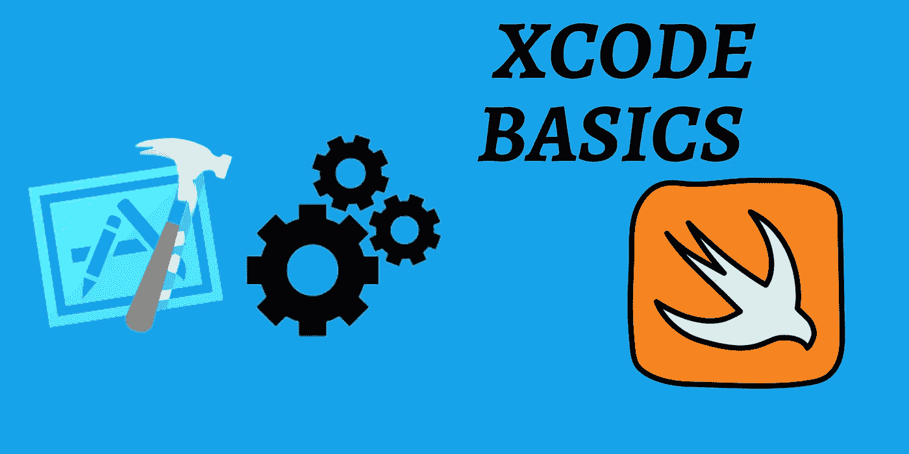

# 无论您是季节性程序员还是开发新手，理解与用 Swift 编程语言或 objective C 构建原生应用程序相对应的重要术语，对于巩固您的 Xcode 知识非常重要。

让我们来看看一些基本定义，它们将帮助我们更好地理解使用 Xcode IDE 进行 IOS 开发。

# **1。移动视图控制器**

像其他操作系统一样，IOS 开发采用了自己独立的应用程序设计方式。这个设计概念被称为模型-视图-控制器(MVC)，它允许我们与移动 IOS 设备进行交互。

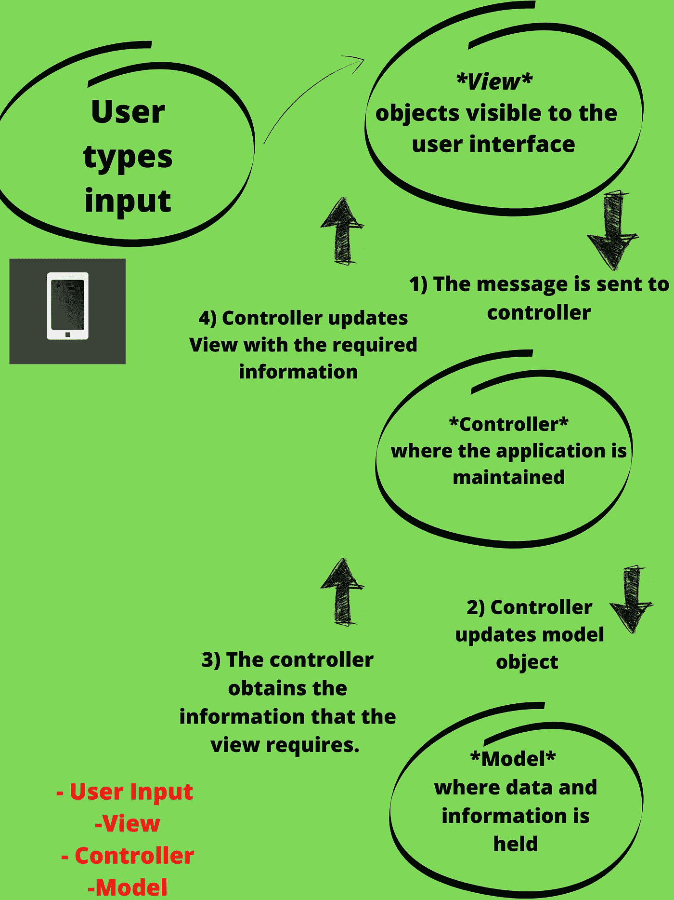

模型视图控制器模式

因此，让我们把它分解成一些知识片段，来理解什么是移动视图控制器。

特定层描述了允许开发者与数据交互并在应用程序之间传输信息的 IOS 架构。

用户界面在 IOS 功能中起着至关重要的作用。特定的层是模型层、视图层、控制器层。

**视图层:**用户通常每天都会看到这一层，可以被解释为按钮、视图控制器和应用程序中的其他交互对象。

**控制器层:**在控制器层管理应用的以下动作和管理。控制器层是必不可少的，因为下一个同步活动是在 IOS 架构的这一层中确定的。

**模型层:**我们会想到模型层，其中数据和应用程序信息保持休眠状态，直到被控制器层充分调用。模型层有意地确认除用户界面之外的所有数据，用户界面对模型层是不可见的。

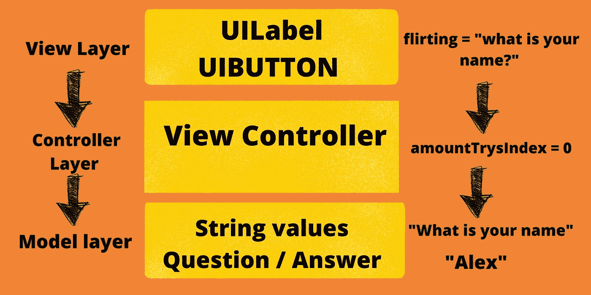

> *使用 Xcode 构建应用程序时，最好了解 IOS 架构的基础知识，以及每一层对于开发的重要性。让我们在 Xcode 中创建新项目，深入了解 Xcode IDE 的基本知识。*

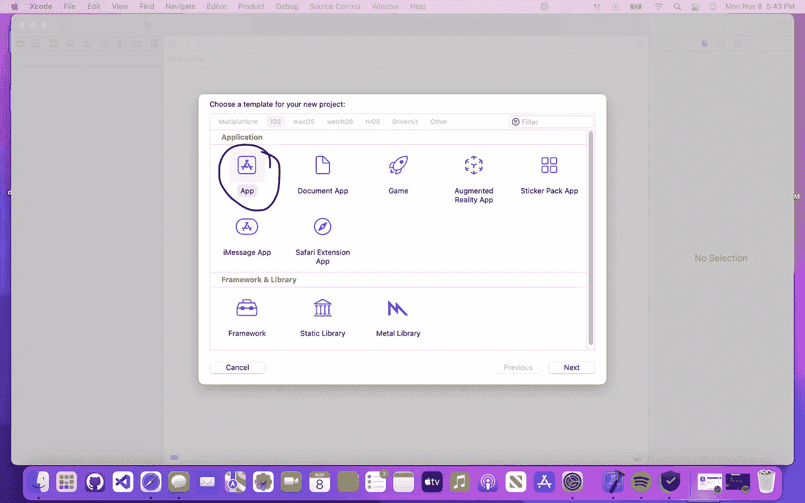

创建一个新项目，点击应用程序按钮。

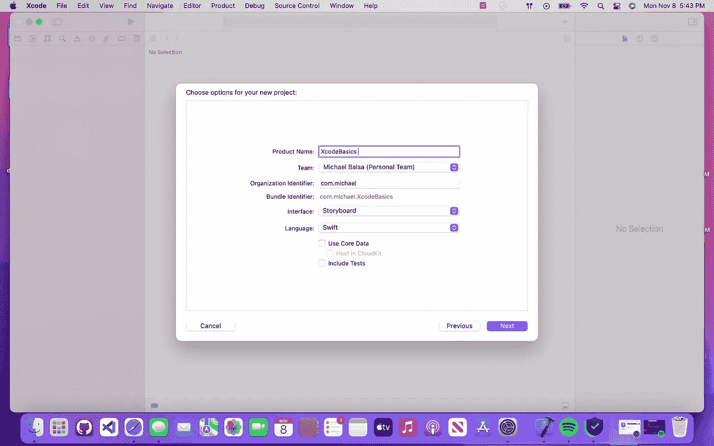

按照上面列出的名称命名您的项目，然后按下一步。

# **主要故事板**

*当开发人员开始构建他们的应用程序时，看到程序编译成功后的代码结果以及完成后对象对用户的外观是非常重要的。因此，它包括按钮、滑块、图片和标签，当与应用程序交互时，它们将呈现给用户。主要的。故事板文件向开发人员显示了应用程序在开发过程中的外观。*

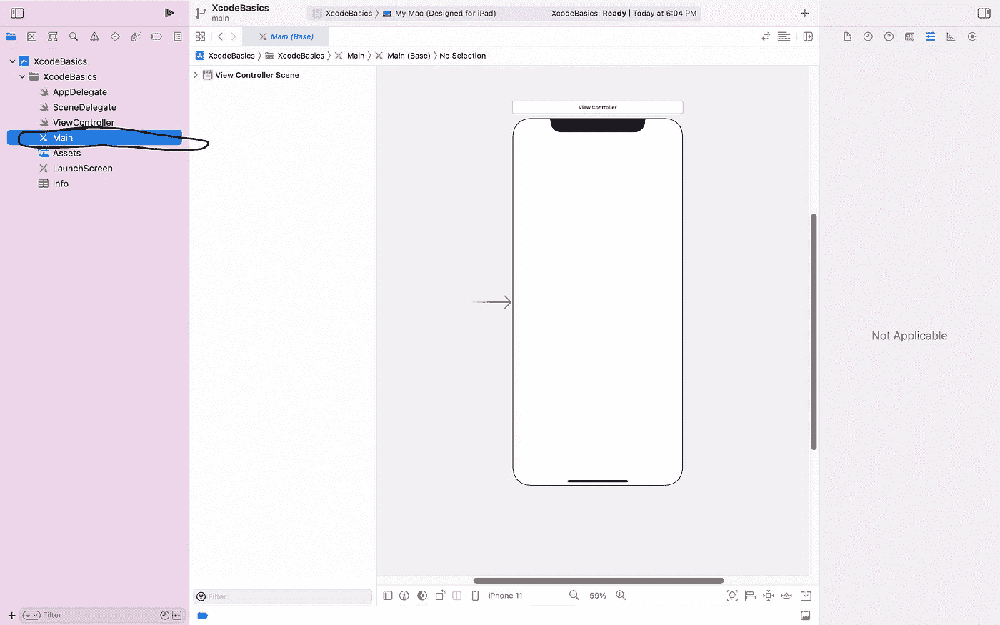

主故事板。文件

# Xcode 库

*将对象添加到 main。故事板文件，我们可以在 Main 中定位 Xcode IDE 右上角的加号。故事板文件。Xcode 允许我们从选择列表中向视图控制器添加对象、图像和颜色。按下标签对象并在视图控制器中拖动它。*

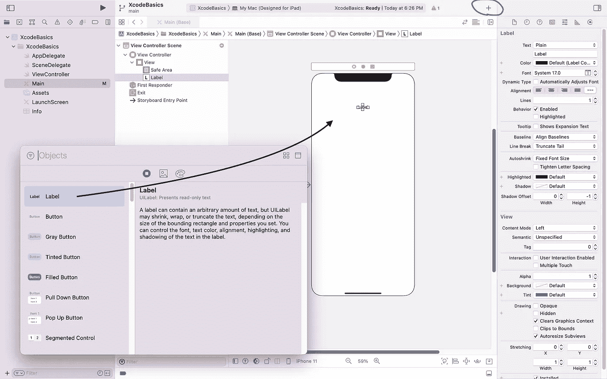

如上所示，将标签图标拖动到视图控制器中。

> *我们可以从下面的“标签”文本中更改标签的名称。*
> 
> 对于这个例子，我将标题重命名为“Hello World”在右上角，有编辑标签的列表选项。要编辑标签，请按下右上角的标签文本，更改文本“标签”，并增加字体大小以使其更加清晰可见。

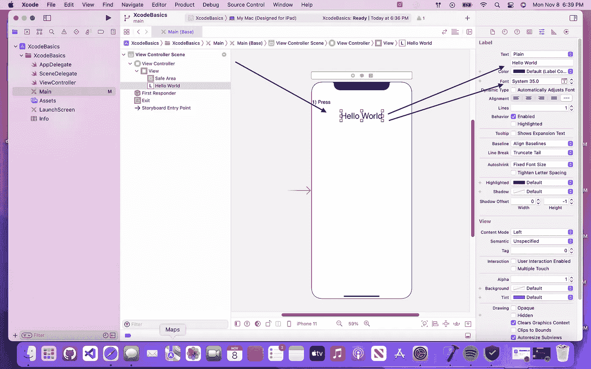

# **汽车布局**

*当开发一个应用程序并确保它在视图控制器中显示出来时，将标签与视图控制器对齐是非常重要的。自动布局工具有助于将约束和位置添加到对象在屏幕上的位置。*

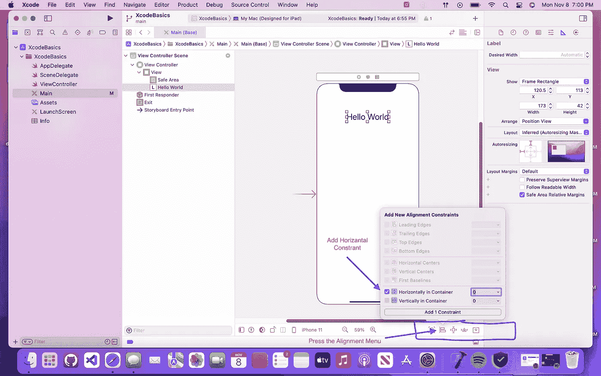

通过按下复选框并单击“添加 1 个约束”按钮，向标签添加水平约束。

> *选择约束并按下键盘上的删除按钮删除条件。对于下面的例子，我将删除规则。*

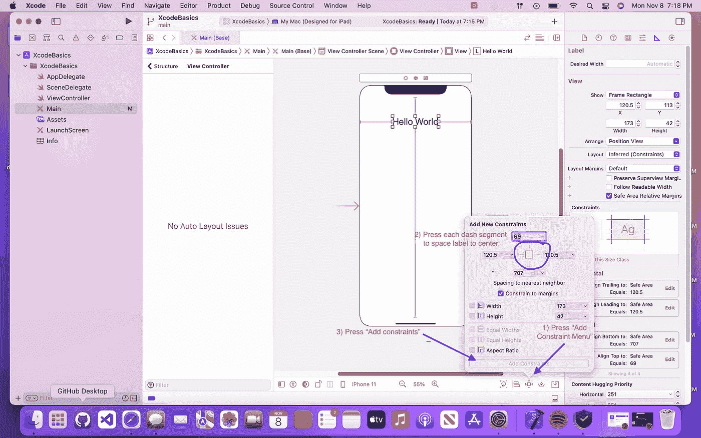

# **添加新约束**

新的约束菜单是下面列出的自动布局菜单的一部分。我们可以从隔开标签开始，通过按下菜单顶部的每个虚线段来查看控制器。我们将为标题总共添加四个约束。您会注意到在视图控制器上，标签的间距之间有蓝色的线。蓝线段是 Xcode 告诉用户约束已经适当地应用到对象的方式。

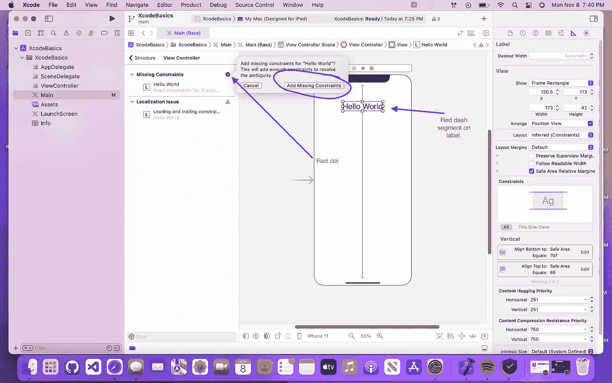

Xcode 正在检测标签上缺失的约束。

> 当对象缺少约束时，Xcode 会通过显示对象上的红色虚线段来自动通知用户。例如，在视图控制器左侧的导航器侧的顶角会有一个红点，如图所示。按下这个红点，Xcode 将允许您为对象添加缺少的约束。

# **插座&连接**

在对象和用户界面之间建立连接和动作构成了移动应用和日常性能。为了理解什么是 outlets 以及它们是如何工作的，我们必须举例说明它们在 Xcode 中是如何工作的。我们将从将焦点转移到 ViewController 文件开始。

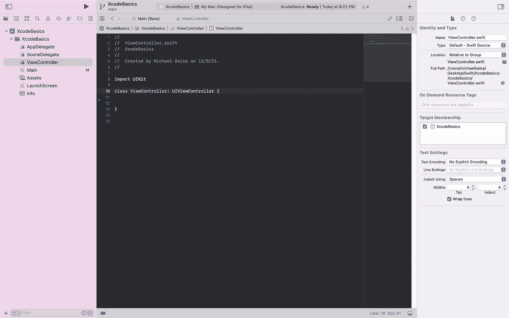

ViewController 文件将包含一个覆盖函数。继续删除代码。

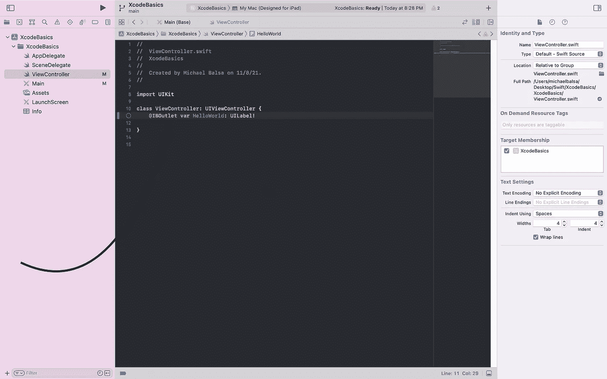

2)将以下代码添加到您的 ViewController 中。

# **IBOutlet**

IBOutlet 是 Xcode 中使用的关键字，它告诉 IDE 这个特定的行代码将在程序中的某个时候使用 Interface Builder 连接到一个对象。例如，要建立用户与应用程序中对象的交互，它们需要成为视图控制器和 Main 中对象之间的连接。故事板文件。

> *@ IBOutlet var hello world:ui label！*

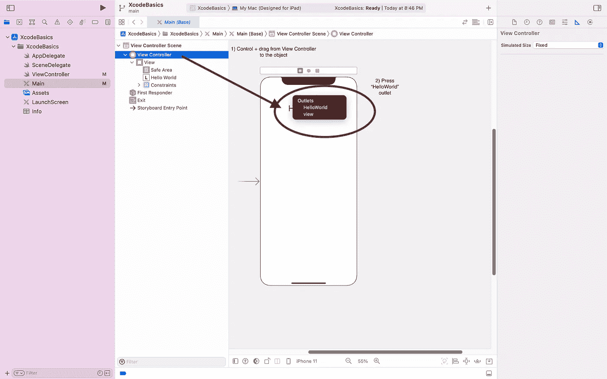

1)上面列出的是从 outlet 到 Main.storyboard 文件中的对象的初始设置。

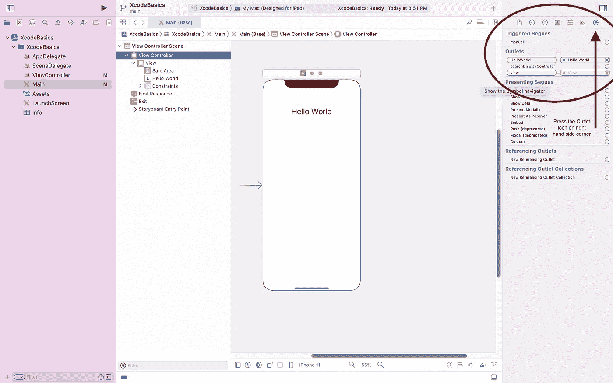

2)上面的图标将显示目标和插座之间的当前连接。

# 行动 IBOutlet

IBOutlets 还要求在用户与按钮或图标交互时发生动作或变化。当用户与图标或按钮建立交互时，将触发 action 方法。

> *@ I action func 问候语(_ sender: UIButton) {}*
> 
> *-下面的代码是 Xcode 中 action 方法的一个例子。*

# 模拟器

Xcode 为开发者提供了各种各样的 iPhone 和 IPad 模拟器。下面列出了在 Xcode 中开发 IOS 应用程序时可以使用的所有选项。

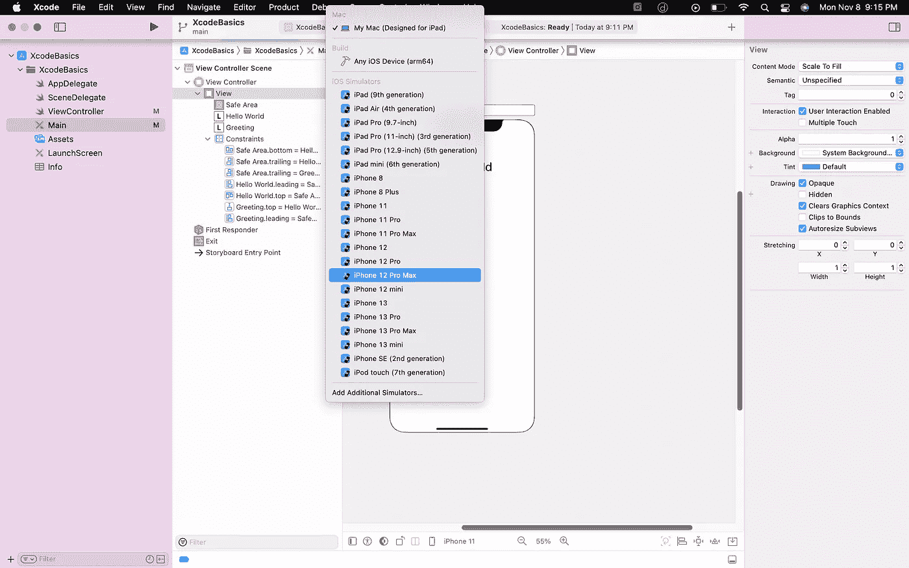

可供开发者使用的 Xcode 模拟器。

# **Xcode 文档**

Xcode 提供了优秀的文档，为开发人员详细解释了 Swift 编程语言。按下“帮助”选项卡，您将看到一个名为“开发人员文档”的选项当您按下标签时，它会将您引导至 Swift 语言文档，并浏览在 Xcode 中编程时需要理解的所有内容。

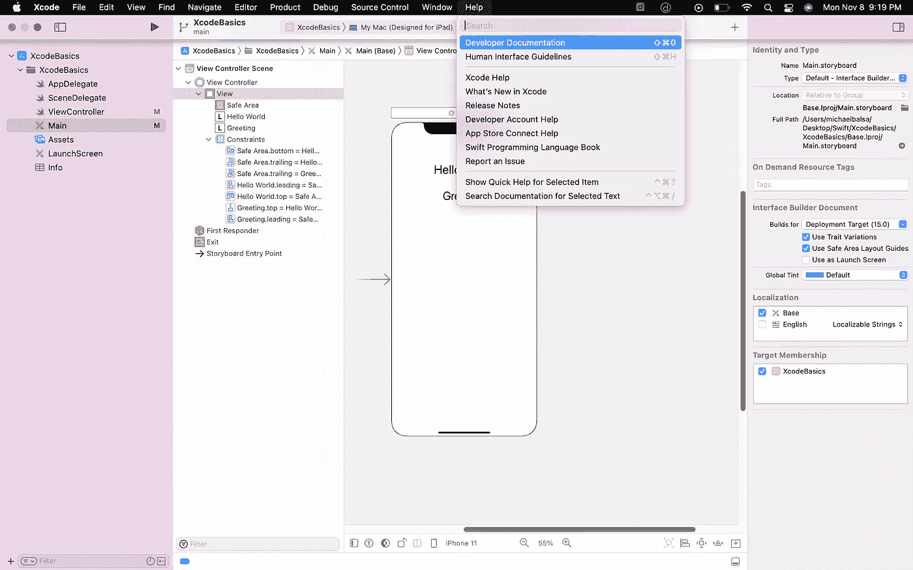

将鼠标悬停在屏幕顶部的帮助选项卡上。

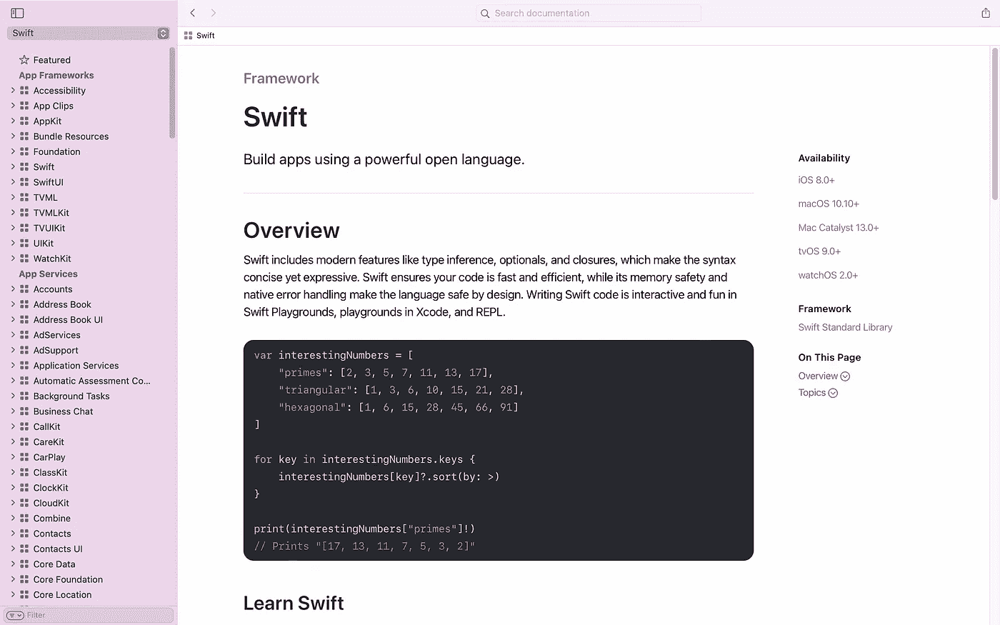

按屏幕顶部的“开发者文档”。

# 概观

在构建应用程序时，有更多的工具和基础来理解某些 Xcode 基础知识。成为开发人员时，了解如何使用 Xcode 中的特定工具是必不可少的。这只是对使用 Xcode 的基础知识的一个简单概述，所有季节性和新开发人员都必须理解，以供将来参考。