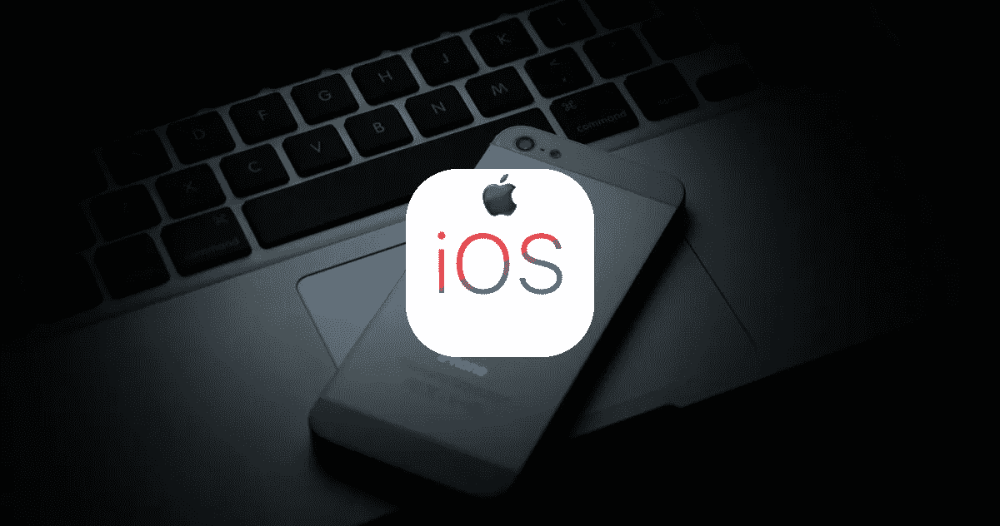
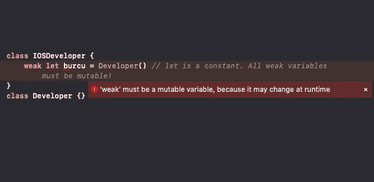
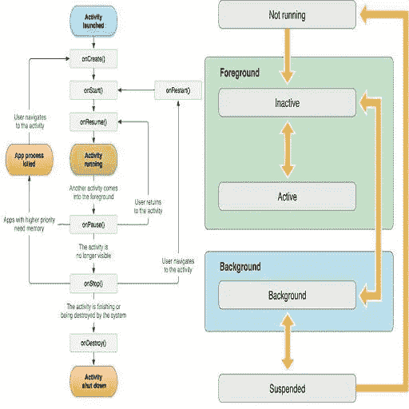
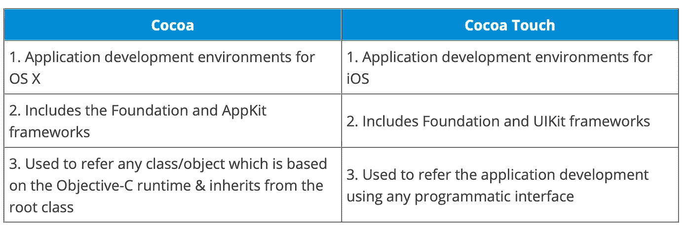

# IOS 开发:重要概念和面试问题

> 原文：<https://blog.devgenius.io/ios-development-important-concepts-ios-interview-questions-8c429d520bc2?source=collection_archive---------4----------------------->



每个 IOS 开发人员都应该了解 IOS 基础知识，以理解整体应用程序行为。下面是我做的一些笔记，帮助 IOS 开发者(当然还有我自己！)对重要概念和概念感到自如包括 ***“面试问题****。我收集并审查了针对 IOS 开发人员的 Swift 和 Objective C 概念的最佳解释:)*

# *原子和非原子性质*

*首先，原子和非原子属性在 Objective-C 中使用，在 Swift 中没有用武之地(他们说！).默认情况下，Swift 将属性定义为非原子的，但是对于 Objective-C，默认情况下它是原子的*

*被指定为**原子**的属性保证总是返回一个完全初始化的对象。这也是合成属性的默认状态。虽然指定原子属性以消除混淆的可能性是一个好的做法，但是如果我们不这样做，属性仍然是原子的。*

*这种原子属性的保证是以牺牲性能为代价的。但是，如果我们有一个属性，我们知道检索未初始化的值没有风险(例如，如果对该属性的所有访问已经通过其他方式同步)，那么将其设置为非原子可以提高性能。*

**“原子的和非原子的”是指属性的 setter/getter 是否会原子地读写属性的值。*”*

*原子属性在 getter/setter 中是线程安全的。
非原子属性返回自己的属性。它们不是线程安全的，因此会受到其他线程的影响。这对于批判性应用来说是有风险的。*

# *核心数据*

> *核心数据是一个框架，用于管理应用程序中的模型层对象。它为与对象生命周期和对象图管理(包括持久性)相关的常见任务提供了通用和自动化的解决方案。*(developer.apple.com 文档)**

*警告:核心数据不是数据库。它使用 SQLite 并存储数据，但是框架本身不是数据库。核心数据包括比数据库更多的功能，如管理对象图、跟踪数据变化等。*

# *Let 与 Var*

> *Let 是一个不可变的变量，意味着它不能被改变。
> Var 是可变变量，意思是可以改变。*

# *农业研究委员会*

*ARC(自动引用计数):负责在其引用计数为零后从内存中删除对象。*

*ARC 是 Swift 语言的跟踪内存管理系统。*

*我想我不能用一个比 Paul Hudson 更好的例子来解释 ARC:)*

> *当您从一个类中创建一个对象时，Swift 会记住该实例仅被引用一次。如果您将另一个变量指向该对象，Swift 会将引用计数增加到 2，因为两个变量指向同一个对象。如果现在销毁第一个变量(可能它在函数内部，函数结束了)，Swift 会将引用计数降回 1。所有这些都很重要，因为只要引用计数大于 1，对象就保持活动状态。但是当引用该对象的最后一个变量消失时，Swift 会将引用计数减少到零。因为没有现有变量指向该对象，所以可以释放它的内存。因此，ARC 是一种有效跟踪对象生命周期的方式，在大多数情况下，您甚至不会注意到它的发生——Swift 为您完成了所有工作。(保罗·哈德森)*

*那么 ARC 的作用是什么呢？*

> *每当 init()创建一个新的类实例时，ARC 都会分配一块内存来存储信息。关于实例类型及其值的信息存储在内存中。
> 当不再需要类实例时，它会通过 deinit()自动释放内存空间，以便进一步存储和检索类实例。
> ARC 跟踪当前引用的类实例属性、常量和变量，以便只将 deinit()应用于那些未使用的实例。
> ARC 维护对那些类实例属性、常量和变量的“强引用”,以在类实例当前正在使用时限制解除分配。(教程观点)*

# *强引用类型*

*Swift 默认使用**强**引用类型。
***强引用类型保护被引用对象不被 ARC*** 释放。在强引用中，如果引用的对象计数不为 0，它将继续被分配。*

```
***class** IOSDeveloper {
**let** burcu = Developer() *//strong reference to child.* }**class** Developer {}*
```

# *弱引用类型*

*弱引用只是一个指向对象的指针。它不保护对象，它可以被 ARC 释放！*

*强引用将对象的保留计数增加 1，而弱引用不会！*

*当对象被释放时，弱引用将指向该对象的指针清零。这确保了当您访问弱引用时，它要么是有效对象，要么为零。这里有很大的危险，所以你可以使用弱引用，在它生命周期的某个时刻，引用有可能变为零。你应该使用一个**无主的**引用，因为在自身对象存在之前**没有**任何时候引用变为零的可能性。*

***加成:**
*在 Swift 中，所有弱引用都是非恒定的* `*Optionals*` *(想想* `*var*` *vs.* `*let*` *)因为引用* ***可以*******当不再有任何东西持有对它的强引用时*** *会突变为零。* ***免得忘了:*结构和枚举不能赋给弱变量。****

****

# **内存泄漏和保留周期**

**内存泄漏是程序不再引用的已分配内存块。**

**内存空间由不可访问数据的页面填充，当发生泄漏时会导致额外的分页活动。**

**泄漏的内存最终会迫使系统为应用程序分配额外的虚拟内存页面，这种分配本来可以通过回收泄漏的内存来避免。(*developer.apple.com 文档*)**

**在[https://medium . com/@ vinodhswamy/strong-Cycle-Retain-Cycle-in-swift-f452f 07518 b 2](https://medium.com/@vinodhswamy/strong-cycle-retain-cycle-in-swift-f452f07518b2)有关于 ARC、内存泄漏和保持周期的精彩讲解**

**更多信息:[https://krakendev . io/blog/weak-and-unowned-references-in-swift](https://krakendev.io/blog/weak-and-unowned-references-in-swift)**

# **IOS 应用生命周期和应用状态**

**首先，让我们理解跳板。跳板安排应用程序图标，壁纸，应用程序，如果它们启动或不启动，IPhone 的一些设置，所以它是管理 IOS 设备上主屏幕的应用程序。使用 SpringBoard，可以组织主屏幕上的图标，更改背景壁纸，以及启动应用程序。iPhone 在启动时的一些设置也是由跳板设置的。别忘了:跳板可以在越狱时修改。**

****

**图片来源于 hackernoon**

**不同的 iOS 应用程序状态包括:**

*   ****未运行**状态:app 尚未启动或正在运行，但被系统终止。**
*   ****Inactive** 状态:当 app 在前台运行，但当前没有接收事件时。当应用程序转换到另一种状态时，它会暂时停留在这种状态。它保持不活动的唯一时间是当用户锁定屏幕或系统提示用户响应一些事件，如电话或短信。**
*   ****活动**状态:当 app 在前台运行，正在接收事件时。这是前台应用程序的正常模式。**
*   ****后台**状态:app 在后台执行代码时。大多数应用程序在被挂起的过程中都会短暂地进入这种状态。但是，请求额外执行时间的应用程序可以保持这种状态一段时间。此外，直接在后台启动的应用程序会进入这种状态，而不是非活动状态。**
*   ****挂起**状态:一个挂起的应用留在内存中，但不执行任何代码。当出现内存不足的情况时，系统可能会在没有通知的情况下清除暂停的应用程序，以便为前台应用程序腾出更多空间。**

****什么时候你会说一个应用没有处于运行状态？****

**在以下情况下，应用程序被称为处于“未运行”状态:
–当它未启动时。
–在运行过程中被系统终止。**

****什么时候一个 app 被说成是处于活跃状态？** 当一个应用程序在前台运行并接收事件时，它被认为处于活动状态。**

****app 启动时的状态转换有哪些？** 一个 app 在上线前，据说处于未运行状态。
在短暂转换非活动状态后，它在启动时会进入活动或后台状态。**

****应用程序在被暂停之前会短暂进入哪种状态？**一个应用程序在被挂起的途中短暂进入后台状态。**

# **响应应用程序上的状态转换**

**通过调用应用程序的委托对象上的相应方法，可以以适当的方式响应状态转换。**

**例如:**

*   **applicationDidBecomeActive()方法:准备作为前台应用程序运行**
*   **applicationDidEnterBackground()方法:当应用程序在后台运行时，执行一些可能随时暂停的代码**
*   **applicationWillEnterForeground()方法:当应用程序移出后台时执行一些代码**
*   **applicationWillTerminate()方法:当应用程序被终止时调用**

# **可可 vs 可可触感**

****

**[https://www . edu reka . co/blog/interview-questions/IOs-interview-questions/](https://www.edureka.co/blog/interview-questions/ios-interview-questions/)**

# **IOS 的 JSON 支持**

*   **IOS 支持 SBJson 框架。SBJson 是 Objective-C 的 Json 解析器和生成器。它提供了灵活的 API 和额外的控制，使 JSON 处理更容易。**
*   **对于 IOS 开发者来说，很容易使用 Foundation framework 的 [JSONSerialization](https://developer.apple.com/reference/foundation/nsjsonserialization) 类将 JSON 转换成 Dictionary、Array、String、Number、Bool 等 Swift 数据类型。然而，因为您不能确定应用程序接收的 JSON 的结构或值，所以正确地反序列化模型对象是一个挑战。对于干净的代码，你可以使用**编码**协议:)**

****从 JSON 中提取值:**JSON serialization 类方法 jsonObject(with:options:)返回 Any 类型的值，如果数据无法解析，则抛出错误。**

**更多信息请访问[苹果开发者](https://developer.apple.com/swift/blog/?id=37):)**

# **管理对象上下文及其功能**

**托管对象上下文(由 NSManagedObjectContext 的实例表示)是应用程序中一个临时的“便笺式存储器”，用于(大概)相关的对象集合。这些对象共同表示一个或多个持久性存储的内部一致视图。**

**单个受管对象实例存在于且仅存在于一个上下文中，但是一个对象的多个副本可以存在于不同的上下文中。**

**受管对象上下文的主要功能包括:**

*   **生命周期管理:在这里，上下文提供验证、反向关系处理和撤销/重做。**
*   **通知:它指的是上下文帖子在不同点的通知，可以在应用程序中的其他地方有选择地进行监控。**
*   **并发性:在这里，核心数据使用线程(或序列化队列)限制来保护托管对象和托管对象上下文。**

# **与 GCD 和运营的并发性**

****并发**是“同时运行多个任务”。iOS 设备上经常使用并发，因此您可以在后台运行任务(如下载或处理数据)，同时保持用户界面的响应性。**

****iOS 中实现并发的三种方式:**
线程、调度队列、操作队列**

**线程的缺点是它们将创建可伸缩解决方案的负担交给了开发人员。您必须决定创建多少个线程，并根据情况的变化动态调整这个数字。此外，应用程序承担了与创建和维护它所使用的线程相关的大部分成本。**

**因此，OS X 和 iOS 更喜欢采用异步设计方法来解决并发问题，而不是依赖线程。**

**异步启动任务的技术之一是 Grand Central**Dispatch(GCD)**，它将线程管理下放到系统级。开发人员所要做的就是定义要执行的任务，并将它们添加到适当的*调度队列*。GCD 负责创建所需的线程，并调度任务在这些线程上运行。**

**所有的**调度队列**都是先进先出(FIFO)的数据结构，所以任务总是按照它们被添加的顺序开始。**

**一个**操作队列**是一个*并发分派队列*的 Cocoa 等价物，由`[NSOperationQueue](https://developer.apple.com/library/ios/documentation/Cocoa/Reference/NSOperation_class/index.html)`类实现。与调度队列不同，操作队列不限于以 FIFO 顺序执行任务，还支持为您的任务创建复杂的执行顺序图。**

****GCD** (或 Grand Central Dispatch)和 **Operations** (以前称为 NSOperation)是你在 iOS 中用来管理并发任务的 API(与直接处理线程相对)。异步启动任务的技术之一是[中央调度(GCD)](https://developer.apple.com/library/prerelease/mac/documentation/Performance/Reference/GCD_libdispatch_Ref/index.html) ，它将线程管理下放到系统级。开发人员所要做的就是定义要执行的任务，并将它们添加到适当的*调度队列*。GCD 负责创建所需的线程，并调度任务在这些线程上运行。**

**因此，OS X 和 iOS 更喜欢采用异步设计方法来解决并发问题，而不是依赖线程。**

# **什么是自动释放池？**

**自动释放池是一种便利，它允许您将发送-释放推迟到“以后”。这种“稍后”可能发生在几个地方，但在 Cocoa GUI 应用程序中最常见的是在当前运行循环周期的末尾。**

**如果没有自动释放池，我们将无法验证弱引用最终是否会被释放。自动释放池关闭中的所有引用都应在排空时释放。这只有在不存在强引用的情况下才会发生。**

**简而言之，`autoreleasepool`在 iOS/Swift 开发中仍然有用，因为 UIKit 和 Foundation 中仍然有调用`autorelease`的遗留 Obj-C 类，但由于 ARC 的优化，在处理 Swift 类时，您可能不需要担心它。**

# **“分配”和“保留”的区别**

****Assign** 创建一个从一个对象到另一个对象的引用，而不增加源的保留计数。**

****Retain** 创建一个从一个对象到另一个对象的引用，并增加源对象的保留计数。**

**`retain`和`assign`是内存限定符的类型，但是不影响底层对象是什么。它将对象的保留计数增加 1，并获得对象的所有权。**

**`assign`是用于原语的关键字。这很容易理解:如果没有对象，就不能使用`strong`，因为 strong 告诉编译器如何处理指针。但是如果你有一个原语(例如，int，float，bool，或者类型后面没有小星号的东西)，那么你使用`assign`，这使得它可以处理原语。**

# **什么是层对象？**

**图层对象是数据对象。它们代表视觉内容。视图使用它们来呈现内容。您可以在界面中添加和实现自定义层，并将其用于复杂动画和任何其他视觉效果。**

# **AppID VS BundleID**

*   **一个应用 ID 是由两部分组成的字符串，用于标识一个开发团队中的一个或多个应用。该字符串由一个团队 ID 和一个捆绑包 ID 搜索字符串组成，带有一个句点(。)将两者分开。**
*   **团队 ID 由 Apple 提供，对于特定的开发团队是唯一的，而捆绑 ID 由开发者提供，用于匹配单个应用程序的捆绑 ID 或一组应用程序的一组捆绑 ID。**

**由于大多数用户认为应用程序 ID 是一个字符串，他们认为它可以与捆绑包 ID 互换。在会员中心创建应用 ID 后，我们只能使用与应用捆绑包的捆绑包 ID 相匹配的应用 ID 前缀。**

**捆绑包 ID 唯一定义了每个应用程序。它在 Xcode 中指定。一个 Xcode 项目可以有多个目标，因此可以输出多个应用程序。一个常见的用例:一个应用程序同时拥有 lite/free 和 pro/full 两个版本或多个品牌。**

# **iVar 和@property 是什么关系？**

**iVar 是一个实例变量。除非我们创建由@property 生成的访问器，否则不能访问它。iVar 及其对应的@property 可以有不同的名称。**

```
**@interface Box : NSObject{
    NSString *boxName;
}
@property (strong) NSString *boxDescription;//this will become another ivar
-(void)aMethod;
@end
@implementation Box
@synthesize boxDescription=boxName;//now boxDescription is accessor for name
-(void)aMethod {
    NSLog(@"name=%@", boxName);
     NSLog(@"boxDescription=%@",self.boxDescription);
    NSLog(@"boxDescription=%@",boxDescription); //throw an error
}
@end**
```

# **NSURLConnection 和属性**

**NSURLConnection 对象允许您通过提供 URL 请求对象来加载 URL 的内容。NSURLConnection 的接口很稀疏，只提供启动和取消 URL 请求的异步加载的控件。您在 URL 请求对象本身上执行大多数配置。**

***NSURLConnection 类有两种使用方式:异步和同步。***

****异步连接**将创建一个新线程，并在新线程上执行其下载过程。**

****同步连接**将在下载内容和进行通信时阻塞调用线程。**

****奖励:**很多开发者认为同步连接只阻塞主线程，这是不正确的。同步连接将总是阻塞触发它的线程。如果我们从主线程触发一个同步连接，主线程将被阻塞。然而，如果我们从主线程之外的线程中触发同步连接，它将像异步连接一样，不会阻塞我们的主线程。**

***事实上，同步连接和异步连接的唯一区别在于，在运行时，会为异步连接创建一个线程，而不会为同步连接创建线程。***

***例如，为了创建一个异步连接，我们需要:*
将我们的 URL 放在 NSString 的一个实例中
将我们的字符串转换为 NSURLRequest 的一个实例
将我们的 URL 放在 NSURLRequest 类型的 URL 请求中，或者在可变 URL 的情况下，放在 NSMutableURLRequest 的一个实例中
创建 NSURLConnection 的一个实例，并将 URL 请求传递给它**

# **可可的抽象类是什么？**

**可可不提供任何所谓的抽象。它可以创建一个只在运行时检查的类抽象，而在编译时不检查它。**

```
**@interface AbstractClass : NSObject
@end
@implementation AbstractClass
+ (id)alloc{
    if (self == [AbstractClass class]) {
        NSLog(@"Abstract Class can’t be used");
    }
    return [super alloc];
@end**
```

# **willFinishLaunchingWithOptions()和 didFinishLaunchingWithOptions()**

**这两种方法都存在于 AppDelegate.swift 文件中。它们用于在应用程序启动时向应用程序添加功能。**

**`application:willFinishLaunchingWithOptions`—这个方法是你的应用在启动时第一次执行代码的机会。**

**`application:didFinishLaunchingWithOptions`—此方法允许您在向用户显示应用程序之前执行任何最终初始化。**

# **Swift 的优势和劣势**

**重要的 Swift 特性:静态类型、协议、引用类型、值类型、可选、泛型。**

****那么静态类型呢？**
它允许协议、泛型和可选性存在，并在编码时提供帮助(带提示)。
在编译时和编译错误时显示警告。
提供运行时安全性和确定性(可选、var/let、一般或具体类型等。)**

**同时，当你构建需要更多灵活性的东西时，比如构建一个库或者一个框架，静态类型可能限制太多。在这方面，Objective-C 可能是更好的选择，因为它提供了比 Swift 更好的元编程能力。(尽管在这一点上 Objective-C 可能会过时，苹果平台的所有开发都应该在 Swift 中完成)**

**所以 Swift 是一种强类型语言，这可能是它最大的特点，同时也是它的优势和劣势。这是该语言提供的最大优势之一。(**类型安全！****

# **JSONSerialization 有哪些渲染选项？**

1.  **可变容器:数组和字典被创建为可变对象，而不是常量。**
2.  **可变叶:JSON 对象图中的叶字符串是作为变量字符串的实例创建的。**
3.  **allowFragments:解析器应该允许不是数组或字典实例的顶级对象。**

# **什么是 iOS 应用程序，你的代码适合它吗？**

**典型的 iOS 应用程序只是代码块，当然还有一个巨大的运行循环。它等待用户输入，并被外部信号中断，如电话呼叫、推送通知、home 手势/按钮按压和其他应用程序生命周期事件。唯一的区别是，它不是一个简单的主循环函数，每次用户点击你的应用程序图标时都会启动，而是具有更高的抽象级别，开发人员可以使用的 [UIApplication](https://developer.apple.com/documentation/uikit/uiapplication) 、 [AppDelegate](https://developer.apple.com/documentation/uikit/uiapplicationdelegate) 和 [SceneDelegate](https://developer.apple.com/documentation/uikit/uiscenedelegate) 。**

****好处:**您编写的实现应用程序业务逻辑的其余代码被放在“触发点”的某个地方，由主循环通过`AppDelegate`或`SceneDelegate`委托给我们的应用程序。在 iOS 13 之前，`AppDelegate`负责接收应用程序的所有外部事件并旋转 UI，但从 iOS 13 开始，所有与 UI 相关的逻辑都被转移到了 SceneDelegate。**

**就是这样。简单。你为你的应用程序编写的代码可以像方法/函数调用一样简单，也可以像 **VIPER** 架构一样复杂和伟大:)**

# **什么是 MVC？**

**MVC 代表模型视图控制器。这是一种软件设计模式，苹果公司选择它作为 iOS 应用开发的主要方法。**模型**代表应用数据；**视图**在屏幕上画东西；**控制器**管理模型和视图之间的数据流。模型和视图从不直接相互通信，而是依靠控制器来协调通信。**

****导致“海量视图控制器”问题！！所以你应该寻找更多的建筑设计原则(MVVM、MVP、VIPER、VIP、CleanSwift 等。)****

**iOS 应用程序中每个 Apple MVC 层的典型代表是:**

*   **[UIView](https://developer.apple.com/documentation/uikit/uiview) 子类(Cocoa Touch 或 custom)是视图**
*   **[UIViewControllers](https://developer.apple.com/documentation/uikit/uiviewcontroller) 及其子类是控制器**
*   **任何数据对象、 [NSManagedObject](https://developer.apple.com/documentation/coredata/nsmanagedobject) 子类和类似的都是模型**

# **单身族呢？**

**Singleton 是一个类，无论你请求多少次，它都只返回一个相同的实例。**

**单件有时被认为是一种反模式。使用单件有许多缺点。主要的是全局状态、对象生命周期和依赖注入。当你只有一个实例时，很容易直接引用和使用它，而不是把它注入到你的对象中。这会导致代码中不必要的具体实现耦合，而不是使用接口抽象。**

**“方便的”单例的另一个恶意副作用是全局状态。通常，单例支持全局状态共享，并充当每个对象用来存储状态的“公共包”的角色。当这种不受控制的状态被某人覆盖或删除时，会导致不可预测的结果、错误或崩溃。**

**如果你使用过苹果的框架，那么你很可能已经使用过单例模式。他们可能看起来很眼熟。**

```
****// Shared URL Session
let sharedURLSession = URLSession.shared****// Default File Manager
let defaultFileManager = FileManager.default****// Standard User Defaults
let standardUserDefaults = UserDefaults.standard****// Default Payment Queue
let defaultPaymentQueue = SKPaymentQueue.default()****
```

**但是单例模式有一个副作用，这通常是采用单例模式的真正原因，**全局访问**。但是对单例对象的全局访问只不过是单例模式的副作用。**

**不幸的是，许多开发人员使用 singleton 模式从项目的任何地方轻松访问 singleton 对象。默认的支付队列可以通过`default()`类方法访问。这意味着项目中的任何对象都可以访问默认的付款队列。虽然这很方便，但这种方便是有代价的。**

****如果你想了解更多关于单例模式的问题，那么你应该阅读** [**单例模式不好吗**](https://cocoacasts.com/are-singletons-bad/) **。****

# **代表和 KVO 呢？**

**两者都是在对象之间建立关系的方式。**

**[委托](https://developer.apple.com/library/archive/documentation/General/Conceptual/DevPedia-CocoaCore/Delegation.html)是一对一的关系，一个对象实现一个委托协议；另一个使用协议定义的方法向它发送消息。**

**[KVO](https://developer.apple.com/library/archive/documentation/General/Conceptual/DevPedia-CocoaCore/KVO.html) 是一个多对多的关系，其中一个对象广播一条消息，一个或多个其他对象监听这条消息并做出反应。KVO 不依赖协议。(`**NSNotification**` & `**NSNotificationCenter**`)**

**键值观察是 Swift 将代码附加到变量上的能力，因此无论变量何时改变，代码都会运行。类似于属性观察者(`**willSet**`和`**didSet**`)，除了 KVO 是用来在类型定义的之外添加观察者*。***

**KVO 在纯 Swift 代码中并不是很好，因为它依赖于 Objective-C 运行时——你需要使用从`**NSObject**`继承的`**@objc**`类，然后用`**@objc dynamic**`标记你的每个属性。**

# **坚实的原则呢？**

****固体**代表[单一责任原则](https://www.oodesign.com/single-responsibility-principle.html)、[开/闭原则](https://www.oodesign.com/open-close-principle.html)、[利斯科夫替代原则](https://www.oodesign.com/liskov-s-substitution-principle.html)、[接口分离原则](https://www.oodesign.com/interface-segregation-principle.html)、[依赖倒置原则](https://www.oodesign.com/dependency-inversion-principle.html)。这些原则相互补充、相互支持，是您可以为代码采用的最佳通用设计方法之一。让我们逐一查看。**

****单一责任原则(SRP)** 是集团最重要的原则。它规定每个模块应该只有一个责任和理由去改变。SRP 从具体的小例子开始，比如一个类和/或一个对象只有一个目的，并且只用于一件事。**

****开放/封闭原则(OCP)** 声明你的模块应该对扩展开放，但对修改关闭。这是一件听起来很容易的事情，但是当你开始思考它的含义时，你就很难理解了。实际上，这意味着在编写代码时，您应该能够通过使用接口、抽象和依赖注入来实现对象，从而通过继承、多态和组合来扩展对象的行为。**

****李斯科夫替换原则(LSP)** 声明程序中的对象应该可以用其子类型的实例替换，而不改变程序的正确性。这意味着，当你从一个类或抽象类继承或实现一个接口(协议)时，你的对象应该是可替换的和可注入的，无论你从哪个接口或类派生出子类。这一原则通常被称为契约式设计，或者最近在 **Swift 社区中被称为面向协议的编程。这个原则的主要信息是，你不应该违反你的接口从承诺到履行的契约，并且通过子类化，那些子类可以在超类以前被使用的任何地方被使用。****

****接口隔离原则(ISP)** 认为许多特定于客户端的接口比一个通用接口要好。它还指出，不应该强迫任何客户端依赖和实现它不使用的方法。这意味着，当你创建你的类实现的接口(协议)时，你应该努力并依赖抽象而不是具体，但不要等到你必须实现一堆你的新类甚至没有使用的方法时，这就成了一种浪费。**

****依赖倒置原则(DIP)** 声明，“依赖抽象，而不是具体化。”展示这一原则的最好例子是依赖注入(DI)技术。使用依赖注入技术，当您创建一个对象时，您在初始化或配置时提供并注入它的所有依赖，而不是让对象为自己创建或获取/找到它的依赖。**

# ****在 iOS 上实现存储和持久化有哪些选择？****

****内存中的数组、字典、集合和其他数据结构**非常适合于中间存储数据或者不需要持久存储的数据。**

**NSUserDefaults/Keychain 是简单的键值存储。一个是不安全的，另一个是安全的。**

****文件/磁盘存储**是一种使用 [NSFileManager](https://developer.apple.com/documentation/foundation/nsfilemanager) 向/从磁盘写入数据(序列化或非序列化)的方式。**

**核心数据和领域是简化数据库工作的框架。**

****SQLite** 是一个关系数据库，当您需要实现复杂的查询机制，而核心数据或领域无法满足您的需求时，它是一个不错的选择。**

# **iOS 上有哪些联网和 HTTP 的选项？**

**在 IOS 中有几个选项来实现 [HTTP](https://en.wikipedia.org/wiki/Hypertext_Transfer_Protocol) 联网。你可以继续使用好的旧的[nsursession](https://developer.apple.com/documentation/foundation/urlsession)，但是除非你把它抽象得足够好，否则它会让人望而生畏。另一种选择是在它周围使用一个包装库。iOS 上最流行的解决方案是 [Alamofire](https://github.com/Alamofire/Alamofire) 。**

**如今， **NSURLSession** 和 **Codable** 是 iOS 上用于联网的两种主要技术，但了解开源解决方案如 **Alamofire** 也是有益的。**

**更多信息:**

*   **[恩苏尔塞申(developer.apple.com)](https://developer.apple.com/documentation/foundation/nsurlsession)**
*   **[可编码的(developer.apple.com)](https://developer.apple.com/documentation/swift/codable)**
*   **[阿拉莫费尔(github.com)](https://github.com/Alamofire/Alamofire)**
*   **[具象状态转移(休息)](https://en.wikipedia.org/wiki/Representational_state_transfer)**

# **如何以及何时在 iOS 上序列化和映射数据？**

**在两种最常见的情况下，您需要在 ios 应用程序中序列化和映射数据:**

****在网络层接收或发送数据**(如 JSON 或 XML 或其他)**

****保存或检索存储层中的模型** (NSData，NSManagedObject)。**

**每次从后端 API 收到 JSON 或 XML 或任何其他响应类型的响应时，您很可能会得到 JSON 或二进制或其他“不方便”的格式。**

****首先:处理你收到的数据**就是把它序列化成你的应用程序能理解的东西。在最简单和最基本的层次上，这将是一个字典或一个对象数组，其中包含来自该响应的其他字典、数组和原语。NSJSONSerialization 会解决这个问题。**

**下一步是将数据映射到应用程序的域模型中。这些将是模型对象或结构，供应用程序的其余部分使用。你既可以手动完成，也可以使用苹果提供的`Codable`协议，或者使用 Mantle 或 SwiftyJSON 之类的库。数据和序列化/映射的流程是:`binary data`->-`json`->-`NSDictionary/NSArray`->-`your domain model objects`。**加油，用 Codable！****

**类似地，在存储层，您需要将数据序列化并映射到您的自定义域模型对象，以及从您的自定义域模型对象映射到您的存储理解的格式。读取数据的“映射”链:`db`->-`raw data format`->-`custom domain models`；而对于写作:`custom domain models`->-`raw data format`->-`db`。您可以在这里使用 NSManagedObject 或 NSCoding 或 Codable 协议来实现这一点。**

# **优化动态调整表或集合视图的滚动性能**

**主要难点是细胞高度计算。当用户滚动时，每个下一个单元格都需要计算其内容和高度，然后才能显示。**

**如果你做手动框架视图布局，那么它更有性能，但挑战是得到正确的高度和大小计算。如果您使用自动布局，那么挑战在于正确设置所有约束。但是，即使 AutoLayout 本身也可能需要一些时间来计算单元格高度，并且您的滚动性能会受到影响。**

**滚动性能问题的潜在解决方案可能是:
自己计算单元格高度
保留一个用内容填充的原型单元格，并用它来计算单元格高度**

> **或者，你可以采取一个完全激进的方法，这是使用不同的技术，如 ASDK(纹理)。ASDK(纹理)是专为具有动态内容大小的列表视图而设计的，并针对在后台线程中计算单元格高度进行了优化，这使得它具有超强的性能。**

# **管理依赖关系**

**您可以从 CocoaPods、Carthage 和 Swift Package Manager 中选择依赖项管理器。**

**更多信息:**

*   **[椰子恐龙(cocoapods.org)](https://cocoapods.org/)**
*   **【github.com/Carthage 迦太基**
*   **【swift.org】Swift 套餐经理[s](https://swift.org/package-manager/)**

# **调试并分析 XCode 上的代码**

**iOS 应用程序中总是有`NSLog`ing 和`print` ing。您可以使用 Xcode 设置断点。对于个别代码的性能，您可以使用 XCTest 的 measureBlock。太棒了:)请观看 wwdc 视频，了解 XCode 中[调试的详细信息。](https://developer.apple.com/videos/play/wwdc2019/412/)**

# **plist 呢？**

**特性列表或 plist 是指使用几种对象类型将数据组织成命名值和值列表的列表。这些类型为我们提供了生成有意义的结构化、可传输、可存储和可访问的数据的方法，但仍然尽可能高效。在 Mac OS X 和 iOS 上运行的应用程序经常使用属性列表。【Cocoa 和 Core Foundation 的属性列表编程接口允许我们将这些基本类型对象的分层结构组合转换成标准 XML，或者从标准 XML 转换过来。我们可以将 XML 数据保存到磁盘上，然后用它来重建原始对象。**

**我们通过 NSUserDefaults 类以编程方式访问的用户默认系统使用属性列表来存储代表用户首选项的对象。这种限制似乎将许多类型的对象排除在用户默认系统之外，例如 NSColor 和 NSFont 对象。但是，如果对象符合 NSCoding 协议，则可以将它们归档到 NSData 对象，这是与特性列表兼容的对象。**

# **重用标识符的目的是什么？将其设置为非零值有什么好处？**

**重用标识符用于将 UITableView 中的相似行组合在一起，即仅在内容上有所不同但布局相似的行。UITableView 通常会分配足够的 UITableViewCell 对象来显示表中可见的内容。**

****好处:**如果 reuseIdentifier 设置为非零值，那么当表视图滚动时，UITableView 将首先尝试重用已经分配的具有相同 reuseIdentifier 的 UITableViewCell。如果未设置 reuseIdentifier，则 UITableView 将被迫为滚动到视图中的每个新项目分配新的 UITableViewCell 对象，这可能会导致动画滞后。**

# **小问题:)**

**哪个是用于构建 iOS 应用程序用户界面的框架？
ui kit 框架用于为 iOS 开发应用程序的用户界面。它提供了专门为触摸屏界面设计的事件处理、绘图模型、窗口、视图和控件。**

****应该从哪个应用线程使用 UIKit 类？** UIKit 类只能在应用程序的主线程中使用。**

**你会使用哪种 API 来编写测试脚本来测试应用程序的 UI 元素？
UI 自动化 API 用于自动化测试程序。写入 UI 自动化 API 的 JavaScript 测试脚本模拟用户与应用程序的交互，并将日志信息返回给主机。**

****什么是 SpriteKit，什么是 SceneKit？SpriteKit 是一个用于轻松开发动画 2D 对象的框架。
SceneKit 是一个继承自 OS X 的框架，用于辅助 3D 图形渲染。预计 SpriteKit、SceneKit 和 Metal 将驱动新一代移动游戏，这些游戏将重新定义 iOS 设备强大的 GPU 所能提供的功能。****

****什么是 iBeacons？iBeacon.com 将 iBeacon 定义为苹果的技术标准，它允许移动应用程序监听来自物理世界的信号并做出相应的反应。
iBeacon 技术允许移动应用程序在微观本地范围内了解自己的位置，并根据位置向用户提供超上下文内容。
底层通信技术是蓝牙低能耗。****

****在 NSObject 之前，UIButton 的层次结构是什么？** UIButton 继承自 UIControl，UIControl 继承自 UIView，UIView 继承自 UIResponder，UIResponder 继承自根类 NSObject。**

**什么是 swizzling 方法？
方法重组是在运行时改变现有选择器的实现的过程。在运行时， ***可以改变*** 方法的功能，但只能在 objective-c 中实现**

****什么是未命名类别？由于@protocol 已经扩展到支持@optional 方法，一个未命名的类别已经失宠。****

**Objective-C 包含私有方法吗？**

**不，在 Object-C 编程中没有所谓的私有方法。如果方法是在。m only，那么它就变得受保护了；如果它是在。h，它是公共的。**

**如果我们真的想要一个私有方法，那么我们需要在类中添加一个本地类别/未命名类别/类扩展，并在类别中添加方法，并在 class.m 中定义它。**