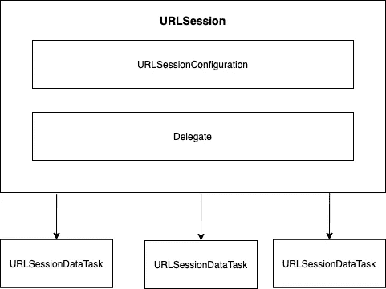

# iOS 基础:使用 URLSession 联网

> 原文：<https://blog.devgenius.io/ios-fundamental-networking-with-urlsession-db335bc9d045?source=collection_archive---------0----------------------->

URLSession 是苹果公司强大的 API，我们可以使用它在 iOS 应用程序中下载和上传数据

本·科尔德在 [Unsplash](https://unsplash.com?utm_source=medium&utm_medium=referral) 上的照片

URLSession 是一个在 iOS 中负责处理 http 和 https 请求的对象。它要求 URLSessionConfiguration 对象发送和接收对 web 服务的请求。下面是一个关于 URLSession 类的简单依赖关系图:

URLSession 有一个名为 URLSessionConfiguration 的依赖项。我们用它来配置 http 请求属性，如缓存策略、会话类型、http 头、超时等。定义会话配置时，您有三种选择:

*   。默认
    它将创建默认配置对象，这些对象使用磁盘持久化全局缓存、凭证和 cookie 存储对象。
*   。短暂的
    它是相似的。默认配置，除非会话相关数据保存在内存中。
*   。后台
    它将为下载和上传任务创建一个后台会话，它可以恢复或取消，并可以在应用程序被终止或终止后继续任务。

在上图中，您可以看到 URLSessionDataTask。它是一个抽象对象，代表现实生活中要求的实际工作。URLSession 可以创建多个任务来处理一些用例，如获取数据、下载和上传文件。有三种类型的任务:

*   URLSessionDataTask
    我们可以使用这个任务通过 GET 方法从 web 服务中检索数据。
*   URLSessionUploadTask
    我们可以使用这个任务通过 POST 或 PUT 方法将数据上传到 web 服务。
*   URLSessionDownloadTask
    我们可以使用该任务从 web 服务下载文件，并将其保存到临时本地存储。

通常，我们可以通过两种方式从 URLSession 获取请求的结果。首先，我们可以对结果使用闭包完成处理程序，不管结果是成功还是失败。其次，如果我们在定义 URLSession 对象时设置了 delegate 属性，我们可以使用 delegate。

下面是一个关于如何使用 URLSession 从 web 服务获取数据的简单示例:

下面是上面的示例代码中发生的情况:

1.  在 ExampleNetworkService 类中，它有两个属性，即 URLSession 和 URLSessionDataTask 实例。在初始化器中，我们将会话配置定义为一个参数。有了这个实现，当我们使用 ExampleNetworkService 类时，我们可以注入任何我们想要的会话配置。
2.  我们有一个叫做请求的功能。它接受一些参数，如 url、查询、http 方法和使用结果类型的完成处理程序。在函数内部，它基本上验证 url，设置查询，并创建 url 请求对象。
3.  在定义了 url 请求对象之后，我们可以从 url 会话执行网络请求，并将其传递给我们之前定义的数据任务。最后，我们要求数据任务恢复，因为基本上数据任务在第一次的状态是终止的。

这很简单，对吗？您可以简单地通过 url 请求设置 http 方法，我们已经准备好了。然后我们来配置如何使用 URLSessionDownloadTask 从 iTunes API 下载一些音乐。首先，我们创建了一个新的类型来表示音乐对象。

音乐类型有一些属性，如艺术家、名称和预览 URL。index 属性是一个助手属性，我们可以在以后处理表视图时使用它。另一个属性是 isDownloaded，它的默认值是 false，这表示音乐是否已经下载。

接下来，我们创建表示下载对象的新类型。这对我们以后管理下载状态有很大帮助。

Download 类有一些帮助属性，如 is Download，这表示音乐是否正在下载。如果您需要在 UI 中显示下载进度，progress 属性也是 helper 属性。当您暂停下载并希望恢复下载时，会使用恢复数据，我们可以稍后从 URLSession 对象处理它。然后下载类有一个名为 downloadTask 的属性，它是 URLSessionDownloadTask 的实例，一个我们可以用来从 web 服务下载文件的特定任务。

下一步是创建包含 URLSession 的下载服务对象。

在 ExampleDownloadService 类中，它有一个名为 activeDownloads dictionary 的属性。我们可以用它来跟踪当前是否有活跃的下载。接下来，我们定义下载会话，它是 URLSession 的一个实例。在初始化器中，我们有两个参数，即会话配置和 URLSessionDelegate。有了这个实现，我们可以根据自己的需要注入会话配置，这次我们需要实现 URLSessionDelegate，以便稍后处理下载任务的完成。

现在我们的下载服务已经准备好了，我们可以继续在服务内部执行下载任务。在服务内部，我们有四个用例，分别是开始、取消、暂停和恢复下载。

当你想开始下载或取消下载时，这是非常简单的。您可以通过调用`resume()`启动下载任务，也可以通过调用`cancel()`功能取消下载任务。

但是当你想暂停下载的时候就有点不同了。这意味着你想在以后继续下载，对吗？幸运的是，这很容易做到。您可以调用另一个取消功能，这一次当您想要取消下载时，您还需要简历数据。恢复数据包含继续下载所需的所有信息。将简历数据保存在下载对象中。

如果您想继续下载，您可以从下载对象中提取简历数据。如果存在，那么您可以启动下载会话，并将简历数据传递给所提供的参数。否则，就从头开始下载。

好吧，这是相当长的解释。接下来，为了处理下载任务，我们需要实现 URLSessionDelegate 方法。

URLSessionDelegate 中已经提供了您需要的一切。下载是否完成，或者您是否需要配置下载进度，或者甚至当您使用后台会话配置定义后台传输时。

## 挑战

首先，祝贺你一直关注这篇文章。正如你所看到的，这篇文章只是解释了关于 URLSession 的详细概念，缺乏实际的实现:】。你的任务如果你接受它，创建一个简单的 iOS 应用程序来实现你所有的关于 URLSession 的知识。您可以玩另一个任务，如上传任务，或者您可以尝试设置会话配置，如超时，缓存策略等。感谢你一直支持我写一篇关于 iOS 开发的文章。如果您有任何反馈或建议，请告诉我。谢谢你，在目前的疫情局势中保持安全:】。