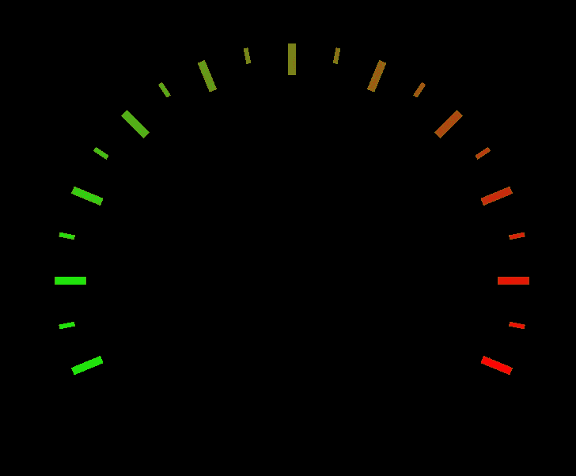

# iOS:如何使用 SwiftUI 创建仪表视图/速度表？

> 原文：<https://blog.devgenius.io/ios-how-create-gaugeview-speedometer-using-swiftui-ae46778e042f?source=collection_archive---------6----------------------->

## XCode 11.5 iOS 13

## **创建分笔成交点:**

*   我们将创建 2x 分笔成交点，交替使用长短表示法。
*   对于主题，我们将使用绿色到红色的混合颜色

**约束**

*   我们画的拱门应该从中心到顶部向北。
*   刻度应该等距。

**输出:**

## 给记号标上数字

*   给每个粗体的勾号标上数字。
*   旋转文本两次，使文本看起来不会翻转。

**输出:**

## 添加针

*   添加具有从中心到刻度的路径的形状。
*   值改变时更新角度

**输出:**

## 组合所有/演示: