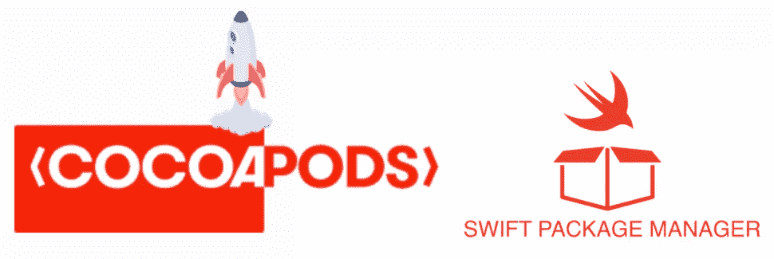
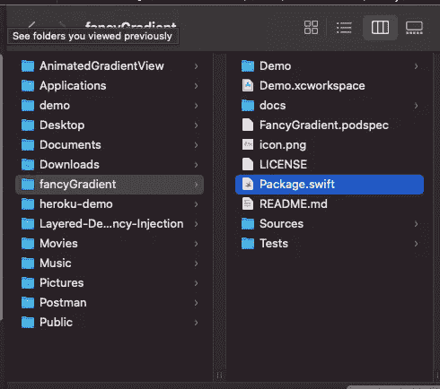
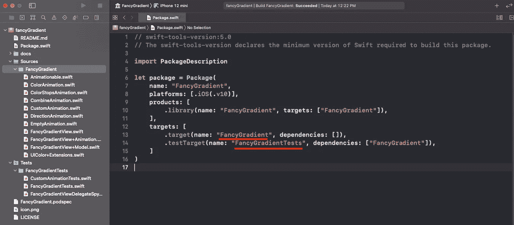
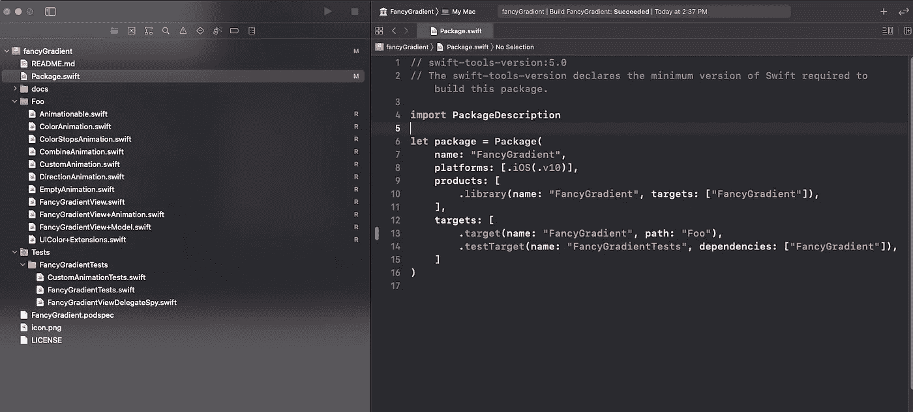
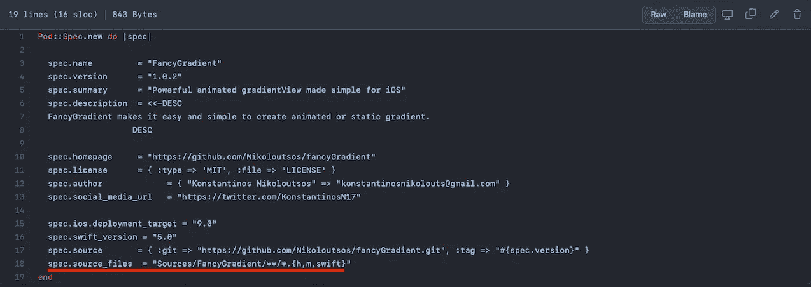
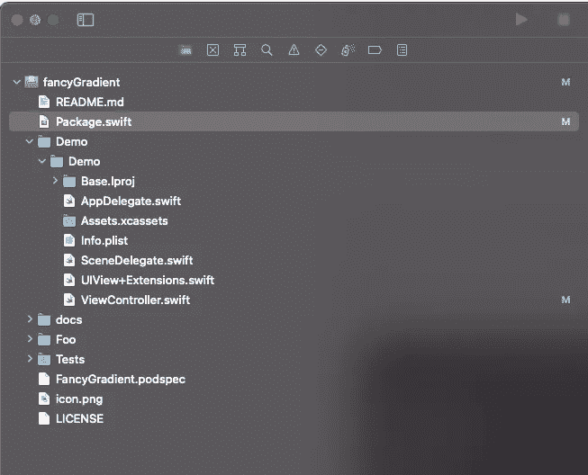
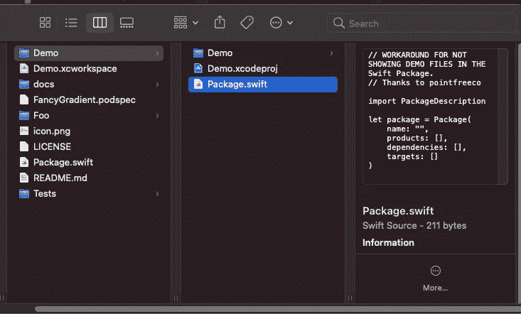
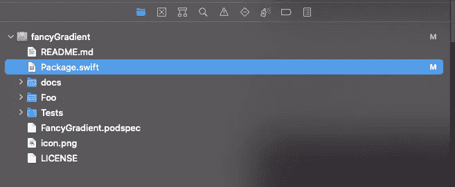

# iOS 库支持 Cocoapods 和 Swift 包管理器

> 原文：<https://blog.devgenius.io/ios-library-support-both-cocoapods-and-swift-package-manager-983c81b35080?source=collection_archive---------3----------------------->

Cocoapods 和 SwiftPM 是一些最受欢迎的包管理器。通过在你的开源库中支持这两者，你潜在地增加了使用它的开发者。

🚨记住，所有包管理者想要知道的最重要的事情是**源文件**在哪里，以便分发它们。每个包管理器都有自己的配置方式。

因此，让我们直接跳到一些实际的例子，以便了解如何支持这两者。为此，我们将以我最近构建的名为 FancyGradient 的开源库为例。

 [## GitHub-Nikoloutsos/fancy gradient:swift 中强大的动画 gradientView🌈

### FancyGradient 是一个 UIView 子类，可以让你在你的 iOS 应用中制作渐变动画。它纯粹是用 Swift 写的…

github.com](https://github.com/Nikoloutsos/fancyGradient) 

**Swift 软件包管理器🔥**

配置发生在名为`Package.swift` (又名清单)的文件上。
这是我们需要编辑的文件，以便让 SPM 知道要包含哪些文件。

> 注意:每个 SPM 库必须包含一个名为 **Package.swift** 的清单文件

文件夹中的 EPackage.swift

默认情况下，SPM 预计开发人员会将:

*   他的源代码放入→ `Sources >> {{target Name}}`文件夹📁
*   他的测试(XCTests) → `Sources >> {{testTarget Name}`文件夹📁

红色下划线显示了**目标**和**测试目标**的名称。

> 注意:如果我把文件夹名`Sources >> FancyGradient`改成别的名字，库将无法编译。当然，因为 SPM 不知道如何找到文件🚨

但是如果您想要不同的结构或不同的文件夹名称呢？不要担心 SPM 的开发者会支持你💪

为了改变 SPM 的默认行为，您需要篡改`Package.swift`清单。

我们把默认目录改成了 Foo

`path`target 中的参数使您能够更改 SPM 尝试查找文件的路径。(在这种情况下是源代码)。👀

所以现在我们知道了 SPM 如何定位我们的文件，以便与其他开发人员共享这个库。✅

> 注意:在将这个推送到 github 之后，记得添加一个标签版本的库，然后推它。这样当有人使用你的库时，他就会知道他拥有的版本或者决定得到什么版本。

FancyGradient 的版本

**椰子🔥**

Cocoapods 有一个名为`{{LibraryName}}.podspec`的配置文件

FancyGradient.podspec

红色下划线的行让 Cocoapods 知道在哪里搜索源代码。我们当然可以像在 SPM 清单中那样更改文件夹结构的名称。

> 注: `Sources/FancyGradient/**/*.{h,m,swift}` 将包括所有。装运库中的 h .m .swift 文件。

**椰子+ SPM🚀**

所以现在我们已经知道了每个包管理器配置是如何工作的，我们可以同时支持它们。✅

如果您已经支持 Cocoapods 但不支持 SPM，您可以遵循以下步骤。👇

1.  创建新的空 SPM 包
2.  (可选)重命名文件夹结构(正如我们在上面看到的)
3.  将源代码文件从当前库复制到`sources >> {{Library Name }}.`中，对测试做同样的操作(如果你只是创建库，不要复制任何东西😄)
4.  在目前的结构下，添加可可豆荚(如果你已经有了，不用担心)
5.  改变可可豆荚源文件。podspec 文件(让它知道搜索源代码的路径)
6.  向 Github 添加并推送库的新标签版本。
7.  发布 Cocoapods(您将使用命令行)并将所有内容推送到 GitHub

现在你的图书馆同时支持 cocoa pods 和 SPM。

> 注意:如果你忘记或对如何做有任何疑问，只需打开另一个支持两个包管理器的 github 库，看看它是如何做的。你不必重新发明轮子👀

## 给那些来❤️的人额外的小贴士

对于那些即将结束的人，这里有一个从 **pointfreeco** 学到的有用技巧。假设你想在你的库中添加一个演示项目，你会得到这个。

演示文件夹在中不好看

您可以通过在演示⭐️中手动创建一个空文件`Package.swift`来删除包中的演示文件夹

在演示中添加空 Package.swift

SPM 忽略了演示。

同样，如果你不想要 docs 文件夹，只需在里面添加一个空清单，然后砰的一声🎉。

## 额外资源:

 [## iOS 版 Swift 软件包管理器

### 了解如何使用 Swift 包管理器(SwiftPM)创建、更新和加载本地和远程 Swift 包…

www.raywenderlich.com](https://www.raywenderlich.com/7242045-swift-package-manager-for-ios)  [## 创建自己的 CocoaPods 库

medium.com](https://medium.com/@jeantimex/create-your-own-cocoapods-library-da589d5cd270) 

如果你喜欢你学到了不要忘记留下一个👏