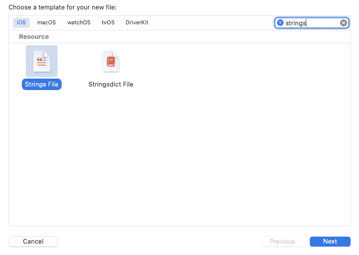
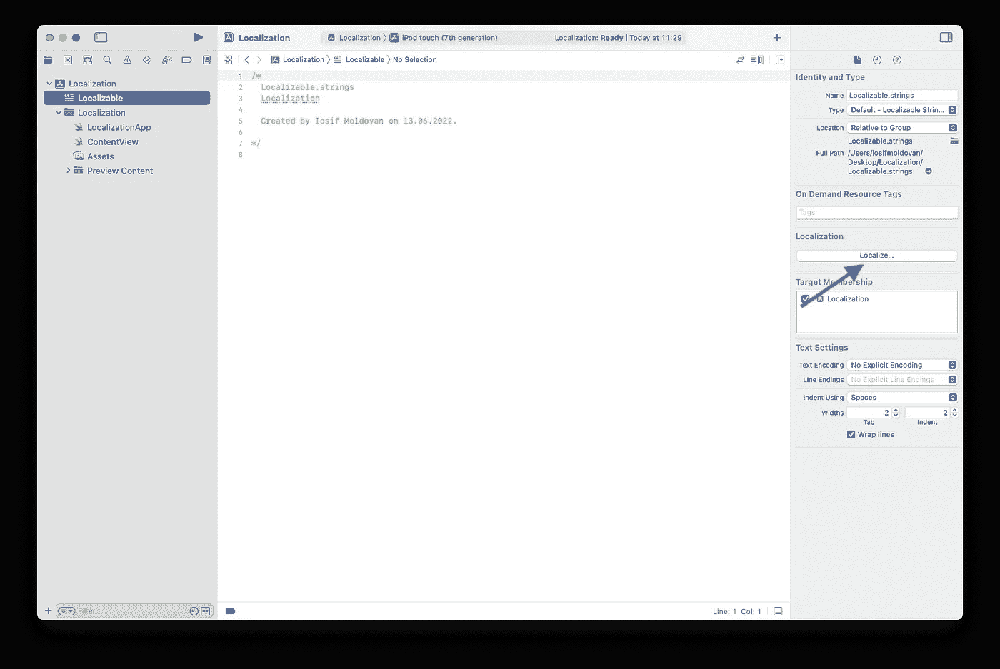
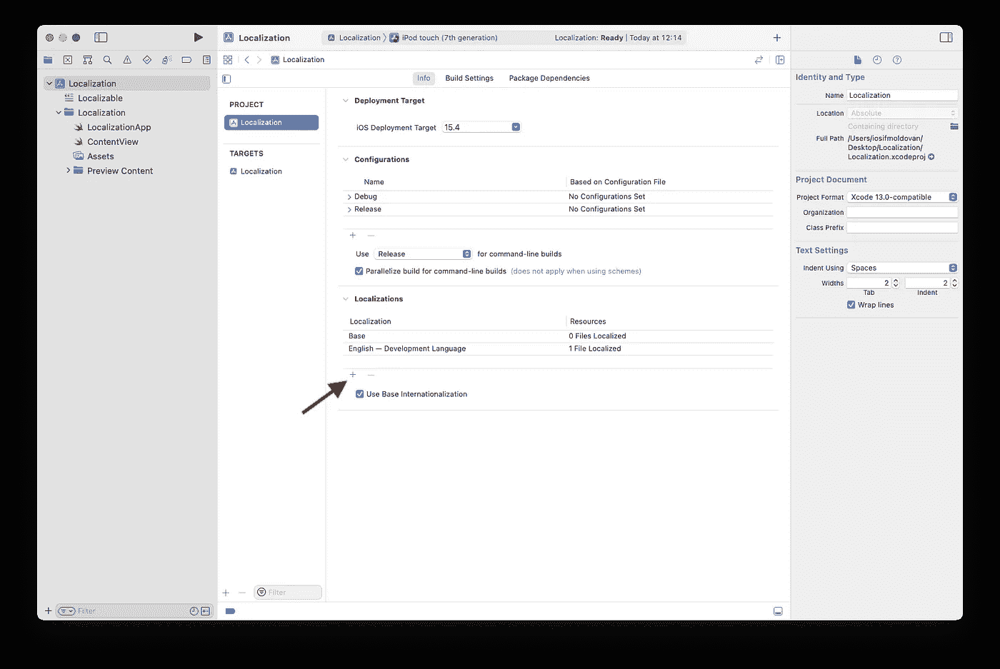
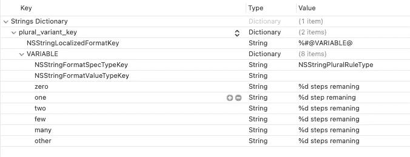

# 从零到英雄的 iOS 本地化

> 原文：<https://blog.devgenius.io/ios-localization-from-zero-to-hero-2c50e30a1af3?source=collection_archive---------9----------------------->

照片由 [Z](https://unsplash.com/@dead____artist?utm_source=unsplash&utm_medium=referral&utm_content=creditCopyText) 在 [Unsplash](https://unsplash.com/s/photos/localization?utm_source=unsplash&utm_medium=referral&utm_content=creditCopyText) 上拍摄

这篇文章讲的是 iOS 本地化的深度。对于初学者和有经验的开发者来说都是如此，他们正在寻找如何去做或者如何改进他们的过程。

# 简单步骤:如何本地化您的应用程序

如果你想本地化你的应用程序，你可以休耕下一步。首先向您的项目添加一个新的`strings`文件， **CMD+N** 并从文件创建模板中选择`Strings File`，然后点击**下一个**按钮。

下一步是选择您新创建的本地化文件，然后从右边的面板点击本地化按钮。该操作执行本地化过程，在您的项目上创建`lproj`目录，并将可本地化的文件移动到相应的 lproj 文件夹。

为了本地化您的应用程序，这些是您必须执行的步骤。如果您想在本地化过程中添加更多语言，您必须在 Xcode navigator(左侧面板)中选择您的项目，然后选择您的工作区，(而不是您的目标)，然后在`Info`选项卡中，您可以通过按下`+`按钮来添加更多语言。

此时，您已经完成了所有的配置设置，您的应用程序可以支持您定义的任意多种语言。请注意，如果您查看磁盘上的文件夹结构，您会看到每种语言都有自己的扩展名为`.lproj`的目录。这就是 iOS 系统如何根据设备的语言环境知道加载哪种语言。

本地化文件是基于键-值的，其中键表示文本标识符，值表示相应的翻译文本。例如，如果您的应用程序支持两种语言，英语和西班牙语，您可以将 ***问候语*** 文本定义为休闲:

# 向前进:`Stringsdict`

到目前为止，我们涵盖了基础知识，从现在开始，我们将深入到本地化过程中。首先，我们来谈谈复数，即名词从单数形式变为复数形式的过程。不是所有的语言都以同样的方式改变名词的复数形式。例如，汉语和日语的复数形式是单一的。德语、英语、西班牙语有两种形式。另一方面，一些斯拉夫语的复数名词有 3 种或更多的形式，这个列表还在继续。

简单的推杆，如果你要显示完成一个任务的步数，你的显示文字会是这样的:`%d steps remaining`。这种硬编码文本的问题是，你不能尊重所有步骤计数可能性的语法。为了解决这个问题，你必须在你的项目中添加一个新的字符串文件类型，`Stringsdict`,它有一个 plist 格式来覆盖一种语言中所有可用的复数变体。

这样你可以提供任何你需要的复数形式的变体，对于英语你只需要`one`和`other`条目，其余的都可以删除。如果以上任何条目都不符合条件或者没有提供值，则多元化过程将总是退回到`other`条目。在代码中，您可以这样使用它:

# 寻找数字格式

如果你在应用程序中显示数字，你应该开始考虑如何将它们本地化。幸运的是，iOS 系统通过提供`NSNumberFormatter`来帮助我们，它允许在数字上应用许多格式，包括本地化。例如，如果你想拼出数字，你可以这样做:

更令人感兴趣的是基于区域设置的数字的可视化显示，事情是一样的，你只需要改变`numberStyle`:

如果你需要更多的数字转换，你可以查看文档，有很多方法可以依赖这个 api。

# 日期本地化

日期是需要本地化的重要部分，因为世界各地的人们对日期的看法不同。处理日期的黄金法则是在应用程序业务逻辑中以时间戳或 UTC 格式保存它们，并在要在 UI 中显示它们时应用必要的格式和本地化。这里我们有`NSDateFormatter`来帮助我们在应用程序中本地化日期，它提供了一些非常方便的样式来显示您的日期:

如果预定义的 iOS 样式不符合您的应用程序要求，您可以使用日期模板来匹配您预期的日期格式，以下是一个示例:

# 我们到达底部了吗:内容本地化

到目前为止，我们从技术角度看待本地化，这需要开发技能来实现。现在我想谈谈内容本地化，这是指向用户提供本地化的内容。这一点需要大量的研究，也需要与当地人接触，以了解当地的文化和法律。这里有一个很大的错误，那就是假设在一个地方运行良好的东西在其他地方也会运行良好。另外，当你计划去一个不同的国家时，市场营销很可能需要重新考虑他们的策略。这里没有什么技术上的东西需要解释，你需要大量的研究和与当地人接触来获得一个很好的本地化接触。

我希望你喜欢这个故事，并发现它内容丰富，易于阅读。玩得开心，回头见。