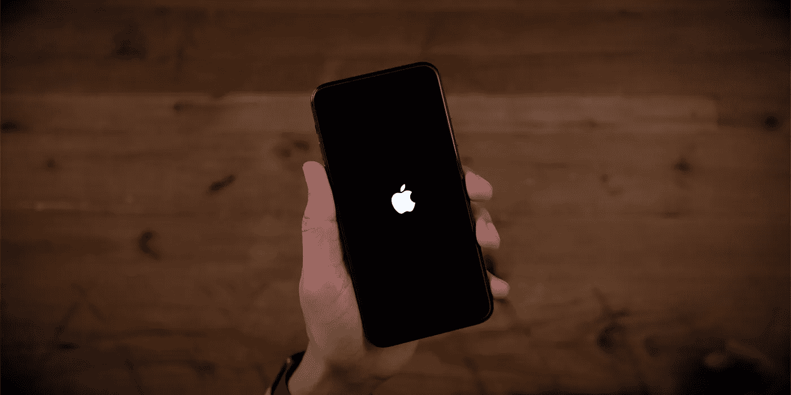

# 从 Android 用户的角度看 iOS

> 原文：<https://blog.devgenius.io/ios-perspective-from-an-android-user-a3bd768c42a8?source=collection_archive---------35----------------------->

一直在考虑 iOS，但没有采取行动，现在你不必这样做了，这里是我的宝贵见解，它将帮助你清除所有这些陈词滥调的疑虑。

问一个安卓用户使用 iOS，他可能会伸出手指给你看，但究竟是什么让安卓大军无法消化。所以为了给你更多的个人见解，我换了一部 iPhone，在生态系统呆了 2 年。

事实是:它很舒适，一切都像它应该的那样顺利，就在彩虹的尽头，你意识到一些缺点，这些缺点可能会给你们中的一些人带来麻烦，但不是所有人。看，来自 android 大军的我们总是关注规格表和 RAM，以及最新的 Android 能做什么新的噱头。“谷歌的手势简直太酷了！”。我想说的是，我们的钱花得物有所值；所有最新功能，100 倍变焦(那是超人吗？)，x 光视觉(嗨！一加)和诸如此类的东西，所以对苹果公司抱有同样的期望是很正常的。

嗯，是的，但实际上不是。

## **欢迎来到最精致的时代**

iOS 是一件艺术品，你不能想做什么就做什么。你必须放弃一些特权，开始改变你使用智能手机的方式。(是时候停止非法下载那些歌曲，在后台听 YouTube 了)。因此，当你启动你的 iPhone 时，你会看到最可爱的助手 Siri。嗯，那要看情况，有时她会表现得好像没有在听，但话说回来，发展这种关系取决于你。说到关系，iOS 有一个非常简单的用户友好体验，几十年来都没有改变。iOS 基本上触及了所有的基础，你不会感觉到在你最喜欢的 4 个应用程序或者 16 个应用程序之间切换的任何滞后。有趣的事实:iOS 建议让你最常用的应用程序在后台打开，因为这样它就不必额外增加电池电量来再次启动它；和安卓完全相反。说到苹果，他们有自己的音乐应用程序，Apple Music 拥有超过 6000 万首歌曲，是最好的音乐应用程序之一，但价格不菲。就像 Apple Music 一样，还有许多其他预装的应用程序，是 iOS 系统中最好的应用程序之一，例如播客、股票、GarageBand、Keynote 等。

## **向电池冠军问好**

当你有 15%的电池，你的手机告诉你可以持续 30-45 分钟，但几分钟后它显示 10%，这很糟糕。嗯，这是我注意到的 Android 生活中的一个正常斗争，但它很快被快速充电、Dash 充电等等掩盖了。我能在 20 分钟内自愈并不意味着我喜欢每隔 1 小时就被爆头！这说不通。幸运的是，说到 iOS，我可以把我的钱押在一部 iPhone 的电池备份上。有一次，我在健身房锻炼结束时，手机电量只有 5%,当我回到 5 公里外的家时，手机电量还在 2%。当最新的 iPhone 声称比上一代多 30 分钟的备用电池时，他们实际上是认真的。他们不吹嘘电池数量，而是利用他们拥有的备用电池；高效，就是这么简单。从我 2 年的 iOS 体验来看，电池备份是最好的。

## 可扩展存储，我不这么认为

所以我买了 32 GB 的版本，我觉得对我来说足够了。(我一生中从未犯过这么大的错误)。因此，基本上 iOS 所做的是，它为系统保留一些空间，当我说一些空间时，我指的是 7 GB，一直到 25 GB，取决于您的变体。所以我经常面临这个问题，我发现自己每个月都要备份，这样我就可以释放一些存储空间来摆脱“存储空间不足”的通知，或者更新 PUBG 的最新版本。苹果公司提供的解决方案是给你云存储空间，他们再次每月收取额外费用。如果你每个月都有一些额外的现金，我不认为你会有任何问题，但如果你没有，你可能要重新考虑你的 32 至 64 GB 的变种。相信我，额外的钱是值得的。

## 捕捉瞬间而不是照片:检查

苹果在 iOS 开发和他们的相机系统上花了很多钱，这可能就是为什么去年的主题演讲几乎都是关于相机的。哎呀！但说真的，iOS 确实能拍出一些 iPhone 上最好的照片，我想我们都同意这一点，由于整个 iOS 的无缝集成，切换到相机只是点击一下就可以了，这很流畅。所以没有半秒钟加载模式或任何东西。所以在我的经历中我点击了很多图片，对不起，瞬间，我仍然永远珍惜它们。以下是其中的一些:

海边的鳄鱼

门上的烟花

老人

所以在 iOS 上的那两年是一段神奇的，有时是有限的经历，但我想这对于你获得的绝对流畅和无缝体验来说是没问题的。所以如果你想补充点什么或者有什么想法的话。请务必发表评论。

下一集见。和平。