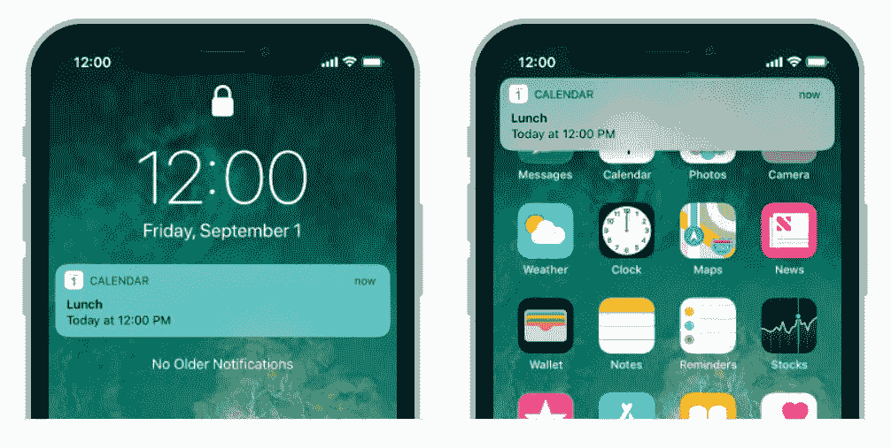
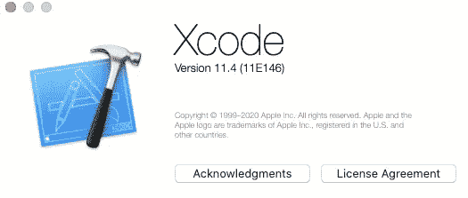
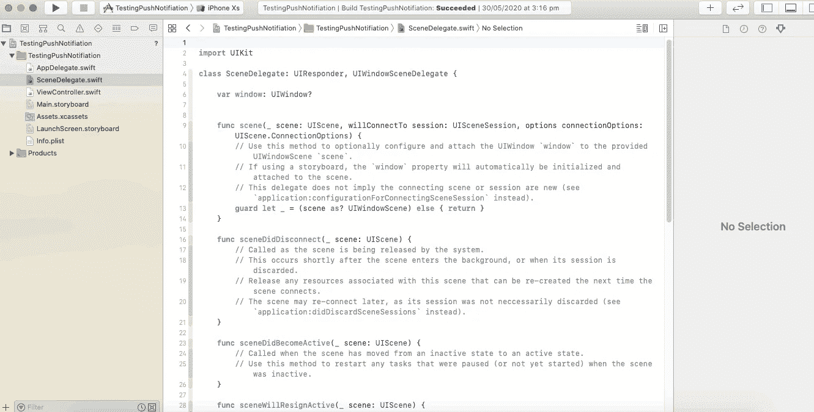
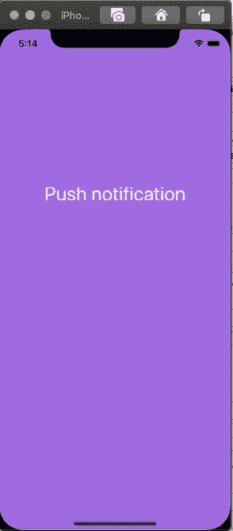
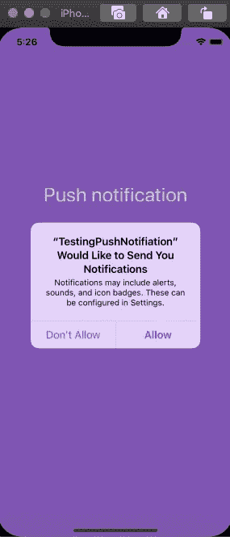
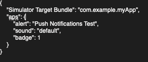
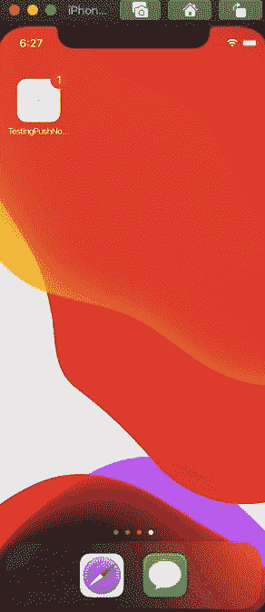

# iOS 模拟器推送通知

> 原文：<https://blog.devgenius.io/ios-simulator-push-notification-9ae0ce98d417?source=collection_archive---------9----------------------->

*有了 XCode 11.4，就可以实现了！*



苹果照片

推送通知在开发生命周期中起着至关重要的作用，从用户的角度来看也是如此。它有助于用户更长时间地使用应用程序。在 iOS 中推送通知是借助 APNS(Apple Push Notification Services)实现的。

然而，推送通知的实现过程涉及一长串步骤。而且，最痛苦的部分是，它需要一个真实的设备来测试推送通知。但是随着 XCode 11.4 的发布，你可以在模拟器上实现这一点。

*Xcode 11.4 的新特性是* [*这里列出了*](https://developer.apple.com/documentation/xcode_release_notes/xcode_11_4_release_notes) *。*

*Xcode 11.5 的新特性是这里列出的*[](https://developer.apple.com/documentation/xcode_release_notes/xcode_11_5_release_notes)**。**

> *模拟器支持模拟远程推送通知，包括后台内容获取通知。在模拟器中，将 APNs 文件拖放到目标模拟器上。该文件必须是 JSON 文件，具有有效的 Apple 推送通知服务有效负载，包括“aps”密钥。它还必须包含顶级“模拟器目标包”，其字符串值与目标应用程序的包标识符相匹配。—苹果 Xcode 11.4 发行说明*
> 
> *simctl 还支持发送模拟推送通知。如果文件包含“Simulator Target Bundle ”,则不需要 Bundle 标识符，否则您必须将其作为参数提供(8164566):*

****$ xcrun simctl 推送<设备>com . example . my-app example push . apns****

# *让我们从一些变通办法开始*

> *要求:-
> 1-Xcode 11.4+
> 2-Mac OS Catalina(10 . 15 . 4)*

*那么，现在让我们来看看如何实现 Xcode 11.4 的这个新特性。为此，你需要 Xcode 11.4 或以上版本，我有 Xcode 11.4。*

**

*Xcode 11.4*

*下一步是在 Xcode 中创建一个项目，我已经将我的项目命名为***TestingPushNotification***并选择了故事板。如果需要，您可以选择 SwiftUI。*

**

*创建了新项目*

*我在 Main.Storyboard 的“ViewController.swift”中添加了背景颜色和带有文本“Push Notification”的 UILabel，而不是在点击 compile 按钮时显示空白视图。*

*现在，当我们在模拟器中运行应用程序时，在这种情况下，iPhone Xs 看起来像下图。*

**

*让我们从代码的某个部分开始吧！移动到你的 AppDelegate.swift 文件，在上面你可以看到 *import UIKit 就在它下面导入苹果的用户通知框架。**

```
*import UserNotification*
```

*现在我们在 AppDelegate 类中需要一个函数，“askForPushNotification()”这将请求用户允许向设备发送通知。*

```
***func askForPushNotification() {
let center = UNUserNotificationCenter.current()
center.requestAuthorization(options: [.alert, .sound, .badge]) { granted, error in
// Enable or disable features 
}}***
```

*在 AppDelegate 的 didfinishlaunchingwithoption()方法中添加“askForPushNotification()”。点击运行应用程序，模拟器会显示一个对话框，要求用户**允许**和**不允许。**用户需要选择**允许**选项来接收通知。*

*下面是带有对话框选项的模拟器图像*

**

*要求用户许可的对话框选项*

*根据苹果 Xcode 11.4 的发布说明，我们需要用有效的苹果推送通知服务有效载荷创建一个 JSON 文件。让我们创建一个 JSON 文件，并以. apns.
的扩展名保存它。在我们的例子中，我们已经创建了一个名为" **Notification.apns** "的文件，并确保它有一个" aps "键，以便匹配通知。*

**

*Notification.apns 文件结构*

*从 Notification.apns 文件的结构中可以清楚地看到，它有以下几个键:
“alert”——包含文本消息
“sound”——默认值//作为初始值
“badge”——1//它可以根据需要根据值进行更改。
“模拟器目标包”——包含您的应用< com.example.myApp >的包标识符*

*下一步是拖放最近在模拟器中创建的 json 文件，如下图所示。通过这样做，它将在模拟器中显示一个演示推送通知。*

**

*在模拟器中拖放 json 文件并弹出通知*