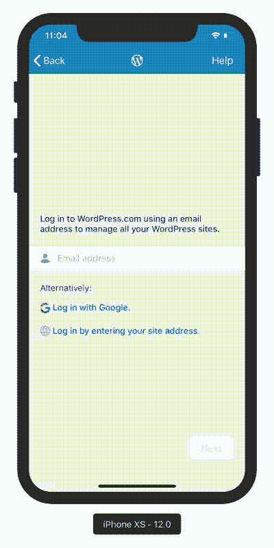
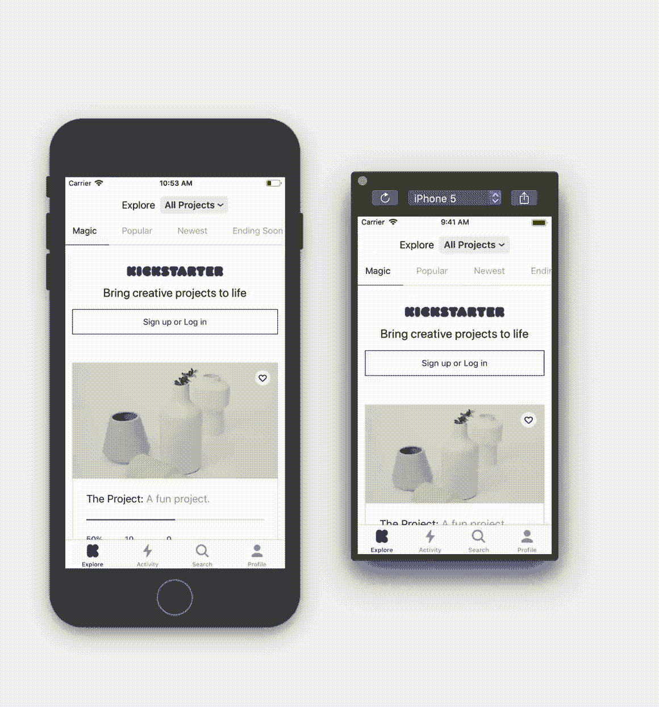
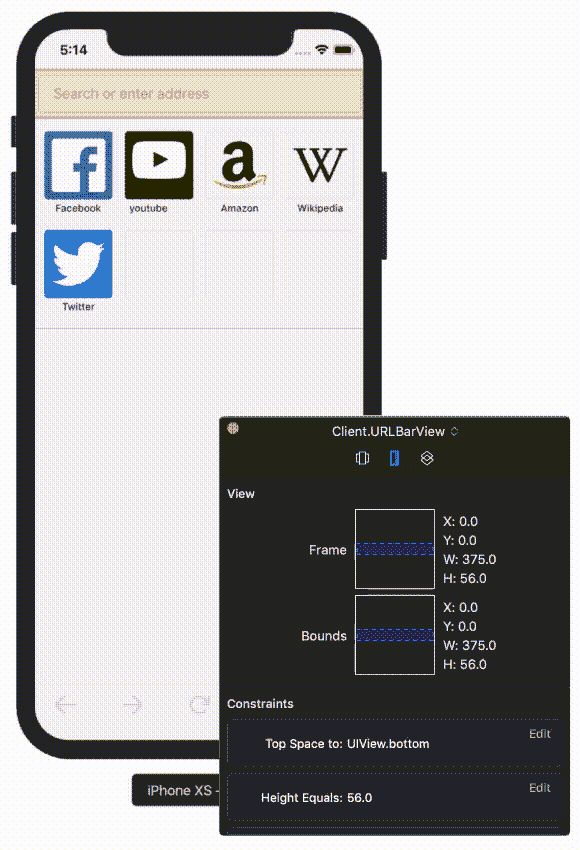

# iOS 模拟器与夏洛克的超能力

> 原文：<https://blog.devgenius.io/ios-simulator-superpowers-with-sherlock-406ca8317304?source=collection_archive---------4----------------------->

你是否大量使用 UI 或者试图理解 UI 视图是如何构建的？这篇文章保证能节省你的时间，提高你的工作效率🚀。

> **夏洛克**是一个工具，可以帮助你在实时⚡️中编辑视图和布局约束，模拟在其他设备上运行，所有这些都可以从你的模拟器中完成——不需要任何配置。

## 利益🎉：

它看起来与 web 浏览器中的`Inspection element`一模一样，也向您显示了视图层次。我个人使用它来探索新的 UI 屏幕或复杂的视图。我个人的偏好是先用夏洛克得到一个视觉反馈，然后去看代码。首先有一个视觉反馈要好得多🔥

探索 UI，了解它是如何构建的。

尤其是当您厌倦了在不同的模拟器中运行应用程序来检查 UI 的行为时。

> 注意:如果根据屏幕大小使用不同的约束，这将不起作用

查看您的 UI 如何与更大/更小的屏幕交互。

让你的文本更长，看看你的内容拥抱/压缩优先级是否如预期的那样工作。否则我们每次都必须硬编码并重新运行应用程序。

特别是如果你像我一样用编程的方式来创建 UI，你可以看到你的约束，看看你是否打错了👀

动态更改自动布局约束和文本。

> 提示:夏洛克给学生打折。但是如果你有一个朋友有一个学生邮箱，它也可以工作:)

你们中的一些人可能认为我们有 XCode DebugViewHierarchy，但这不是实时的，它会停止你的应用程序。从而减慢了开发过程。

## 如何设置:

*   首先你必须从[这里](https://sherlock.inspiredcode.io)下载
*   第二，哦，就这样，没有任何其他步骤，因为我们说过需要零配置，✅

希望这篇文章能帮助你提高工作效率。如果你喜欢你所读的，别忘了👏

*更多内容尽在*[*blog . devgenius . io*](http://blog.devgenius.io)*。*