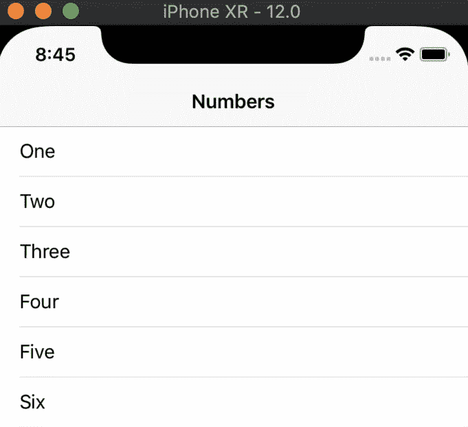

# 具有多个动作的 iOS UITableViewCell 使用闭包的简洁方法。

> 原文：<https://blog.devgenius.io/ios-uitableviewcell-with-multiple-actions-a-clean-approach-using-closures-e75abc4816f1?source=collection_archive---------3----------------------->


克里斯蒂安·威迪格在 [Unsplash](https://unsplash.com?utm_source=medium&utm_medium=referral) 上拍摄的照片

作为一名 **iOS 开发者**，你肯定会遇到对 UITableView 的需求。这是一个在 **UIKit** 中提供的出色组件。

UITableView 的是显示列表的有用组件。 **UIKit** 为处理 **UITableView** 提供了更好的架构。但是开发人员经常面临**开箱即用** **需求**的挑战，我们被迫去思考**开箱即用**的解决方案**。**

简而言之，用户交互可以用 **UITableView 的委托**来处理。

```
func tableView(_ tableView: [UITableView](https://developer.apple.com/documentation/uikit/uitableview), 
         didSelectRowAt indexPath: [IndexPath](https://developer.apple.com/documentation/foundation/indexpath))
```

**didSelectRowAt****index path**，返回被点击项目的**索引**。对于一个简单的实现，这个委托很好。

让我们考虑一个 **UITableView** 实现，如下所示。



查找用户与哪个索引进行了交互，并从**数据源**数组中获取详细信息，这是一件轻而易举的事情。

现在，让我们考虑另一个 **UITableView** ，它有多个选项供用户交互。


在这里，用户可以点击喜欢，评论或只是单元格。我们如何区分这些事件？

1.  设定**按钮** a **标记**值，并检查**按钮动作**中的标记值。
2.  为 **UITableViewCell** 设置一个**委托**，从 Cell 类返回不同的事件。

尽管上面的方法产生了我们想要的结果，但是代码库将会以**丛生**结束，并变成**紧密耦合**。我们需要一种方法，代码应该清晰并且易于维护。

**为你解围！**

在本文中，我将解释处理这种情况的一种更好的方法。

我将遵循闭包法，以高效紧凑的方式解决这个问题。

**后续步骤:**

1.  创建一个 **UITableView 单元格**类，并设计单元格布局。
2.  在 **UITableViewCell** **布局**上有两个**ui button**并将 **touchUpInside** 事件拉至 Cell 类。(本教程结束时，您可以从 UITableViewCell 中处理更多操作)。
3.  您在 **UITableViewCell** 上的 **UIButtons** 应该已经连接到 Cell 类中的两个 IBActions，如下所示。

让我们从简单的闭包回调开始，因为这篇介绍会让你从一个清晰的方法开始，这个方法可以扩展到更复杂的回调。

首先为我们的回调声明一个 **typealias** ,

这个闭包能够返回一个整数变量。

声明一个类似的回调，它可以返回一个“ **String** ”类型。

我们有**回调 1** 和**回调 2** 闭包，可以分别返回 Int 和 String 类型。

现在在我们的 **UITableViewCell** 类中声明**两个** **变量**，类型为“回调 1”&“回调 2”。

我们需要一个函数来设置这些闭包变量，它可以在 UITableView 运行时产生结果。在 UITableViewCell 类中实现该函数。这个函数得到一个**索引**变量和两个闭包变量，然后可以将它们分配给单元格的变量。

现在，是时候初始化这些变量了。但是这些应该在什么时候初始化呢？

**UITableView** 单元格的设计方式是在上下滚动时让**重用**。，这意味着当 UITableView 滚动时， **UITableViewCell 的**将会丢失**其初始化的变量。保持单元格变量的状态是开发人员的责任。**

初始化闭包对象的正确方法是在创建单元格的时候。，即

```
func tableView(_ tableView: [UITableView](https://developer.apple.com/documentation/uikit/uitableview), 
  cellForRowAt indexPath: [IndexPath](https://developer.apple.com/documentation/foundation/indexpath)) -> [UITableViewCell](https://developer.apple.com/documentation/uikit/uitableviewcell)
```

创建单元后，立即初始化闭包，并给它分配单元的闭包变量。

现在，忘记 **UITableView 的** **didSelectRowAt** 方法，因为我们已经为单元格操作创建了紧凑的操作块。现在是触发关闭的时候了。但是在哪里？

在 UIButton 的 IBAction 上！

**能力越大责任越大，**检查单元格上的闭包变量是否不为零，并调用块。为了避免**运行时** **致命** **崩溃**，确实需要检查零情况。

您的 **UITableViewCell** 类应该如下所示。,

为了便于理解，我使用了简单的返回类型。您可以根据需要实时扩展它。一旦你开始实施封闭的方法，你会上瘾的，相信我！

看看这个！，如果您面临任何问题，请不要犹豫发表评论！

**我的 Github 账号:**

[](https://github.com/bharathi91/) [## bharathi91 -概述

### 北极代码库贡献者解散在 GitHub 上注册你自己的个人资料，托管代码，管理…

github.com](https://github.com/bharathi91/) 

**电子邮件:**

bharathi91m@gmail.com