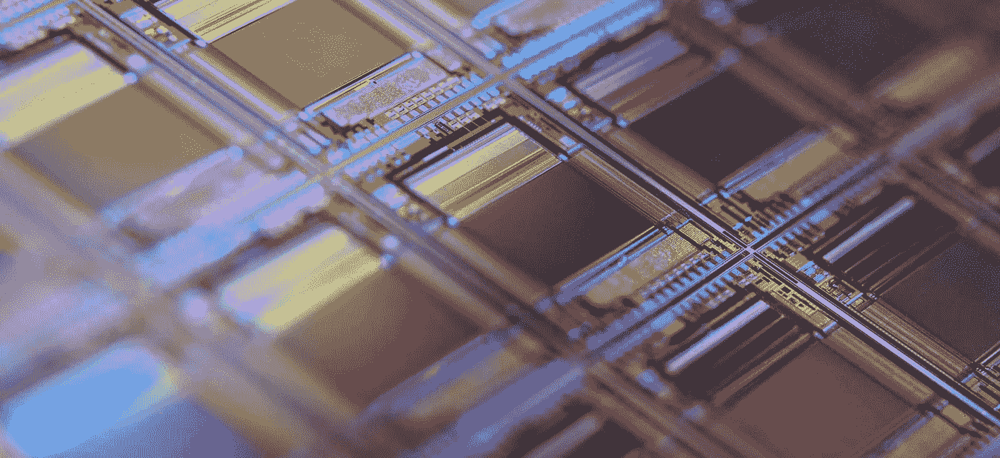
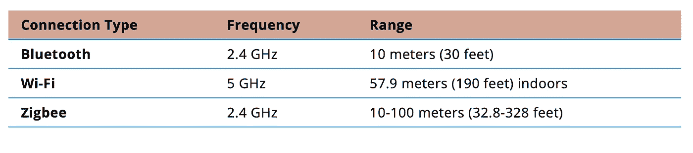

# 制造业中的物联网:2022 年的 6 大工业物联网趋势

> 原文：<https://blog.devgenius.io/iot-in-manufacturing-6-industrial-iot-trends-in-2022-34ce29cf738e?source=collection_archive---------4----------------------->

物联网(IoT)就是将设备连接到一起工作的网络。这是设计从整体式机器向分段式机器转变的结果。换句话说，物联网就是微处理和将较大的系统分割成各种较小的系统。通过这样做，网络的管理、升级和维护变得更加容易。

在制造业环境中，工业物联网(IIoT)非常重要，原因有很多。其中最重要的是物联网分析。制造商需要数据来了解他们的绩效状况，以及是什么让他们慢了下来。从那里，他们可以作出决定，以提高他们的业务效率。这个过程甚至可以通过结合 IIoT 系统和人工智能来实现自动化。

然而，仔细思考 IIoT 技术如何应用于您的业务非常重要。以创新的方式将技术结合在一起是保持企业竞争力的最佳方式之一。重要的是要考虑 2022 年现有的制造业物联网趋势，以了解这些技术究竟能给你带来什么好处。

# 趋势#1:连接技术

物联网技术在制造业最大的瓶颈之一就是带宽。网络中的所有这些设备一次可以交换多少数据？一次可以传输的数据越多，这些系统在替代设置中的速度就越快，效率就越高。网络速度对于实时应用和边缘计算的成功至关重要。然而，如果不需要尽可能快地传送数据，则可能不需要极高的带宽。评估制造企业的需求很重要，这样你才能选择最佳方案。

# 有线 IIOT 解决方案

对于最一致和最快的解决方案，有线 IIoT 连接是制造商寻求将多个物联网设备连接到网络的最佳选择。这些使用 EtherCAT、Ethernet/IP 和 Profinet 协议。USB 连接的速度和范围有限，因此通常使用类别电缆来扩展其范围。在更远的情况下，光纤电缆可用于连接相距数英里的工业设施。

有线解决方案比无线技术更成熟，具有可靠的可靠性和抗噪性。然而，这些连接的最大缺点是物理组件。布线会占用空间，具有环境限制，并且设置起来更耗时。有线连接也增加了额外的布线成本。

# 无线 IIOT 解决方案

就多功能性和易于设置而言，无线连接要有效得多。虽然无线连接天生容易出现不一致，但这可以根据所使用的无线连接类型来缓解。2022 年，有多种技术正在用于制造 IIoT 系统，并且正在兴起:

**连接类型 frequencrangebluetooth**2.4 GHz 10 米(30 英尺) **Wi-Fi** 5 GHz57.9 米(190 英尺)室内**Zigbee**2.4 GHz 10–100 米(32.8–328 英尺)

[*来源*](https://internetofthingsagenda.techtarget.com/tip/Evaluate-industrial-IoT-connectivity-options)

蓝牙低能耗是一种比 Wi-Fi 和 Zigbee 更高效的技术。这是便携式电池供电设备的绝佳选择。然而，由于能量限制，一次可以传输的数据较少。它还容易受到蓝牙和老式 Wi-Fi 网络可能使用的 2.4 GHz 范围内的干扰，影响设备的工作方式。

Zigbee 是一种替代连接类型，最适合数据吞吐量较低的电池供电传感器。这依赖于连接多条路径的节点。需要中央集线器协调器，这增加了系统的复杂性。

Wi-Fi 在工厂的机器传感器方面有更大的潜力。借助 5 GHz 接入点，这些接入点可以为最远 190 英尺远的设备提供高速连接。为了提供最大的覆盖范围，多个信标可以分布在整个工厂车间。这可能是支持固定位置电缆供电的 IIoT 传感器的最佳方式。由于不需要额外的通信电缆，因此可以监控机器的 IIoT 传感器的设置非常简单。高速 Wi-Fi 连接是 2022 年工厂工业物联网应用的最佳解决方案之一。

# 趋势#2:预测性维护和分析

制造中心的故障代价极其高昂。通过人工智能提供的预测性维护，组织可以节省数百万美元。然而，工业机器学习算法在没有关于它们正在评估的机器的高质量数据的情况下无法运行。工业物联网传感器可以通过机器网络收集数据。然后，这些数据可用于识别哪些机器需要优先安排维护以及何时维护。

这些传感器还可以测量机器的温度、振动和用电量，以估计潜在的未来故障点。

# 趋势#3:自动化质量保证

得益于工业物联网网络，质量保证监控可以远程自动完成。这可以大大提高生产企业的生产率和效率。可以发送实时警报，以便对意外的机器故障和其他中断等问题做出更快速的响应。通过 IIoT 设备的实时视频连接也支持人工智能工作，如自动视觉检查。这使得 [AI](https://becominghuman.ai/ai-application-development-guide-for-business-owners-88215ec781b1) 能够检测到缺陷，并在它们被运走之前将其从装配线上移除。[如果没有物联网传感器和摄像头为决策过程提供眼睛和耳朵，人工智能驱动的视觉检测](https://mobidev.biz/blog/ai-visual-inspection-deep-learning-computer-vision-defect-detection)解决方案就不可能实现。

# 趋势#4:边缘计算

工业物联网技术领域最有趣的趋势之一是边缘计算。许多行业和企业已经转向将处理从本地设备卸载到为其进行数据处理的远程服务器。虽然这减少了本地设备(如手机或 PC)必须进行的处理量，但在时间和带宽方面代价很高。边缘计算的目标是相反的，保持处理尽可能靠近“边缘”。

在制造环境中，工厂的本地边缘网络中的几个设备可以处理处理，而不必将数据发送到其他地方进行处理。这不仅更快更有效，而且本质上也更安全。由于数据从未离开工厂，因此不存在被第三方截取或恢复的风险。

前瞻性的工业公司通过将边缘计算和人工智能融合到边缘人工智能中来利用新的机会。边缘人工智能概念允许人工智能计算在物联网网络边缘的用户附近完成，而不是云。这有助于为工业流程带来实时智能，增加隐私并增强网络安全，同时降低成本并确保制造流程的持续改进。

# 趋势 5:位置追踪

位置跟踪在制造业中有多种应用，它们都依赖于工业物联网技术。众所周知，GPS 在大多数室外环境中非常有效，但室内定位系统和有 GPS 干扰的区域(如高楼林立的密集城市)可能更难使用。室外解决方案通常属于物流领域，但室内解决方案属于制造领域。

实时定位系统(RTLS)基于无线技术，如 Wi-Fi、BLE 信标、UWB 和 RFID。他们可以帮助识别产品在工厂车间的哪个位置，从而从生产过程的开始到结束监控它们的进度。这不仅有助于验证质量保证，还可以提供额外的数据来支持 digital twins 应用。

# 趋势 6:能源优化

你可能在某个时候走进一个黑暗的房间，只是为了让灯自己打开。乍一看可能不是这样，但我们可以从运动感应灯开关中学到很多东西。他们的目标不仅仅是让我们更容易打开灯。他们的潜在目标是，如果房间不用，灯会自动关闭。这与工业物联网交叉的地方是能源优化的概念。我们可以优化工厂的照明，但如何优化其他设备的能耗呢？

能源优化可以通过各种方式实现，包括密切关注温度控制系统、工业机器等等。EIA 的一份报告显示，2020 年，美国总能耗的 33%可归因于制造业。能源优化不仅对环境更有利，还能显著节约成本。

通过使用 IIoT 能源优化传感器来监控工厂中设备和机器的电气状态和使用情况，操作员可以微调过程并自动优化各种设备的能源使用。然而，这只是拼图的一部分。创造更加环保的制造流程需要的不仅仅是物联网传感器和电子数据处理。

# 物联网在制造业中的未来

最终，工业物联网的未来取决于许多因素。由于去年开始的芯片短缺仍困扰着市场，企业能够以更实惠的价格推出的设备数量有限。由于俄罗斯最近入侵乌克兰，对俄罗斯的制裁加剧，[彭博报道](https://www.bloomberg.com/news/features/2022-03-16/when-will-the-chip-shortage-end-u-s-eu-spend-billions-in-race-to-beat-china?msclkid=00936598a62211ec9d0d69d341cdf631)短缺将变得更加严重。

然而，这并不意味着 IIoT 设备无法获得和实施，现有的系统也可以改进。在混乱时期，创新极其重要。尽管芯片短缺限制了市场的扩张，但那些能够利用现有硬件和资源解决问题的公司将在剩余的短缺中保持竞争力。短缺结束后，这些企业将继续繁荣，带来更多收益。

由 [MobiDev](https://mobidev.biz/services/machine-learning-consulting) 的首席创新官 [Oleksii Tsymbal](https://mobidev.biz/our-team/oleksii-tsymbal) 撰写。

由[安东·洛格维年科](https://mobidev.biz/our-team/anton-logvinenko)审核，他是 [MobiDev](https://mobidev.biz/services/web-application-development) 的 JavaScript 小组组长。

*全文原载于*[*https://mobidev . biz*](https://mobidev.biz/blog/industrial-iot-internet-of-things-trends)*，基于 mobi dev 技术研究。*