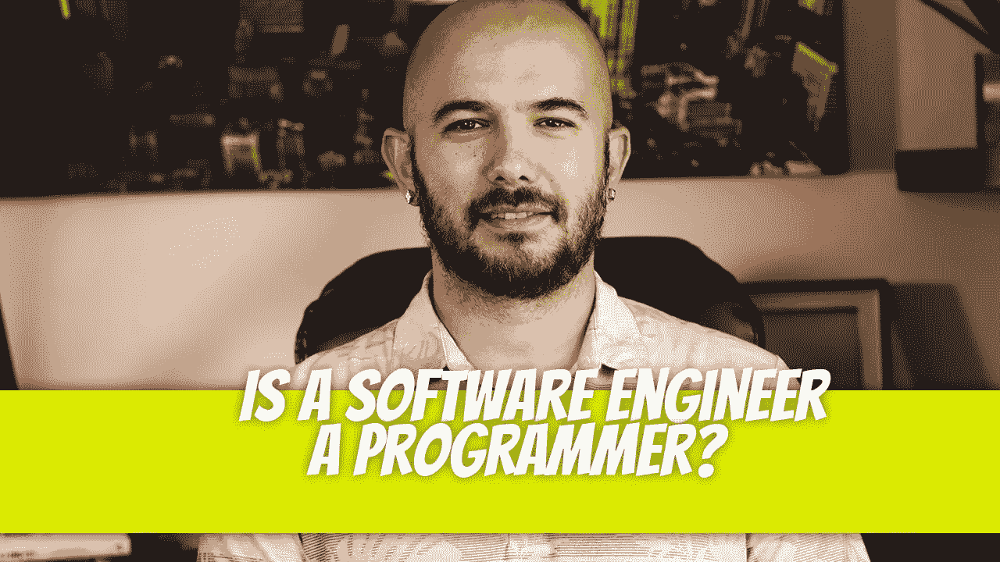

# 软件工程师是程序员吗？

> 原文：<https://blog.devgenius.io/is-a-software-engineer-a-programmer-b98c63997804?source=collection_archive---------6----------------------->

在这篇文章中，我们将讨论软件工程师做什么，以及为什么他们与程序员不同。我们还将讨论他们如何使用编程语言知识来创建更复杂的应用程序。

## **持证专业人员**

软件工程师是创建软件程序的有执照的专业人员。软件工程师通常不编写代码，但他们可能会参与设计和测试代码的过程。

软件开发人员通常被公司雇佣来开发在计算机、网络或移动设备上运行的计算机程序。他们经常与其他程序员一起工作，为商业用途创建新的应用程序。

## **软件开发人员是从头开始创建软件应用程序的程序员**

作为软件开发人员，您将负责创建和实现其他人使用的应用程序。您还将对自己编写的代码的质量以及团队其他成员如何使用它负责。

此外，由于开发人员通常在拥有许多不同类型的应用程序(通常是多种语言)的大型团队中工作，安全性是我们工作的另一个重要部分。

## **程序员以写代码为生**

计算机程序员以写代码为生。这是一项完全可以在电脑上完成的工作，并且经常需要大量的创造性思维。

计算机程序员出于各种目的编写代码，包括:

*   帮助计算机理解它们看到的内容(例如，识别文本)或听到的内容(例如，理解语音)的程序。
*   允许计算机做像下棋或驾驶汽车这样的事情的程序——这个过程被称为“自动化”
*   专门为人类通过移动设备和台式电脑上的网站、应用程序和其他数字界面与计算机进行交互而设计的代码；这些应用包括 Gmail 和 Outlook 等电子邮件客户端；像脸书这样的社交媒体平台；文字处理器等生产力工具；Xbox Series X 等视频游戏控制台，允许用户玩由电子艺界公司、任天堂公司、微软公司、索尼公司和育碧娱乐公司(Ubisoft Entertainment SA/ADI)等第三方专门为该设备制作的游戏。

程序员从创建简单的脚本来自动化一些小任务或实用程序开始。从那里，他们前进到更复杂的程序，做越来越复杂的事情，一路上遇到问题和绊脚石。

可以想象，这是任何一个个体都难以经历的过程。程序员从他们的错误中学习，并在必要时做出调整，但也有很多尝试和错误。

编程是一个不断发展变化的领域；擅长自己技术的程序员可能会受到新技术或不断变化的行业标准的挑战。除了随着时间的推移学习如何有效地编程，程序员还必须不断开发新的技能，以跟上所有这些变化，这样他们不仅能生存下来，还能在该领域茁壮成长。程序员花几个小时去阅读对他们领域的人来说什么有用，什么没用。

程序员的角色是创建软件，但这份工作需要的不仅仅是编码。程序员还负责跟上新技术的发展，这样他们就可以把新技术应用到他们以计算机程序的形式写下来的程序中，这些程序可以在各种硬件系统上运行。

## 教育

理论上，最大的区别是软件工程师有工程学位，而程序员可能有也可能没有。

## 重叠和差异

程序员和软件工程师之间肯定有一些重叠，但这两种职业之间也有明显的区别。

要成为一名优秀的程序员，你需要很好地掌握技术技能，并知道如何在工作中使用它们。您应该能够编写高效可靠的代码，这意味着编写的代码在运行时不会崩溃或发出太多噪音。你的工作将对用户的生活产生影响——你将负责交付结果或修复他们每天使用的产品中的错误。

软件工程师更关注他们工作的实际方面:能够通过构建原型快速实现新功能；设计用户界面；为数据库(或其他类型的信息系统)设计数据模型。

## 结论

还在迷茫？其他人也是。最后，开发人员、程序员和工程师之间的区别通常是在公司层面上定义的。就像你会看到初级开发人员拥有高级职称，或者两个人的公司中的 CTO，这些职称在开发中通常没有什么意义。然而，如果你打算为一个像这样结构的大组织工作，你可能想弄清楚这些头衔中哪一个能赚最多的钱。

迪诺·卡伊奇目前是 [LSBio(生命周期生物科学公司)](https://www.lsbio.com/)、[绝对抗体](https://absoluteantibody.com/)、 [Kerafast](https://www.kerafast.com/) 、[珠穆朗玛生物](https://everestbiotech.com/)、[北欧 MUbio](https://www.nordicmubio.com/) 和 [Exalpha](https://www.exalpha.com/) 的 IT 主管。他还担任我的自动系统的首席执行官。他有十多年的软件工程经验。他拥有计算机科学学士学位，辅修生物学。他的背景包括创建企业级电子商务应用程序、执行基于研究的软件开发，以及通过写作促进知识的传播。

你可以在 [LinkedIn](https://www.linkedin.com/in/dinocajic/) 上联系他，在 [Instagram](https://instagram.com/think.dino) 上关注他，或者[订阅他的媒体出版物](https://dinocajic.medium.com/subscribe)。

[*阅读迪诺·卡吉克(以及媒体上成千上万其他作家)的每一个故事。你的会员费直接支持迪诺·卡吉克和你阅读的其他作家。你也可以在媒体上看到所有的故事。*](https://dinocajic.medium.com/membership)