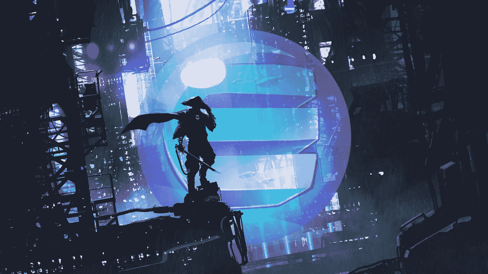

# 完美是金恩硬币的可取之处吗？

> 原文：<https://blog.devgenius.io/is-efinity-enjin-coins-saving-grace-84983293d75d?source=collection_archive---------1----------------------->

来源于[金恩](https://enjin.io/company-news/enjin-coin-japan-listing-en)

金恩硬币无疑已经在加密领域找到了立足之地。作为一个专注于游戏玩家的独特标志，一旦更多的游戏使用了区块链的先进技术，它就可以占领大众市场。已经有几款游戏使用了金恩。《我的世界》，铁锈时代，替代宇宙和失落的遗迹。

所有这些游戏与区块链的联系都是为了支持他们在金恩的项目。这意味着这些游戏中的物品在网络空间之外具有内在价值。不喜欢你目前的物品？融化它。想换一件不同的物品吗？卖掉它。不想自己磨东西吗？买吧。

**他们利用区块链让你在游戏中的工作与实际价值相关联。**

金恩硬币有一个潜在的问题。作为一个 ERC-20 代币，它遵循以太区块链的规则。基于以太坊意味着它也遭受了主链上争论的同样的汽油费问题。

气体是区块链工作的基础。汽油是在区块链进行交易的费用。如果你刚到区块链，想了解更多，看看[以太坊的解释](https://ethereum.org/en/developers/docs/gas/#:~:text=In%20essence%2C%20gas%20fees%20are,your%20gas%20costs%201%20Gwei.)——这比我们在这份文件中能做的要好得多。

已经有几个提议要改变以太坊的收费机制，最著名的是 EIP-1559 在最近登上舞台。然而，还没有一个解决费用问题的方案，这已经严重损害了 ERC-20 社区。

对于金恩来说，把聚光灯作为一个可行的象征，它需要要么改变区块链，要么为自己的需要创造一个层次。后者恰恰是计划。

> **介绍 Efinity。**

[Efinity](https://enjin.io/help/efinity) 希望通过提供基于以太坊网络的可扩展解决方案来解决正在发生的天然气费用狂潮。Efinity 已经参与谈判好几年了。毫无疑问，随着燃气费的增加，开发商一直试图尽快将铁锈推向市场。

我们关于这个项目的最多信息是金恩最近发布的 [nft.io](https://nft.io) 和开发者 Witek 最近对 [Telegram](https://www.reddit.com/r/EnjinCoin/comments/lnqny6/witek_gave_us_some_updates_today_in_telegram/) 的更新。虽然看起来 Efinity 平台应该会在今年的某个时候推出，如果不是在 Q1 的话。

这个解决方案可以解决可扩展性问题，防止金恩硬币成为事实上的 NFT。

 [## 工作的证明正在消亡，但为什么要挖掘呢

### 有用工作的证明万岁

austimullins.medium.com](https://austimullins.medium.com/proof-of-work-is-dying-but-why-should-mining-dc9c55619573) 

我建议在对这种转变形成看法之前，先阅读一下[蒂姆·拉克加登的经济分析](https://timroughgarden.org/papers/eip1559.pdf)。