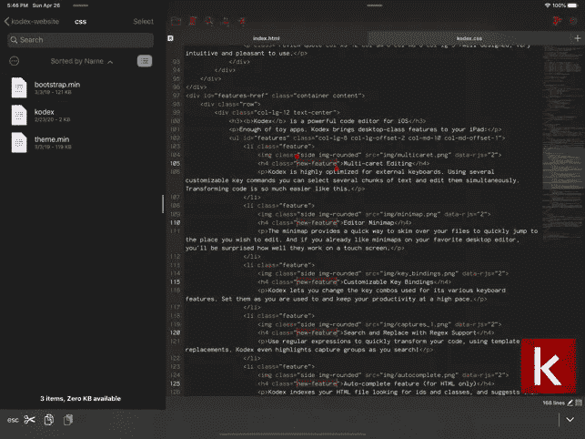
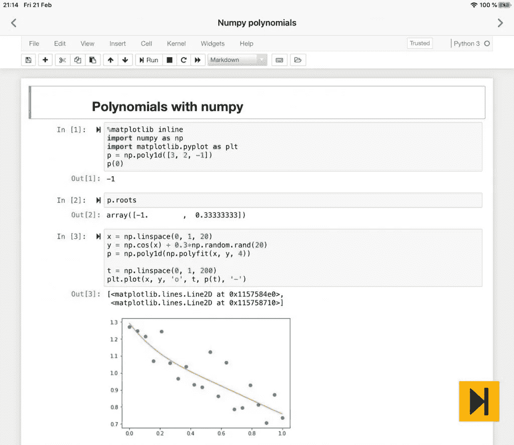
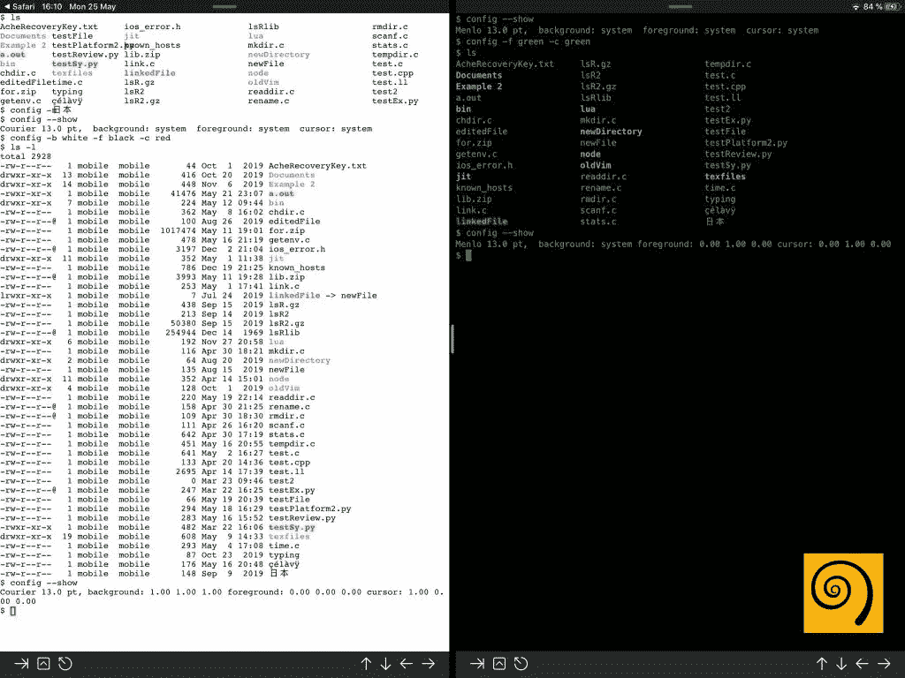
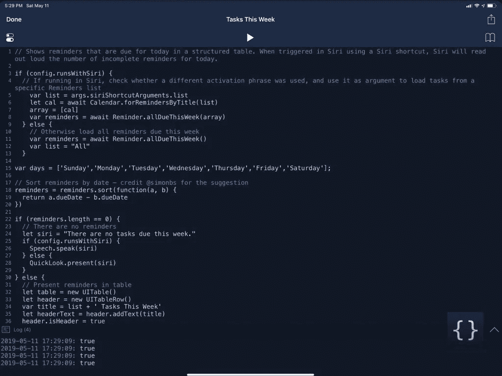
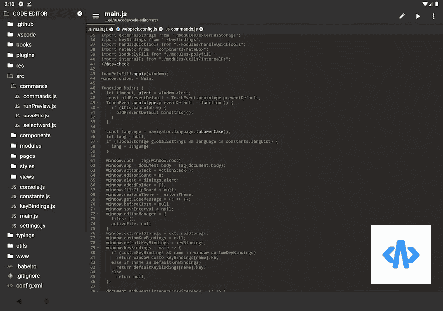
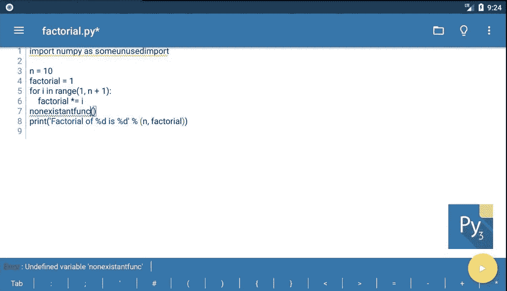
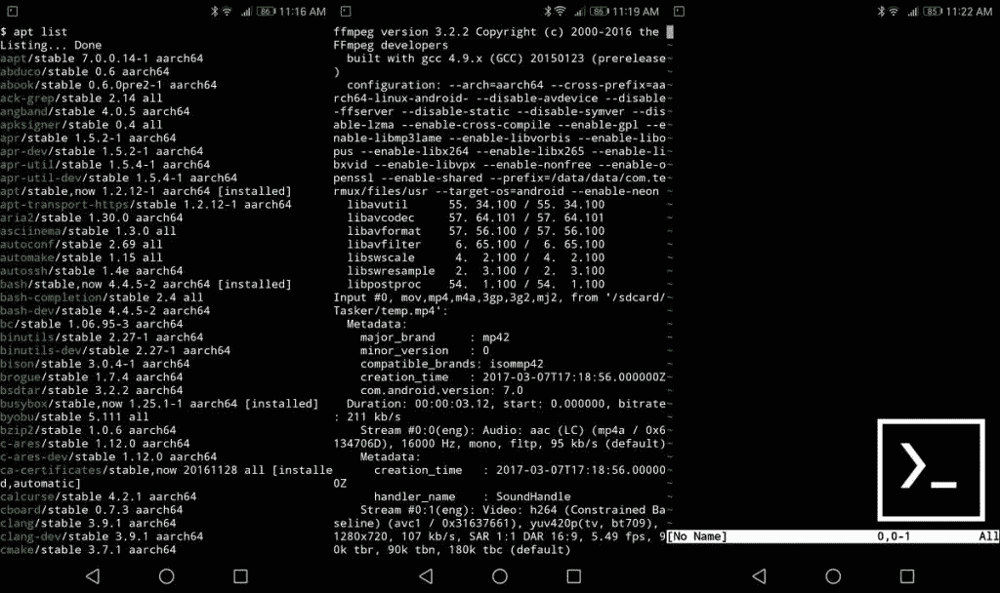
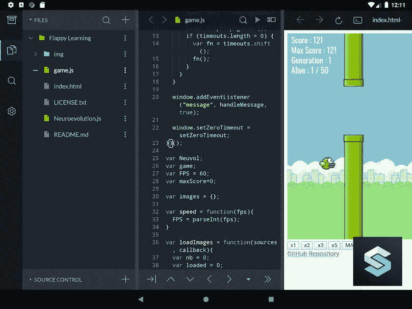

# iOS/Android 有能力做数据科学吗？

> 原文：<https://blog.devgenius.io/is-ios-android-capable-of-doing-data-science-88963edd2864?source=collection_archive---------17----------------------->

我们不断在新闻和科技文章中听到 iPad 将成为电脑的替代品。虽然这对于大多数使用电脑写邮件、文档、交流和其他日常活动的人来说是正确的，但如果我们需要更多的东西，事情就变得困难了。但是，随着 iPadOS 和 Android 的最新发展，许多专业任务(如数字艺术、视频编辑、音频制作和工程、UI/UX 设计、照片编辑)已经成为可能，并且对于某些使用案例来说，它是笔记本电脑/电脑所不能提供的更好的解决方案。但是编码呢？作为一个技术迷和程序员，我想知道仅仅用一台平板电脑/手机我能走多远。

首先，这些是我使用最多的编码工具。

1.  计算机编程语言
2.  Visual Studio 代码
3.  Jupyter 笔记本

和一些对这两个平台都不可用的特殊工具。因此，更换我的笔记本电脑的问题被直接排除了。但是，当我们的主设备不可用时，我们可以使用的辅助设备呢？我决定用我的空闲时间来检查我是否能完成以下任务

1.  写代码
2.  编译 Python
3.  同步到驱动器

因此，我正在寻找以下工具

1.  至少具有语法突出显示的代码编辑器
2.  Python IDE/编译器
3.  类似码头的环境
4.  可能适用于其他语言的工具

我也不想要一个付费应用程序，因为我并不致力于将我的平板电脑用作编码设备，尽管如果我要这样做的话，我确实会考虑一些可用的选项。这些是我找到的工具。

# ios

## 代码编辑器— Kodex

Kodex 是一个令人惊讶的多功能代码编辑器，并且像我们预期的那样工作。它有许多语言的语法高亮显示，不同的主题，处理文件和文件夹，自动缩进，甚至有一些语言的代码完成。它也是干净和最小的

## Python IDE —通行证

虽然有一个很棒的付费 python IDE 叫做 Pythonista，但是我很难找到一个像样的 python 环境，直到我找到了 Carnets。Carnets 很神奇，它是我们 iPhone 或 iPad 中完整的 jupyter 笔记本环境，我们可以做我们在 Jupyter 中做的一切，包括从 pip 安装包——前提是它们是纯 python 包。这意味着我们不能安装像 OpenCV、Pytorch 或 Tensorflow 这样的库，但现在许多库都是可访问的，这仍然很棒。其实像 numpy，pandas，sklearn，matplotlib 这些库都是预装的。然而，如果我们想做任何神经网络的事情，我们就没有运气了——幸运的是，我们可以在 colab 中做，前提是我们有活跃的互联网连接。

## 终端仿真器—外壳

我需要某种命令行环境，以备不时之需。我找到了 A-shell，这是一个由同一开发者开发的终端模拟器应用程序。A-shell 允许许多 UNIX 命令在本地运行，如 scp、grep、curl。如果需要，它还带有 vim 编辑器来编辑文件。它还内置了 C、C++编译器、Javascript 和 Python 解释器，并且还支持 Lua 和 Tex。它还可以与文件系统交互。

## 其他工具

我还碰到了 Scriptable——Javascript Enivronment，Jayson——JSON Editor，d coder——在线编译器和 IDE，以及 REPL——在线 IDE(基于 Web)。对于任何其他 python 需求，可以在浏览器中访问 Colab。

# 机器人

当谈到文件系统和系统文件时，android 比 iOS 提供了更多的灵活性，因此有许多编码应用程序可用于 Android。

## 代码编辑器— Acode

Acode 是一个面向 android 的开源代码编辑器，支持多种语言、语法高亮、自动缩进和所有其他我们期望从代码编辑器中得到的东西。改变编辑器主题的能力被锁定在付费墙后面，但是我们可以编辑最重要的部分——编码环境。但是，如果我们需要这个特性，可以选择从源代码编译。

## Python IDE — Pydroid

我已经用 pydroid 做了很长时间的小任务，效果很好。如果是纯 python，我们可以安装几乎所有的库。如果需要，我们也可以安装 Jupyter 笔记本，但它不像 Carnets 那样光滑。对于更强大的任务，我会坚持使用 colab。

## 终端仿真器— Termux

Termux 是一个非常强大的开源终端仿真器。我们不仅可以用它来执行常规的 UNIX 命令，还可以在里面安装一个完整的 linux 发行版(如果我们有空间的话)。这允许安装 Android 中没有的工具，如 R。我们还可以安装许多其他语言的编译器。

## 其他工具

其他有用的工具有 Spck——Javascript IDE、CppDroid/cxx droid——C/c++ IDE、DCoder——在线编译器、REPL——在线编译器(基于 Web ),还有很多其他语言的工具。同样，Colab 可以通过浏览器访问。

那么，iOS/Android 有能力代替笔记本电脑进行编码吗？截至目前，答案是 100%没有。然而，它完全可以作为一个方便的辅助设备。也许再过 5 年，在编码方面，移动操作系统可以接近桌面操作系统，或者更好——甚至远远超过它们。