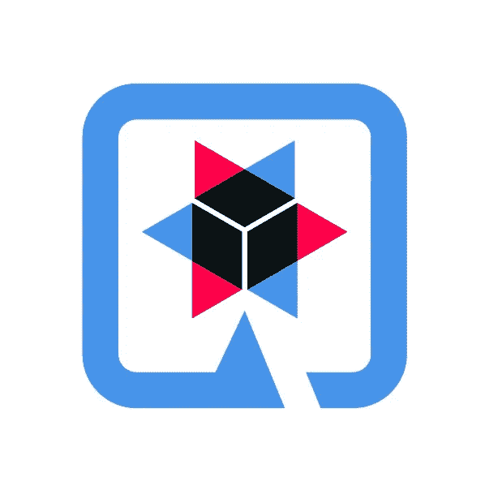
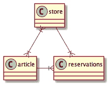
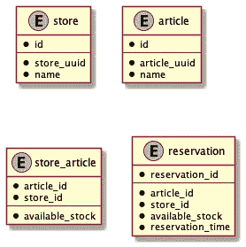
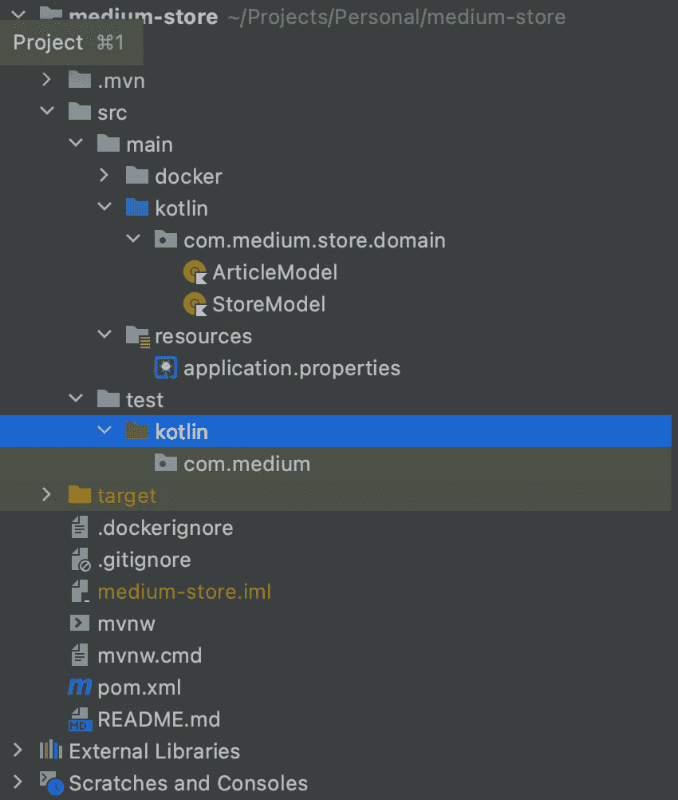

# 这是你第一次和 Kotlin 和 Quarkus 一起做 API 吗？让我们看看！—第一部分

> 原文：<https://blog.devgenius.io/is-it-gonna-be-your-first-api-with-kotlin-and-quarkus-lets-see-part-1-f980a95e74ab?source=collection_archive---------10----------------------->

如果你读过我的文章，你就会知道我的写作风格。我喜欢用口头语写作，所以这就是我要做的，我的小朋友。



让我开始吧！

几年前，我在希腊开始了我的软件工程师生涯。在我之前的一篇文章中，我已经告诉过你我是多么努力地寻找资源，寻找我想要的东西。我敢肯定，以我当时的经历，我真的没有能力在疯狂的互联网世界中正确地搜索，所以我多次失去动力。年复一年，我在搜索、学习方面变得更好，当然，伴随着这些，我成为了一名更好的工程师。反正！我读了这么多文章，但我总是犹豫要不要写一篇技术文章。我在想我的文章可以做得多好，我可以对一个人说些不同的话，以帮助她/他。我宁愿写一些关于我的经历的文章。直到最近，我决定尝试一下。
把我推出我的舒适区，分享我在软件开发方面的一些经验。

请系好安全带，和我一起分享一个美好的故事，与科特林和夸库斯一起制作我们的第一个 Rest API。在这篇文章中，我会试着回答你可能有的所有问题，因为这对我也是一个很好的学习机会！

所以在这个文章系列的背景下，我要介绍两个人！
我们可爱的青春，一个刚开始软件开发生涯的小伙子，一个有几年行业经验的漂亮女士。随你怎么称呼他们。

故事就要开始了…

Lady:所以，你已经有了一些构建 API 的经验！
青年:是的，是的！我已经用 Python 编写了一些代码，但是经验有限！我肯定想尝试一些新的东西！

l:不错！你为什么不试着在科特林建点什么？我也许能帮助你。很好听的语言！Y:嗯，科特林？听起来很有趣！你能给我一个案例研究吗？给你！

> 让我们举一个简单的例子，一家物流公司需要一个小的 API 来保存每个商店的商品库存。你可以实现一个 CRUD API 来保存、获取、修改和删除每篇文章的库存。
> 除此之外，您还可以使用预订功能，员工可以在特定时间段内预订 X 件商品。
> 你可以使用任何你想要的框架！

y:厉害！让我看看我能从哪里开始！

*让我们进入青年的大脑，看看他在想什么！*

嗯，我们的领域是什么？我们有商店，我们有商品，还有什么？我们有预约。我们可能有多个商店，也可能有用户。但是让我们从简单的开始！

商店优先。商店可以有一个名称和一个 id。商品大致相同，加上每个商店的数量。
不管怎样，我们需要跟踪预订情况。

好的，很好。我们有自己的小领域模型。让我们看看如何将这些数据存储在关系数据库中。

似乎很简单。



实体图



数据库表

l:太好了！这似乎是一个不错的方法！那么让我们深入研究代码吧！您可以使用 Spring boot，它是一个成熟的框架，也可以是您想要的任何其他框架。
Y:那夸库斯呢？我听说那有一些我想学的好功能！那就去吧！

我们的第一个 Quarkus 应用！

```
quarkus create app org.acme:medium-store \
    --extension=kotlin,resteasy-reactive-jackson,quarkus-jdbc-postgresql,quarkus-smallrye-health,quarkus-smallrye-metrics,quarkus-smallrye-jwt
```



初始项目结构

因为我们有一个数据库，让我们找到一个好的方法来与它交流。

你知道我可以用什么好的表格吗？
L:在 Java 中，有一些明显的竞争者，像 Hibernate、iBatis、EBean，但是你可以看看一些为 Kotlin 构建的。暴露和 Ktorm 似乎是一个不错的选择给你。
Y:谢谢老师！我去看看！

这两种 orm 非常相似，所以我决定使用 Ktorm！我首先定义了两个主要对象，Article 和 Store

```
interface Article : Entity<Article> {
    companion object : Entity.Factory<Article>()

    val id: Int
    var uuid: UUID
    var name: String
}

object Articles : Table<Article>(schema = "stock_keeping", tableName = "article") {
    val id = *int*("id").*primaryKey*().*bindTo* **{ it**.id **}** val uuid = *uuid*("article_uuid").*bindTo* **{ it**.uuid **}** val name = *varchar*("name").*bindTo* **{ it**.name **}** }

val Database.*articles* get() = this.*sequenceOf*(Articles)interface Store : Entity<Store> {
    companion object : Entity.Factory<Store>()

    val id: Int
    var uuid: UUID
    var name: String
}

object Stores : Table<Store>(schema = "stock_keeping", tableName = "store") {
    val id = *int*("id").*primaryKey*().*bindTo* **{ it**.id **}** val uuid = *uuid*("store_uuid").*bindTo* **{ it**.uuid **}** val name = *varchar*("name").*bindTo* **{ it**.name **}** }

val Database.*stores* get() = this.*sequenceOf*(Stores)
```

然后他们之间的联系，只要预订表，我们可以保留预订的文章。

```
interface StoreArticle : Entity<StoreArticle> {
    companion object : Entity.Factory<StoreArticle>()

    val articleId: Int
    val storeId: Int
    val availableStock: Int
}

object StoreArticles : Table<StoreArticle>(schema = "stock_keeping", tableName = "store_article") {
    val articleId: Column<Int> = *int*("article_id").*primaryKey*().*bindTo* **{ it**.articleId **}** val storeId: Column<Int> = *int*("store_id").*primaryKey*().*bindTo* **{ it**.storeId **}** val availableStock = *int*("available_stock").*bindTo* **{ it**.availableStock **}** }

interface Reservation : Entity<Reservation> {
    companion object : Entity.Factory<Reservation>()

    val articleId: Int
    val storeId: Int
    val reservedStock: Int
    val reservationTime: Instant
}

object Reservations : Table<Reservation>(schema = "stock_keeping", tableName = "reserved_article") {
    val articleId: Column<Int> = *int*("article_id").*primaryKey*().*bindTo* **{ it**.articleId **}** val storeId: Column<Int> = *int*("store_id").*primaryKey*().*bindTo* **{ it**.storeId **}** val quantity = *int*("reserved_stock").*bindTo* **{ it**.reservedStock **}** val reservationTime = *timestamp*("reservation_time").*bindTo* **{ it**.reservationTime **}** }
```

厉害！Y:我想我需要短暂的休息！我们能晚一点继续吗？当然，新手，再见！

[推特](https://twitter.com/petroskont)&[insta gram](https://www.instagram.com/captain_pk4)&[LinkedIn](https://www.linkedin.com/in/pknt/)