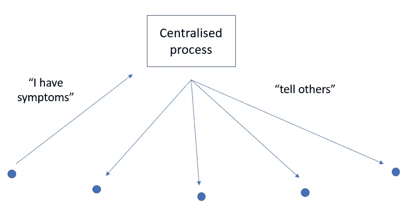

# 做一个跟踪追踪 app 很难吗？

> 原文：<https://blog.devgenius.io/is-it-hard-to-build-a-track-and-trace-app-9e11e76c2766?source=collection_archive---------37----------------------->


丁满·斯图德勒在 [Unsplash](https://unsplash.com?utm_source=medium&utm_medium=referral) 上的照片

由 NHSX 开发的跟踪和追踪应用程序被推迟，可能要到冬天。

我是不是错过了什么，或者这应该很容易建立？(请注意，我不是应用程序开发人员)

该应用程序使用你的手机作为你的代理人。我认为它需要做五件主要的事情:

*   维护隐私
*   当你联系另一个人时注册
*   保留一份你联系过的所有人的名单
*   如果你有症状，提醒你联系过的人
*   如果你接触的人有症状，提醒你

**维护隐私**

应用程序用户需要一个唯一的匿名 ID。从 app 需要做的事情来看，我觉得不需要个人信息。如果该应用程序将与人类接触跟踪集成，那么在数据管理的某个点上，我可以看到这些 id 需要映射到实际的人和联系方式。

但这与机密信息(密码、信用卡)在网络上的存储和处理方式有什么不同吗？

**联系他人时注册**

需要界定接触的概念；假设是 2m 及以下的用户(手机)之间的接触。

电话能告诉你这些吗？蓝牙是最好的选择吗？我认为 GPS 已经过时了，因为 1)它不够精确，2)它在地铁上不起作用。

**列出你联系过的所有人(匿名)**

如果应用程序可以成功注册其他用户的联系人，那么注册这些实例就非常简单了。这些信息也可以附加额外的，但可能不是必要的数据，比如 GPS。类似于…

```
userID    contactTime
122843758 Mon 15/06/2020 09:15
310248484 Mon 15/06/2020 09:16
918540018 Mon 15/06/2020 09:20
412604581 Mon 15/06/2020 17:03
321806739 Mon 15/06/2020 17:24
394149247 Mon 15/06/2020 17:23
...       ...
```

你周一开始上班——在上班的路上“联系”了 3 个人，在回来的路上又联系了 3 个人(只有你在办公室，中间没有联系)。

**如果您有症状，提醒您联系过的人**

你开始感到不适。你告诉应用程序，它可能会问你几个问题，以确定你从哪一点开始可能具有传染性(如果你有病毒)。

该应用程序会查看您的接触事件列表，并根据接触时间从可能的感染点进行过滤。这样，您就有了一个用户列表，可以通过合适的消息和建议与他们联系。从概念上讲，它可能看起来像这样…



**如果你接触的人出现症状，提醒你**

如上，除了你在应用上收到消息。

**我错过了什么？**

也许我太简单了。如此重要的东西花了这么长时间才推出，这似乎有点奇怪。是不是…

*   不同操作系统的问题？比如说安卓和苹果
*   难以使用电话准确登记密切接触者？
*   数据隐私？
*   app 外卖？即仅在人们下载、使用它并遵守隔离建议的范围内有效
*   与人类接触追踪整合？
*   围绕“我有症状”与“我现在有症状，我已经检测出阳性/阴性”的更复杂的逻辑