# 是时候从 Lens 迁移到 OpenLens 来管理您的 Kubernetes 集群了吗？

> 原文：<https://blog.devgenius.io/is-it-time-to-migrate-from-lens-to-openlens-75496e5758d8?source=collection_archive---------0----------------------->

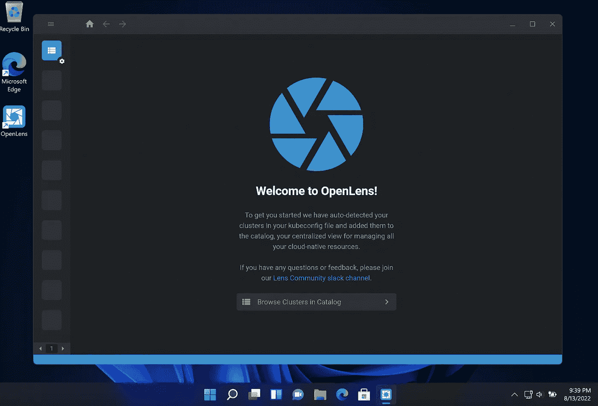

TL；dr；OpenLens 与 Lens IDE 相同，没有专有组件，并且基于 MIT 许可证是免费的。然而，目前没有适用于 OpenLens 的带符号二进制文件。本文讨论了关于社区代码签名的众筹，并展示了如何为 macOS、Linux 和 Windows 自行编译 OpenLens。

—

毫无疑问，随着时间的推移，Lens IDE 已经在 Kubernetes 管理员和应用程序开发人员中广受欢迎。它将复杂的 Kubernetes 基础设施聚集在一个易于理解和管理的界面中。

作为一个拥有麻省理工许可的[开源软件](https://github.com/lensapp/lens/blob/master/LICENSE)帮助 Lens 更快地流行起来。然而，在最近几个月，Lens 背后的公司已经开始推动镜头用户创建一个镜头 ID，并且它将有一个新的企业定价模型。换句话说，Lens 不再对所有人开放。

我们通常下载和安装的 [Lens IDE](https://k8slens.dev/) 并不是真正的开源，它是一个专有应用。它源自[原始和开源 **OpenLens**](https://github.com/lensapp/lens) ，其中添加了额外的云 ID 和其他专有模块，如云登录，并作为“ **Lens** ”分发。它更像是谷歌的 **Chrome** 由**Chrome**衍生而来。

远离镜头还有其他选择，其中之一是名为 [k9s](https://k9scli.io/) 的基于 CLI 的工具。不过 k9s 自带功能有限。为了释放全部潜力(例如对自定义资源定义的可见性)，有一个名为 [k9s𝞪](https://k9salpha.io/) 的付费升级

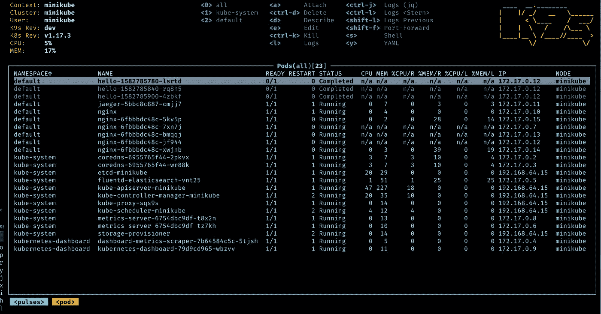

k9s 来自他们官网的截图

在本文中，我们主要关注 OpenLens。

# 可执行的 OpenLens 二进制文件在哪里？

下载和运行镜头很容易。然而，当查看 [OpenLens 发布库](https://github.com/lensapp/lens/releases)时，你只会找到源代码:

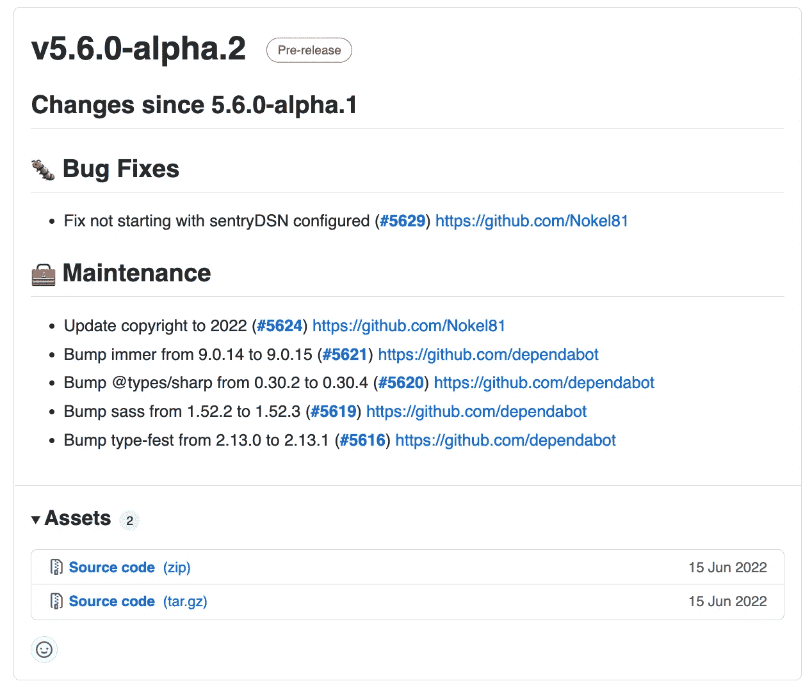

好像他们只是简单地为 Lens 编译和构建应用程序。而不是开放式镜头。

好消息是，您可以克隆 OpenLens git 库，如果您的机器有必要的工具来编译(node、yarn 等)，您可以通过`make build`命令自己编译二进制文件。

# 社区 OpenLens 二进制文件

在我最初的研究中，我发现了卡尔坎的这个知识库。

[你可以找到 Windows，macOS(英特尔和苹果芯片)，基于 Redhat 的 Linux，基于 Debian 的 Linux，甚至 Linux 的 AppImage 的编译版本](https://github.com/MuhammedKalkan/OpenLens/releases):

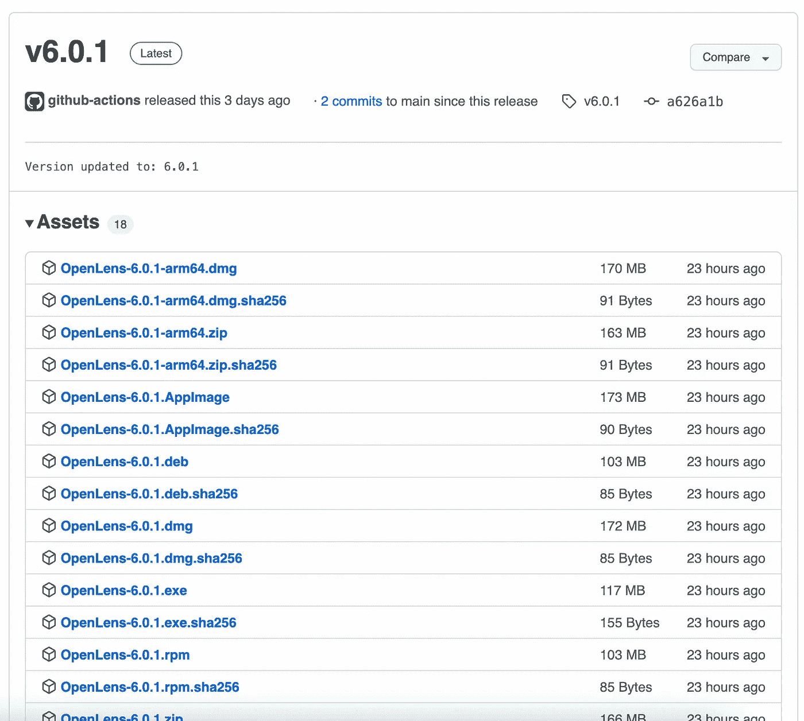

这背后的想法很简单。它从 OpenLens 存储库中克隆了开源版本的 Lens (OpenLens ),并使用 Github actions 在 3 个不同的操作系统中运行`make build`。

如前所述，Lens 团队准备了`make build`命令来编译并给出基于运行的操作系统的二进制文件，它只需要正确的编译工具存在于正在进行编译和构建的系统中。[在这种情况下，存储库使用 Github](https://github.com/MuhammedKalkan/OpenLens/blob/main/.github/workflows/main.yml) 提供的运行器并安装必要的工具。

**有没有蹊跷？**

嗯，我个人并不了解卡尔坎，所以我不能担保他，也不能保证那里的一切都是安全的，但看看管道和 Github 的行动，对我来说一切看起来都很好，我希望他的仓库能够保持势头，并得到普及。事实上，我希望社区努力使 OpenLens 成为主流，关注他的知识库。我个人也为他的 patre on[捐款，以支付代码签名的费用。](https://patreon.com/openlens)

***代码签名！***

这是我目前面临的 OpenLens 分叉的唯一难题，我希望随着越来越多的人对这个库的 [Patreon](https://patreon.com/openlens) 做出贡献，这个问题会很快得到解决。

Linux 版本不需要对二进制文件进行签名，但是，对于没有签名的二进制文件，Windows 和 macOS 会抛出警告。

我可以在我的 M1 个人电脑上运行 OpenLens，而不需要代码证书:

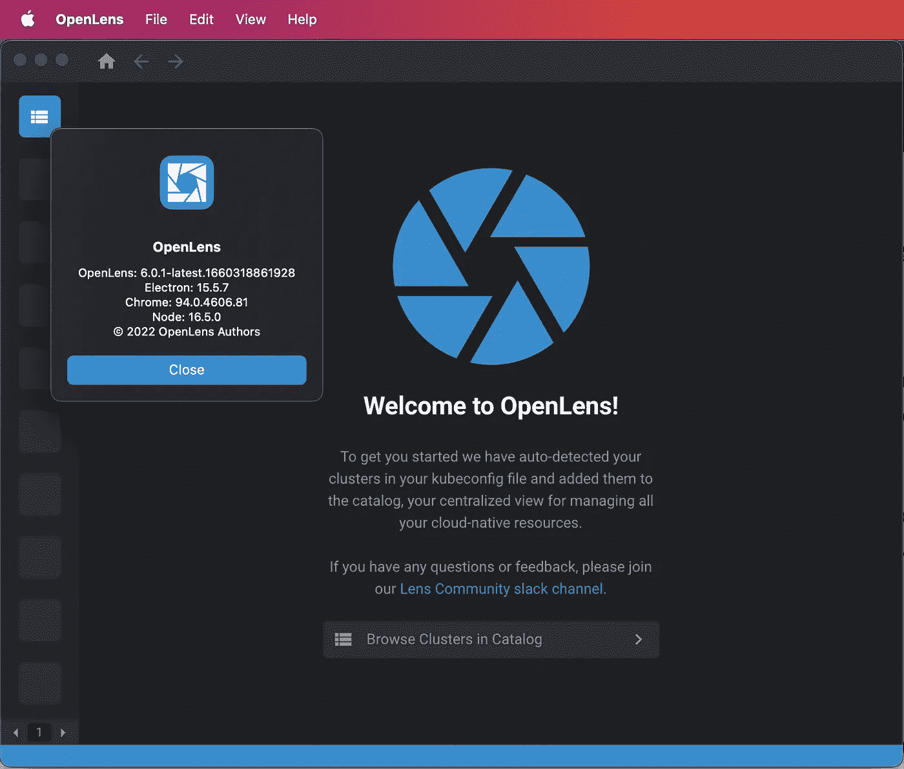

但是，它需要签名才能在有限的组织笔记本电脑上运行:

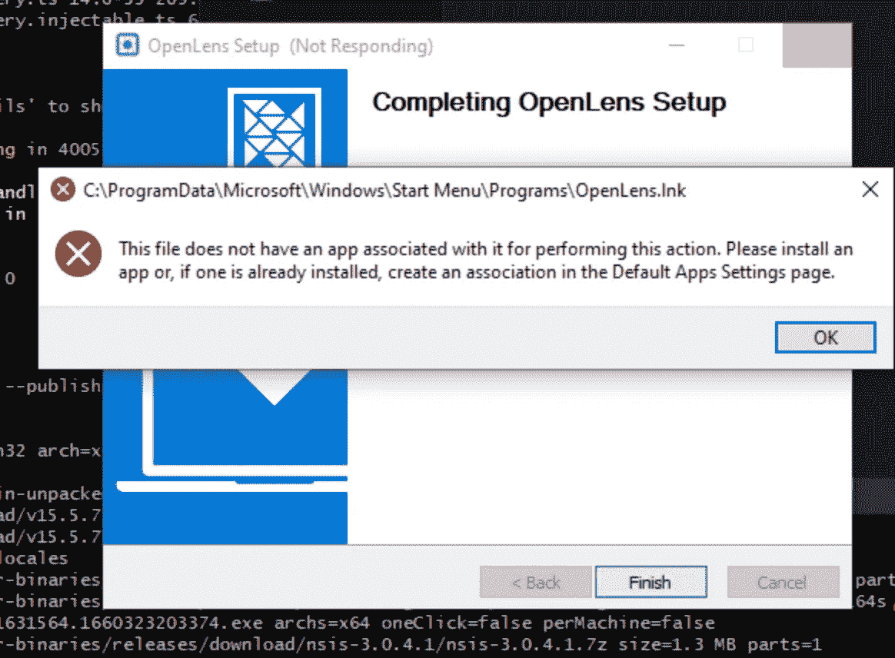

这是一个自行编译的 OpenLens 二进制文件的截图，然而，在这个 repo 中提供的二进制文件在受限的 Windows 机器中抛出类似的错误。

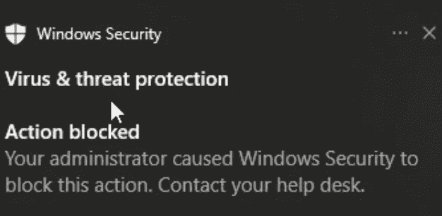

如果您的窗口由某个组织控制，并且他们对可以运行的内容设置了限制，那就没有办法了。

请注意，这个文件是安全的，因为我已经亲自从 Open Lens 开源库编译了它。(我没有为这张截图下载 m .卡尔坎的仓库中提供的 windows 二进制文件)但是如果你的 Windows/macOS 机器受到限制，m .卡尔坎的仓库会抛出类似的错误，很可能是因为它没有用付费证书签名。

对于较小组织中的用户或在个人计算机上运行 OpenLens 的用户来说，这不是问题。因为如果他们信任该应用程序，他们可以运行 OpenLens 并绕过 Windows/macOS 关于未签名应用程序的警告。然而，许多大型组织的笔记本电脑都有限制和保护措施，不运行未签名的二进制文件，没有任何绕过的选项。

所以这些二进制文件没有被签名，因为签名代码需要付费证书。Apple Developer Program 每年花费 99 美元，Windows code signing 根据您选择的发行者有不同的价格，在当前阶段，该发行者不在此社区存储库中。

[该项目的众筹开始](https://github.com/MuhammedKalkan/OpenLens/discussions/19)以赞助颁发证书的费用。希望这个 [Patreon](https://patreon.com/openlens) 很快达到它的目标，我们将会签署二进制文件。

# 编译 OpenLens 二进制文件

OpenLens 是通过 Electron 和 nodeJS 开发的，这里是跨平台的。根据运行的 OS 不同，编译 OpenLens 需要安装的工具也不同。

然而，考虑到自己构建二进制文件和代码签名的复杂性，我投票支持上面提到的社区项目。

您的组织策略可能不允许您运行自编译的二进制文件，因此您可能会收到与我上面显示的类似的错误。否则可以直接从[镜头开源库](https://github.com/lensapp/lens)编译 OpenLens。

我在这里提供的步骤来自于卡尔坎在他的社区项目中的 CI/CD 管道，它们可能在你的系统中有所不同，但是你可以消化它的基础。

如果您运行的是 macOS 或 Linux，那么您的机器中可能已经内置了大多数基本命令。但是，你需要安装 nodeJS 和 yarn。

我不会详细介绍 Linux，因为每个发行版都会有所不同。不过我就以 Ubuntu distro 为例，也很直白。

**Linux 二进制(Ubuntu)**

安装 git 和 curl: `sudo apt install -y curl git`
安装 NodeJS repo: `curl -fsSL [https://deb.nodesource.com/setup_16.x](https://deb.nodesource.com/setup_16.x) | sudo -E bash -`
安装 NodeJS v16 LTS: `apt install -y nodejs`
安装最新版本的 yarn: `sudo npm install -g yarn` 克隆 Open Lens 库:`git clone [https://github.com/lensapp/lens.git](https://github.com/lensapp/lens.git)` `~/openlens`
进入 Open Lens 源代码目录:`cd ~/openlens`
选择你的具体版本:`git checkout v6.0.1`
构建你的二进制:`make build`

现在您可以在`~/openlens/dist`目录中找到您的 Linux 二进制文件。给定正确的主机环境，您将得到一个解包的二进制文件夹以及`.rpm`、`.deb`和`.AppImage`安装程序。

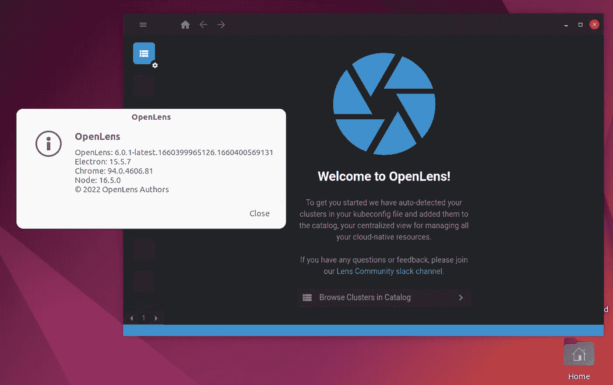

根据您的 Linux 环境，步骤可能会有所不同，但是它应该让您很好地了解为 Linux 构建它所需的步骤。

**macOS 二进制文件**

首先，安装 X 代码。它将安装`gcc`和编译代码所需的其他必要的基本工具。

如果您使用的是 brew 软件包管理器，可以按照以下步骤操作。否则，我强烈建议安装[brew 包管理器](https://brew.sh/)，然后按照下面的步骤操作！

安装 nodeJS 和 git 和 yarn: `brew install node@16 git yarn`

克隆开放式镜头:`git clone [https://github.com/lensapp/lens.git](https://github.com/lensapp/lens.git) ~/openlens`

转到 OpenLens 源代码文件夹:`cd ~/openlens`

将你的 git head 设置为你试图构建二进制文件的特定镜头版本:`git checkout v6.0.1`
注意:你可以在 [Lens 网站](https://k8slens.dev/)上查看最新的镜头版本:

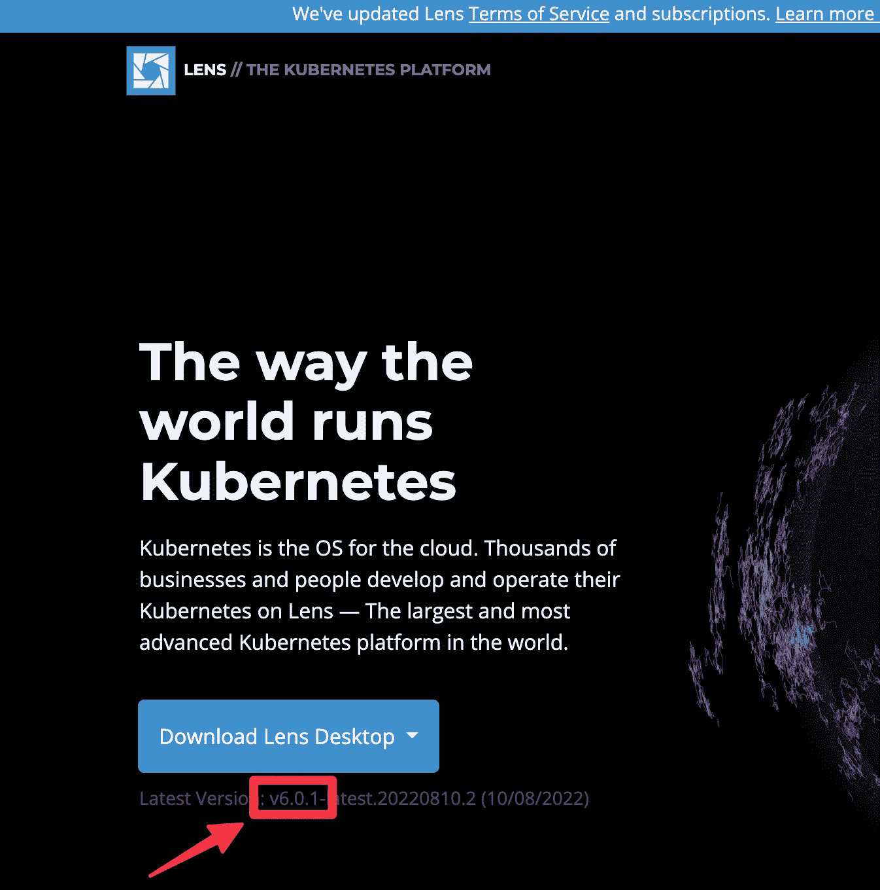

构建 macOS 苹果芯片和英特尔二进制:`env ELECTRON_BUILDER_EXTRA_ARGS="--arm64 --x64 --config.dmg.sign=false" make build`

一旦这一步完成，您可以在`~/openlens/dist`文件夹中找到您的 OpenLens 二进制文件:

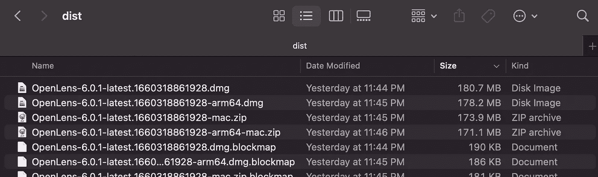

打开其中一个 dmg 映像(基于您的系统 CPU)，您可以安装并运行 OpenLens:

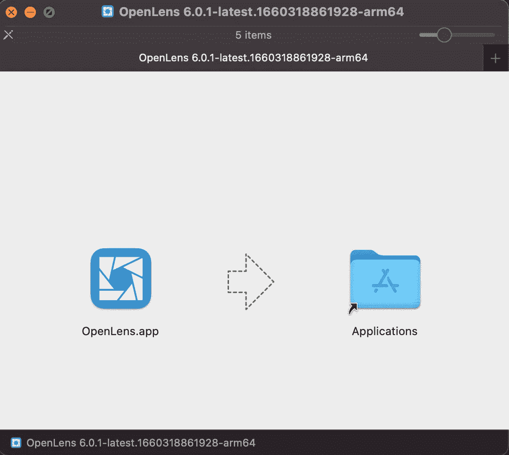

**微软 Windows 二进制文件**

我提到过 macOS 中的 brew 包管理器。对于 windows，我想提一下 chocolatey 包管理器。如果没有，[请安装。](https://chocolatey.org/install)

步骤和 macOS 类似。但是，您需要安装一些额外的包，并从 bash 兼容的终端运行命令。

使用 chocolatey 安装第一步需要的工具:`choco install nodejs-lts yarn python make git visualstudio2019buildtools visualstudio2019-workload-vctools` 如果使用的是 Visual Studio IDE，这里提到的 Visual Studio 2019 工具就不需要了。在这种情况下，您需要在 Visual Studio 中安装“使用 C++进行桌面开发”工作负载:

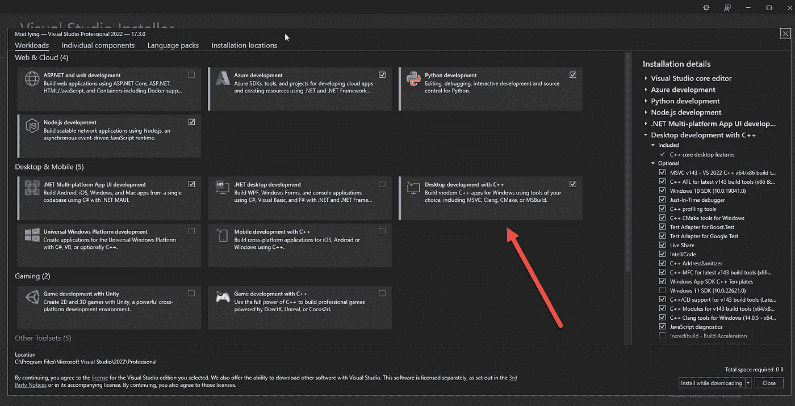

运行 chocolatey install 命令后，您可能需要关闭所有现有的终端窗口，然后重新打开它们以应用环境`PATH`更新，或者您可以键入:`refreshenv`

接下来，您需要一个 bash 兼容的终端，能够在 windows 环境中运行基本的 bash 命令，我推荐使用 [Cygwin 终端](https://www.cygwin.com/):

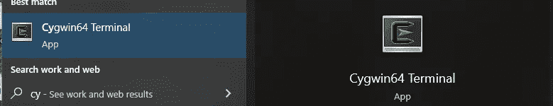

现在，让我们继续。打开 cygwin 终端，转到一个文件夹，最好在您的窗口中访问:`cd /cygdrive/c/`

从 Lens 克隆 OpenLens 库:`git clone [https://github.com/lensapp/lens.gi](https://github.com/lensapp/lens.git)t openlens`

转到 OpenLens 文件夹:`cd openlens`

将您的 git head 设置为您试图为其构建二进制文件的特定镜头版本:`git checkout v6.0.1`
注意:您可以在 [Lens 网站](https://k8slens.dev/)上查看最新的镜头版本，在上面的 macOS 二进制文件构建一节中有详细介绍。

神奇的命令来了:`make build`

构建过程需要一段时间才能完成，一旦完成，打开 C:\openlens\dist\ folder，openlens 安装程序会欢迎您:

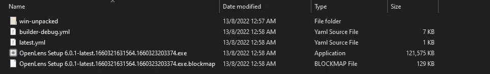

浏览安装向导并运行 OpenLens:

# 所以我应该用社区版还是自己建？

正如演示的那样，您不必继续使用官方的镜头云 ID 和包，您可以使用 OpenLens 来代替。根据您的机器配置，您构建和运行二进制文件的步骤可能会有所不同，但至少本文让您了解了如何自己构建二进制文件。

如果完成构建过程或代码签名对你来说是个问题，我建议使用由这个 repo 发起的[并加入由 m .卡尔坎发起的](https://github.com/MuhammedKalkan/OpenLens/releases) [Patreon 来创建签名的二进制文件](https://github.com/MuhammedKalkan/OpenLens/discussions/19)。

*声明:我不认识卡尔坎先生。我只是他主动开始搭建 OpenLens 的社区二进制版本的粉丝。我不隶属于本文中提到的任何项目、组织或个人。*