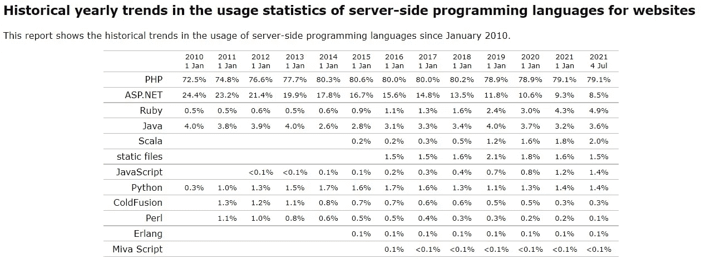

# 我应该在 2021 年还是 2022 年学 PHP？

> 原文：<https://blog.devgenius.io/is-it-worth-learning-php-in-2021-or-in-2022-1a2ee0e30040?source=collection_archive---------1----------------------->

## 简短的回答是肯定的。哦，但是等等，真的值得学吗？让我想想…

本在 [Unsplash](https://unsplash.com?utm_source=medium&utm_medium=referral) 上的照片

***注:*** *这里写的东西都是自以为是。它让你对这个主题有一个广阔的视野，这只是一个讨论，值得一读，以了解所有剩下的选项。嗯，也许在决定之前，先做一次自己的调查是件好事。*😀

# PHP 的一点介绍

啊，这个博客的这一部分只是为了帮助你对 PHP 有一个大致的了解，这样你就不会错过进一步的讨论。

*   PHP 是一种流行的开源脚本语言。
*   由拉斯马斯·勒德尔夫于 1994 年创建，在 2000 年左右，它因其简单而变得非常有名。
*   它在服务器上执行。
*   它被用来建立一个简单也非常复杂的网站。
*   你猜怎么着？脸书使用 PHP，因为它是后端语言之一。

# 需要多长时间才能学会

照片由 [Dmitry Ratushny](https://unsplash.com/@ratushny?utm_source=medium&utm_medium=referral) 在 [Unsplash](https://unsplash.com?utm_source=medium&utm_medium=referral) 上拍摄

嗯，有很多东西要学。仅仅学习 PHP 本身对你没有帮助，你需要学习它的一个或一些框架，你需要学习一个或一些数据库——MySql 是 PHP 的最佳伙伴。所以，让我们假设你开始独自学习 PHP，在这种情况下，它再次完全取决于你。你的理解能力，编程结构的基础，你每天投入学习的时间，还有你的奉献和努力都很重要。

> 人们可以很容易地说，你可以在一个月内轻松学会 PHP，是的，很容易！😄

但是等等，有一个陷阱！仅仅通过博客，基于文本的课程，视频课程，或者其他什么来学习，不会再帮助你了。它带给你的只是知识。你需要大量练习，建立一些爱好项目，在任何论坛上进行讨论等等。综上所述，要成为，嗯比方说，PHP 中级需要很多时间。

# 网络世界的主导地位

网站服务器端编程语言使用统计的历史年度趋势

我们不要拐弯抹角了！说到统治力，PHP 绝对是王者。根据 [W3Techs 调查的数据](https://w3techs.com/technologies/details/pl-php)， **PHP 在所有网站中的使用率为 79.1%** 。这导致我们几乎每 10 个互联网网站中就有 8 个是用 PHP 编写的。很酷，对吧？

然而，我们也需要知道这几年来它在某种程度上是下降的。2015 年 W3Techs 报道 80.6%。2018 年，他们得到了 80.2%，现在这个数字在 2021 年 7 月 4 日下降到了 79.6%。这是来源: [W3Techs 的历史年度趋势](https://w3techs.com/technologies/history_overview/programming_language/ms/y)。

PHP 的统治地位还不止于此。听说过 WordPress 吗？哦，你一定听过，对吧？WordPress 为互联网上超过 34%的网站提供支持，这是相当多的网站。咳咳！你听说过 *MediaWiki* (维基百科的软件) *Drupal* ，和 *Joomla 吗？都是用 PHP 写的。😁*

照片由[Frederik lwer](https://unsplash.com/@frederikloewer?utm_source=medium&utm_medium=referral)在 [Unsplash](https://unsplash.com?utm_source=medium&utm_medium=referral) 拍摄

PHP 绝对不会消亡，记住它的统治地位。我不认为上面提到的数字会在不久的将来急剧下降，但它正在下降。我不认为 PHP 会被消灭。我相信 PHP 将会在未来几十年继续存在，这是因为很多因素，WordPress、Drupal 和 Joomla 等等。

至于版本，目前在 2020 年 11 月 26 日发布的 PHP 8 上。他们已经改进、优化并添加了强大的特性——预加载、JIT(实时编译器)等等。因此，仍然有成千上万的 PHP 工作，我们将进一步讨论。也就是说，我们可以肯定地认为 PHP 将会为统治地位而战。🙂

# PHP 的优点👍

*   ***易学*** —我认为，PHP 是最容易学的语言。只要参考 W3schools 网站，就可以很容易地学会。
*   **进入门槛低** — 因为简单易学，任何人只要学习 PHP 就能创建简单的网页，所以有很多 PHP 开发人员，并且很容易成为其中一员。
*   ***性价比*** —开发和出货一个基于 PHP 的项目成本很低。PHP 及其 MySql 是免费的，部署这样的应用程序并不密集。
*   ***庞大的社区和论坛***——如果你被困在某个地方，没必要担心。有很多社区和论坛可以帮助你，除此之外，几乎所有的错误或问题都在 StackOverflow 中解决了。
*   *—有很多网站为你提供库、助手和其他补丁，所以不用担心。来自第三方的 API 集成非常容易。*
*   ****轻松更新***——我不认为 PHP 从一个版本升级到另一个版本很难。记住，凡事总会有一个教程。*

# *PHP 的缺点👎*

*   *因为它很容易学，所以有很多 PHP 开发人员(这是一件好事)，也请记住，也会有很多糟糕的开发人员。很难从人才库中找到好的 PHP 开发人员。*
*   ****事实***——它正在成为一种古老的语言，尽管它拥有统治地位。其他语言已经接管了 PHP。*
*   *因为它的门槛很低，所以 PHP 开发人员的工资也很低。*
*   *现在普遍认为 PHP 是一种不安全的入门级语言。*

# *PHP 的声誉*

*嗷！说实话，PHP 的名声真的真的不好。有很多开发人员不喜欢 PHP。如今，PHP 成了众矢之的。我不明白为什么人们这么讨厌它，其实它真的是很好的语言。看看我们讨论过的所有话题，PHP 仍然是一个选择。是的，我们都必须承认它正在衰落，这是因为它自身的缺陷。*

*哦，我知道你现在在想什么。为什么别人批评我还说好。让我澄清一下，这是我的观点，基于我们目前讨论的所有优点。我还是会进一步详述我的观点，继续看。*

# *PHP 作业*

**

*照片由[本·怀特](https://unsplash.com/@benwhitephotography?utm_source=medium&utm_medium=referral)在 [Unsplash](https://unsplash.com?utm_source=medium&utm_medium=referral) 上拍摄*

*别担心！有很多薪水不错的 PHP 工作。你仍然可以找到一份 PHP 开发人员的好工作，但是请记住，工作机会是很大的。有成千上万的人申请，你找工作很有挑战性。这都是因为它的易学因素。*

> *前面说了，只学 PHP 不会给你太多。你必须熟悉 HTML，CSS，数据库，并且学习任何 PHP 框架都是一个巨大的优势(例如查看 Laravel)。*😋**

*那么现在，一个新的 PHP 开发人员的工资是多少？嗯，这也取决于你的技能，国家等等。我想把这个留给你，做一个快速的谷歌搜索，你会找到它。但是，我告诉你，它通常很低，这是因为上面已经讨论过的它的缺点。*

# *我最后的想法*

*嗯，现在一切都归结到这一点。应该在 2021 年还是 2022 年学 PHP？其实真的取决于这么多因素。我不能说直截了当，因为很难。但是，可以肯定地说，PHP 正在衰落，对某些人来说不是一个好的选择。所以，这是我最后的想法:*

*   *如果你是一个在校生——学习 PHP 可能是一个不错的选择，因为你当然会在职业生涯中更新你的技能。PHP 将成为他们的支柱，而且值得注意的是，如果你学习 PHP 之外的其他现代语言并申请工作，你的工资肯定会更高。*
*   ****如果你是个大学生***——学 PHP 可能不太好，那是因为我觉得你可能学过其他语言(或者第一语言)，在上面学 PHP 可能不适合你。我建议你学习 Python 或 JavaScript，因为它正在推动市场的发展。*
*   ****如果你已经毕业了***——哦，你已经没有其他选择了。不要浪费时间学习 PHP，而是学习 JavaScript 或 Python，你会在经验和工资方面处于有利地位。*

# *结论*

*开始了。这个话题没有明确的结论。这完全取决于你属于哪一类以及你想成为哪一类。但是，有一点是肯定的，PHP 并没有死，在我看来，它只适合入门级。但是，有很多公司仍然依赖 PHP 作为他们的堆栈，这是他们的愿望，他们根据自己的需要选择了 PHP。有成千上万的 PHP 工作，甚至在 2022 年以后肯定还会有。*

*好了，我就说到这里，下次博客再见。如果这个博客对你有所帮助，给了你一些见解，请给我一个👏分享这个博客。谢谢您们。*

**快乐编码！**