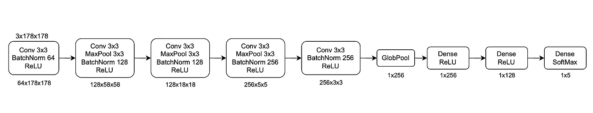
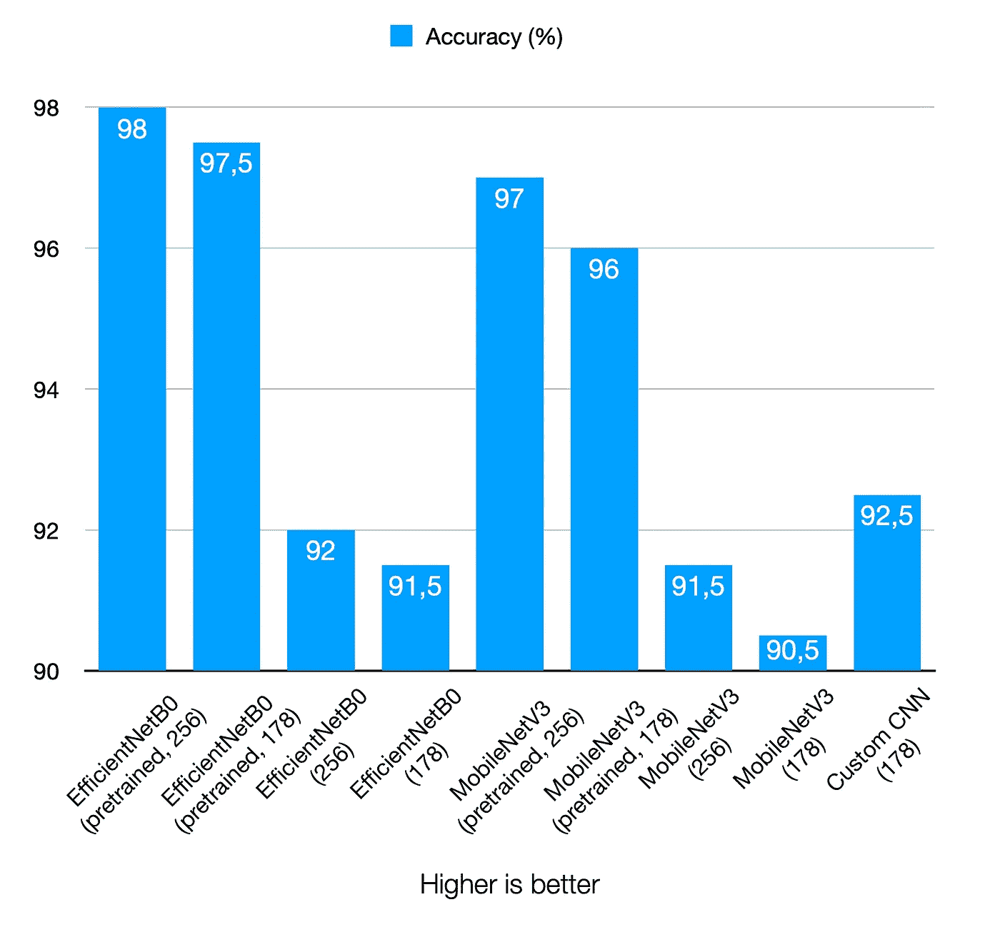
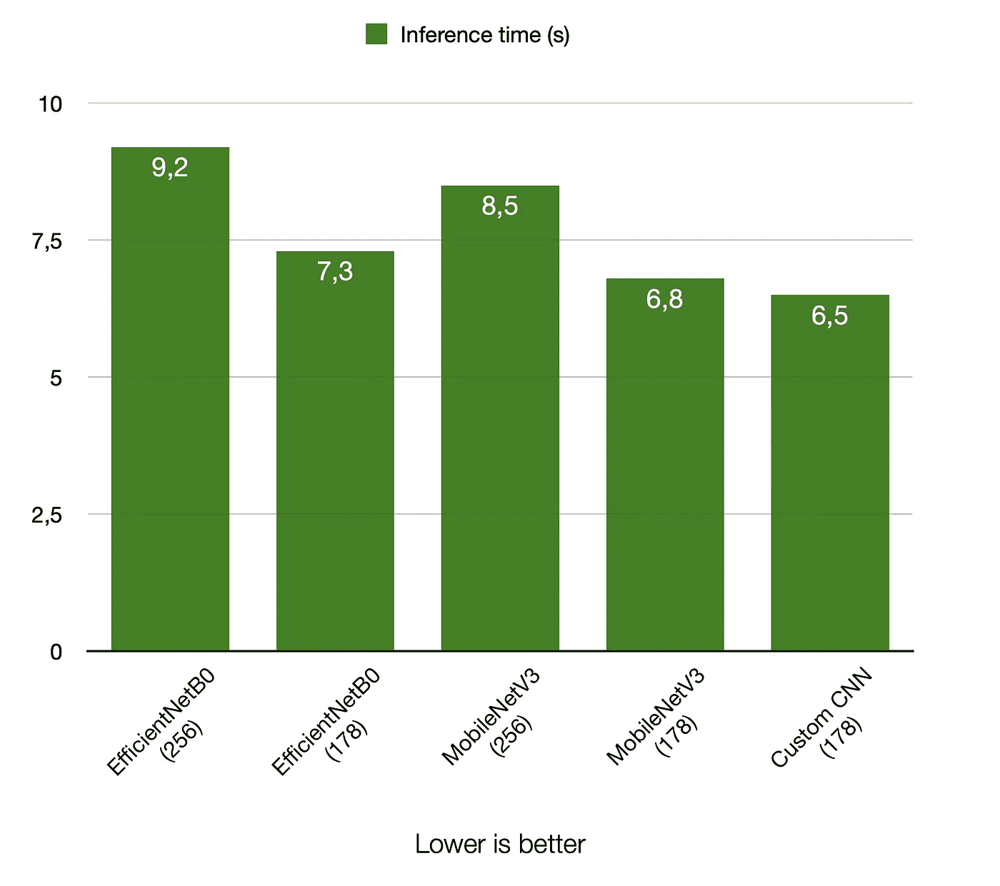
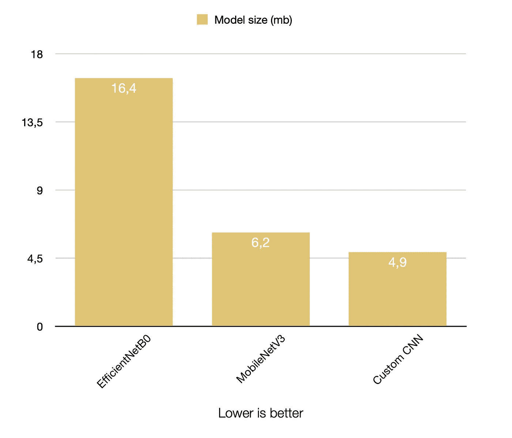
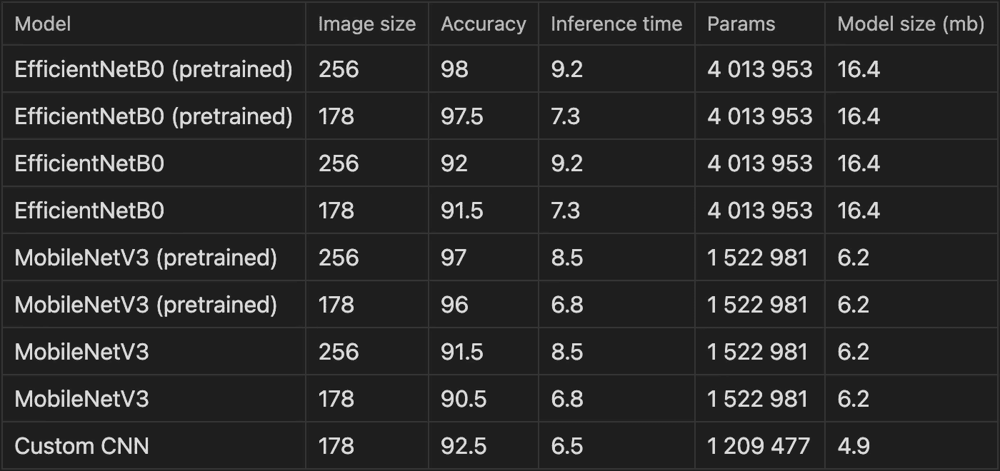

# 为你的分类任务写一个自定义 CNN 值得吗？

> 原文：<https://blog.devgenius.io/is-it-worth-writing-a-custom-cnn-for-your-classification-task-a5faacbe795b?source=collection_archive---------2----------------------->


由稳定扩散产生

分类是计算机视觉中一项基本而广泛的任务。幸运的是，对于分类问题有很多很好的架构，您可以在 PyTorch 和 TensorFlow 中找到它们，因此您可以轻松地选择模型并根据您的数据进行训练。这是一个可靠的解决方案，也是一个正确的起点。但是我有一个任务要做一个真正快速轻量级的神经网络，准备牺牲一些准确性。让我们看看进展如何。

# 我想达到什么目标？

因此，我需要一个轻量级和快速的卷积神经网络分类任务，相当小的图像(约 178x178)和 5 类预测。

我的分类模型将基于检测器模型的作物产量进行推理，这就是为什么我的数据集图像很小，但它们的大小不一样。基于大小统计和一些实验，我发现神经网络输入的最佳大小是 178x178，有 3 个通道(RGB)。因为我希望我的推断更快，所以输入越小越好。

# 我有什么选择？

我可以从 [PyTorch](https://pytorch.org/vision/stable/models.html#classification) 获取一个预训练的模型，然后用我的数据训练它。我应该得到很好的结果，但大多数模型是在 224x224 或更大的图像上进行预训练的。当然，我可以调整到推荐的大小，但是对于我的推理时间和数据来说，这不是最佳的。我可以用 178x178 的图像进行训练，但这似乎也不是最佳的，因为神经网络是在不同的大小上进行预训练的。

所以我的第二个想法是写一个简单的自定义 CNN。在这种情况下，我可以对我的数据采用一种架构，并对其进行调整，使其在我的情况下足够准确和快速地工作。这比编写一个伟大的通用架构(例如 EfficientNet)更容易，它在各种情况下都能很好地工作。有了两条不同的路，我开始工作。

# 如何为 PyTorch 准备我们的数据？

无论你选择什么道路，你都需要为训练准备数据。我假设您已经收集了数据并将其存储到文件夹中，这些文件夹显示了您的类:

```
-> data_folder
---> class_1
-----> image_1.jpg
-----> image_2.jpg
---> class_2
-----> image_1.jpg
-----> image_2.jpg
```

之后，我们需要:

*   将数据拆分到文件夹“训练”、“有效”、“测试”
*   加载和预处理数据

下面是如何做到这一点的示例(utils.py):

```
import os
import random
import shutil

import torch
from torchvision import datasets, transforms

# Count images for train valid test split
def get_sets_amount(valid_x, test_x, path_to_folder):
    count_images = 0

    folders = [x for x in os.listdir(path_to_folder) if not x.startswith(".")]
    for folder in folders:
        path = os.path.join(path_to_folder, folder)
        for image in os.listdir(path):
            image_path = os.path.join(path, image)
            if os.path.isfile(image_path) and not image.startswith("."):
                count_images += 1

    valid_amount = int(count_images * valid_x)
    test_amount = int(count_images * test_x)
    train_amount = count_images - valid_amount - test_amount

    return train_amount, valid_amount, test_amount

# Split images by folders
def create_sets_folders(path_to_folder, valid_part, test_part, classes):
    train_amount, valid_amount, test_amount = get_sets_amount(
        valid_part, test_part, path_to_folder
    )
    print(
        f"Train images: {train_amount}\nValid images: {valid_amount}\nTest images: {test_amount}"
    )

    os.chdir(path_to_folder)
    if os.path.isdir("train") is False:

        os.mkdir("valid")
        os.mkdir("test")

        for name in classes:
            shutil.copytree(f"{name}", f"train/{name}")
            os.mkdir(f"valid/{name}")
            os.mkdir(f"test/{name}")

            valid_samples = random.sample(
                os.listdir(f"train/{name}"), round(valid_amount / len(classes))
            )
            for j in valid_samples:
                shutil.move(f"train/{name}/{j}", f"valid/{name}")

            test_samples = random.sample(
                os.listdir(f"train/{name}"), round(test_amount / len(classes))
            )
            for k in test_samples:
                shutil.move(f"train/{name}/{k}", f"test/{name}")

        print("Created train, valid and test directories")

# Load images to Torch and preprocess them
def load_data(path, im_size, batch_size):
    transform = transforms.Compose([transforms.Resize(im_size), transforms.ToTensor()])
    dataset = datasets.ImageFolder(path, transform=transform)
    dataloader = torch.utils.data.DataLoader(
        dataset, batch_size=batch_size, shuffle=True
    )

    return dataloader

def get_splited_data(
    path_to_folder, valid_part, test_part, classes, im_size, batch_size
):
    create_sets_folders(path_to_folder, valid_part, test_part, classes)

    train_data = load_data(os.path.join(path_to_folder, "train"), im_size, batch_size)
    valid_data = load_data(os.path.join(path_to_folder, "valid"), im_size, batch_size)
    test_data = load_data(os.path.join(path_to_folder, "test"), im_size, batch_size)

    return train_data, valid_data, test_data
```

# 如何在自定义数据集上轻松训练 PyTorch 模型？

在第一个解决方案中，我只需要一个预训练的模型，改变最后一层，以获得正确数量的类的输出。您可以修补架构或添加增强，但假设这是我们的基线模型。下面是一个如何训练你的模型的例子:

```
import os
import time
from pathlib import Path

import torch
import torchvision.models as models
from sklearn.metrics import accuracy_score, f1_score
from torch import nn
from tqdm import tqdm

from utils import get_splited_data

# get model predictions
def get_preds(model, testing_data, device):
    val_preds = []
    val_labels = []
    model.eval()  # set mode

    with torch.no_grad():
        for data, target in testing_data:
            images, labels = data.to(device), target.to(device)
            outputs = model.forward(images)
            val_preds.extend(torch.max(outputs.data, 1).indices.tolist())
            val_labels.extend(labels.tolist())

    return val_preds, val_labels

def build_model(num_classes, device):
    model = models.efficientnet_b0(
        weights=models.EfficientNet_B0_Weights.DEFAULT,
    )
    model.classifier[1] = nn.Linear(in_features=1280, out_features=num_classes)
    return model.to(device)

def train(
    train_data, device, optimizer, model, loss_func, valid_data, epochs, path_to_save
):
    best_metric = 0

    for epoch in range(1, epochs + 1):
        model.train()  # set mode

        with tqdm(train_data, unit="batch") as tepoch:
            for data, target in tepoch:
                tepoch.set_description(f"Epoch {epoch}/{epochs}")

                images, labels = data.to(device), target.to(device)
                # zero the parameter gradients
                optimizer.zero_grad()
                # forward + loss + backward + optimize
                outputs = model.forward(images)
                loss = loss_func(outputs, labels)
                loss.backward()
                optimizer.step()

        # Get metrics after an epoch
        preds, valid_labels = get_preds(model, valid_data, device)
        f1 = f1_score(preds, valid_labels, average="weighted")
        accuracy = accuracy_score(preds, valid_labels)

        print(f"Valid accuracy: {round(accuracy, 2)}, valid f1: {round(f1, 2)}")

        # Save best model
        if f1 > best_metric:
            best_metric = f1
            torch.save(model.state_dict(), os.path.join(path_to_save, "model.pt"))

def infer(model_path, valid_data, test_data, device, classes):
    model = build_model(len(classes), device)
    checkpoint = torch.load(model_path)
    model.load_state_dict(checkpoint)

    time_start = time.perf_counter()

    valid_accuracy = round(accuracy_score(*get_preds(model, valid_data, device)), 2)
    test_accuracy = round(accuracy_score(*get_preds(model, test_data, device)), 2)

    print("time:", round(time.perf_counter() - time_start, 3))
    print(f"valid_accuracy = {valid_accuracy}, test_accuracy = {test_accuracy}")

def main():
    path_to_folder = Path("path_to_folder")
    path_to_save = Path("path_to_save")
    device = torch.device("mps")  # 'cuda' if you use nvidia gpu

    classes = ["class_1", "class_2"]
    im_size = 256, 256
    valid_part = 0.15
    test_part = 0.05
    batch_size = 30
    epochs = 15

    torch.manual_seed(42)

    train_data, valid_data, test_data = get_splited_data(
        path_to_folder, valid_part, test_part, classes, im_size, batch_size
    )

    model = build_model(len(classes), device)  # build the model
    loss_func = (
        nn.CrossEntropyLoss()
    )  # init loss function (combined with final activation)
    optimizer = torch.optim.Adam(model.parameters())

    train(
        train_data,
        device,
        optimizer,
        model,
        loss_func,
        valid_data,
        epochs,
        path_to_save,
    )
    infer(path_to_save / "model.pt", valid_data, test_data, device, classes)

if __name__ == "__main__":
    main()
```

# 自定义 CNN 呢？

第二条路径会稍微长一点。首先，我需要创建一个架构，这是我为这项任务带来的:



定制分类器架构

这很简单，但应该行得通。训练代码类似于第一个，只需要用选择的架构编写你的自定义类。这里有一个例子:

```
class Custom_classifier(nn.Module):
    def __init__(self):
        super(Custom_classifier, self).__init__()

        self.features = nn.Sequential(
            # input channels, output channels, kernel size, padding
            nn.Conv2d(3, 64, (3, 3), padding='same'),
            nn.BatchNorm2d(64),
            nn.ReLU(),

            nn.Conv2d(64, 128, (3, 3)),
            nn.MaxPool2d((3, 3)),
            nn.BatchNorm2d(128),
            nn.ReLU(),

            nn.Conv2d(128, 128, (3, 3)),
            nn.MaxPool2d((3, 3)),
            nn.BatchNorm2d(128),
            nn.ReLU(),

            nn.Conv2d(128, 256, (3, 3)),
            nn.MaxPool2d((3, 3)),
            nn.BatchNorm2d(256),
            nn.ReLU(),

            nn.Conv2d(256, 256, (3, 3)),
            nn.BatchNorm2d(256),
            nn.ReLU(),
        )

        self.glob_pool = nn.AdaptiveAvgPool2d((1, 1)) # Global average pooling

        self.classifier = nn.Sequential(
            nn.Linear(256, 256),
            nn.ReLU(),

            nn.Linear(256, 128),
            nn.ReLU(),

            nn.Linear(128, 5), # n_classes
        )

    def forward(self, x):
      x = self.features(x)
      x = self.glob_pool(x).reshape(-1, 256)
      x = self.classifier(x)
      return x
```

你可以写得更简洁，我只是在修改架构时发现它更容易使用。所以用这个片段作为例子。

# 我的结果是什么？

最后说一下训练结果。我已经训练了 EfficientNetB0 和 MobileNetV3，并从头开始训练，我还尝试了 256x256 和 178x178 作为输入尺寸。当然还有 178x178 输入尺寸的自定义 CNN。以下是我得到的信息:



很容易看出，预训练的模型更准确(咄)，但有趣的是，在从头开始训练时，我得到了与定制模型同样好的结果，即使输入大小更低，而且它更快更小，所以架构很好。那给了我什么？不幸的是，没有太多，因为我每个班只有大约 3000 张图片，所以我不能得到更接近预训练模型的精度。

以下是来自培训的所有数据:



推理时间是用谷歌 colab 的 a100 对 4164 幅图像进行测量的

# 那么值得吗？

如果你没有大量的数据，你可以利用预训练的模型——这是一个很好的解决方案(你也可以冻结一些层)。

如果你有具体的数据而 ImageNet 或者 COCO 是不相关的，你就要从零开始训练模型。你也可以从现有的架构开始，看看你能得到多好的结果，这仍然是一个好的解决方案。

在极少数情况下，您可能需要一个定制的模型，因此您可以从头开始编写它或者定制现有的架构。

如果你有具体的数据而 ImageNet 或者 COCO 是不相关的，你就要从零开始训练模型。你也可以从现有的架构开始，看看你能得到多好的结果，这仍然是一个好的解决方案。在极少数情况下，您可能需要一个定制的模型，因此您可以从头开始编写它或者定制现有的架构。

最后，这种情况下的答案是不，不值得。我可以采用一个预训练的模型，并获得 96%的准确性，模型大小略有增加，推理速度略有下降。是的，从一个快速的基线开始，然后试着增加它总是一个好主意。

感谢您的关注！